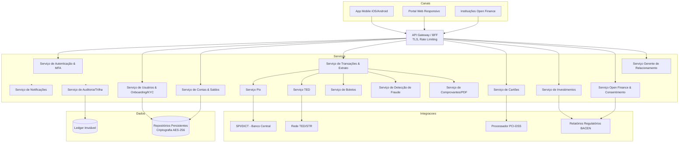
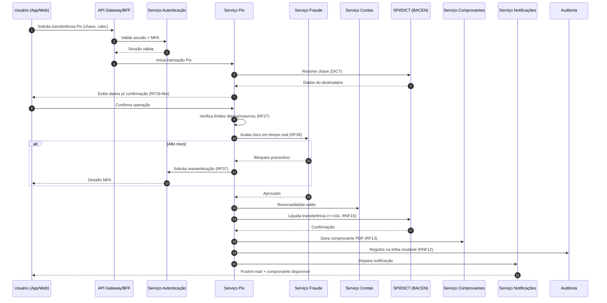
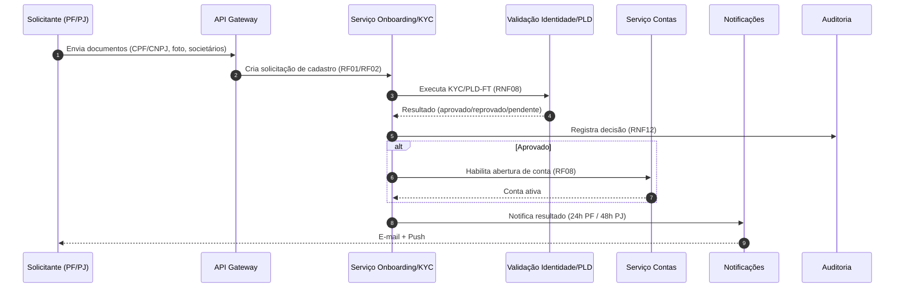
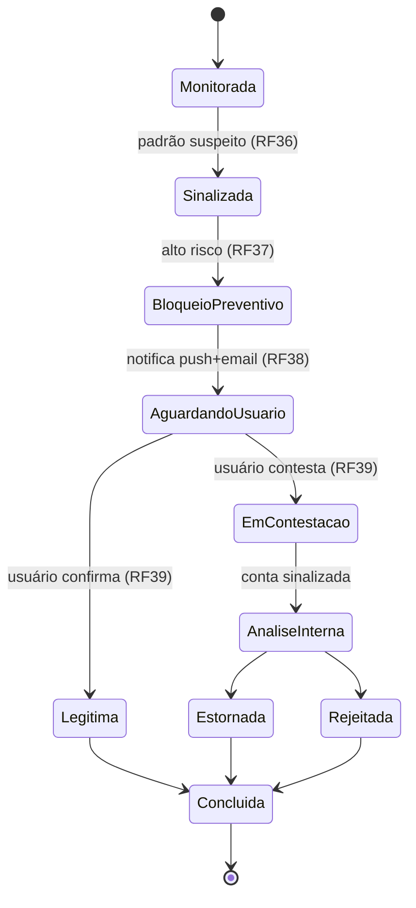

# Relatório Técnico de Arquitetura de Software
## Sistema Bancário Digital (G01) — Plataforma Financeira Digital

---

## 1. Identificação das HUs

| HU | Título | Perfil | RFs Associados | RNFs Críticos |
|----|--------|--------|----------------|---------------|
| HU01 | Abrir conta com validação de identidade | PF | RF01, RF02, RF08 | RNF08, RNF10 |
| HU02 | Autenticar com múltiplos fatores | Todos | RF03, RF04, RF05 | RNF01, RNF03, RNF04 |
| HU03 | Realizar transferência via Pix | PF/PJ | RF22, RF23, RF24, RF27, RF13 | RNF15, RNF21 |
| HU04 | Pagar boleto com agendamento | PF/PJ | RF28, RF29, RF30, RF31 | RNF21 |
| HU05 | Gerenciar cartão de crédito | PF/PJ | RF16, RF17, RF18, RF19, RF20 | RNF06, RNF02 |
| HU06 | Contestar transação não reconhecida | PF/PJ | RF21, RF39 | RNF12 |
| HU07 | Investir em renda fixa | PF/PJ | RF32, RF33, RF34, RF35 | RNF21 |
| HU08 | Gerenciar consentimentos open finance | PF/PJ | RF41, RF42, RF44 | RNF11, RNF10 |
| HU09 | Alertas e resposta a fraude | PF/PJ | RF36, RF37, RF38, RF39, RF40 | RNF12, RNF17 |
| HU10 | Abrir conta PJ com doc. societária | PJ | RF01, RF02, RF08 | RNF08 |
| HU11 | Realizar TED para fornecedores | PJ | RF25, RF27, RF13 | RNF21 |
| HU12 | Acompanhar carteira de clientes | Gerente | RF07, RF45, RF46 | RNF10, RNF12 |
| HU13 | Abrir solicitação em nome do cliente | Gerente | RF47 | RNF12 |

---

## 2. Diagramas de Arquitetura (Mermaid)

### 2.1 Visão de Componentes (alto nível)

### 2.2 Sequência — Transferência via Pix (HU03)

### 2.3 Sequência — Onboarding com validação de identidade (HU01/HU10)

### 2.4 Diagrama de Estados — Ciclo de Contestação de Fraude (HU06/HU09)

---

## 3. Decisões de Arquitetura

| ID | Decisão | Justificativa | Requisitos |
|----|---------|---------------|------------|
| DA01 | Arquitetura orientada a serviços com fronteiras por domínio de negócio (contas, cartões, Pix, TED, boletos, investimentos, fraude, open finance) | Permite escalonamento horizontal seletivo e isolamento de falhas | RNF16, RNF17 |
| DA02 | Camada de Gateway/BFF única para canais, centralizando TLS, rate limiting e roteamento | Ponto uniforme de aplicação de políticas de segurança | RNF01, RNF04 |
| DA03 | Serviço de Autenticação dedicado com MFA obrigatório e gestão de sessão configurável por perfil | Requisito transversal de segurança | RF03, RF04, RNF03 |
| DA04 | Ledger/trilha de auditoria imutável separado do armazenamento transacional operacional, retenção ≥5 anos | Conformidade regulatória e auditabilidade | RNF12, RF40 |
| DA05 | Não persistência de dados de cartão; delegação a processador certificado PCI-DSS | Reduz escopo PCI e superfície de risco | RNF06 |
| DA06 | Motor de detecção de fraude acoplado em modo síncrono no fluxo de transações de alto risco e assíncrono para monitoramento contínuo | Balanceia latência (RNF15) e cobertura de risco | RF36, RF37 |
| DA07 | Serviço de Consentimento e APIs padronizadas de Open Finance isolados, seguindo especificação BACEN | Conformidade e interoperabilidade | RF41-44, RNF11 |
| DA08 | Criptografia em repouso (AES-256) para dados sensíveis e hashing forte de senhas | Proteção de dados | RNF02, RNF03 |
| DA09 | Serviço de Notificações desacoplado (push/e-mail) consumido por eventos dos demais serviços | Reuso e baixo acoplamento | RF20, RF31, RF38 |
| DA10 | Implantação multi-AZ com backup contínuo (RPO≤1h/RTO≤4h) e observabilidade centralizada | Disponibilidade e resiliência | RNF13, RNF22, RNF23, RNF24 |
| DA11 | Padrão Saga/compensação para transações distribuídas com fallback automático | Garante que transações em andamento não se percam | RNF17 |

---

## 4. Tabela de Componentes e Rastreabilidade

| Componente | Responsabilidade Principal | Comunica-se com | Origem (HU / Critério de Aceite) |
|-----------|---------------------------|-----------------|----------------------------------|
| API Gateway / BFF | Roteamento, TLS, rate limiting, agregação para canais | Todos os serviços, Canais | RNF01, RNF04, HU02 |
| Serviço de Autenticação & MFA | Login, MFA (OTP/biometria), sessão configurável, alertas de acesso | Gateway, Usuários, Notificações | HU02 / "MFA obrigatório", RF03-05 |
| Serviço de Usuários & Onboarding/KYC | Cadastro PF/PJ, validação de identidade, KYC/PLD-FT | Validação, Contas, Auditoria, Notificações | HU01, HU10 / "validar CPF/CNPJ, sócios" |
| Serviço de Contas & Saldos | Abertura de conta, saldo em tempo real, rendimentos poupança | Transações, Investimentos, DB | RF08-12, HU01 |
| Serviço de Transações & Extrato | Registro, extrato filtrável, orquestração de operações financeiras | Pix, TED, Boletos, Fraude, Comprovantes | RF09, RF10, RF13, HU03/HU11 |
| Serviço Pix | Resolução de chaves, gestão de chaves, liquidação SPI | SPI/DICT, Fraude, Contas, Comprovantes | HU03 / RF22-24, RF27 |
| Serviço TED | Transferências interbancárias, validação de dados, limites/horários | Rede TED/STR, Contas, Comprovantes | HU11 / RF25 |
| Serviço de Boletos | Leitura código de barras/linha digitável, agendamento, lembretes | Transações, Notificações | HU04 / RF28-31 |
| Serviço de Cartões | Emissão débito/crédito, faturas, limites, bloqueio, notificações | Processador PCI, Contas, Notificações | HU05 / RF14-20 |
| Serviço de Investimentos | Catálogo renda fixa, aplicação/resgate, posição, informe IR | Contas, Relatórios Regulatórios | HU07 / RF32-35 |
| Serviço de Detecção de Fraude | Monitoramento em tempo real, bloqueio preventivo, alertas, histórico | Transações, Autenticação, Notificações, Auditoria | HU09 / RF36-40 |
| Serviço Open Finance & Consentimento | Autorização, gestão/revogação de consentimentos, APIs padronizadas, iniciação de pagamento | Instituições externas, Auditoria, Notificações | HU08 / RF41-44 |
| Serviço Gerente de Relacionamento | Visão consolidada de carteira, anotações, solicitações de serviço | Contas, Investimentos, Auditoria, Notificações | HU12, HU13 / RF07, RF45-47 |
| Serviço de Notificações | Envio push/e-mail orientado a eventos | Todos os serviços, Canais | RF20, RF31, RF38 / HU04-HU09 |
| Serviço de Comprovantes/PDF | Geração e disponibilização de comprovantes em PDF | Transações, Pix, TED | RF13 / HU03, HU11 |
| Serviço de Auditoria/Trilha | Registro imutável de operações, acessos e configurações | Todos os serviços, Ledger | RNF12, RF40 / HU13 |
| Repositórios de Dados | Persistência criptografada AES-256, backup contínuo | Serviços de domínio | RNF02, RNF22 |
| Ledger Imutável | Armazenamento append-only da trilha regulatória (≥5 anos) | Auditoria | RNF12 |

---

## 5. Bloqueios e Pendências

| ID | Descrição | Impacto | Ação Requerida |
|----|-----------|---------|----------------|
| BL01 | Regras de análise de crédito (RF15) não especificadas (critérios, motor, política) | Bloqueia emissão de cartão de crédito | Definir política/motor de crédito com área de risco |
| BL02 | SLA e fluxo de resolução de contestações (RF21, RF39, HU06) não detalham prazos regulatórios de estorno | Ambiguidade no ciclo de contestação | Especificar prazos e integração com bandeiras |
| BL03 | Especificação de "rendimentos vigentes do Banco Central" (RF11) não parametrizada | Cálculo de poupança pode divergir da norma | Obter tabela de regras oficiais versionadas |
| BL04 | Mecanismo de consentimento do gerente (RF07/HU12) não define formato/prova do consentimento | Risco de compliance LGPD | Definir modelo de consentimento auditável |
| BL05 | Relatórios regulatórios (RNF09 — BACEN 3040/SCR) sem detalhamento de layout/periodicidade | Risco regulatório | Levantar especificações oficiais junto ao compliance |
| BL06 | Ausência de definição de disaster recovery entre AZs além de backup | Meta RNF13/RNF23 sob risco | Elaborar plano de DR e failover geográfico |

---

## 6. Cobertura de Requisitos

**Requisitos Funcionais:** 47/47 endereçados.

| Faixa | Componente(s) Responsável(is) | Status |
|-------|------------------------------|--------|
| RF01-07 | Usuários/Onboarding, Autenticação, Gerente | ✅ Coberto |
| RF08-13 | Contas & Saldos, Transações, Comprovantes | ✅ Coberto |
| RF14-21 | Cartões, Processador PCI, Notificações | ✅ Coberto (RF15 parcial — BL01) |
| RF22-27 | Pix, TED, Transações | ✅ Coberto |
| RF28-31 | Boletos, Notificações | ✅ Coberto |
| RF32-35 | Investimentos | ✅ Coberto |
| RF36-40 | Detecção de Fraude, Auditoria | ✅ Coberto |
| RF41-44 | Open Finance & Consentimento | ✅ Coberto |
| RF45-47 | Gerente de Relacionamento | ✅ Coberto |

**Requisitos Não Funcionais:** 24/24 endereçados via decisões arquiteturais (DA01-DA11).

| Categoria | RNFs | Tratamento |
|-----------|------|-----------|
| Segurança | RNF01-06 | Gateway TLS/rate limiting, AES-256, hashing, PCI delegado, pentest |
| Conformidade | RNF07-12 | KYC/PLD, relatórios regulatórios, LGPD, Open Finance, ledger imutável |
| Disponibilidade/Desempenho | RNF13-17 | Multi-AZ, targets de latência, escalonamento horizontal, saga/fallback |
| Usabilidade/Compat. | RNF18-21 | Apps iOS/Android, web responsivo, WCAG 2.1 AA, confirmação explícita |
| Infra/Dados | RNF22-24 | Backup contínuo, redundância geográfica, observabilidade |

---

## 7. Gap Analysis

| # | Lacuna Identificada | Impacto Arquitetural | Ação Recomendada |
|---|---------------------|----------------------|------------------|
| G01 | **Motor de decisão de crédito** ausente (RF15, HU13 pedido de limite) | Serviço de Cartões depende de subsistema não modelado | Especificar serviço/integração de análise de crédito e políticas de risco |
| G02 | **Idempotência e conciliação** de transações Pix/TED não descritas | Risco de duplicidade em retries e falhas de rede | Definir chaves de idempotência e reconciliação com SPI/STR |
| G03 | **Estratégia de consistência do saldo em tempo real** (RF09, RNF14 ≤1s) vs. ledger transacional | Trade-off entre latência de leitura e consistência | Adotar modelo de leitura otimizada com sincronização de eventos |
| G04 | **Gestão de segredos e chaves criptográficas** (RNF02) não abordada | Impacta armazenamento AES-256 e conformidade | Definir custódia de chaves (rotação, cofre de segredos) |
| G05 | **Fluxo de reautenticação em fraude** (RF37) sem definição de UX/timeout | Pode bloquear transações legítimas | Especificar política de step-up authentication |
| G06 | **Retenção e ciclo de vida de dados LGPD** (RNF10) vs. retenção 5 anos (RNF12) | Possível conflito entre direito ao esquecimento e obrigação legal | Definir política de retenção diferenciada por categoria de dado |
| G07 | **Governança de APIs Open Finance** (RF44) — versionamento, certificados, diretório | Interoperabilidade e homologação BACEN | Estabelecer gestão de certificados e conformidade por fase |
| G08 | **Detalhamento de agendamento** (RF26, RF30) — reprocessamento em falha/feriado | Jobs agendados podem falhar silenciosamente | Definir scheduler resiliente com política de retentativa e calendário bancário |
| G09 | **Observabilidade de negócio** além de métricas técnicas (RNF24) | Fraude e SLAs regulatórios exigem alertas de negócio | Ampliar painel com KPIs de fraude, latência Pix e falhas regulatórias |
| G10 | **Testes de acessibilidade WCAG 2.1 AA** (RNF20) sem processo definido | Risco de não conformidade em UI | Incluir auditoria de acessibilidade no pipeline de qualidade |

---

> **Nota de Neutralidade Tecnológica:** Este relatório descreve responsabilidades e interfaces conceituais. Escolhas de produtos, bancos de dados, brokers de mensageria e provedores de nuvem foram deliberadamente omitidas, cabendo ao time de desenvolvimento selecioná-las em fase de detalhamento técnico, respeitando os RNFs de segurança, conformidade e disponibilidade aqui estabelecidos.