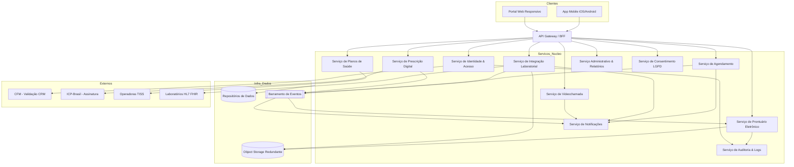
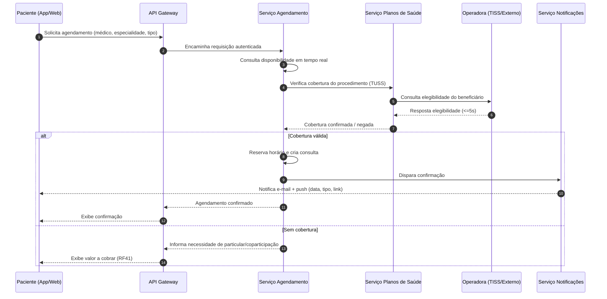
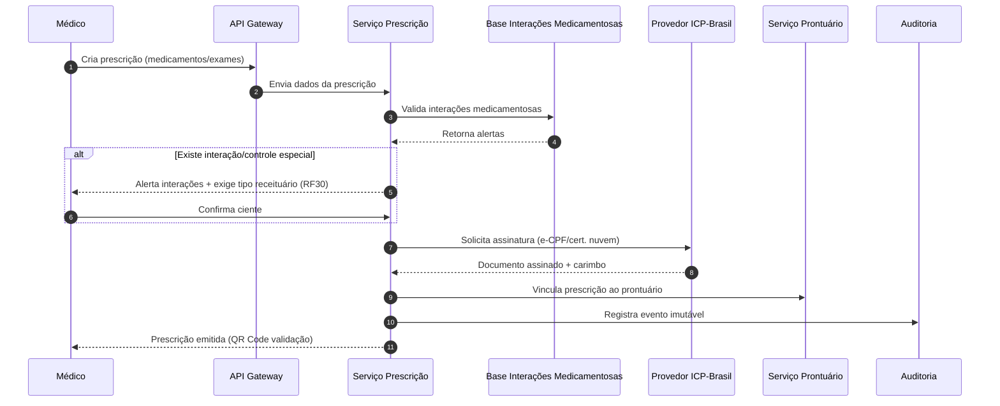
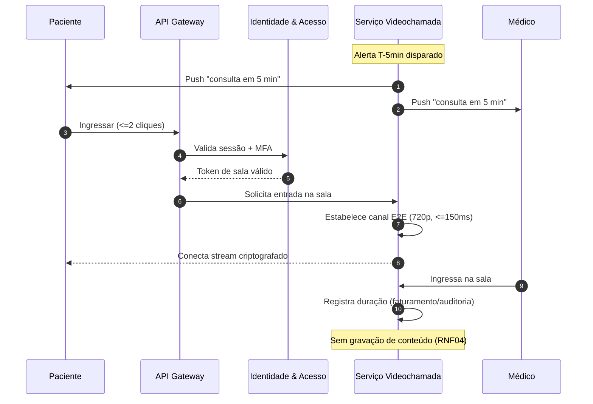

# Relatório Técnico de Arquitetura de Software
## Plataforma Integrada de Saúde Digital — Telemedicina (G02)

---

## 1. Identificação das HUs

| HU | Perfil | Título | RFs Relacionados | RNFs Relacionados |
|----|--------|--------|------------------|-------------------|
| HU01 | Paciente | Cadastro e consentimento de dados de saúde | RF01, RF23, RF24 | RNF07, RNF12 |
| HU02 | Paciente | Agendar consulta presencial/videochamada | RF07, RF08, RF09, RF11 | RNF14 |
| HU03 | Paciente | Participar de consulta por videochamada | RF14, RF15, RF17, RF18 | RNF04, RNF16, RNF22 |
| HU04 | Paciente | Visualizar prontuário e resultados | RF22, RF24, RF33 | RNF02, RNF15 |
| HU05 | Paciente | Acessar/compartilhar prescrição digital | RF29, RF30 | RNF06 |
| HU06 | Paciente | Notificação de resultado disponível | RF32, RF33 | RNF26 |
| HU07 | Médico | Validar cadastro com CRM ativo | RF01, RF02 | RNF08 |
| HU08 | Médico | Registrar evolução clínica | RF20, RF25, RF06 | RNF10, RNF11 |
| HU09 | Médico | Emitir prescrição digital | RF26, RF27, RF28, RF30 | RNF06 |
| HU10 | Médico | Solicitar exame + alerta valor crítico | RF34, RF32, RF35 | RNF26 |
| HU11 | Médico | Acessar prontuário compartilhado | RF19, RF23, RF06 | RNF05, RNF11 |
| HU12 | Admin Clínica | Gerenciar médicos e agendas | RF12, RF42, RF43 | — |
| HU13 | Admin Clínica | Acompanhar faturamento por convênio | RF40, RF44 | RNF09 |
| HU14 | Operador Plano | Processar autorização prévia (TISS) | RF37, RF38, RF39 | RNF09, RNF26 |

---

## 2. Diagramas de Arquitetura (Mermaid)

### 2.1 Diagrama de Componentes (visão macro)

### 2.2 Sequência — Agendamento com verificação de cobertura (HU02)

### 2.3 Sequência — Prescrição digital assinada (HU09)

### 2.4 Sequência — Ingresso na videochamada (HU03)

---

## 3. Decisões de Arquitetura

| ID | Decisão | Justificativa | Requisitos |
|----|---------|---------------|-----------|
| AD01 | Arquitetura baseada em serviços de domínio desacoplados | Isola domínios sensíveis (prontuário, prescrição) e permite escalonamento independente | RNF17 |
| AD02 | Barramento de eventos assíncrono para notificações e propagação de resultados | Desacopla produtores (agenda, laboratório) de consumidores (notificação, prontuário) | RF11, RF32, RNF17 |
| AD03 | Serviço de Auditoria dedicado com armazenamento imutável e retenção ≥ 20 anos | Exigência regulatória de trilha imutável do prontuário | RF06, RF25, RNF11 |
| AD04 | Object storage externo com redundância geográfica para documentos/imagens clínicas | Volume elevado e requisito de resiliência geográfica | RF21, RNF18 |
| AD05 | Serviço de Consentimento LGPD centralizado como ponto único de autorização | Base legal por finalidade e controle de compartilhamento de prontuário | RF23, RF24, RNF07, RNF12 |
| AD06 | BFF/Gateway único com aplicação de MFA, RBAC e rate limiting | Ponto de enforcement de segurança e perfis | RF03, RF04, RNF01, RNF05 |
| AD07 | Adoção de padrões abertos HL7 FHIR (labs) e TISS/TUSS (operadoras) nas integrações | Interoperabilidade e onboarding de novos parceiros | RF31, RF38, RF40, RNF26 |
| AD08 | Videochamada com mídia E2E sem gravação, sinalização via serviço próprio | Confidencialidade e conformidade CFM | RF14, RNF04, RNF16 |
| AD09 | Assinatura digital delegada a provedor ICP-Brasil homologado pelo CFM | Validade jurídica das prescrições e imutabilidade do prontuário | RF27, RNF06 |
| AD10 | Implantação multi-AZ com backup contínuo (RPO 1h / RTO 4h) | Alta disponibilidade 99,9% | RNF13, RNF23, RNF24 |

---

## 4. Tabela de Componentes e Rastreabilidade

| Componente | Responsabilidade Principal | Comunica-se com | Origem (HU / Critério de Aceite) |
|-----------|----------------------------|-----------------|----------------------------------|
| API Gateway / BFF | Roteamento, autenticação, MFA, RBAC, rate limiting, agregação para clientes | Todos os serviços de núcleo, clientes | HU01–HU14 / RF03, RF04, RNF05 |
| Serviço de Identidade & Acesso (IAM) | Cadastro multi-perfil, MFA, sessão configurável, validação CRM junto ao CFM | CFM, Auditoria, Gateway | HU07 / RF01, RF02, RF05, RF03 |
| Serviço de Consentimento LGPD | Registro, revisão e revogação de consentimentos; autorização de compartilhamento | Prontuário, IAM | HU01, HU11 / RF23, RF24, RNF07, RNF12 |
| Serviço de Agendamento | Agenda em tempo real, grades, encaixe urgente, cancelamento/remarcação | Planos de Saúde, Notificações, Barramento | HU02, HU12 / RF07–RF13 |
| Serviço de Videochamada | Sala E2E, sinalização, alerta T-5min, registro de duração, compartilhamento de arquivos | IAM, Notificações, Object Storage | HU03 / RF14–RF18, RNF04, RNF16 |
| Serviço de Prontuário Eletrônico | Prontuário único, evoluções/CID, imutabilidade pós-assinatura, adendos, histórico | Consentimento, Auditoria, Object Storage, Barramento | HU04, HU08, HU11 / RF19–RF25 |
| Serviço de Prescrição Digital | Emissão, validação de interações, controle especial, assinatura ICP-Brasil | Base Interações, ICP-Brasil, Prontuário | HU05, HU09 / RF26–RF30 |
| Serviço de Integração Laboratorial | Solicitação de exames, recepção de resultados (FHIR), alerta de valor crítico | Laboratórios, Prontuário, Notificações, Barramento | HU06, HU10 / RF31–RF35 |
| Serviço de Planos de Saúde | Cadastro planos/TUSS, elegibilidade, guias/faturamento TISS, autorização prévia | Operadoras, Agendamento | HU02, HU13, HU14 / RF36–RF41 |
| Serviço Administrativo & Relatórios | Gestão de clínicas/unidades/salas, indicadores, relatórios gerenciais | Agendamento, Planos, Prontuário | HU12, HU13 / RF42–RF46 |
| Serviço de Notificações | Envio de e-mail e push (confirmação, lembrete, resultado, alertas) | Barramento, clientes | HU02, HU03, HU06, HU10 / RF11, RF32 |
| Serviço de Auditoria & Logs | Trilha imutável de acessos/alterações, retenção 20 anos, detecção de anomalias | Todos os serviços | HU08, HU11 / RF06, RNF05, RNF11 |
| Object Storage Redundante | Armazenamento criptografado de documentos/imagens com redundância geográfica | Prontuário, Laboratório, Videochamada | HU04 / RF21, RNF02, RNF18 |
| Barramento de Eventos | Propagação assíncrona de eventos de domínio | Serviços de núcleo | AD02 / RF32, RNF17 |

---

## 5. Bloqueios e Pendências

| ID | Bloqueio / Pendência | Impacto | Ação Necessária |
|----|----------------------|---------|-----------------|
| BL01 | Interface e SLA da API de validação de CRM do CFM não especificados | HU07 depende de disponibilidade externa; RF02 pode ficar bloqueante | Definir contrato, fallback e política de revalidação periódica |
| BL02 | Fonte da base de interações medicamentosas não definida (RF28) | Risco clínico e legal se ausente | Selecionar base autoritativa e regras de atualização |
| BL03 | Parâmetros de "valores críticos" de exames (RF35) não catalogados | Alertas podem ser inconsistentes | Definir dicionário de referências por tipo de exame |
| BL04 | Regras de coparticipação/particular (RF41) sem detalhamento de cálculo | Faturamento incompleto | Especificar regras comerciais por plano |
| BL05 | Política de retenção vs. direito de eliminação LGPD (RNF11 x RNF12) | Conflito potencial: 20 anos obrigatórios × direito ao apagamento | Definir precedência jurídica e anonimização |
| BL06 | Homologação SBIS/certificação do prontuário (RNF10) não planejada | Bloqueio regulatório para produção | Iniciar processo de certificação NGS |
| BL07 | Padrão de compartilhamento de prescrição com farmácias (RF29) indefinido | Interoperabilidade externa incerta | Definir formato (link/PDF/QR) e validação |

---

## 6. Cobertura de Requisitos

**Requisitos Funcionais:** 46/46 endereçados.

| Faixa | Componente Responsável |
|-------|------------------------|
| RF01–RF06 | IAM + Auditoria |
| RF07–RF13 | Agendamento |
| RF14–RF18 | Videochamada |
| RF19–RF25 | Prontuário + Consentimento |
| RF26–RF30 | Prescrição Digital |
| RF31–RF35 | Integração Laboratorial |
| RF36–RF41 | Planos de Saúde |
| RF42–RF46 | Administrativo & Relatórios |

**Requisitos Não Funcionais:** 26/26 endereçados.

| Categoria | RNFs | Tratamento Arquitetural |
|-----------|------|--------------------------|
| Segurança | RNF01–RNF06 | Gateway (TLS, rate limit), criptografia AES-256, E2E, ICP-Brasil |
| Conformidade | RNF07–RNF12 | Consentimento LGPD, Auditoria imutável, padrões TISS/CFM/SBIS |
| Disponib./Desempenho | RNF13–RNF18 | Multi-AZ, escalonamento horizontal, object storage redundante |
| Usab./Compat. | RNF19–RNF22 | Clientes mobile/web responsivos, WCAG AA, fluxo ≤2 cliques |
| Infra/Dados | RNF23–RNF26 | Backup contínuo, monitoramento, HL7 FHIR/TISS |

**Cobertura de HUs:** 14/14 mapeadas na Seção 1 e refletidas nos diagramas 2.2–2.4 e componentes.

---

## 7. Gap Analysis

| Gap | Descrição da Lacuna | Impacto Arquitetural | Ação Recomendada |
|-----|---------------------|----------------------|------------------|
| GAP01 | Ausência de estratégia de identidade federada entre unidades parceiras | Prontuário único (RF19) exige identificação consistente do paciente entre unidades; risco de duplicidade | Definir índice mestre de paciente (MPI) e política de deduplicação |
| GAP02 | Não há especificação de resiliência para dependências externas críticas (CFM, ICP, operadoras) | Falha externa pode bloquear cadastro, prescrição e agendamento | Definir circuit breakers, filas de retry e modos degradados |
| GAP03 | Conflito de retenção (20 anos) vs. direito de eliminação LGPD não resolvido | Decisão de dados fundamental afeta modelagem de storage/auditoria | Definir base legal de prevalência e estratégia de anonimização/pseudonimização |
| GAP04 | Requisitos não detalham observabilidade de segurança (SIEM) além de RNF05/RNF25 | Detecção de anomalias no prontuário pode ficar superficial | Especificar coleta centralizada de eventos e regras de correlação |
| GAP05 | Ausência de requisito sobre versionamento/migração de padrões TISS e FHIR | Mudanças de versão da ANS/HL7 podem quebrar integrações | Camada de adaptação por versão e testes de contrato |
| GAP06 | Não há definição de política de gravação de compartilhamento de arquivos na videochamada (RF17 vs RNF04) | Compartilhar documentos exige armazenamento; RNF04 proíbe gravação de conteúdo | Esclarecer: documentos anexados ao prontuário ≠ gravação da chamada |
| GAP07 | Ausência de estratégia de consentimento granular (por finalidade/por unidade) | RNF07 exige base legal por finalidade; modelo binário é insuficiente | Modelar consentimento por finalidade com trilha temporal |
| GAP08 | Sem requisito de teste de carga para SLAs (RNF14–RNF16) | Metas de desempenho não verificáveis sem baseline | Definir plano de testes de performance e critérios de aceite mensuráveis |

---

*Relatório gerado pelo Sistema Multi-Agente AI4ES — Time 2. Design em nível conceitual, tecnologicamente neutro, salvo padrões citados literalmente nos requisitos (ICP-Brasil, TISS, TUSS, HL7 FHIR, AES-256, TLS, bcrypt/Argon2, WCAG 2.1).*