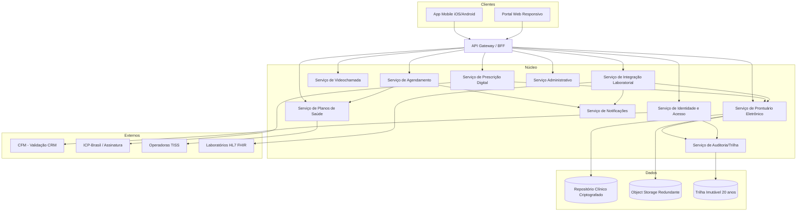
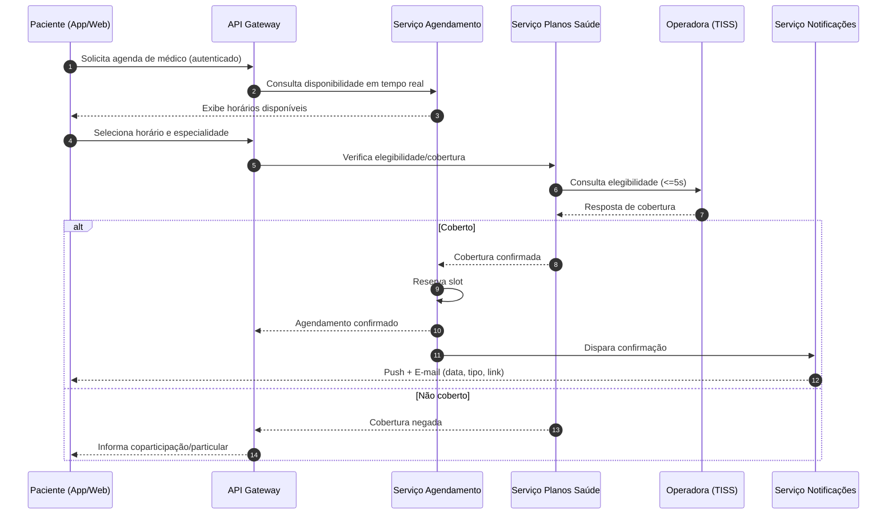
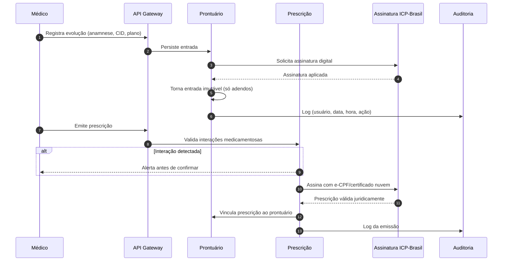

# Relatório Técnico de Arquitetura de Software
## Plataforma Integrada de Saúde Digital (G02) — Telemedicina

---

## 1. Identificação das HUs

| HU | Perfil | Título | RFs Relacionados | RNFs Relacionados |
|----|--------|--------|------------------|-------------------|
| HU01 | Paciente | Cadastro e consentimento de dados de saúde | RF01, RF23, RF24 | RNF07, RNF12 |
| HU02 | Paciente | Agendar consulta presencial/videochamada | RF07, RF08, RF09, RF11 | RNF14, RNF17 |
| HU03 | Paciente | Participar de consulta por videochamada | RF14, RF15, RF17, RF18 | RNF04, RNF16, RNF22 |
| HU04 | Paciente | Visualizar prontuário e exames | RF22, RF23, RF24, RF33 | RNF02, RNF15 |
| HU05 | Paciente | Acessar e compartilhar prescrição digital | RF29, RF30 | RNF06 |
| HU06 | Paciente | Notificação de resultado de exame | RF31, RF32, RF33 | RNF26 |
| HU07 | Médico | Validar cadastro com CRM ativo | RF01, RF02 | RNF08 |
| HU08 | Médico | Registrar evolução clínica | RF20, RF25, RF06 | RNF10, RNF11 |
| HU09 | Médico | Emitir prescrição digital com validade jurídica | RF26, RF27, RF28, RF30 | RNF06 |
| HU10 | Médico | Solicitar exame e receber alerta de valor crítico | RF34, RF32, RF35 | RNF26 |
| HU11 | Médico | Acessar prontuário compartilhado | RF19, RF23, RF06 | RNF05, RNF11 |
| HU12 | Admin Clínica | Gerenciar médicos e agendas | RF12, RF42, RF43 | RNF25 |
| HU13 | Admin Clínica | Acompanhar faturamento por convênio | RF40, RF44 | RNF09 |
| HU14 | Operador Plano | Processar autorização prévia (TISS) | RF37, RF38, RF39 | RNF09, RNF26 |

---

## 2. Diagramas de Arquitetura (Mermaid)

### 2.1 Diagrama de Componentes (Visão Macro)

### 2.2 Diagrama de Sequência — HU02 (Agendamento com verificação de cobertura)

### 2.3 Diagrama de Sequência — HU08/HU09 (Registro clínico + Prescrição assinada)

---

## 3. Decisões de Arquitetura

| ID | Decisão | Justificativa | Requisitos |
|----|---------|---------------|------------|
| AD01 | Arquitetura baseada em serviços de domínio desacoplados | Permite escalabilidade horizontal e isolamento de domínios sensíveis (prontuário, prescrição) | RNF17, RNF13 |
| AD02 | Gateway/BFF único de entrada com autorização por perfil | Centraliza MFA, RBAC e rate limiting | RF03, RF04, RNF05 |
| AD03 | Trilha de auditoria imutável dedicada (append-only) | Retenção legal de 20 anos e imutabilidade de acessos | RF06, RNF11, RF25 |
| AD04 | Object storage externo com redundância geográfica para documentos/imagens | Resiliência e desempenho de carregamento | RNF18, RNF24 |
| AD05 | Criptografia em repouso (AES-256) do repositório clínico | Proteção de dado sensível de saúde | RNF02, RNF07 |
| AD06 | Videochamada com E2EE e sem gravação de conteúdo | Conformidade CFM e privacidade | RNF04, RF14 |
| AD07 | Integrações externas via padrões abertos (HL7 FHIR / TISS) | Interoperabilidade e onboarding de parceiros | RNF26, RF31, RF38 |
| AD08 | Serviço de assinatura desacoplado (ICP-Brasil) | Validade jurídica de prontuário e prescrição | RF27, RNF06 |
| AD09 | Barramento de eventos para notificações assíncronas | Desacopla emissão de eventos (exame pronto, agendamento) | RF11, RF32 |
| AD10 | Gestão de consentimento como componente transversal | Base legal LGPD e controle de acesso compartilhado | RF23, RNF07, RNF12 |

---

## 4. Tabela de Componentes e Rastreabilidade

| Componente | Responsabilidade Principal | Comunica-se com | Origem (HU / Critério de Aceite) |
|------------|---------------------------|-----------------|----------------------------------|
| Serviço de Identidade e Acesso (IAM) | Cadastro multiperfil, MFA, RBAC, sessões, validação CRM junto ao CFM | Gateway, CFM, Auditoria | HU01, HU07 / MFA, bloqueio CRM inativo |
| Serviço de Agendamento (SCH) | Disponibilidade em tempo real, agendamento, cancelamento, encaixe, grade | Gateway, Planos Saúde, Notificações | HU02, HU12 / disponibilidade e confirmação |
| Serviço de Videochamada (VID) | Sessão E2EE, ingresso autenticado, compartilhamento de docs, duração | Gateway, Auditoria | HU03 / E2EE, sem gravação, 2 cliques |
| Serviço de Prontuário (EHR) | Registro clínico único, imutabilidade pós-assinatura, adendos, consentimento | Assinatura, Object Storage, Auditoria | HU04, HU08, HU11 / imutabilidade, consentimento |
| Serviço de Prescrição (PRE) | Emissão, validação de interações, controle especial, vínculo ao prontuário | Assinatura ICP, EHR, Auditoria | HU05, HU09 / assinatura, interações, receituário |
| Serviço de Integração Laboratorial (LAB) | Solicitação de exames, recepção de resultados, alerta de valor crítico | Laboratórios (FHIR), EHR, Notificações | HU06, HU10 / valor crítico, notificação |
| Serviço de Planos de Saúde (HP) | Elegibilidade, cobertura TUSS, guias/faturamento TISS, autorização prévia | Operadoras (TISS), Agendamento | HU02, HU13, HU14 / cobertura, TISS |
| Serviço Administrativo (ADM) | Gestão de clínicas, médicos, salas, relatórios e indicadores | Gateway, EHR, HP | HU12, HU13 / ocupação, faturamento |
| Serviço de Notificações (NOT) | Push e e-mail de confirmação/lembrete/alerta | Agendamento, LAB, Prescrição | HU02, HU06, HU10 / push+e-mail |
| Serviço de Auditoria (AUD) | Trilha imutável 20 anos, detecção de acesso anômalo | Todos os serviços clínicos | HU08, HU11 / log com data/hora/ação |
| Serviço de Assinatura (ICP) | Assinatura digital ICP-Brasil de prontuário e prescrição | EHR, PRE | HU08, HU09 / validade jurídica |
| Gateway/BFF | Entrada única, roteamento, autorização, rate limiting, TLS | Todos, clientes | RNF01, RNF05, RF04 |

---

## 5. Bloqueios e Pendências

| ID | Descrição | Impacto | Responsável sugerido |
|----|-----------|---------|----------------------|
| BL01 | Contratos e SLAs das APIs do CFM para validação/revalidação de CRM não especificados | Bloqueia HU07 e revalidação automática | Product/Integração |
| BL02 | Fonte da base de interações medicamentosas (RF28) não definida | Impede validação clínica de prescrição | Clínico/Regulatório |
| BL03 | Provedor de infraestrutura de videochamada E2EE sem gravação não definido tecnicamente | Afeta RNF04/RNF16 | Arquitetura |
| BL04 | Definição da base de valores críticos de referência (RF35) por exame não fornecida | Bloqueia alerta de valor crítico | Clínico |
| BL05 | Especificação de qual versão TISS/ANS e homologação com operadoras pendente | Bloqueia faturamento e autorização (HU14) | Regulatório |
| BL06 | Política de retenção pós-20 anos e descarte não descrita | Risco de conformidade CFM | DPO/Jurídico |

---

## 6. Cobertura de Requisitos

**Requisitos Funcionais:** 46/46 endereçados nos componentes.

| Módulo | RFs | Componente Principal |
|--------|-----|----------------------|
| Usuários/Acesso | RF01–RF06 | IAM, Auditoria |
| Agendamento | RF07–RF13 | SCH, HP, NOT |
| Videochamada | RF14–RF18 | VID, NOT |
| Prontuário | RF19–RF25 | EHR, ICP, AUD |
| Prescrição | RF26–RF30 | PRE, ICP |
| Laboratórios | RF31–RF35 | LAB, EHR, NOT |
| Planos Saúde | RF36–RF41 | HP |
| Administrativo | RF42–RF46 | ADM |

**Requisitos Não Funcionais:** RNF01–RNF26 endereçados via decisões AD01–AD10 e Gateway.

| Categoria | RNFs | Tratamento |
|-----------|------|------------|
| Segurança | RNF01–RNF06 | TLS no Gateway, AES-256, hash de senha, E2EE, ICP, rate limiting |
| Conformidade | RNF07–RNF12 | Consentimento, auditoria imutável, TISS, SBIS/CFM |
| Disponibilidade/Desempenho | RNF13–RNF18 | Multi-AZ, escalonamento horizontal, metas de latência |
| Usabilidade/Compat. | RNF19–RNF22 | App multiplataforma, WCAG AA, fluxo 2 cliques |
| Infra/Dados | RNF23–RNF26 | Backup RPO/RTO, monitoramento, FHIR/TISS |

---

## 7. Gap Analysis

| Gap | Descrição da Lacuna | Impacto Arquitetural | Ação Recomendada |
|-----|---------------------|----------------------|------------------|
| G01 | Ausência de especificação de motor de consentimento granular (finalidade por dado — art. 11 LGPD) | Risco de não conformidade e acesso indevido ao prontuário | Modelar Consent Service com escopos por finalidade e trilha de revogação (RF23, RNF07) |
| G02 | Não há definição de estratégia de identidade única do paciente entre unidades parceiras (MPI/identificação nacional) | Prontuário "único" pode fragmentar-se entre parceiros | Definir índice mestre de pacientes (Master Patient Index) via FHIR |
| G03 | Requisitos silenciam sobre reconciliação de faturamento/glosas além de relatório | Perda financeira por glosas não tratadas | Especificar fluxo de tratamento e reenvio de glosas TISS |
| G04 | Falta política de failover para a verificação síncrona de elegibilidade (RF37) quando operadora está indisponível | Bloqueio de agendamento em picos/indisponibilidade | Definir cache/fallback e fila de reprocessamento assíncrono |
| G05 | Ausência de SLA para revalidação periódica do CRM (HU07) | Médicos com CRM suspenso podem manter acesso | Agendar job de revalidação e revogação automática de acesso clínico |
| G06 | Não especificado o tratamento de latência da videochamada em redes ruins (fallback de qualidade) | Degradação da experiência clínica | Definir política adaptativa de bitrate mantendo E2EE |
| G07 | Retenção de 20 anos vs. direito de eliminação LGPD (conflito potencial) | Colisão regulatória | Documentar prevalência da norma CFM sobre eliminação e anonimização parcial |
| G08 | Falta definição de armazenamento imutável (WORM) para atender RNF11/RF25 | Risco de adulteração de prontuário | Adotar armazenamento append-only/WORM com verificação de integridade |

---

*Fim do Relatório Canônico — AI4ES Time 2.*