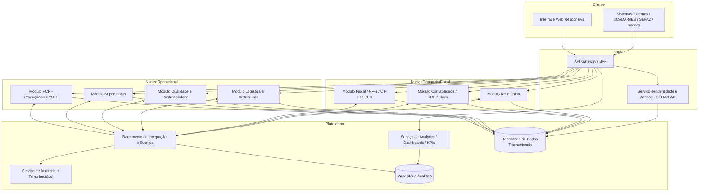
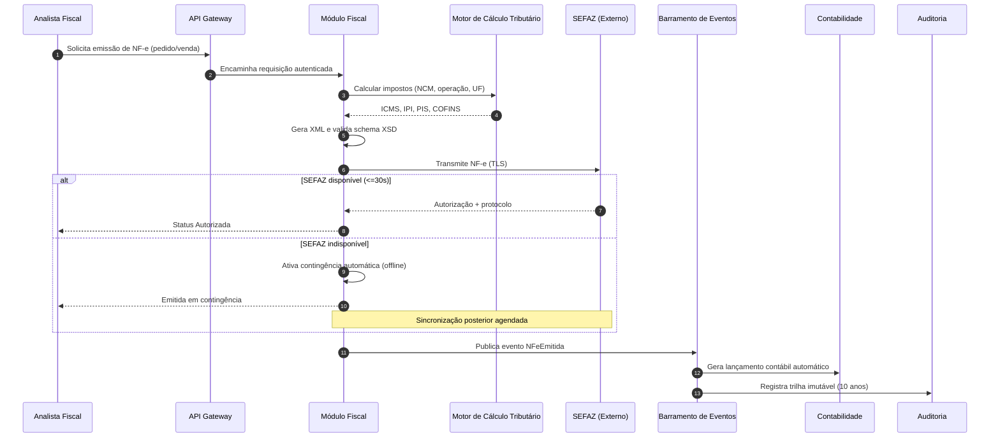
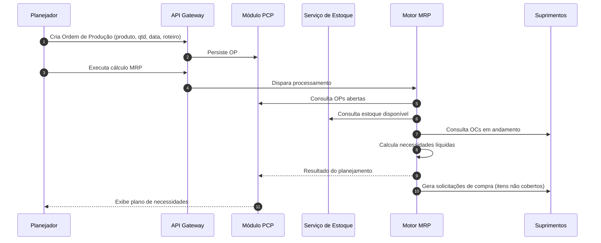
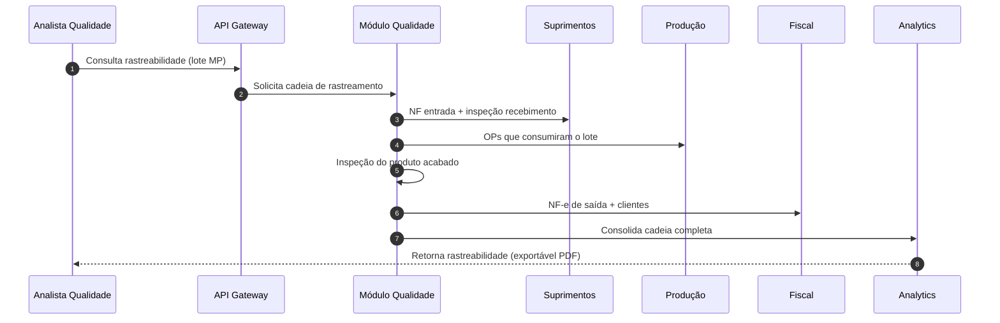

# Relatório Técnico de Arquitetura de Software
## Sistema Integrado de Gestão Empresarial para Manufatura (ERP) — G03
### AI4ES – Time 2 | Relatório Canônico de Arquitetura

---

## 1. Identificação das HUs

| HU | Perfil | Objetivo | RFs Associados | RNFs Associados |
|----|--------|----------|----------------|-----------------|
| HU01 | Planejador de Produção | Gerar OPs e calcular MRP | RF05, RF06, RF07, RF14 | RF13, RNF13 |
| HU02 | Planejador de Produção | Monitorar OEE e desvios em tempo real | RF08, RF10, RF11, RF12 | RNF14, RNF18 |
| HU03 | Comprador | Gerenciar cotações multi-fornecedor | RF13, RF15, RF16, RF19 | RNF03, RNF19 |
| HU04 | Gestor de Suprimentos | Acompanhar desempenho de fornecedores | RF19, RF25, RF53 | RNF14 |
| HU05 | Analista de Qualidade | Registrar inspeção e bloquear reprovados | RF20, RF21, RF22, RF24 | RNF10 |
| HU06 | Analista de Qualidade | Rastrear lote insumo→produto acabado | RF09, RF17, RF23, RF31 | RNF10, RNF20 |
| HU07 | Analista Fiscal | Emitir NF-e com cálculo automático | RF31, RF32, RF33, RF34 | RNF06, RNF07, RNF15, RNF17 |
| HU08 | Analista Fiscal | Manter SPED Fiscal atualizado | RF36, RF48 | RNF08, RNF10 |
| HU09 | Analista de RH | Processar folha mensal | RF37, RF38, RF39, RF40 | RNF02, RNF11 |
| HU10 | Analista de RH | Gerar obrigações acessórias | RF40, RF41, RF42 | RNF08, RNF09, RNF11 |
| HU11 | Controller | Visualizar DRE e Fluxo de Caixa | RF43, RF44, RF45, RF46, RF47 | RNF14, RNF49 |
| HU12 | Diretor/CEO | Dashboard executivo de KPIs | RF50, RF51, RF52, RF53 | RNF14, RNF16 |

---

## 2. Diagramas de Arquitetura (Mermaid)

### 2.1 Diagrama de Componentes (Visão Macro Modular)

### 2.2 Diagrama de Sequência — HU07 (Emissão de NF-e com Contingência)

### 2.3 Diagrama de Sequência — HU01 (Geração de OP e Cálculo de MRP)

### 2.4 Diagrama de Sequência — HU06 (Rastreabilidade de Lote)

---

## 3. Decisões de Arquitetura

| ID | Decisão | Justificativa | Requisitos Direcionadores |
|----|---------|---------------|---------------------------|
| AD01 | **Arquitetura modular por domínio de negócio** (PCP, Suprimentos, Qualidade, Logística, Fiscal, Contabilidade, RH) | Isolar contextos com ciclos de vida e regulação distintos; permitir evolução independente | Todos os grupos de RF |
| AD02 | **Barramento de integração orientado a eventos** entre módulos | Suporte a DRE/contabilidade em tempo real e propagação de eventos (NF-e, apontamento, folha) | RF43, RF45, RF11, RNF16 |
| AD03 | **Serviço de Identidade centralizado com SSO/LDAP e RBAC+SoD** | Autenticação corporativa, segregação de funções em operações críticas | RF01, RF02, RF04, RNF03 |
| AD04 | **Camada analítica (repositório separado) para dashboards e KPIs** | Isolar carga OLAP das transações; garantir carregamento <5s | RF50-53, RNF14 |
| AD05 | **Motor de Cálculo Tributário parametrizável** desacoplado | Absorver mudanças frequentes de legislação sem alterar módulos | RF32, RNF06, RNF07 |
| AD06 | **Mecanismo de contingência automática para NF-e** | Continuidade fiscal durante indisponibilidade da SEFAZ | RF34, RNF17 |
| AD07 | **Serviço de Auditoria com trilha imutável e retenção ≥10 anos** | Conformidade legal (CTN, LGPD) | RF03, RNF09, RNF10 |
| AD08 | **Camada de adaptadores de integração industrial** (OPC-UA/MQTT/REST) configurável por unidade | Interoperabilidade com chão de fábrica heterogêneo | RF11, RNF18 |
| AD09 | **Modelo multi-unidade com isolamento lógico de dados** | Suportar múltiplas fábricas com consolidação central | RF04, RNF16 |
| AD10 | **Criptografia em repouso (AES-256) e em trânsito (TLS 1.2+)** | Proteção de dados financeiros/fiscais/RH | RNF01, RNF02 |
| AD11 | **API Gateway/BFF como ponto único de entrada** | Centralizar autenticação, rate limiting, versionamento de APIs | RNF04, RNF19 |
| AD12 | **Suporte a implantação flexível (on-premises/nuvem privada/híbrida)** | Aderência à política de TI do cliente | RNF22 |

---

## 4. Tabela de Componentes e Rastreabilidade

| Componente | Responsabilidade Principal | Comunica-se com | Origem (HU / Critério de Aceite) |
|------------|----------------------------|-----------------|----------------------------------|
| Serviço de Identidade e Acesso | Autenticação SSO/LDAP, RBAC, SoD, perfis por unidade | API Gateway, Repositório de Dados | HU03 (fluxo alçada) / RF01-04, RNF03 |
| API Gateway / BFF | Ponto único de entrada, rate limiting, roteamento, exposição de APIs REST | Todos os módulos, Identidade | HU07,HU12 / RNF04, RNF19 |
| Módulo PCP | Gestão de OP, sequenciamento, apontamento, OEE, alertas de desvio | Motor MRP, Estoque, Barramento, Adaptador Industrial | HU01, HU02 / RF05-12 |
| Motor MRP | Cálculo de necessidades líquidas por OP e estoque | PCP, Estoque, Suprimentos | HU01 / RF06, RNF13 |
| Adaptador Integração Industrial | Coleta dados SCADA/MES via OPC-UA/MQTT/REST | Módulo PCP, Barramento | HU02 / RF11, RNF18 |
| Módulo Suprimentos | Fornecedores, solicitações, cotações, OC, recebimento, desempenho | MRP, Fiscal, Qualidade, Barramento | HU03, HU04 / RF13-19 |
| Módulo Qualidade e Rastreabilidade | Planos de inspeção, resultados, bloqueio de lote, NC, rastreabilidade | Suprimentos, PCP, Logística, Fiscal | HU05, HU06 / RF20-25 |
| Módulo Logística e Distribuição | Estoque PA, expedição, romaneios, rastreamento, RMA | Fiscal, Qualidade, Barramento | RF26-30 |
| Módulo Fiscal | Emissão NF-e/CT-e, contingência, cancelamento, SPED | Motor Tributário, SEFAZ, Contabilidade | HU07, HU08 / RF31-36 |
| Motor de Cálculo Tributário | Cálculo de impostos por NCM/operação/UF | Módulo Fiscal | HU07 / RF32, RNF06 |
| Módulo RH e Folha | Cadastro, ponto, folha, encargos, obrigações acessórias | Contabilidade, Barramento, Bancos | HU09, HU10 / RF37-42 |
| Módulo Contabilidade | Lançamentos automáticos, plano de contas, DRE, balanço, contas a pagar/receber | Todos os módulos via Barramento | HU11 / RF43-49 |
| Barramento de Integração e Eventos | Propagação assíncrona de eventos entre módulos | Todos os módulos, Auditoria, DW | HU11 / RF43, RNF16 |
| Serviço de Analytics/Dashboards | KPIs, metas, drill-down, exportação PDF/Excel | Repositório Analítico, Gateway | HU04, HU11, HU12 / RF50-53 |
| Serviço de Auditoria | Trilha imutável de operações críticas, retenção 10 anos | Barramento, Repositório de Dados | HU08 / RF03, RNF10 |
| Repositório de Dados Transacionais | Persistência transacional com criptografia em repouso | Todos os módulos | RNF02, RNF21 |
| Repositório Analítico | Dados consolidados para BI | Analytics, Barramento | RF50, RNF14 |

---

## 5. Bloqueios e Pendências

| ID | Bloqueio / Pendência | Impacto | Responsável Sugerido |
|----|----------------------|---------|----------------------|
| BL01 | Certificado digital A1/A3 e credenciais SEFAZ por unidade não especificados | Bloqueia homologação de NF-e/CT-e | Cliente / Fiscal |
| BL02 | Catálogo de protocolos industriais reais por fábrica (OPC-UA vs MQTT) não detalhado | Define escopo do adaptador industrial | Engenharia de Produção |
| BL03 | Regras de alçada de aprovação de OC não parametrizadas | Impacta HU03 | Suprimentos |
| BL04 | Política de retenção/expurgo LGPD vs retenção fiscal de 10 anos com possível conflito | Requer definição jurídica | DPO / Jurídico |
| BL05 | Convenções coletivas aplicáveis por sindicato não fornecidas | Impacta cálculo de folha (RF41, RNF11) | RH |
| BL06 | Estratégia de isolamento de dados multi-unidade (lógico vs físico) não definida | Afeta AD09 e RNF16 | Arquitetura |
| BL07 | SLA de integração bancária (remessa/retorno) não especificado | Impacta HU09 | Financeiro/TI |

---

## 6. Cobertura de Requisitos

**Requisitos Funcionais:** 53/53 mapeados ✅

| Grupo | RFs | Componente Responsável |
|-------|-----|------------------------|
| Usuários/Acesso | RF01-04 | Serviço de Identidade |
| PCP | RF05-12 | Módulo PCP + Motor MRP + Adaptador Industrial |
| Suprimentos | RF13-19 | Módulo Suprimentos |
| Qualidade | RF20-25 | Módulo Qualidade |
| Logística | RF26-30 | Módulo Logística |
| Fiscal | RF31-36 | Módulo Fiscal + Motor Tributário |
| RH | RF37-42 | Módulo RH e Folha |
| Contabilidade | RF43-49 | Módulo Contabilidade |
| Dashboards | RF50-53 | Serviço de Analytics |

**Requisitos Não Funcionais:** 24/24 endereçados ✅

| Categoria | RNFs | Tratamento Arquitetural |
|-----------|------|-------------------------|
| Segurança | RNF01-05 | AD03, AD10, AD11; pentest como processo operacional |
| Conformidade | RNF06-11 | AD05, AD06, AD07; motor tributário e trilha imutável |
| Disponibilidade/Desempenho | RNF12-17 | AD02, AD04, AD06; segregação OLTP/OLAP |
| Interoperabilidade | RNF18-20 | AD08, AD11; APIs REST e formatos padrão |
| Infraestrutura/Dados | RNF21-24 | AD12; backup, monitoramento, UI responsiva |

---

## 7. Gap Analysis

| Gap | Descrição da Lacuna | Impacto Arquitetural | Ação Recomendada |
|-----|---------------------|----------------------|------------------|
| GAP01 | **Estratégia de notificação** (e-mail, push) mencionada em HU02/HU05/HU10 sem serviço dedicado especificado | Múltiplos módulos precisam disparar notificações; risco de duplicação | Criar Serviço de Notificações compartilhado no barramento |
| GAP02 | **Versionamento e ciclo de atualização das regras fiscais** (RNF06) não descrito | Alíquotas/NCM mudam frequentemente; sem processo, motor tributário fica defasado | Definir pipeline de atualização parametrizada e versionada de tabelas fiscais |
| GAP03 | **Definição de "tempo real"** para DRE/OEE/dashboards ambígua (streaming vs micro-batch) | Afeta dimensionamento do barramento e do repositório analítico | Estabelecer latência-alvo com o negócio (ex.: near-real-time ≤ X min) |
| GAP04 | **Conflito de retenção LGPD × Fiscal (10 anos)** para dados pessoais de colaboradores | Pode violar minimização de dados da LGPD | Definir política de anonimização pós-vínculo com base legal documentada |
| GAP05 | **Recuperação de desastres (RTO)** não especificada; apenas RPO (RNF21) | Sem RTO, meta de 99,5% (RNF12) fica incompleta | Definir RTO e estratégia de failover/replicação |
| GAP06 | **Gestão de concorrência no MRP** para 50.000 itens (RNF13) sem detalhe de execução | Risco de bloqueios em bases grandes | Especificar processamento assíncrono/particionado do MRP |
| GAP07 | **Fluxo de liberação de lote bloqueado** (HU05) descreve bloqueio automático mas não o workflow formal de liberação | Falta de definição de quem/como libera | Modelar workflow de aprovação de liberação com SoD |
| GAP08 | **Integração com transportadoras** (RF27, RF29) não define protocolo/parceiros | Impacta rastreamento de entregas | Definir padrões de integração logística (EDI/API) |
| GAP09 | **Estratégia de migração de dados legados** ausente | ERP costuma substituir sistemas existentes | Planejar componente/processo de migração e conciliação |
| GAP10 | **Requisitos de acessibilidade** (além de responsividade RNF24) não mencionados | Possível não conformidade com normas de acessibilidade | Validar necessidade de WCAG com o cliente |

---

> **Observação de Neutralidade Tecnológica:** Este relatório descreve responsabilidades, interfaces e padrões conceituais. Produtos, bancos de dados e frameworks específicos serão definidos na fase de arquitetura tecnológica de detalhe, respeitando os requisitos de implantação flexível (RNF22).