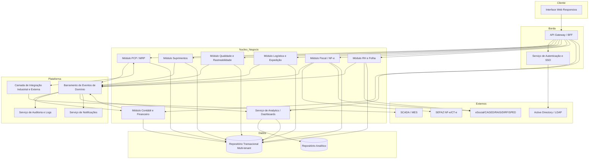
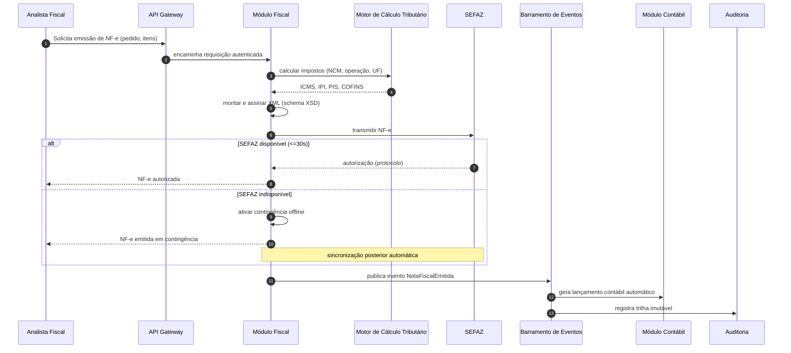
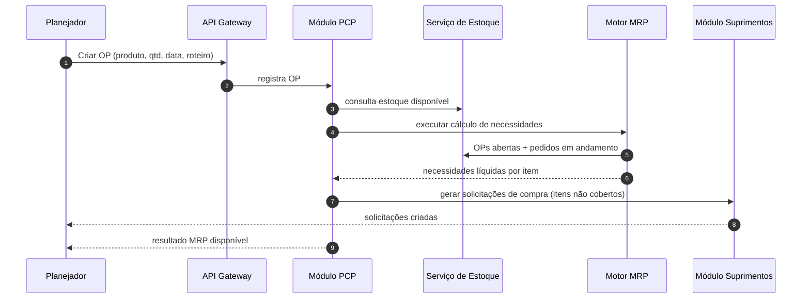

# Relatório Técnico de Arquitetura de Software
## Sistema Integrado de Gestão Empresarial para Manufatura (ERP) — G03

---

## 1. Identificação das HUs

| HU | Perfil | Objetivo | RFs Relacionados | RNFs Relacionados |
|----|--------|----------|------------------|-------------------|
| HU01 | Planejador de Produção | Gerar OPs e calcular MRP automaticamente | RF05, RF06, RF07, RF14 | RNF13, RNF16 |
| HU02 | Planejador de Produção | Monitorar OEE e desvios em tempo real | RF08, RF10, RF11, RF12, RF52 | RNF14, RNF18, RNF23 |
| HU03 | Comprador | Gerenciar cotações multi-fornecedor | RF13, RF15, RF16, RF19 | RNF03, RNF19 |
| HU04 | Gestor de Suprimentos | Acompanhar desempenho de fornecedores | RF19, RF25, RF53 | RNF14 |
| HU05 | Analista de Qualidade | Registrar inspeção e bloquear lotes reprovados | RF20, RF21, RF22, RF24 | RNF03 |
| HU06 | Analista de Qualidade | Rastrear lote do insumo ao produto acabado | RF09, RF17, RF23, RF31 | RNF10, RNF20 |
| HU07 | Analista Fiscal | Emitir NF-e com cálculo automático de impostos | RF31, RF32, RF33, RF34 | RNF06, RNF07, RNF15, RNF17 |
| HU08 | Analista Fiscal | Manter SPED Fiscal atualizado | RF36, RF43, RF48 | RNF08, RNF10 |
| HU09 | Analista de RH | Processar folha de pagamento mensal | RF38, RF39, RF40 | RNF02, RNF11 |
| HU10 | Analista de RH | Gerar obrigações acessórias de RH | RF40, RF41 | RNF08, RNF09, RNF11 |
| HU11 | Controller | Visualizar DRE e Fluxo de Caixa em tempo real | RF43, RF45, RF46, RF47, RF52 | RNF14, RNF16 |
| HU12 | Diretor / CEO | Dashboard executivo de KPIs | RF50, RF51, RF52, RF53 | RNF14, RNF16, RNF24 |

---

## 2. Diagramas de Arquitetura (Mermaid)

### 2.1 Visão de Componentes (macroarquitetura modular)

### 2.2 Diagrama de Sequência — HU07 (Emissão de NF-e com contingência)

### 2.3 Diagrama de Sequência — HU01 (Geração de OP e MRP)

---

## 3. Decisões de Arquitetura

| # | Decisão | Justificativa | Requisitos-Fonte |
|---|---------|---------------|------------------|
| AD01 | Arquitetura modular orientada a serviços de domínio (módulos com fronteiras claras PCP, Suprimentos, Qualidade, Logística, Fiscal, RH, Contábil, BI) | ERP amplo exige isolamento funcional e evolução independente | Todos os blocos de RF |
| AD02 | Barramento de eventos de domínio para propagação assíncrona (ex.: lançamento contábil automático, auditoria, notificações) | Requisitos de contabilidade "em tempo real" e DRE derivada de outros módulos | RF43, RF45, RF50 |
| AD03 | Camada de integração industrial dedicada com adaptadores por protocolo (OPC-UA, MQTT, REST/JSON) configuráveis por unidade | Interoperabilidade com SCADA/MES heterogêneos | RF11, RNF18 |
| AD04 | Modelo multi-tenant com isolamento lógico por unidade fabril e consolidação centralizada | Múltiplas plantas com segregação e consolidação | RF04, RNF16 |
| AD05 | Motor de cálculo tributário parametrizável e desacoplado do módulo fiscal | Alíquotas/NCM/UF variam e mudam com frequência | RF32, RNF06 |
| AD06 | Mecanismo de contingência offline com fila de sincronização para NF-e | Resiliência frente à indisponibilidade da SEFAZ | RF34, RNF17 |
| AD07 | Serviço de auditoria com armazenamento imutável e retenção de 10 anos | Trilha legal fiscal/RH | RF03, RNF10 |
| AD08 | RBAC com segregação de funções (SoD) aplicado no gateway e nos módulos | Controle granular e SoD financeiro/fiscal | RF01, RNF03 |
| AD09 | Repositório analítico separado do transacional alimentado por eventos | Dashboards em tempo real sem impactar OLTP; drill-down | RF50, RF52, RNF14 |
| AD10 | Bloqueio de estado de lote como invariante de domínio da Qualidade, consultado por Estoque/Expedição | Impedir consumo/expedição de reprovados | RF22, HU05 |
| AD11 | Criptografia em repouso (AES-256) para domínios financeiro, fiscal e RH; TLS em trânsito | Proteção de dados sensíveis e LGPD | RNF01, RNF02, RNF09 |
| AD12 | Implantação flexível (on-premises, nuvem privada, híbrida) via empacotamento agnóstico | Política de TI variável entre clientes | RNF22 |

---

## 4. Tabela de Componentes e Rastreabilidade

| Componente | Responsabilidade Principal | Comunica-se com | Origem (HU / Critério de Aceite) |
|------------|----------------------------|-----------------|----------------------------------|
| Interface Web Responsiva | Apresentação responsiva multi-navegador, dashboards, exportação | API Gateway | HU12 / RNF24, RF53 |
| API Gateway / BFF | Roteamento, autenticação, rate limiting, agregação | UI, Auth, Módulos | RNF04 / RF01 |
| Serviço de Autenticação e SSO | SSO com AD/LDAP, RBAC, SoD, bloqueio de conta | AD/LDAP, Gateway | RF01, RF02, RNF03, RNF04 |
| Módulo PCP / MRP | OP, sequenciamento, apontamento, OEE, MRP, alertas de desvio | Estoque, Suprimentos, Integração Industrial, Eventos | HU01, HU02 / RF05-RF12 |
| Motor MRP | Cálculo de necessidades líquidas | PCP, Estoque, Suprimentos | HU01 / RF06, RNF13 |
| Módulo Suprimentos | Fornecedores, cotações, OC, recebimento, devoluções, desempenho | PCP, Fiscal, Estoque, Notificações | HU03, HU04 / RF13-RF19 |
| Módulo Qualidade e Rastreabilidade | Planos de inspeção, resultados, bloqueio de lote, NC, rastreabilidade | Estoque, Logística, Notificações, Eventos | HU05, HU06 / RF20-RF25 |
| Serviço de Estoque | Saldos em tempo real, endereçamento, estado de lote | PCP, Qualidade, Logística, Suprimentos | RF09, RF26 / HU05 |
| Módulo Logística e Expedição | Expedição, romaneios, rastreamento, RMA | Fiscal, Estoque, Notificações | RF26-RF30 |
| Módulo Fiscal / NF-e | Emissão NF-e/CT-e, cálculo tributário, cancelamento, contingência, SPED Fiscal | SEFAZ, Contábil, Eventos, Órgãos | HU07, HU08 / RF31-RF36 |
| Motor de Cálculo Tributário | Cálculo de ICMS/IPI/PIS/COFINS/ISS por NCM/UF/operação | Fiscal | HU07 / RF32, RNF06 |
| Módulo RH e Folha | Cadastro, ponto, folha, benefícios, obrigações acessórias | Contábil, Órgãos, Eventos | HU09, HU10 / RF37-RF42 |
| Módulo Contábil e Financeiro | Lançamentos automáticos, DRE, balanço, fluxo de caixa, AP/AR, multimoeda | Eventos, todos módulos, BI | HU11 / RF43-RF49 |
| Serviço de Analytics / Dashboards | KPIs, metas, drill-down, exportação, alertas visuais | Repositório Analítico, Eventos | HU12 / RF50-RF53 |
| Barramento de Eventos de Domínio | Propagação assíncrona de eventos entre módulos | Todos módulos | AD02 / RF43, RF45 |
| Serviço de Auditoria e Logs | Trilha imutável, retenção 10 anos | Todos módulos | RF03, RNF10 |
| Serviço de Notificações | Alertas por e-mail/visuais | Módulos, UI | HU02, HU05 / RF12, RF51 |
| Camada de Integração Industrial e Externa | Adaptadores OPC-UA/MQTT/REST, import/export, APIs | MES/SCADA, PCP, sistemas externos | RF11, RNF18, RNF19, RNF20 |
| Repositório Transacional Multi-tenant | Persistência OLTP com isolamento por unidade | Módulos | RF04, RNF16, RNF21 |
| Repositório Analítico | Persistência para dashboards e KPIs | BI, Eventos | RF50 / RNF14 |

---

## 5. Bloqueios e Pendências

| ID | Descrição do Bloqueio | Impacto | Ação Necessária |
|----|-----------------------|---------|-----------------|
| BL01 | Requisitos não definem provedor de assinatura digital (certificado A1/A3) para NF-e/CT-e | Alto — bloqueia emissão fiscal | Definir política de certificados e HSM/armazenamento seguro |
| BL02 | Não há definição de volumetria de transações/dia por unidade (além dos 50k itens do MRP) | Médio — dimensionamento de capacidade | Levantar métricas de carga por planta |
| BL03 | Regras de alçada de aprovação (RF16) descritas como "configuráveis" sem taxonomia mínima | Médio — modelagem de workflow | Definir dimensões de alçada (valor, categoria, centro de custo) |
| BL04 | Integração bancária (remessa/retorno CNAB) citada na HU09 mas ausente nos RF | Médio — folha incompleta | Especificar layouts bancários suportados |
| BL05 | Convenções coletivas (RNF11) variam por sindicato/UF — sem catálogo de regras | Alto — cálculo de folha | Definir mecanismo de parametrização de acordos coletivos |
| BL06 | Estratégia de versionamento de leiautes legais (SPED, eSocial) não especificada | Médio — conformidade contínua | Definir processo de atualização de esquemas |

---

## 6. Cobertura de Requisitos

**Requisitos Funcionais:** 53/53 mapeados a componentes.

| Módulo | RFs cobertos |
|--------|-------------|
| Autenticação/Acesso | RF01, RF02, RF03, RF04 |
| PCP/MRP | RF05–RF12 |
| Suprimentos | RF13–RF19 |
| Qualidade | RF20–RF25 |
| Logística | RF26–RF30 |
| Fiscal | RF31–RF36 |
| RH/Folha | RF37–RF42 |
| Contábil/Financeiro | RF43–RF49 |
| Analytics/Dashboards | RF50–RF53 |

**Requisitos Não Funcionais:** 24/24 endereçados.

| Categoria | RNFs | Tratamento arquitetural |
|-----------|------|-------------------------|
| Segurança | RNF01–RNF05 | TLS, AES-256, RBAC/SoD, rate limiting, pentest (AD08, AD11) |
| Conformidade | RNF06–RNF11 | Motor tributário parametrizável, schemas XSD, auditoria imutável (AD05, AD07) |
| Disponibilidade/Desempenho | RNF12–RNF17 | Repositório analítico, contingência NF-e, multi-tenant (AD06, AD09) |
| Interoperabilidade | RNF18–RNF20 | Camada de integração com adaptadores (AD03) |
| Infraestrutura/Dados | RNF21–RNF24 | Backup/WAL, deploy híbrido, monitoramento, UI responsiva (AD12) |

**Cobertura das HUs:** 12/12 com fluxo arquitetural definido.

---

## 7. Gap Analysis

| # | Lacuna Identificada | Impacto Arquitetural | Ação Recomendada |
|---|---------------------|----------------------|------------------|
| GAP01 | **Gestão de certificados digitais e assinatura** não especificada, embora essencial para NF-e/CT-e/SPED. | Sem isso, o Módulo Fiscal não cumpre RF31–RF36. Requer componente de gestão de chaves seguro. | Especificar serviço de assinatura/HSM e ciclo de vida de certificados A1/A3. |
| GAP02 | **Consistência transacional cross-módulo** (ex.: consumo de MP + baixa estoque + lançamento contábil) não definida diante da opção assíncrona por eventos. | Risco de inconsistência entre "tempo real" (RF09) e eventual (AD02). | Definir padrão de saga/compensação e quais fluxos exigem consistência forte vs. eventual. |
| GAP03 | **Estratégia de recall (HU06)** citada mas sem processo de notificação/bloqueio retroativo formalizado nos RF. | Rastreabilidade existe (RF23) mas ação de recall não tem RF. | Especificar processo de recall (bloqueio, comunicação a clientes, documentação). |
| GAP04 | **Política de retenção diferenciada** — RNF10 exige 10 anos para fiscal/RH; RNF21 define 90 dias de backup. Falta política de arquivamento de longo prazo. | Conflito de retenção pode gerar não conformidade legal. | Definir camada de arquivamento imutável de longo prazo separada do backup operacional. |
| GAP05 | **Desempenho de dashboards em tempo real (RNF14)** vs. drill-down até transacional (RF52) — tensão entre repositório analítico e OLTP. | Drill-down profundo pode exigir acesso ao transacional, impactando latência. | Definir estratégia de materialização/cache e limites de profundidade de drill-down. |
| GAP06 | **Gestão de configuração multi-unidade** (protocolos MES, alçadas, planos de conta, benefícios) sem repositório central de parametrização descrito. | Configurações dispersas dificultam governança multi-planta (RNF16). | Introduzir componente de gestão de configuração/parametrização centralizado. |
| GAP07 | **Fluxo de aprovação/workflow genérico** (alçadas de OC, liberação de lote, encerramento de NC) recorre em vários módulos sem componente único. | Duplicação de lógica de workflow entre módulos. | Avaliar serviço de workflow/BPM reutilizável. |
| GAP08 | **Idempotência e reprocessamento** de eventos industriais (RF11, alta frequência) não tratados. | Duplicação de apontamentos afeta OEE (RF10). | Definir deduplicação e janelas de agregação na camada de integração. |

---

*Fim do Relatório Canônico — AI4ES Time 2.*