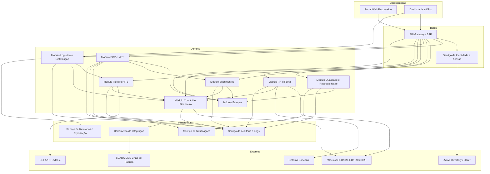
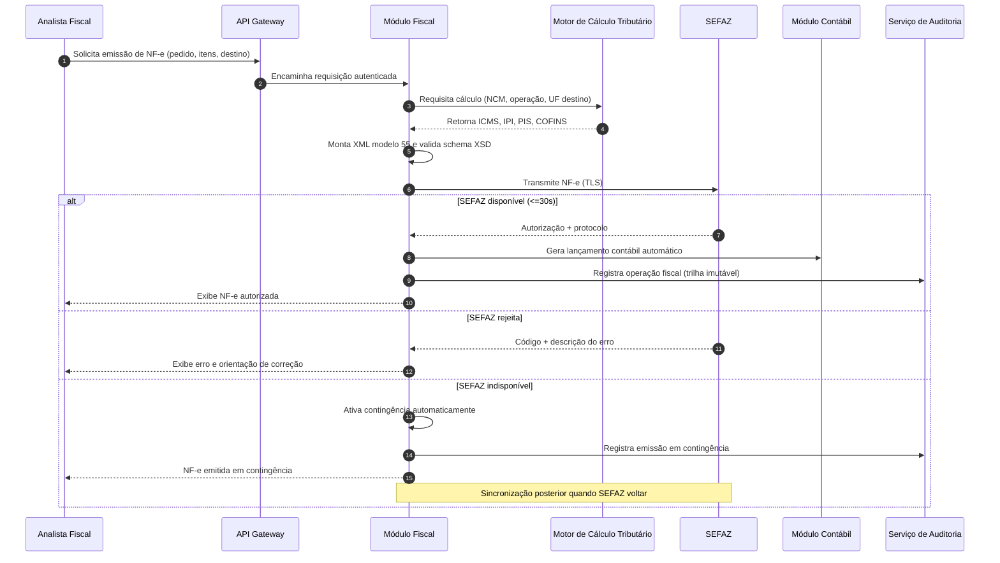
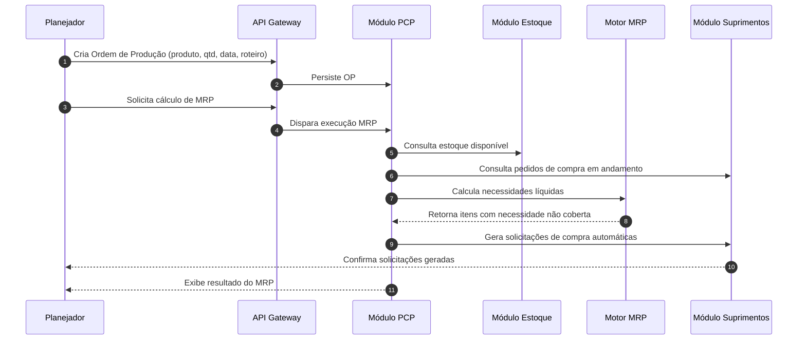
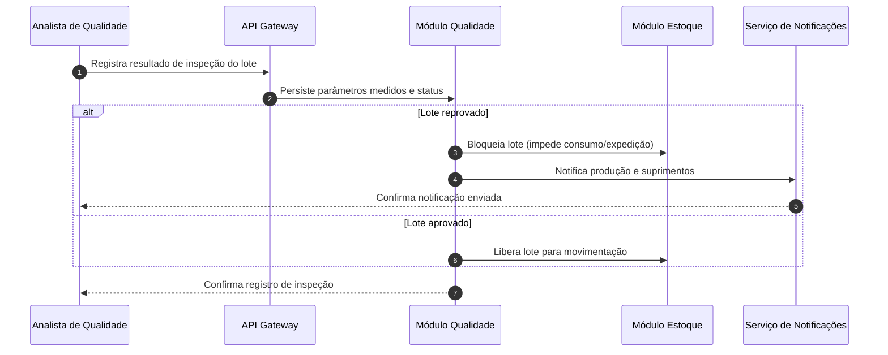

# Relatório Técnico de Arquitetura de Software
## Sistema Integrado de Gestão Empresarial para Manufatura (ERP) — G03

---

## 1. Identificação das HUs

| HU | Perfil | Objetivo Central | RFs Relacionados | RNFs Relacionados |
|----|--------|------------------|------------------|-------------------|
| HU01 | Planejador de Produção | Criar OPs e executar MRP com geração automática de solicitações de compra | RF05, RF06, RF14 | RF13, RNF13 |
| HU02 | Planejador de Produção | Monitorar OEE e desvios de produção em tempo real | RF08, RF10, RF11, RF12, RF52 | RNF14, RNF18 |
| HU03 | Comprador / Suprimentos | Gerenciar cotações multi-fornecedor com comparação e aprovação por alçada | RF13, RF15, RF16, RF19 | RNF03 |
| HU04 | Gestor de Suprimentos | Acompanhar desempenho de fornecedores | RF19, RF25, RF53 | RNF20 |
| HU05 | Analista de Qualidade | Registrar inspeção de lote e bloquear reprovados | RF20, RF21, RF22 | — |
| HU06 | Analista de Qualidade | Rastreabilidade completa de lote (insumo → produto acabado) | RF09, RF17, RF23, RF31 | RNF10 |
| HU07 | Analista Fiscal | Emitir NF-e com cálculo automático de impostos e contingência | RF31, RF32, RF33, RF34 | RNF07, RNF15, RNF17 |
| HU08 | Analista Fiscal | Manter SPED Fiscal atualizado automaticamente | RF36, RF48 | RNF08, RNF06 |
| HU09 | Analista de RH | Processar folha de pagamento mensal | RF37, RF38, RF39, RF41 | RNF11, RNF02 |
| HU10 | Analista de RH | Gerar obrigações acessórias de RH (eSocial, CAGED, RAIS, DIRF) | RF40 | RNF08, RNF09 |
| HU11 | Controller / CFO | Visualizar DRE e Fluxo de Caixa em tempo real com drill-down | RF43, RF45, RF46, RF47, RF52 | RNF14 |
| HU12 | Diretor / CEO | Dashboard executivo de KPIs operacionais e financeiros | RF50, RF51, RF52, RF53 | RNF14, RNF16 |

---

## 2. Diagramas de Arquitetura (Mermaid)

### 2.1 Diagrama de Componentes (Visão Modular)

### 2.2 Diagrama de Sequência — HU07: Emissão de NF-e com cálculo de impostos e contingência

### 2.3 Diagrama de Sequência — HU01: Geração de OP e cálculo de MRP

### 2.4 Diagrama de Sequência — HU05: Inspeção de lote e bloqueio automático

---

## 3. Decisões de Arquitetura

| ID | Decisão | Justificativa | Requisitos |
|----|---------|---------------|------------|
| AD01 | **Arquitetura modular orientada a domínios** (PCP, Suprimentos, Qualidade, Logística, Fiscal, RH, Contábil) com fronteiras explícitas | Isola responsabilidades regulatórias e permite evolução independente de módulos fiscais/RH voláteis | RF05–RF53, RNF16 |
| AD02 | **API Gateway / BFF único** como ponto de entrada com autenticação centralizada | Padroniza segurança, rate limiting e roteamento | RNF01, RNF04, RNF19 |
| AD03 | **Serviço de Identidade com integração SSO/LDAP e RBAC+SoD** | Requisito explícito de SSO e segregação de funções financeiras/fiscais | RF01, RF02, RF04, RNF03 |
| AD04 | **Barramento de integração dedicado para chão de fábrica** suportando OPC-UA/MQTT/REST por unidade | Desacopla ingestão de dados industriais de alta frequência do núcleo transacional | RF11, RNF18 |
| AD05 | **Motor de cálculo tributário isolado** parametrizável por NCM/UF/operação | Isola a volatilidade da legislação fiscal do restante do sistema | RF32, RNF06 |
| AD06 | **Serviço de emissão fiscal com contingência automática** e sincronização posterior | Resiliência frente à indisponibilidade da SEFAZ | RF34, RNF17 |
| AD07 | **Trilha de auditoria imutável centralizada** com retenção mínima de 10 anos | Exigência legal (CTN) para operações financeiras/fiscais/RH | RF03, RNF10 |
| AD08 | **Lançamentos contábeis por eventos** originados dos módulos operacionais | Permite DRE/Fluxo de Caixa em tempo real sem consolidação manual | RF43, RF45, RF46, RF52 |
| AD09 | **Camada analítica dedicada para dashboards/KPIs** com drill-down até o transacional | Atende performance de painéis sem onerar OLTP | RF50–RF53, RNF14 |
| AD10 | **Criptografia em repouso (AES-256) segmentada** para dados financeiros, fiscais e de RH | Requisito explícito de segurança e LGPD | RNF02, RNF09 |
| AD11 | **Modelo multi-tenant por unidade fabril** com isolamento de dados e consolidação central | Suporte a múltiplas plantas com hierarquia organizacional | RF04, RNF16 |
| AD12 | **Backup diário + WAL contínuo (RPO ≤ 1h)** e suporte a implantação on-premises/nuvem/híbrida | Requisitos explícitos de continuidade e infraestrutura flexível | RNF21, RNF22 |

---

## 4. Tabela de Componentes e Rastreabilidade

| Componente | Responsabilidade Principal | Comunica-se com | Origem (HU / Critério de Aceite) |
|-----------|----------------------------|-----------------|----------------------------------|
| Portal Web Responsivo | Interface de usuário multi-perfil, responsiva sem plugins | API Gateway | RNF24 / HU01–HU12 |
| API Gateway / BFF | Roteamento, autenticação, rate limiting, agregação | Todos os módulos, Identidade | RNF04, RNF19 / HU geral |
| Serviço de Identidade e Acesso | SSO, RBAC, SoD, permissões granulares por unidade | LDAP/AD, Gateway, Auditoria | RF01–RF04, RNF03 / HU geral |
| Módulo PCP e MRP | OP, sequenciamento, apontamento, OEE, MRP | Estoque, Suprimentos, Barramento, Notificações | RF05–RF12 / HU01, HU02 |
| Motor MRP | Cálculo de necessidades líquidas em ≤10 min/50k itens | PCP, Estoque, Suprimentos | RF06, RNF13 / HU01 CA2 |
| Barramento de Integração Industrial | Ingestão OPC-UA/MQTT/REST por planta em tempo real | SCADA/MES, PCP | RF11, RNF18 / HU02 CA1 |
| Módulo Suprimentos | Fornecedores, cotações, OC, recebimento, desempenho | Estoque, Contábil, Notificações | RF13–RF19 / HU03, HU04 |
| Módulo Estoque | Endereçamento, saldo em tempo real, bloqueio de lote | PCP, Suprimentos, Qualidade, Logística | RF09, RF22, RF26 / HU05, HU06 |
| Módulo Qualidade e Rastreabilidade | Planos de inspeção, NC, bloqueio, rastreabilidade lote | Estoque, Notificações, Fiscal | RF20–RF25 / HU05, HU06 |
| Módulo Logística e Distribuição | Expedição, romaneio, rastreamento, RMA | Fiscal, Estoque, Contábil | RF26–RF30 / — |
| Módulo Fiscal e NF-e | Emissão NF-e/CT-e, cálculo tributário, contingência, SPED | SEFAZ, Contábil, Auditoria | RF31–RF36 / HU07, HU08 |
| Motor de Cálculo Tributário | Cálculo ICMS/IPI/PIS/COFINS/ISS por NCM/UF/operação | Módulo Fiscal | RF32, RNF06 / HU07 CA1 |
| Módulo RH e Folha | Cadastro, ponto, folha, verbas CLT, obrigações acessórias | Bancário, Órgãos Gov, Contábil, Auditoria | RF37–RF42 / HU09, HU10 |
| Módulo Contábil e Financeiro | Lançamentos automáticos, DRE, balanço, AP/AR, câmbio | Todos os módulos operacionais, SPED | RF43–RF49 / HU11 |
| Serviço de Relatórios e Exportação | Geração e exportação PDF/Excel de painéis e relatórios | Dashboards, módulos | RF53, RNF20 / HU04 CA3, HU06 CA3 |
| Camada Analítica / Dashboards | KPIs em tempo real, metas, alertas, drill-down | Módulos de domínio, Relatórios | RF50–RF52 / HU11, HU12 |
| Serviço de Notificações | Alertas visuais e e-mail sobre desvios/eventos | PCP, Qualidade, Suprimentos, RH | RF12, RF51 / HU02 CA2, HU05 CA3 |
| Serviço de Auditoria e Logs | Trilha imutável, retenção ≥10 anos, logs de operações | Todos os módulos | RF03, RNF10 / HU geral |

---

## 5. Bloqueios e Pendências

| ID | Descrição | Impacto | Responsável Sugerido |
|----|-----------|---------|----------------------|
| BL01 | Protocolos industriais suportados por planta (OPC-UA/MQTT/REST) não especificam frequência de amostragem nem volume esperado | Dimensionamento do barramento de ingestão (RF11) | Arquitetura + Automação Industrial |
| BL02 | Regras de alçada de aprovação de OC não detalham níveis, valores-limite e substituição de aprovadores | Modelagem do workflow de aprovação (RF16, HU03) | Suprimentos + PO |
| BL03 | Política de retenção LGPD vs. retenção fiscal de 10 anos pode conflitar quanto a dados pessoais em documentos fiscais/RH | Estratégia de anonimização/expurgo (RNF09 x RNF10) | Jurídico + DPO |
| BL04 | Critério de "tempo real" para DRE/Fluxo de Caixa não define latência aceitável de consolidação | Design da camada de lançamentos por evento (RF45, HU11) | Controladoria + Arquitetura |
| BL05 | Estratégia de multi-tenant (isolamento físico vs. lógico) por unidade não definida | Modelo de dados e segurança (RNF16, AD11) | Arquitetura + TI |
| BL06 | Integração bancária (layout de remessa/retorno CNAB) não especificada em requisitos | Emissão de remessa de folha (HU09 CA3) | RH + Financeiro |

---

## 6. Cobertura de Requisitos

**Requisitos Funcionais:** 53/53 mapeados a componentes.

| Módulo | RFs Cobertos |
|--------|--------------|
| Identidade e Acesso | RF01, RF02, RF03, RF04 |
| PCP e MRP | RF05–RF12 |
| Suprimentos | RF13–RF19 |
| Qualidade | RF20–RF25 |
| Logística | RF26–RF30 |
| Fiscal / NF-e | RF31–RF36 |
| RH e Folha | RF37–RF42 |
| Contábil / Financeiro | RF43–RF49 |
| Dashboards / KPIs | RF50–RF53 |

**Requisitos Não Funcionais:** 24/24 endereçados por decisões arquiteturais (AD01–AD12) e componentes transversais (Gateway, Identidade, Auditoria, Backup/Infra).

| Categoria RNF | Cobertura |
|---------------|-----------|
| Segurança (RNF01–05) | AD02, AD03, AD07, AD10 |
| Conformidade (RNF06–11) | AD05, AD06, AD07, Módulos Fiscal/RH/Contábil |
| Disponibilidade/Desempenho (RNF12–17) | AD06, AD09, AD12, Motor MRP |
| Interoperabilidade (RNF18–20) | AD04, AD02, Serviço de Relatórios |
| Infraestrutura/Dados (RNF21–24) | AD12, Portal Web, Auditoria |

**Cobertura de HUs:** 12/12 — cada HU possui componentes e critérios de aceite rastreados na Seção 4; HU01, HU05, HU07 detalhadas com diagramas de sequência.

---

## 7. Gap Analysis

| # | Lacuna Identificada | Impacto Arquitetural | Ação Recomendada |
|---|---------------------|----------------------|------------------|
| GAP01 | **Ausência de especificação de SLA de latência para dados de chão de fábrica** (RF11/HU02 exigem "tempo real" sem métrica) | Impossibilita dimensionar buffer/streaming do barramento industrial | Definir com Engenharia janela máxima de latência (ex.: por criticidade de KPI) e volume por planta |
| GAP02 | **Estratégia de recuperação de desastres (RTO) não especificada** — apenas RPO (RNF21) está definido | Risco de indisponibilidade prolongada afetando RNF12 (99,5%) | Especificar RTO e arquitetura de failover; validar janela vs. turno produtivo |
| GAP03 | **Conflito LGPD × retenção fiscal de 10 anos** para dados pessoais (BL03) | Requer política de minimização/pseudonimização não prevista nos módulos | Definir camada de governança de dados pessoais com base legal por finalidade |
| GAP04 | **Versionamento de leiautes regulatórios** (SPED, eSocial, NF-e XSD) muda periodicamente, sem estratégia de atualização definida | Alterações regulatórias podem exigir deploy do núcleo | Externalizar leiautes/regras em repositório versionado parametrizável (reforça AD05) |
| GAP05 | **Gestão de custo de produção/ativo imobilizado** referenciada indiretamente (RF25 custo da não qualidade, RF43) mas sem módulo de custeio explícito | Cálculo de margem bruta (HU12) e DRE dependem de custeio consistente | Avaliar necessidade de módulo/serviço de custeio industrial |
| GAP06 | **Fluxo de liberação formal de lote bloqueado** (HU05 CA2 menciona "até liberação formal") sem RF definindo o processo de desbloqueio | Lacuna funcional no ciclo de qualidade | Especificar workflow de liberação com alçada e registro em auditoria |
| GAP07 | **Requisitos de acessibilidade** (WCAG) e internacionalização não mencionados apesar de multi-moeda (RF49) | Pode gerar retrabalho de UI | Confirmar escopo de i18n/a11y com stakeholders |
| GAP08 | **Estratégia de reconciliação da contingência NF-e** (RF34/RNF17) não define tratamento de divergências pós-sincronização | Risco de inconsistência fiscal | Especificar regras de conciliação e alertas de exceção na sincronização |

---

*Fim do Relatório Canônico — AI4ES Time 2.*