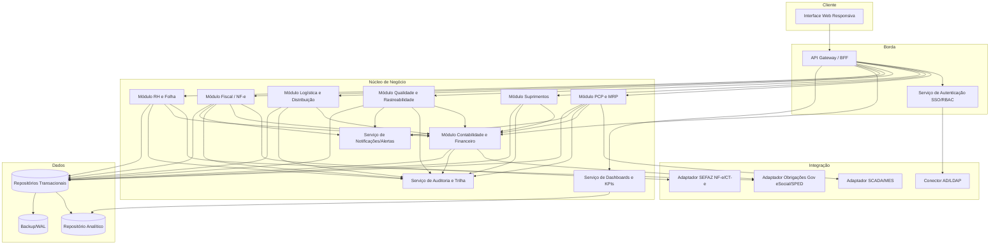
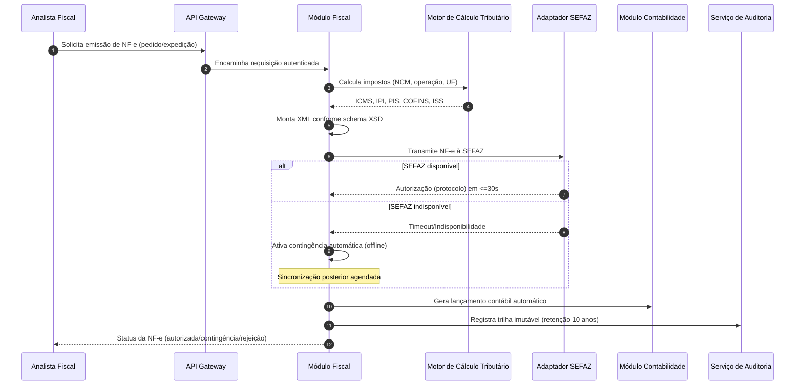
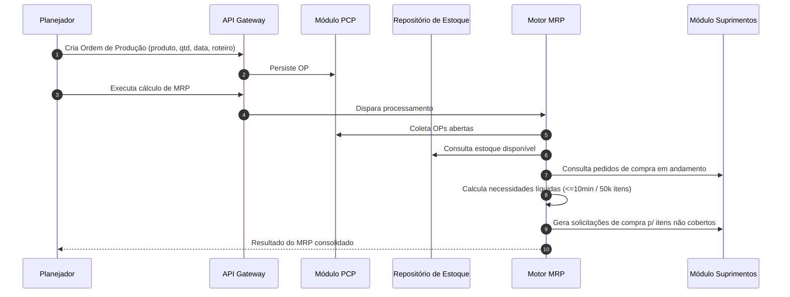
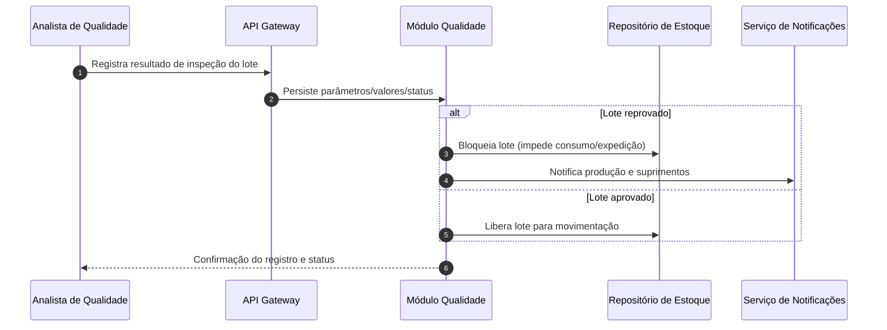

# Relatório Técnico de Arquitetura de Software
## ERP para Indústria Manufatureira (G03) — AI4ES Time 2

---

## 1. Identificação das HUs

| HU | Perfil | Objetivo | RFs Relacionados | RNFs Relacionados |
|----|--------|----------|------------------|-------------------|
| HU01 | Planejador de Produção | Criar OP e executar MRP | RF05, RF06, RF07, RF14 | RNF13, RNF16 |
| HU02 | Planejador de Produção | Monitorar OEE e desvios em tempo real | RF08, RF10, RF11, RF12, RF52 | RNF14, RNF18, RNF23 |
| HU03 | Comprador | Cotações com múltiplos fornecedores | RF13, RF15, RF16 | RNF03, RNF19 |
| HU04 | Gestor de Suprimentos | Acompanhar desempenho de fornecedores | RF19, RF53 | RNF14, RNF20 |
| HU05 | Analista de Qualidade | Registrar inspeção e bloquear reprovados | RF20, RF21, RF22, RF24 | RNF10 |
| HU06 | Analista de Qualidade | Rastreabilidade lote → produto acabado | RF09, RF17, RF23, RF31 | RNF10, RNF20 |
| HU07 | Analista Fiscal | Emitir NF-e com cálculo automático | RF31, RF32, RF33, RF34 | RNF06, RNF07, RNF15, RNF17 |
| HU08 | Analista Fiscal | Manter SPED Fiscal atualizado | RF36, RF48 | RNF08, RNF10 |
| HU09 | Analista de RH | Processar folha de pagamento | RF37, RF38, RF39, RF40 | RNF02, RNF09, RNF11 |
| HU10 | Analista de RH | Gerar obrigações acessórias | RF40, RF41, RF42 | RNF08, RNF09 |
| HU11 | Controller | DRE e Fluxo de Caixa em tempo real | RF43, RF45, RF46, RF47 | RNF14, RNF49? (RF49) |
| HU12 | Diretor/CEO | Dashboard executivo de KPIs | RF50, RF51, RF52, RF53 | RNF14, RNF16 |

---

## 2. Diagramas de Arquitetura (Mermaid)

### 2.1 Diagrama de Componentes (Visão Macro)

### 2.2 Diagrama de Sequência — HU07 (Emissão de NF-e com contingência)

### 2.3 Diagrama de Sequência — HU01 (OP + MRP)

### 2.4 Diagrama de Sequência — HU05 (Inspeção e Bloqueio de Lote)

---

## 3. Decisões de Arquitetura

| ID | Decisão | Justificativa | Requisitos |
|----|---------|---------------|------------|
| AD01 | **Arquitetura modular orientada a domínios** (PCP, Suprimentos, Qualidade, Logística, Fiscal, RH, Contabilidade) com API Gateway/BFF. | Isolamento de responsabilidades, escalabilidade seletiva e múltiplas unidades fabris. | RNF16, RNF19 |
| AD02 | **Serviço de Autenticação centralizado** com SSO via diretório corporativo e RBAC + SoD. | RF02 exige SSO; RNF03 exige RBAC/SoD. | RF01, RF02, RF04, RNF03 |
| AD03 | **Serviço de Auditoria transversal com armazenamento imutável** e retenção ≥10 anos. | Exigência legal (CTN) e rastreabilidade fiscal/RH. | RF03, RNF10 |
| AD04 | **Camada de integração via adaptadores** (SCADA/MES, SEFAZ, órgãos Gov, AD/LDAP). | Desacoplar protocolos externos do núcleo; suportar OPC-UA/MQTT/REST. | RF11, RF31, RF40, RNF18 |
| AD05 | **Motor de cálculo tributário parametrizável** por NCM/UF/operação. | Conformidade fiscal dinâmica sem redeploy. | RF32, RNF06 |
| AD06 | **Contabilização automática dirigida por eventos** de negócio dos demais módulos. | DRE/Balanço em tempo real. | RF43, RF45, RF46 |
| AD07 | **Repositório analítico separado do transacional** para dashboards. | Isolar carga de BI; drill-down até transação. | RF50-RF52, RNF14 |
| AD08 | **Mecanismo de contingência fiscal automático** com sincronização posterior. | Resiliência à indisponibilidade da SEFAZ. | RF34, RNF17 |
| AD09 | **Criptografia em repouso (AES-256) para dados sensíveis** e TLS em trânsito. | Segurança de dados financeiros/fiscais/RH. | RNF01, RNF02, RNF09 |
| AD10 | **Modelo multi-tenant/multi-unidade com isolamento de dados** e consolidação central. | Operação multiplanta. | RF04, RNF16 |
| AD11 | **Backup automático + WAL contínuo** (RPO ≤ 1h). | Continuidade e recuperação. | RNF21 |
| AD12 | **Suporte a implantação on-premises/nuvem privada/híbrida** (design agnóstico de infraestrutura). | Política de TI variável do cliente. | RNF22 |

---

## 4. Tabela de Componentes e Rastreabilidade

| Componente | Responsabilidade Principal | Comunica-se com | Origem (HU / Critério de Aceite) |
|------------|---------------------------|-----------------|----------------------------------|
| Interface Web Responsiva | Apresentação, dashboards, drill-down, exportação PDF/Excel | API Gateway | HU12 / drill-down; RF53, RNF24 |
| API Gateway / BFF | Roteamento, agregação, autenticação de requisições | UI, Auth, todos os módulos | Todas as HUs |
| Serviço de Autenticação SSO/RBAC | SSO via AD/LDAP, perfis granulares, SoD, rate limiting | Conector AD/LDAP, Gateway | HU (transversal) / RF01-04, RNF03-04 |
| Módulo PCP e MRP | Gestão de OP, sequenciamento, apontamento, OEE, MRP | Estoque, Suprimentos, SCADA/MES, Contabilidade | HU01, HU02 / OP e MRP |
| Motor MRP | Cálculo de necessidade líquida de materiais | PCP, Estoque, Suprimentos | HU01 / cálculo MRP em ≤10min |
| Adaptador SCADA/MES | Recepção de dados de chão de fábrica (OPC-UA/MQTT/REST) | PCP, Serviço de Notificações | HU02 / OEE em tempo real; RF11, RNF18 |
| Módulo Suprimentos | Fornecedores, cotações, OC, recebimento, desempenho | PCP, Fiscal, Contabilidade, Notificações | HU03, HU04 / cotação e alçada |
| Módulo Qualidade e Rastreabilidade | Planos de inspeção, resultados, bloqueio de lote, NC, rastreio | Estoque, Notificações, PCP, Fiscal | HU05, HU06 / inspeção e rastreabilidade |
| Módulo Logística e Distribuição | Estoque PA, expedição, romaneios, RMA, tracking | Fiscal, Contabilidade, Notificações | RF26-RF30 |
| Módulo Fiscal / NF-e | Emissão NF-e/CT-e, cálculo tributário, SPED Fiscal, contingência | Adaptador SEFAZ, Contabilidade, Auditoria | HU07, HU08 / NF-e e SPED |
| Motor de Cálculo Tributário | Cálculo de ICMS/IPI/PIS/COFINS/ISS por NCM/UF | Módulo Fiscal | HU07 / cálculo automático |
| Adaptador SEFAZ | Transmissão, autorização, cancelamento, contingência | Módulo Fiscal | HU07 / transmissão ≤30s; RNF07, RNF17 |
| Módulo RH e Folha | Cadastro, ponto, folha, benefícios, verbas CLT | Contabilidade, Adaptador Gov, Auditoria | HU09, HU10 / folha e obrigações |
| Adaptador Obrigações Gov | Geração eSocial/CAGED/RAIS/DIRF/SPED | RH, Contabilidade | HU08, HU10 / leiautes vigentes; RNF08 |
| Módulo Contabilidade e Financeiro | Lançamentos automáticos, DRE, Balanço, AP/AR, fluxo de caixa, multimoeda | Todos os módulos, Adaptador Gov | HU11 / DRE tempo real; RF43-49 |
| Serviço de Dashboards e KPIs | KPIs, metas, alertas, drill-down, exportação | Repositório Analítico, UI | HU12 / dashboard executivo |
| Serviço de Auditoria e Trilha | Log imutável de operações, retenção 10 anos | Todos os módulos | RF03, RNF10 |
| Serviço de Notificações/Alertas | Alertas de desvio, e-mail, alertas visuais | PCP, QA, Fiscal, RH | HU02, HU05 / alertas |
| Conector AD/LDAP | Integração de identidade corporativa | Auth | RF02 |
| Repositórios Transacionais | Persistência de dados operacionais com isolamento por unidade | Todos os módulos | RNF16, RNF21 |
| Repositório Analítico | Dados consolidados para BI e drill-down | Contabilidade, Dashboards | RF52, RNF14 |

---

## 5. Bloqueios e Pendências

| ID | Descrição | Impacto | Ação Necessária |
|----|-----------|---------|-----------------|
| BP01 | Protocolo/versão exata de integração SCADA/MES varia por planta (OPC-UA/MQTT/REST). | Alto — define adaptador | Levantar inventário de equipamentos por unidade fabril. |
| BP02 | Regras de alçada de aprovação de OC não detalhadas (níveis, valores, papéis). | Médio | Obter matriz de aprovação com o cliente. |
| BP03 | Requisitos de latência para dados "tempo real" de OEE não quantificados. | Médio | Definir SLA de atraso máximo de ingestão. |
| BP04 | Estratégia de multi-tenant (banco por unidade vs. compartilhado) não especificada. | Alto — modelo de dados | Decidir junto à área de TI/segurança (LGPD). |
| BP05 | Integração bancária (remessa/retorno CNAB) mencionada na HU09 sem layout definido. | Médio | Definir bancos e layouts de remessa. |
| BP06 | Política de convenções coletivas (RNF11) varia por sindicato/planta. | Médio | Mapear convenções aplicáveis. |
| BP07 | Requisitos de RTO (tempo de recuperação) não especificados (só RPO). | Médio | Definir RTO alvo por criticidade de módulo. |

---

## 6. Cobertura de Requisitos

**Requisitos Funcionais:** 53/53 mapeados.

| Módulo | RFs Cobertos |
|--------|-------------|
| Autenticação/Acesso | RF01, RF02, RF03, RF04 |
| PCP/MRP | RF05, RF06, RF07, RF08, RF09, RF10, RF11, RF12 |
| Suprimentos | RF13, RF14, RF15, RF16, RF17, RF18, RF19 |
| Qualidade | RF20, RF21, RF22, RF23, RF24, RF25 |
| Logística | RF26, RF27, RF28, RF29, RF30 |
| Fiscal/NF-e | RF31, RF32, RF33, RF34, RF35, RF36 |
| RH/Folha | RF37, RF38, RF39, RF40, RF41, RF42 |
| Contabilidade/Financeiro | RF43, RF44, RF45, RF46, RF47, RF48, RF49 |
| Dashboards | RF50, RF51, RF52, RF53 |

**Requisitos Não Funcionais:** 24/24 endereçados via decisões AD01–AD12 e componentes transversais (Auth, Auditoria, Backup, Adaptadores, criptografia).

| Categoria | RNFs | Tratamento |
|-----------|------|-----------|
| Segurança | RNF01-05 | AD02, AD09; rate limiting no Auth; pentest (processo) |
| Conformidade | RNF06-11 | Motor tributário, adaptadores Gov, auditoria imutável |
| Disponibilidade/Desempenho | RNF12-17 | Motor MRP otimizado, BI segregado, contingência fiscal |
| Interoperabilidade | RNF18-20 | Camada de adaptadores, APIs REST, import/export padrão |
| Infra/Dados | RNF21-24 | Backup+WAL, deploy híbrido, monitoramento, UI responsiva |

**Cobertura total: 100% dos RF e RNF referenciados em componentes/decisões.**

---

## 7. Gap Analysis

| # | Lacuna Identificada | Impacto Arquitetural | Ação Recomendada |
|---|---------------------|----------------------|------------------|
| G01 | **Ausência de especificação de fluxo de recall** embora HU06 cite "ações de recall". | Falta processo de notificação em massa a clientes afetados. | Especificar workflow de recall vinculado à rastreabilidade e ao módulo Logística. |
| G02 | **RNF05 (pentest) é processo operacional**, não coberto por design de software. | Baixo impacto técnico, alto em governança. | Incluir requisitos de hardening e pipeline de segurança. |
| G03 | **Gestão documental/anexos** (certificados de qualidade, laudos, contratos) não especificada. | Necessário repositório de documentos com versionamento. | Definir componente de gestão documental. |
| G04 | **Conflito potencial DRE "tempo real" (RF45) vs. contabilização batch**. | Exige contabilização orientada a eventos com consistência eventual. | Definir SLA de atualização contábil e estratégia de consistência. |
| G05 | **Ausência de estratégia de versionamento de leiautes fiscais/gov** (eSocial, SPED mudam frequentemente). | Alto — manutenibilidade regulatória. | Projetar mecanismo de versionamento parametrizável de layouts. |
| G06 | **Gestão de câmbio (RF49)** sem fonte de cotação definida. | Médio | Definir adaptador de fonte de taxas de câmbio. |
| G07 | **Ausência de requisitos de acessibilidade** (WCAG) na UI. | Baixo/Médio | Confirmar necessidade de conformidade de acessibilidade. |
| G08 | **Notificações**: canais além de e-mail (push, SMS) não definidos para alertas críticos. | Baixo | Definir matriz de canais por criticidade. |
| G09 | **Escalabilidade do processamento MRP** (RNF13) para bases >50k itens não especificada. | Médio | Definir estratégia de particionamento/paralelização do motor MRP. |
| G10 | **Política de anonimização/retenção LGPD (RNF09) vs. retenção fiscal de 10 anos (RNF10)** pode conflitar para dados de RH. | Alto — governança de dados. | Definir política de ciclo de vida de dados pessoais compatibilizando ambas as exigências. |

---
*Relatório gerado pelo Sistema Multi-Agente AI4ES — Time 2. Design tecnologicamente neutro; produtos específicos a serem definidos na fase de arquitetura física.*