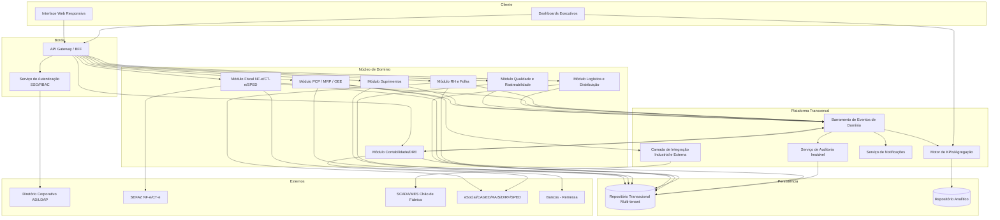
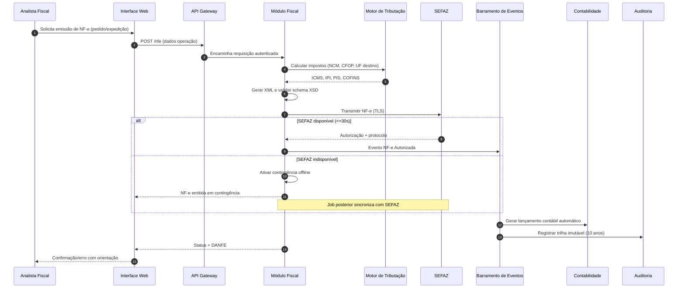
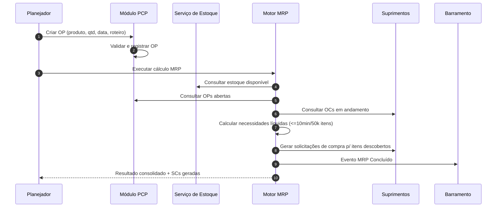
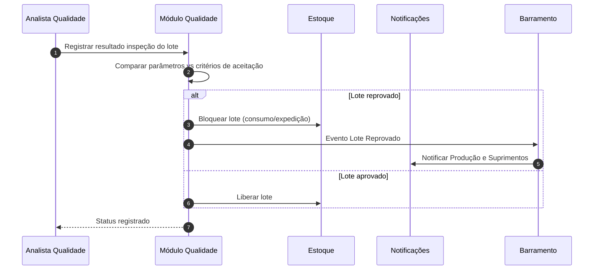

# Relatório Técnico de Arquitetura de Software
## ERP para Indústria Manufatureira (G03) — AI4ES Time 2

---

## 1. Identificação das HUs

| HU | Perfil | Objetivo Central | RFs Relacionados | RNFs Relacionados |
|----|--------|------------------|------------------|-------------------|
| HU01 | Planejador de Produção | Criar OPs e executar MRP automaticamente | RF05, RF06, RF14 | RF13 (fornecedores), RNF13 |
| HU02 | Planejador de Produção | Monitorar OEE e desvios em tempo real | RF08, RF10, RF11, RF12, RF52 | RNF14, RNF18 |
| HU03 | Comprador | Gerenciar cotações multi-fornecedor | RF13, RF15, RF16, RF19 | RNF03 (alçada/SoD) |
| HU04 | Gestor de Suprimentos | Acompanhar desempenho de fornecedores | RF19, RF53 | RNF20 |
| HU05 | Analista de Qualidade | Registrar inspeção e bloquear reprovados | RF20, RF21, RF22 | — |
| HU06 | Analista de Qualidade | Rastrear lote insumo→produto acabado | RF09, RF23, RF17, RF28, RF31 | RNF10 |
| HU07 | Analista Fiscal | Emitir NF-e com impostos automáticos | RF31, RF32, RF33, RF34 | RNF07, RNF15, RNF17 |
| HU08 | Analista Fiscal | Manter SPED Fiscal atualizado | RF36, RF48 | RNF08, RNF10 |
| HU09 | Analista de RH | Processar folha de pagamento | RF37, RF38, RF39, RF40 | RNF02, RNF11 |
| HU10 | Analista de RH | Gerar obrigações acessórias de RH | RF40, RF41 | RNF08, RNF09 |
| HU11 | Controller | DRE e Fluxo de Caixa em tempo real | RF43, RF45, RF46, RF47, RF52 | RNF14 |
| HU12 | Diretor/CEO | Dashboard executivo com KPIs | RF50, RF51, RF52, RF53 | RNF14, RNF16 |

**Cobertura de perfis:** 8 perfis, 12 HUs, todas mapeadas a RFs. Módulos sem HU direta (Logística RF26–RF30 parcial, RH benefícios, Contabilidade CT-e) são cobertos via RFs na Seção 6.

---

## 2. Diagramas de Arquitetura (Mermaid)

### 2.1 Visão de Componentes (Macroarquitetura Modular)

### 2.2 Sequência — HU07: Emissão de NF-e com contingência automática

### 2.3 Sequência — HU01: Criação de OP e execução de MRP

### 2.4 Sequência — HU05: Inspeção de lote e bloqueio automático

---

## 3. Decisões de Arquitetura

| ID | Decisão | Justificativa | Requisitos Direcionadores |
|----|---------|---------------|---------------------------|
| DA01 | **Arquitetura modular orientada a domínios** (PCP, Suprimentos, Qualidade, Logística, Fiscal, RH, Contabilidade) | Isola contextos regulatórios distintos e permite evolução independente | Toda estrutura de RFs |
| DA02 | **Barramento de eventos de domínio** para propagação assíncrona | DRE/contabilização automática e KPIs em tempo real exigem integração desacoplada entre módulos | RF43, RF45, RF50, RF52 |
| DA03 | **Multi-tenancy por unidade fabril com isolamento de dados** | Segregação hierárquica e consolidação centralizada | RF04, RF01, RNF16 |
| DA04 | **Serviço de auditoria imutável append-only** com retenção ≥10 anos | Exigência legal (CTN) e trilha fiscal/financeira/RH | RF03, RNF10 |
| DA05 | **Camada de integração industrial abstrata** com adaptadores por protocolo (OPC-UA/MQTT/REST) | Configurável por unidade fabril; desacopla SCADA/MES do núcleo | RF11, RNF18 |
| DA06 | **Motor de tributação parametrizável** (regras por NCM/CFOP/UF) | Legislação volátil deve ser configurável sem recompilação | RF32, RNF06 |
| DA07 | **Mecanismo de contingência resiliente** para NF-e com sincronização posterior | Continuidade fiscal frente à indisponibilidade da SEFAZ | RF34, RNF17 |
| DA08 | **Repositório analítico separado do transacional** (CQRS de leitura para KPIs/dashboards) | Dashboards ≤5s sem impactar carga transacional | RF50, RF52, RNF14 |
| DA09 | **Autenticação federada SSO + RBAC com SoD** | Integração AD/LDAP e segregação de funções críticas | RF02, RNF03 |
| DA10 | **Criptografia em repouso (AES-256) segmentada** para dados financeiros/fiscais/RH | Proteção de dados sensíveis e LGPD | RNF02, RNF09 |
| DA11 | **Motor de rastreabilidade de lote transversal** consolidando eventos de todos os módulos | Rastreabilidade insumo→acabado e recall | RF23, HU06 |
| DA12 | **Implantação flexível** (on-premises/nuvem privada/híbrida) via empacotamento neutro | Política de TI variável por cliente | RNF22 |

---

## 4. Tabela de Componentes e Rastreabilidade

| Componente | Responsabilidade Principal | Comunica-se com | Origem (HU / Critério de Aceite) |
|-----------|----------------------------|-----------------|----------------------------------|
| Interface Web Responsiva | Apresentação multi-navegador sem plugins | API Gateway | RNF24 / HU geral |
| API Gateway / BFF | Roteamento, autenticação de borda, agregação | Auth, Módulos de domínio | RNF19 |
| Serviço de Autenticação SSO/RBAC | SSO via AD/LDAP, RBAC, SoD, rate limiting | Diretório corporativo, todos os módulos | RF01, RF02, RNF03, RNF04 |
| Módulo PCP/MRP/OEE | OPs, sequenciamento, MRP, apontamento, OEE, alertas | Estoque, Suprimentos, Integração Industrial, Barramento | HU01, HU02 / RF05–RF12 |
| Motor MRP | Cálculo de necessidades líquidas | Estoque, PCP, Suprimentos | HU01 CA2/CA3 / RF06, RNF13 |
| Módulo Suprimentos | Fornecedores, SC, cotação, OC, recebimento, desempenho | PCP, Fiscal, Barramento | HU03, HU04 / RF13–RF19 |
| Módulo Qualidade e Rastreabilidade | Planos de inspeção, resultados, bloqueio, NC, rastreamento | Estoque, Notificações, Barramento | HU05, HU06 / RF20–RF25 |
| Módulo Logística e Distribuição | Estoque acabados, expedição, romaneio, RMA, tracking | Fiscal, Barramento | RF26–RF30 |
| Módulo Fiscal (NF-e/CT-e/SPED) | Emissão, transmissão, contingência, SPED | Motor Tributação, SEFAZ, GOV, Contabilidade | HU07, HU08 / RF31–RF36 |
| Motor de Tributação | Cálculo de impostos por NCM/CFOP/UF | Módulo Fiscal | HU07 CA1 / RF32, RNF06 |
| Módulo RH e Folha | Cadastro, ponto, folha, obrigações, benefícios | Contabilidade, GOV, Bancos, Barramento | HU09, HU10 / RF37–RF42 |
| Módulo Contabilidade/DRE | Lançamentos automáticos, DRE, balanço, fluxo de caixa, SPED contábil | Barramento (todos módulos), Bancos | HU11 / RF43–RF49 |
| Barramento de Eventos de Domínio | Propagação assíncrona de eventos entre módulos | Todos os módulos, KPI, Auditoria, Notificações | DA02 / RF43, RF45 |
| Serviço de Auditoria Imutável | Trilha append-only de operações, retenção 10 anos | Todos os módulos, Persistência | RF03, RNF10 |
| Motor de KPIs/Agregação | Cálculo/consolidação de indicadores, drill-down | Barramento, Repositório Analítico, Dashboards | HU02, HU11, HU12 / RF50–RF52 |
| Dashboards Executivos | Visualização configurável, metas, exportação | Motor de KPIs, API Gateway | HU12 / RF50, RF53, RNF14 |
| Serviço de Notificações | Alertas visuais e e-mail | Barramento | HU02 CA2, HU05 CA3, RF12, RF51 |
| Camada de Integração Industrial/Externa | Adaptadores OPC-UA/MQTT/REST, import/export | PCP, sistemas SCADA/MES, externos | RF11, RNF18, RNF19, RNF20 |
| Repositório Transacional Multi-tenant | Persistência isolada por unidade fabril, backup/WAL | Módulos, Auditoria | RNF16, RNF21, RNF02 |
| Repositório Analítico | Base de leitura para dashboards/KPIs | Motor de KPIs | DA08 / RNF14 |

---

## 5. Bloqueios e Pendências

| ID | Descrição | Tipo | Severidade | Ação Requerida |
|----|-----------|------|------------|----------------|
| BL01 | Requisitos não definem SLA de latência da integração SCADA/MES para cálculo de OEE em tempo real | Ambiguidade | Alta | Definir janela máxima de atualização de dados de chão de fábrica |
| BL02 | Regras de alçada de aprovação (RF16) não especificam número de níveis nem critérios monetários | Lacuna funcional | Média | Obter matriz de alçadas do cliente |
| BL03 | Política de "moeda funcional" e frequência de atualização de câmbio (RF49) não detalhada | Ambiguidade | Média | Definir fonte oficial de taxas e periodicidade |
| BL04 | Critérios de "liberação formal" de lote bloqueado (HU05) sem workflow definido | Lacuna | Média | Especificar fluxo de aprovação/quem libera |
| BL05 | RNF12 (99,5%) conflita parcialmente com operações fabris em turnos 24/7 — janela de manutenção indefinida | Conflito | Média | Confirmar existência de turno não produtivo por unidade |
| BL06 | Não há especificação de estratégia de versionamento de leiautes fiscais/eSocial (volatilidade legal) | Risco arquitetural | Alta | Definir mecanismo de atualização de leiautes sem downtime |
| BL07 | Integração com sistemas de vendas/CRM para origem de pedidos (RF27, RF31) não descrita | Dependência externa | Média | Confirmar origem dos pedidos de venda |

---

## 6. Cobertura de Requisitos

### Requisitos Funcionais

| Módulo | RFs | Componente(s) Responsável(is) | Status |
|--------|-----|-------------------------------|--------|
| Usuários/Acesso | RF01–RF04 | Auth SSO/RBAC | ✅ Coberto |
| PCP | RF05–RF12 | Módulo PCP, Motor MRP, Integração Industrial | ✅ Coberto |
| Suprimentos | RF13–RF19 | Módulo Suprimentos | ✅ Coberto |
| Qualidade | RF20–RF25 | Módulo Qualidade e Rastreabilidade | ✅ Coberto |
| Logística | RF26–RF30 | Módulo Logística | ✅ Coberto (sem HU dedicada) |
| Fiscal | RF31–RF36 | Módulo Fiscal, Motor Tributação | ✅ Coberto |
| RH/Folha | RF37–RF42 | Módulo RH e Folha | ✅ Coberto |
| Contabilidade | RF43–RF49 | Módulo Contabilidade/DRE | ✅ Coberto |
| Dashboards | RF50–RF53 | Motor de KPIs, Dashboards | ✅ Coberto |

**53/53 RFs cobertos.**

### Requisitos Não Funcionais

| Categoria | RNFs | Tratamento Arquitetural |
|-----------|------|-------------------------|
| Segurança | RNF01–RNF05 | TLS no gateway, AES-256 (DA10), RBAC/SoD (DA09), rate limiting, pentest periódico (processo) |
| Conformidade | RNF06–RNF11 | Motor tributação parametrizável, validação XSD, auditoria imutável (DA04), LGPD via criptografia/segmentação |
| Disponib./Desempenho | RNF12–RNF17 | Repositório analítico (DA08), contingência (DA07), multi-tenant (DA03) |
| Interoperabilidade | RNF18–RNF20 | Camada de integração com adaptadores (DA05), APIs REST, import/export multiformato |
| Infra/Dados | RNF21–RNF24 | Backup/WAL, implantação flexível (DA12), painel de métricas, UI responsiva |

**24/24 RNFs endereçados** (RNF05 e RNF23 dependem de processos operacionais além da arquitetura).

---

## 7. Gap Analysis

| # | Lacuna Identificada | Impacto Arquitetural | Ação Recomendada |
|---|---------------------|----------------------|------------------|
| G01 | **Volatilidade da legislação fiscal e leiautes governamentais** não tem estratégia de atualização definida (RNF06, RNF08) | Alto — mudanças frequentes podem exigir redeploy | Externalizar regras tributárias e leiautes como configuração versionada, permitindo hot-update; criar módulo de "engine de regras" testável |
| G02 | **Ausência de especificação de origem de pedidos de venda** (vendas/CRM) | Médio — Logística e Fiscal dependem de pedidos | Definir integração ou módulo comercial mínimo; expor API de ingestão de pedidos |
| G03 | **Consistência transacional distribuída** entre módulos via barramento assíncrono (ex: bloqueio de lote vs expedição) | Alto — risco de expedir lote reprovado por eventual consistência | Adotar padrão de bloqueio síncrono no estoque para operações críticas de qualidade (RF22) e saga para fluxos longos |
| G04 | **Estratégia de recuperação/RPO da contingência NF-e** não detalhada além de "sincronização posterior" | Médio | Definir fila persistente local e job idempotente de reenvio com reconciliação de protocolos |
| G05 | **Governança de dados LGPD** (anonimização, retenção diferenciada, direito de exclusão) não especificada além de criptografia | Médio | Definir política de ciclo de vida de dados pessoais; separar retenção legal (10 anos fiscal) de dados pessoais não obrigatórios |
| G06 | **Escalabilidade do MRP** para bases grandes (RNF13) com múltiplas unidades simultâneas | Médio | Prever execução paralela/particionada do MRP por unidade fabril e processamento em lote assíncrono |
| G07 | **Drill-down até transação de origem em ≤3 cliques** (HU12) exige linhagem de dados entre analítico e transacional | Médio | Manter chaves de rastreamento (correlation IDs) em eventos e no repositório analítico ligando KPI→transação |
| G08 | **Definição de janelas de manutenção vs operação 24/7** (RNF12) | Baixo/Médio | Projetar atualizações rolling/zero-downtime para unidades sem turno ocioso |
| G09 | **Workflow de não conformidade (RF24)** e liberação de lote (BL04) sem detalhamento de estados | Baixo | Modelar máquina de estados configurável para NC e liberação de bloqueios |

---

### Síntese Executiva
A arquitetura proposta é **modular orientada a domínios**, com **barramento de eventos** para integração em tempo real (essencial para DRE, KPIs e contabilização automática), **segregação multi-tenant por unidade fabril**, e **camadas transversais** de auditoria imutável, integração industrial e tributação parametrizável. Todos os 53 RFs e 24 RNFs foram endereçados. Os riscos arquiteturais prioritários são **G01 (volatilidade legal)** e **G03 (consistência transacional em operações de qualidade)**, que devem ser tratados antes do início da implementação.