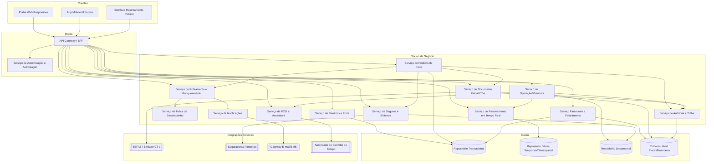
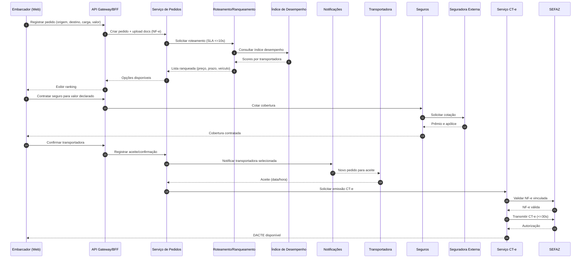
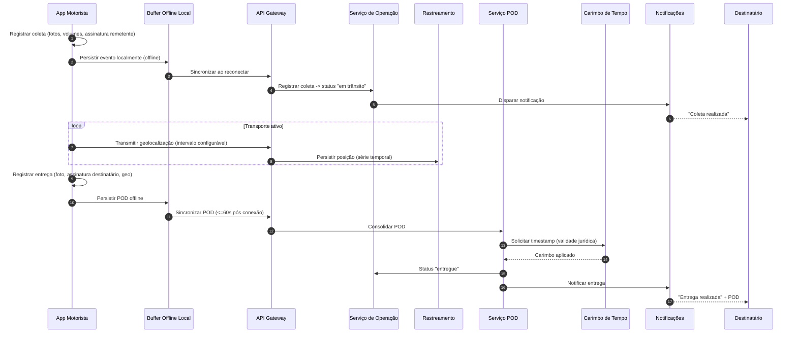

# Relatório Técnico de Arquitetura de Software
## Plataforma de Gestão de Transporte de Cargas (G04)
### AI4ES — Time 2

---

## 1. Identificação das HUs

| HU | Perfil | Título | RFs Relacionados | RNFs Relacionados |
|----|--------|--------|------------------|-------------------|
| HU01 | Embarcador | Registrar pedido de frete | RF05, RF06, RF09, RF10, RF13 | RNF13 |
| HU02 | Embarcador | Selecionar transportadora e contratar seguro | RF11, RF12, RF14, RF17, RF41 | RNF13, RNF24 |
| HU03 | Embarcador | Acompanhar pedidos e receber POD | RF07, RF34, RF37, RF39 | RNF12 |
| HU04 | Embarcador | Abrir sinistro por avaria/extravio | RF42, RF43, RF44 | RNF09, RNF24 |
| HU05 | Transportadora | Aceitar pedidos e gerenciar frota | RF03, RF13, RF14, RF15, RF35 | RNF24 |
| HU06 | Transportadora | Acompanhar motoristas em tempo real | RF25, RF26, RF32, RF35 | RNF06, RNF15, RNF16, RNF23 |
| HU07 | Transportadora | Consultar demonstrativo de repasse | RF46, RF48 | RNF11 |
| HU08 | Motorista | Executar coleta com evidências | RF23, RF24, RF26, RF28 | RNF17, RNF18, RNF21 |
| HU09 | Motorista | Registrar entrega com assinatura | RF27, RF28, RF37, RF38, RF40 | RNF10, RNF17, RNF21 |
| HU10 | Motorista | Registrar ocorrência no transporte | RF26, RF33, RF34, RF35 | RNF17 |
| HU11 | Destinatário | Rastrear carga sem cadastro | RF30, RF31, RF32 | RNF05, RNF06, RNF15 |
| HU12 | Destinatário | Receber notificações por etapa | RF33 | RNF05 |
| HU13 | Administrador | Monitorar SLA e contingência | RF15, RF16, RF36 | RNF12, RNF25 |
| HU14 | Administrador | Painel financeiro da plataforma | RF45, RF46, RF47, RF49 | RNF11 |

---

## 2. Diagramas de Arquitetura (Mermaid)

### 2.1 Diagrama de Componentes (Visão Macro)

### 2.2 Diagrama de Sequência — HU01/HU02: Pedido, Roteamento, Seguro e CT-e

### 2.3 Diagrama de Sequência — HU08/HU09: Coleta e Entrega Offline com POD

---

## 3. Decisões de Arquitetura

| ID | Decisão | Justificativa | Requisitos |
|----|---------|---------------|------------|
| AD01 | Arquitetura orientada a serviços/domínios desacoplados | Domínios heterogêneos (fiscal, financeiro, rastreamento, mobile) com ciclos de mudança distintos | RNF16, RNF24 |
| AD02 | API Gateway/BFF por canal (web, mobile, público) | Necessidade de perfis de acesso, MFA seletivo e link público sem cadastro | RF02, RNF03, RNF05 |
| AD03 | Repositório de séries temporais/geoespacial dedicado à geolocalização | Requisito explícito de otimização para alto volume e consultas geoespaciais | RNF16, RNF23 |
| AD04 | Trilha imutável append-only para movimentações fiscais/financeiras | Retenção mínima 5 anos e imutabilidade | RNF11 |
| AD05 | Sincronização offline-first no app do motorista com buffer local idempotente | Garantia de zero perda de eventos | RF28, RNF17 |
| AD06 | Integrações externas via APIs com contrato versionado (adapters) | Atualização independente de SEFAZ, seguradoras, CT-e | RNF24 |
| AD07 | Barramento de eventos assíncrono para mudanças de status | Desacoplar notificações, rastreamento e desempenho | RF33, RF34, RF35, RF16 |
| AD08 | Modo de contingência CT-e com fila de sincronização | Emissão offline e posterior transmissão | RF19 |
| AD09 | Token único, expirável e escopado por frete para rastreamento público | Não expor dados de outros fretes | RNF05, RNF06 |
| AD10 | Serviço de POD com integração a autoridade de carimbo de tempo | Validade jurídica Lei 14.063/2020 | RF38, RNF10 |
| AD11 | Criptografia em repouso (AES-256) para dados fiscais/financeiros/localização e TLS em trânsito | Segurança | RNF01, RNF02 |
| AD12 | Painéis de monitoramento operacional em tempo real | SLA em risco e métricas de integração | RF36, RNF25 |

---

## 4. Tabela de Componentes e Rastreabilidade

| Componente | Responsabilidade Principal | Comunica-se com | Origem (HU / Critério de Aceite) |
|------------|----------------------------|-----------------|----------------------------------|
| API Gateway/BFF | Roteamento de requisições, agregação por canal, aplicação de tokens | Todos os serviços, AUTH | HU11 (acesso sem cadastro), HU01 |
| Serviço de Autenticação/Autorização | Login, MFA, sessões, RBAC por perfil | Gateway, Usuários | RF02, RNF03, RNF04 / HU05, HU13 |
| Serviço de Usuários e Frota | Cadastro de perfis, motoristas, veículos | AUTH, Auditoria | RF01, RF03 / HU05 |
| Serviço de Pedidos de Frete | CRUD de pedidos, valor declarado, docs, cancelamento | Roteamento, CT-e, Seguros, Auditoria | RF05–RF09 / HU01, HU03 |
| Serviço de Roteamento e Ranqueamento | Roteamento automático, comparação e ranking configurável | Pedidos, Desempenho, Notificações | RF10–RF15 / HU01, HU02, criterio ≤10s |
| Serviço de Índice de Desempenho | Cálculo contínuo do score de transportadoras | Roteamento, Operação | RF16 / HU02 |
| Serviço de CT-e | Emissão, transmissão, contingência, cancelamento, DACTE | SEFAZ, Pedidos, Ledger | RF17–RF22 / HU02 |
| Serviço de Operação/Motorista | Ordens do dia, coleta, entrega, ocorrências, sync offline | Rastreamento, POD, Notificações, Doc | RF23–RF29 / HU08, HU09, HU10 |
| Serviço de Rastreamento em Tempo Real | Ingestão de posição, histórico, ETA, mapa | Repositório geoespacial, Gateway | RF30–RF32 / HU06, HU11 |
| Serviço de POD | Consolidação de assinatura/foto/geo, timestamp jurídico | Autoridade de tempo, Operação, Doc | RF37–RF40 / HU09 |
| Serviço de Seguros e Sinistros | Cotação, contratação, abertura e status de sinistro | Seguradoras, Pedidos, Doc | RF41–RF44 / HU02, HU04 |
| Serviço Financeiro e Faturamento | Cálculo de frete, comissão, faturas, repasses, painel | Ledger, Pedidos | RF45–RF49 / HU07, HU14 |
| Serviço de Notificações | Envio multicanal (e-mail/SMS) por evento e preferência | Barramento de eventos, Gateway E-mail/SMS | RF33–RF36 / HU10, HU12 |
| Serviço de Auditoria e Trilha | Log de operações críticas e trilha imutável | Todos os serviços, Ledger | RF04, RNF11 |
| Repositório Transacional | Persistência de pedidos, usuários, financeiro | Serviços núcleo | RNF02, RNF22 |
| Repositório Séries Temporais/Geoespacial | Armazenar posições e consultas geoespaciais | Rastreamento | RNF23, RNF16 |
| Repositório Documental | NF-e, POD, laudos, evidências de sinistro | Operação, Seguros, POD | RF09, RF44 |
| Trilha Imutável Fiscal/Financeira | Registro append-only com retenção ≥5 anos | Financeiro, CT-e, Auditoria | RNF11 |
| Gateway E-mail/SMS | Entrega efetiva de notificações | Notificações | RF33 / HU12 |
| Autoridade de Carimbo de Tempo | Timestamp com validade jurídica | POD | RF38, RNF10 |

---

## 5. Bloqueios e Pendências

| ID | Descrição | Impacto | Requisito Afetado |
|----|-----------|---------|-------------------|
| BLK01 | Provedor específico de emissão/transmissão de CT-e não definido (próprio vs. terceiro) | Alto — define escopo de conformidade SEFAZ | RF17–RF21, RNF07, RNF08 |
| BLK02 | Autoridade/padrão de carimbo de tempo (ICP-Brasil?) não especificado | Alto — validade jurídica do POD | RF38, RNF10 |
| BLK03 | Regras da "política de cancelamento configurável" não detalhadas (prazos, multas) | Médio | RF08 |
| BLK04 | Critérios de cálculo do índice de desempenho não parametrizados (pesos) | Médio | RF16 |
| BLK05 | Modelo de inadimplência e ciclo de cobrança não especificado | Médio | RF49 |
| BLK06 | Intervalo padrão de transmissão de geolocalização não definido | Baixo — impacta custo/RNF15 | RF25, RNF15 |
| BLK07 | SLA de disponibilidade de integrações externas (SEFAZ/seguradora) fora do controle da plataforma | Médio — afeta RNF12/RNF14 | RNF14, RNF24 |
| BLK08 | Ausência de definição de gestão de pagamentos/liquidação de repasses (meio de pagamento) | Médio | RF48 |

---

## 6. Cobertura de Requisitos

**Requisitos Funcionais:** 49/49 mapeados.

| Grupo | RFs | Componente Responsável |
|-------|-----|------------------------|
| Usuários e Acesso | RF01–RF04 | Usuários/Frota, Auth, Auditoria |
| Pedidos de Frete | RF05–RF09 | Pedidos |
| Roteamento/Seleção | RF10–RF16 | Roteamento, Desempenho, Notificações |
| CT-e | RF17–RF22 | Serviço CT-e |
| Operação Motorista | RF23–RF29 | Operação/Motorista |
| Rastreamento | RF30–RF32 | Rastreamento |
| Notificações | RF33–RF36 | Notificações |
| POD | RF37–RF40 | POD |
| Seguros/Sinistros | RF41–RF44 | Seguros e Sinistros |
| Financeiro | RF45–RF49 | Financeiro |

**Requisitos Não Funcionais:** 25/25 endereçados.

| Categoria | RNFs | Decisão/Mecanismo |
|-----------|------|-------------------|
| Segurança | RNF01–RNF06 | AD02, AD09, AD11 |
| Conformidade | RNF07–RNF11 | AD04, AD08, AD10 |
| Disponibilidade/Desempenho | RNF12–RNF17 | AD03, AD05, AD07 |
| Usabilidade/Compat. | RNF18–RNF21 | App otimizado, portal responsivo |
| Infra/Dados | RNF22–RNF25 | AD03, AD04, AD06, AD12 |

Cobertura total: **RF 100% / RNF 100% / HU 14/14**.

---

## 7. Gap Analysis

| # | Lacuna Identificada | Impacto Arquitetural | Ação Recomendada |
|---|---------------------|----------------------|------------------|
| G01 | Ausência de definição de estratégia de pagamento/liquidação (RF48 gera demonstrativo, mas não há RF de execução de pagamento) | Componente financeiro fica incompleto quanto ao ciclo de caixa | Definir se plataforma efetua repasse ou apenas concilia; especificar integração com meio de pagamento |
| G02 | Conformidade LGPD (RNF09) sem requisitos operacionais de consentimento, retenção e direito ao esquecimento | Risco legal; afeta modelagem de dados pessoais | Especificar políticas de retenção, anonimização e portal de titular de dados |
| G03 | Link público de rastreamento (RF30) versus LGPD e minimização de dados | Exposição indevida de dados do destinatário | Definir quais campos são exibidos; aplicar mascaramento e escopo por token (AD09) |
| G04 | Não há requisito de reconciliação entre eventos offline duplicados na sincronização | Risco de duplicação de status/POD | Adotar chaves de idempotência por evento no buffer local (AD05) |
| G05 | RNF12 (99,5%) depende de disponibilidade da SEFAZ/seguradoras não governáveis | SLA composto pode ser violado por terceiros | Definir SLA interno separado do externo; contingência CT-e já cobre parcialmente (RF19) |
| G06 | Ausência de requisito de versionamento/histórico de tabelas de preço da transportadora | Cálculo de frete (RF45) pode divergir retroativamente | Modelar tabelas de preço com vigência temporal |
| G07 | Regras de SLA de fretes (RF36/HU13) não quantificam o "prazo em risco" | Painel administrativo sem critério objetivo | Parametrizar thresholds de risco por rota/tipo de carga |
| G08 | Não há definição de mecanismo de comunicação direta motorista↔transportadora (HU06 CA) | Falta componente de mensageria/telefonia | Especificar canal de contato (in-app chat ou click-to-call) |
| G09 | Estratégia de escalabilidade de ingestão geoespacial (RNF16) sem métricas de volume esperado | Dimensionamento indefinido | Coletar estimativas de nº de motoristas ativos e frequência de ping |
| G10 | Ausência de requisito de disaster recovery/RTO (só há RPO em RNF22) | Continuidade de negócio parcialmente definida | Definir RTO e estratégia de failover regional |

---

*Fim do Relatório Canônico — AI4ES Time 2.*