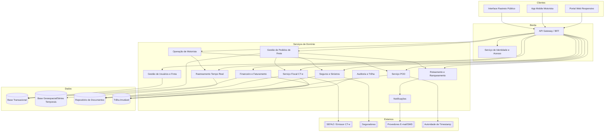
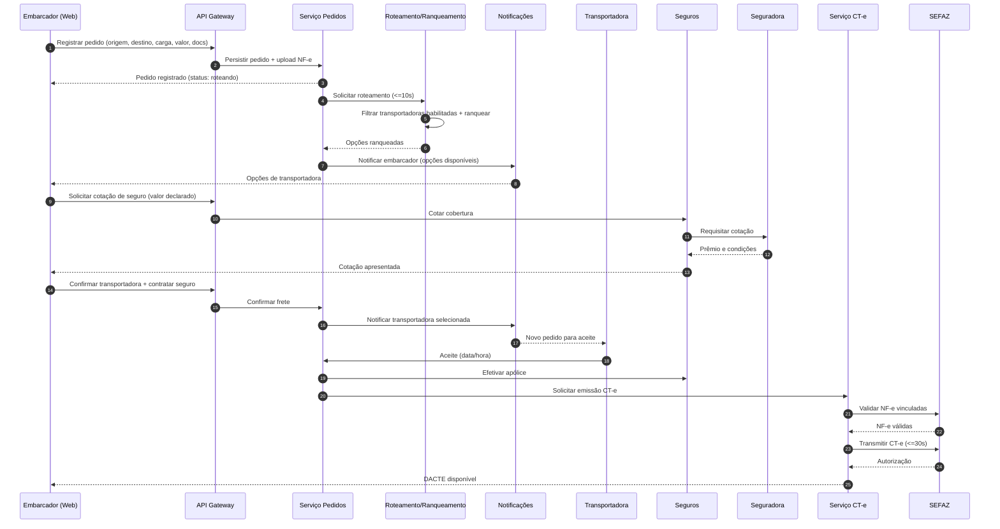
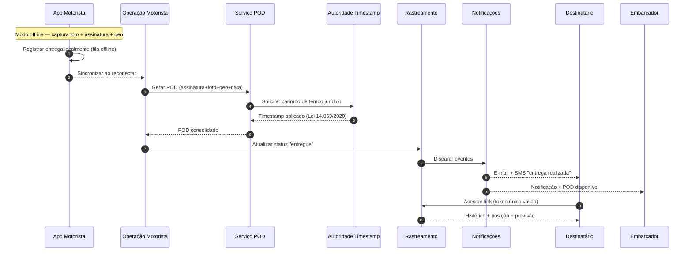

# Relatório Técnico de Arquitetura de Software
## Plataforma de Gestão de Transporte de Cargas (G04) — AI4ES Time 2

---

## 1. Identificação das HUs

| HU | Perfil | Objetivo Central | RFs Relacionados | RNFs Relacionados |
|----|--------|------------------|------------------|-------------------|
| HU01 | Embarcador | Registrar pedido de frete e disparar roteamento automático | RF05, RF06, RF09, RF10 | RNF13 |
| HU02 | Embarcador | Selecionar transportadora ranqueada + contratar seguro em fluxo único | RF11, RF12, RF17, RF41 | RNF13 |
| HU03 | Embarcador | Acompanhar fretes em visão consolidada e receber POD | RF07, RF34, RF37, RF39 | RNF12 |
| HU04 | Embarcador | Abrir sinistro por avaria/extravio | RF42, RF43, RF44 | RNF09 |
| HU05 | Transportadora | Receber, aceitar/recusar pedidos e gerir frota | RF03, RF13, RF14, RF15 | — |
| HU06 | Transportadora | Monitorar posição e status dos motoristas em tempo real | RF25, RF30, RF32 | RNF06, RNF15, RNF16 |
| HU07 | Transportadora | Consultar demonstrativo financeiro de repasse | RF46, RF48 | RNF11 |
| HU08 | Motorista | Executar coleta com evidências | RF23, RF24, RF26 | RNF17, RNF18, RNF21 |
| HU09 | Motorista | Registrar entrega com assinatura e POD | RF27, RF28, RF37, RF38, RF40 | RNF10, RNF17, RNF21 |
| HU10 | Motorista | Registrar ocorrências durante o transporte | RF26, RF34, RF35 | RNF17 |
| HU11 | Destinatário | Rastrear carga sem cadastro via link/token | RF30, RF31, RF32 | RNF05, RNF15 |
| HU12 | Destinatário | Receber notificações de cada etapa | RF33 | RNF05 |
| HU13 | Administrador | Monitorar SLA e acionar contingência | RF15, RF36, RF16 | RNF12, RNF25 |
| HU14 | Administrador | Acompanhar painel financeiro | RF45, RF47, RF49 | RNF11 |

---

## 2. Diagramas de Arquitetura (Mermaid)

### 2.1 Visão de Componentes (Alto Nível)

### 2.2 Sequência — HU01/HU02: Registro de Pedido, Roteamento, Seguro e CT-e

### 2.3 Sequência — HU09/HU11/HU12: Entrega Offline, POD, Rastreio e Notificação

---

## 3. Decisões de Arquitetura

| ID | Decisão | Justificativa | Requisitos |
|----|---------|---------------|------------|
| AD01 | Arquitetura orientada a serviços de domínio segregados | Domínios com ciclos de vida e escalas distintas (rastreio vs. fiscal vs. financeiro) exigem evolução independente | RNF16, RNF24 |
| AD02 | BFF/API Gateway com autorização por perfil na borda | Centraliza RBAC e reduz exposição de funcionalidades | RF02, RNF03, RNF04 |
| AD03 | Base geoespacial/séries temporais dedicada para geolocalização | Requisito explícito de otimização para posição e alto volume | RNF23, RNF16 |
| AD04 | Fila de eventos offline no app + sincronização idempotente | Garantia de não perda de eventos de coleta/entrega/ocorrência | RF28, RNF17 |
| AD05 | Trilha imutável (append-only) segregada para dados fiscais/financeiros | Retenção legal de 5 anos e imutabilidade | RNF11, RF04 |
| AD06 | Integrações externas via adaptadores com contrato versionado | Atualização independente de SEFAZ/seguradoras/CT-e | RNF24, RNF07 |
| AD07 | Emissão de CT-e desacoplada com suporte a contingência offline | Resiliência frente à indisponibilidade da SEFAZ | RF19, RNF14 |
| AD08 | Serviço de notificações assíncrono multicanal (e-mail/SMS) | Desacopla eventos de domínio da entrega de mensagens | RF33-RF36 |
| AD09 | Token efêmero para link público de rastreio | Acesso sem cadastro isolando dados por frete | RNF05, RF30 |
| AD10 | Serviço POD integrado à autoridade de timestamp externa | Validade jurídica exigida | RF38, RNF10 |
| AD11 | Criptografia em repouso AES-256 para dados sensíveis + TLS em trânsito | Segurança de dados fiscais/financeiros/localização | RNF01, RNF02 |
| AD12 | Motor de regras configurável para roteamento, cancelamento e comissão | Critérios e políticas configuráveis exigidos | RF08, RF11, RF12, RF46 |

---

## 4. Tabela de Componentes e Rastreabilidade

| Componente | Responsabilidade Principal | Comunica-se com | Origem (HU / Critério de Aceite) |
|------------|---------------------------|-----------------|----------------------------------|
| API Gateway / BFF | Roteamento de requisições, agregação e aplicação de RBAC na borda | Todos os serviços, Auth | HU (todas) / RF02 |
| Serviço de Identidade e Acesso | Autenticação, MFA, tokens de sessão, perfis | Gateway, Usuários | RF01, RF02 / RNF03, RNF04 |
| Gestão de Usuários e Frota | Cadastro de perfis, motoristas e veículos vinculados | Auth, Pedidos | HU05 / RF01, RF03 |
| Gestão de Pedidos de Frete | Ciclo de vida do pedido, upload de docs, status consolidado, cancelamento | Roteamento, CT-e, Seguros, Financeiro, Docs | HU01, HU03 / RF05-RF09 |
| Roteamento e Ranqueamento | Filtrar transportadoras habilitadas, ranquear por critérios, contingência de recusa | Pedidos, Notificações, Desempenho | HU02, HU05, HU13 / RF10-RF16 |
| Serviço Fiscal CT-e | Emissão/transmissão/cancelamento CT-e, contingência, DACTE | SEFAZ, Pedidos, Docs, Trilha | HU02 / RF17-RF22 |
| Operação de Motorista | Ordens do dia, coleta/entrega, ocorrências, sincronização offline | Rastreamento, POD, Notificações | HU08, HU09, HU10 / RF23-RF29 |
| Rastreamento Tempo Real | Ingestão de geolocalização, histórico de eventos, previsão de entrega | Base Geo, Notificações, Gateway | HU06, HU11 / RF30-RF32 |
| Serviço POD | Consolidar assinatura/foto/geo, timestamp jurídico, recusa | Autoridade Timestamp, Docs, Operação | HU03, HU09 / RF37-RF40 |
| Seguros e Sinistros | Cotação/contratação, abertura e acompanhamento de sinistro, documentação | Seguradoras, Pedidos, Docs | HU02, HU04 / RF41-RF44 |
| Financeiro e Faturamento | Cálculo de frete, comissão, faturas, repasses, painel | Pedidos, Trilha, Base Transacional | HU07, HU14 / RF45-RF49 |
| Notificações | Envio multicanal e-mail/SMS por eventos, preferências | Provedores MSG, serviços de domínio | HU10, HU12 / RF33-RF36 |
| Auditoria e Trilha | Log de operações críticas e trilha imutável fiscal/financeira | Todos os serviços, Ledger | RF04 / RNF11 |
| App Mobile Motorista | UI otimizada, captura offline, sincronização | Gateway, Operação | HU08, HU09 / RNF17-RNF19, RNF21 |
| Interface Rastreio Público | Exibição por token sem cadastro | Gateway, Rastreamento | HU11 / RNF05 |
| Repositório de Documentos | Armazenamento estruturado de NF-e, POD, laudos, CT-e | Pedidos, POD, Seguros, CT-e | RF09, RF44 / RNF02 |

---

## 5. Bloqueios e Pendências

| ID | Descrição | Impacto | Necessita definição de |
|----|-----------|---------|------------------------|
| BL01 | Provedor de emissão/transmissão de CT-e não especificado (interno vs. terceiro) | Alto | Negócio / Fiscal |
| BL02 | Seguradoras parceiras e formato de API de cotação/sinistro indefinidos | Alto | Parcerias |
| BL03 | Autoridade de carimbo de tempo com validade jurídica (ICP-Brasil?) não definida | Alto | Jurídico |
| BL04 | Regras de conciliação/cobrança e gateway de pagamento de faturas/repasses ausentes | Médio | Financeiro |
| BL05 | Política de cancelamento configurável (RF08) sem regras detalhadas | Médio | Produto |
| BL06 | Critério de "SLA em risco" (RF36/HU13) não parametrizado | Médio | Produto |
| BL07 | Algoritmo de rota otimizada com múltiplas paradas (RF29) — provedor de mapas indefinido | Médio | Produto |
| BL08 | Fórmula de índice de desempenho da transportadora (RF16) não especificada | Médio | Produto |

---

## 6. Cobertura de Requisitos

**Requisitos Funcionais:** 49/49 mapeados.

| Faixa | Componente Responsável |
|-------|------------------------|
| RF01-RF04 | Identidade / Usuários e Frota / Auditoria |
| RF05-RF09 | Gestão de Pedidos |
| RF10-RF16 | Roteamento e Ranqueamento |
| RF17-RF22 | Serviço Fiscal CT-e |
| RF23-RF29 | Operação de Motorista / App Mobile |
| RF30-RF32 | Rastreamento Tempo Real |
| RF33-RF36 | Notificações |
| RF37-RF40 | Serviço POD |
| RF41-RF44 | Seguros e Sinistros |
| RF45-RF49 | Financeiro e Faturamento |

**Requisitos Não Funcionais:** 25/25 endereçados.

| RNF | Tratamento Arquitetural |
|-----|-------------------------|
| RNF01-RNF06 | TLS na borda, AES-256 em repouso, MFA, tokens, isolamento de geo por permissão |
| RNF07-RNF11 | Adaptador CT-e conforme XSD, modalidades, LGPD, POD jurídico, trilha imutável 5 anos |
| RNF12-RNF17 | Serviços segregados, base geo dedicada, contingência CT-e, fila offline |
| RNF18-RNF21 | App otimizado (luvas/baixa luz), Android/iOS, portal responsivo, fluxo ≤4 interações |
| RNF22-RNF25 | Backup diário/RPO 1h, base séries temporais, APIs versionadas, painel de métricas |

---

## 7. Gap Analysis

| # | Lacuna | Impacto Arquitetural | Ação Recomendada |
|---|--------|----------------------|------------------|
| G01 | **Consistência offline vs. tempo real:** RF25/RF28/RNF17 exigem sincronização sem perda, mas não há definição de resolução de conflitos e ordenação de eventos atrasados | Risco de status inconsistente e previsões erradas de entrega | Definir estratégia de idempotência, versionamento de eventos e reconciliação temporal na ingestão |
| G02 | **Validade jurídica do POD (RNF10):** Lei 14.063/2020 admite níveis de assinatura distintos; não há definição do nível exigido | Pode invalidar juridicamente comprovantes | Especificar nível de assinatura (simples/avançada/qualificada) com jurídico |
| G03 | **Escalabilidade de geolocalização (RNF16):** volume alvo e cadência real não quantificados | Dimensionamento incorreto da base geo/ingestão | Definir SLAs numéricos (nº de motoristas, frequência mínima de ping) |
| G04 | **Regra de aceitação automática (RF12):** convive com confirmação manual sem critério de decisão claro | Ambiguidade no fluxo de contratação | Detalhar condições de auto-aceite vs. confirmação do embarcador |
| G05 | **Cálculo de comissão e impostos (RF46/RF47):** regras tributárias sobre frete não detalhadas | Erros fiscais no faturamento | Definir modelo tributário e retenções com contabilidade |
| G06 | **Gestão de inadimplência (RF49):** painel exibe inadimplência mas não há fluxo de cobrança/bloqueio | Funcionalidade incompleta | Especificar ciclo de cobrança e ações automáticas |
| G07 | **Reassignação manual (HU13):** interação humana em contingência sem definição de estados intermediários | Complexidade no ciclo de vida do pedido | Modelar máquina de estados incluindo reassignação e override administrativo |
| G08 | **Preferências de notificação sem cadastro (HU12):** gestão via link efêmero conflita com persistência de preferência do destinatário | Risco de segurança/privacidade | Definir escopo e persistência das preferências vinculadas ao frete |
| G09 | **Retenção LGPD vs. fiscal (RNF09 x RNF11):** dados pessoais de motoristas em documentos com retenção de 5 anos | Conflito entre minimização e retenção legal | Definir política de anonimização e base legal de retenção |
| G10 | **Rota otimizada (RF29):** dependência de serviço de mapas/roteirização não modelada como integração | Dependência externa não versionada | Incluir adaptador de mapas com contrato versionado (AD06) |

---

> **Observação de neutralidade:** Este relatório descreve responsabilidades e interfaces conceituais. Escolhas concretas de tecnologia (banco geoespacial, broker de mensagens, provedor de assinatura, gateway de pagamento) devem ser definidas na fase de detalhamento, respeitando os contratos versionados (AD06) e os RNFs de segurança e conformidade.