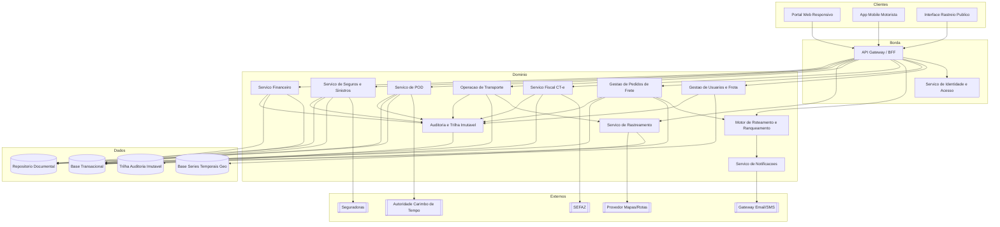
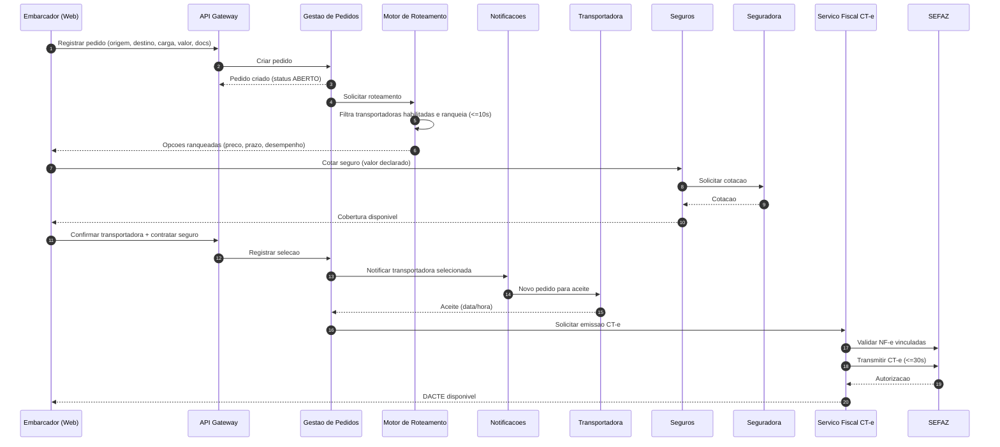
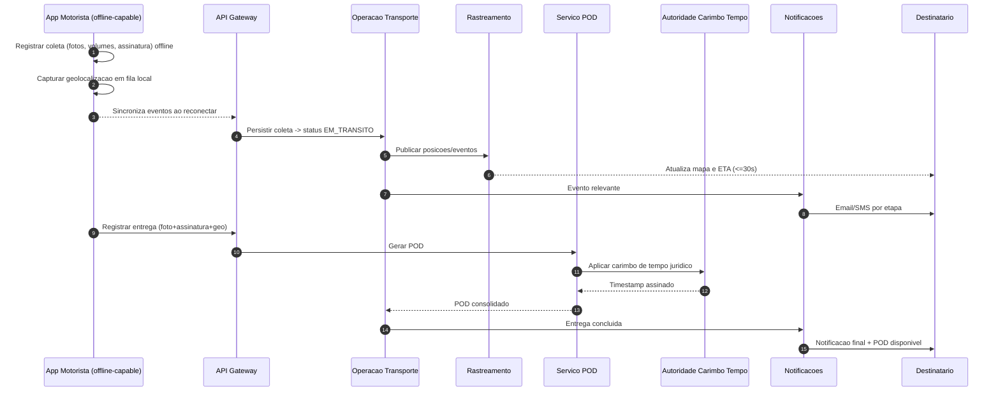

# Relatório Técnico de Arquitetura de Software
## Plataforma de Logística e Rastreamento de Cargas (G04) — AI4ES Time 2

---

## 1. Identificação das HUs

| HU | Título | Perfil | RFs Relacionados | RNFs Relacionados |
|----|--------|--------|------------------|-------------------|
| HU01 | Registrar pedido de frete | Embarcador | RF05, RF06, RF09, RF10 | RNF13 |
| HU02 | Selecionar transportadora e contratar seguro | Embarcador | RF11, RF12, RF17, RF41 | RNF13, RNF24 |
| HU03 | Acompanhar pedidos e receber POD | Embarcador | RF07, RF34, RF37, RF39 | RNF12 |
| HU04 | Abrir sinistro por avaria/extravio | Embarcador | RF42, RF43, RF44 | RNF09, RNF24 |
| HU05 | Aceitar pedidos e gerenciar frota | Transportadora | RF03, RF13, RF14, RF15 | RNF25 |
| HU06 | Acompanhar operação de motoristas em tempo real | Transportadora | RF25, RF26, RF32, RF35 | RNF06, RNF15, RNF16 |
| HU07 | Consultar demonstrativo de repasse | Transportadora | RF45, RF46, RF48 | RNF11 |
| HU08 | Executar coleta com evidências | Motorista | RF23, RF24, RF26 | RNF17, RNF18, RNF21 |
| HU09 | Registrar entrega com assinatura digital | Motorista | RF27, RF37, RF38, RF40 | RNF10, RNF17, RNF21 |
| HU10 | Registrar ocorrência no transporte | Motorista | RF26, RF33, RF34, RF35 | RNF17 |
| HU11 | Rastrear carga sem cadastro | Destinatário | RF30, RF31, RF32 | RNF05, RNF12, RNF15 |
| HU12 | Receber notificações de cada etapa | Destinatário | RF33 | RNF09 |
| HU13 | Monitorar SLA e acionar contingência | Administrador | RF15, RF16, RF36 | RNF25 |
| HU14 | Painel financeiro da plataforma | Administrador | RF47, RF49 | RNF11 |

---

## 2. Diagramas de Arquitetura (Mermaid)

### 2.1 Visão de Componentes (Alto Nível)

### 2.2 Sequência — Registro de Pedido, Roteamento, Seguro e CT-e (HU01, HU02)

### 2.3 Sequência — Operação Offline do Motorista e Rastreamento (HU08, HU09, HU11)

---

## 3. Decisões de Arquitetura

| ID | Decisão | Justificativa | Requisitos |
|----|---------|---------------|------------|
| AD01 | Arquitetura orientada a serviços de domínio segregados | Domínios com ciclos de vida distintos (fiscal, rastreamento, financeiro) exigem evolução e escala independentes | RNF12, RNF16, RNF24 |
| AD02 | Persistência poliglota: base transacional + base de séries temporais/geoespacial + repositório documental | Rastreamento demanda armazenamento otimizado para séries temporais e geo, distinto de dados transacionais | RNF23, RNF16 |
| AD03 | Trilha de auditoria imutável segregada com retenção ≥5 anos | Exigência legal (CTN) e auditoria de operações críticas e financeiras | RF04, RNF11 |
| AD04 | App mobile com arquitetura *offline-first* e fila de sincronização local | Garante zero perda de eventos de coleta/entrega/ocorrência sem conectividade | RF28, RNF17 |
| AD05 | BFF/API Gateway centralizando autenticação, MFA e autorização por perfil | Controle de acesso baseado em perfil e proteção uniforme das APIs | RF02, RNF01, RNF03 |
| AD06 | Integrações externas via APIs com contrato versionado e camada anticorrupção | Permite atualização independente de SEFAZ, seguradoras, mapas e mensageria | RNF24 |
| AD07 | Comunicação assíncrona por eventos para roteamento, notificações e rastreamento | Desacopla emissão de eventos de alta frequência do consumo, sustentando escala | RNF15, RNF16 |
| AD08 | Token único com expiração para acesso público de rastreamento | Acesso sem cadastro, sem expor dados de terceiros | RF30, RNF05 |
| AD09 | Serviço de POD com carimbo de tempo por autoridade externa | Validade jurídica conforme Lei 14.063/2020 | RF38, RNF10 |
| AD10 | Motor de roteamento como serviço dedicado com SLA de resposta | Ranqueamento em ≤10s com critérios configuráveis | RF10-RF12, RNF13 |
| AD11 | Criptografia em repouso (AES-256) para dados fiscais, financeiros e de localização | Requisito de segurança e LGPD | RNF02, RNF09 |

---

## 4. Tabela de Componentes e Rastreabilidade

| Componente | Responsabilidade Principal | Comunica-se com | Origem (HU / Critério de Aceite) |
|------------|---------------------------|-----------------|----------------------------------|
| Portal Web Responsivo | UI para embarcador, transportadora e admin | API Gateway | HU02, HU03, HU07, HU13, HU14 / RNF20 |
| App Mobile Motorista | Coleta, entrega, ocorrência, rota e modo offline | API Gateway | HU08, HU09, HU10 / RNF17-19, RNF21 |
| Interface Rastreio Público | Rastreio via link com token, sem cadastro | API Gateway | HU11 / RF30, RNF05 |
| API Gateway / BFF | Roteamento de requisições, autenticação, autorização | Todos os serviços de domínio, Identidade | HU-todas / RF02, RNF01, RNF03 |
| Serviço de Identidade e Acesso | Autenticação, MFA, perfis, tokens, sessão | API Gateway, Auditoria | RF01, RF02 / RNF03, RNF04 |
| Gestão de Usuários e Frota | Cadastro de perfis, motoristas e veículos | Base Transacional, Auditoria | HU05 / RF01, RF03 |
| Gestão de Pedidos de Frete | Ciclo de vida do pedido, docs, cancelamento | Roteamento, Fiscal, Base, Documental | HU01, HU03 / RF05-RF09 |
| Motor de Roteamento e Ranqueamento | Roteamento automático e ranqueamento configurável | Pedidos, Notificações, Gestão Frota | HU01, HU02, HU13 / RF10-RF16, RNF13 |
| Serviço Fiscal CT-e | Emissão, transmissão, contingência, cancelamento | SEFAZ, Pedidos, Auditoria, Documental | HU02 / RF17-RF22, RNF07-08, RNF14 |
| Operação de Transporte | Ordens, eventos de coleta/entrega/ocorrência | App Mobile, Rastreamento, POD, Notificações | HU08-HU10 / RF23-RF29 |
| Serviço de Rastreamento | Ingestão de geolocalização, mapa, ETA | Base Séries Temporais, Mapas, Operação | HU06, HU11 / RF30-RF32, RNF15-16, RNF23 |
| Serviço de Notificações | E-mail/SMS por evento e preferências | Gateway Email/SMS, demais serviços | HU10, HU12 / RF33-RF36 |
| Serviço de POD | Consolidação de comprovante e carimbo de tempo | Autoridade Carimbo, Documental, Operação | HU09 / RF37-RF40, RNF10 |
| Serviço de Seguros e Sinistros | Cotação, contratação, abertura e acompanhamento | Seguradoras, Pedidos, Documental | HU02, HU04 / RF41-RF44 |
| Serviço Financeiro | Cálculo de frete, comissão, faturas, repasses, painel | Base Transacional, Auditoria | HU07, HU14 / RF45-RF49 |
| Auditoria e Trilha Imutável | Registro imutável de operações críticas e fiscais | Todos os serviços de domínio | RF04 / RNF11 |
| Repositório Documental | Armazenamento de NF-e, POD, laudos, DACTE | Pedidos, POD, Seguros, Fiscal | RF09, RF44 / RNF02 |
| Base Séries Temporais/Geo | Persistência de posições e consultas geoespaciais | Rastreamento | RF25, RF32 / RNF23 |

---

## 5. Bloqueios e Pendências

| ID | Descrição | Impacto | Responsável Sugerido |
|----|-----------|---------|----------------------|
| BL01 | Não há definição do provedor/autoridade de carimbo de tempo com validade jurídica | Bloqueia certificação do POD (RF38, RNF10) | Jurídico + Arquitetura |
| BL02 | Política de cancelamento configurável (RF08) sem regras concretas | Impede implementação determinística | Product Owner |
| BL03 | Critérios e pesos de ranqueamento (RF11) não parametrizados | Ambiguidade no motor de roteamento | Negócio |
| BL04 | SLA de disponibilidade das integrações SEFAZ/seguradoras não acordado | Risco em RNF12/RNF14 | Fornecedores externos |
| BL05 | Regras fiscais de comissão/impostos na fatura (RF47) não detalhadas | Risco de conformidade tributária | Fiscal/Contábil |
| BL06 | Formato e provedor do gateway SMS internacional não definido | Afeta RF33, RNF entrega | Infraestrutura |

---

## 6. Cobertura de Requisitos

**Requisitos Funcionais:** 49/49 mapeados.

| Grupo | RFs | Componente(s) Responsável(is) |
|-------|-----|-------------------------------|
| Usuários/Acesso | RF01-RF04 | Identidade, Gestão Usuários/Frota, Auditoria |
| Pedidos de Frete | RF05-RF09 | Gestão de Pedidos, Repositório Documental |
| Roteamento | RF10-RF16 | Motor de Roteamento, Notificações |
| CT-e | RF17-RF22 | Serviço Fiscal CT-e |
| Operação Motorista | RF23-RF29 | Operação de Transporte, App Mobile |
| Rastreamento | RF30-RF32 | Serviço de Rastreamento |
| Notificações | RF33-RF36 | Serviço de Notificações |
| POD | RF37-RF40 | Serviço de POD |
| Seguros/Sinistros | RF41-RF44 | Serviço de Seguros e Sinistros |
| Financeiro | RF45-RF49 | Serviço Financeiro |

**Requisitos Não Funcionais:** 25/25 endereçados via decisões AD01-AD11 e atributos de componentes. RNF18/RNF19/RNF21 endereçados no App Mobile; RNF22 (backup) e RNF25 (métricas/observabilidade) tratados como capacidades transversais de plataforma.

**Cobertura total: RF 100% · RNF 100%.**

---

## 7. Gap Analysis

| Gap | Descrição | Impacto Arquitetural | Ação Recomendada |
|-----|-----------|----------------------|------------------|
| G01 — Observabilidade | RNF25 exige métricas em tempo real, mas nenhum componente de monitoramento foi requisitado explicitamente | Sem camada de telemetria, SLA (RNF12) e painel admin (HU13) ficam sem base de dados operacionais | Definir plano de instrumentação e coleta de métricas transversal |
| G02 — Backup/DR | RNF22 define RPO 1h, mas não há RTO nem estratégia de disaster recovery | Risco de continuidade de negócio não dimensionado | Especificar RTO, topologia de redundância e testes de restauração |
| G03 — Gestão de consentimento LGPD | RNF09 citado, mas não há requisito de consentimento, portabilidade ou expurgo de dados | Falta de mecanismo de direitos do titular | Adicionar módulo de gestão de consentimento e retenção |
| G04 — Idempotência offline | RF28/RNF17 exigem sincronização, sem regra de deduplicação de eventos | Risco de eventos duplicados na reconexão | Definir chaves de idempotência e estratégia de conflito |
| G05 — Comunicação in-app | HU06 exige "contatar motorista pela plataforma", sem requisito funcional de canal | Componente de comunicação não previsto | Criar requisito de canal de mensageria interna |
| G06 — Reassignação manual | HU13 exige reassignação manual, mas RF15 cobre apenas automação | Fluxo administrativo de contingência ausente | Especificar caso de uso de intervenção manual do admin |
| G07 — Escala de geolocalização | RNF16 exige alto volume sem métrica alvo (msgs/s, nº motoristas) | Dimensionamento do serviço de rastreamento indefinido | Levantar volumetria esperada e definir metas de capacidade |
| G08 — Versionamento de leiaute CT-e | RNF07/RNF08 exigem múltiplas modalidades e versão vigente | Necessidade de estratégia de atualização de schemas sem downtime | Definir mecanismo de gestão de versões de schema fiscal |

---

*Relatório gerado pelo Sistema Multi-Agente AI4ES — Time 2. Design tecnologicamente neutro; produtos específicos citados apenas quando literais nos requisitos.*