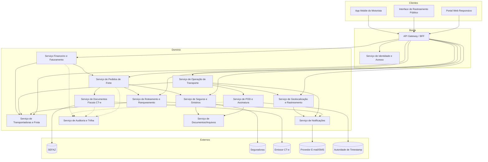
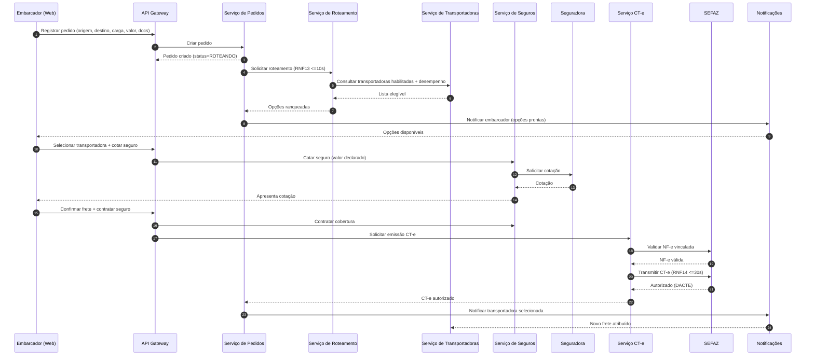
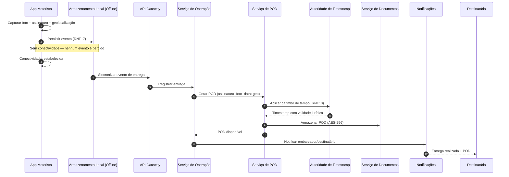
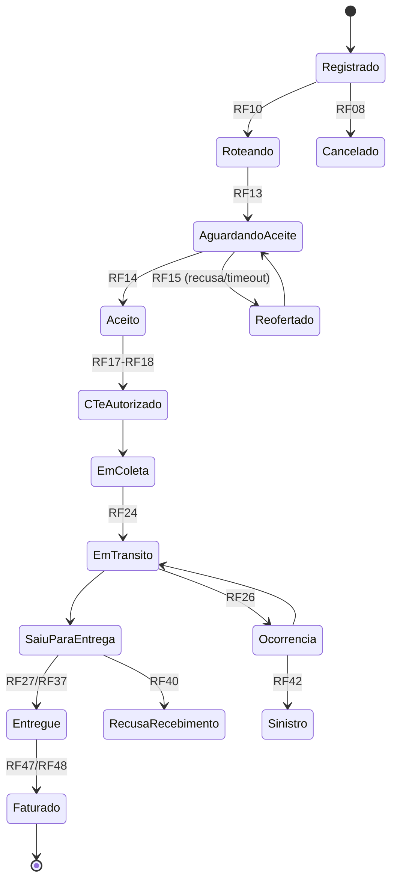

# Relatório Técnico de Arquitetura de Software
## Plataforma de Logística e Rastreamento de Cargas (G04)

---

## 1. Identificação das HUs

| HU | Título | Perfil | RFs Relacionados | RNFs Relacionados |
|----|--------|--------|------------------|-------------------|
| HU01 | Registrar pedido de frete | Embarcador | RF05, RF06, RF09, RF10 | RNF13 |
| HU02 | Selecionar transportadora e contratar seguro | Embarcador | RF11, RF12, RF13, RF17, RF41 | RNF13, RNF24 |
| HU03 | Acompanhar pedidos e receber POD | Embarcador | RF07, RF34, RF37, RF39 | RNF12 |
| HU04 | Abrir sinistro por avaria/extravio | Embarcador | RF42, RF43, RF44 | RNF24 |
| HU05 | Aceitar pedidos e gerenciar frota | Transportadora | RF03, RF13, RF14, RF15, RF35 | — |
| HU06 | Acompanhar motoristas em tempo real | Transportadora | RF25, RF26, RF32 | RNF06, RNF16, RNF23 |
| HU07 | Consultar demonstrativo de repasse | Transportadora | RF46, RF48 | RNF11 |
| HU08 | Executar coleta com evidências | Motorista | RF24, RF26 | RNF17, RNF18, RNF21 |
| HU09 | Registrar entrega com assinatura | Motorista | RF27, RF37, RF38, RF40 | RNF10, RNF17, RNF21 |
| HU10 | Registrar ocorrência em transporte | Motorista | RF26, RF33, RF34, RF35 | RNF17 |
| HU11 | Rastrear carga sem cadastro | Destinatário | RF30, RF31, RF32 | RNF05, RNF15 |
| HU12 | Receber notificações de etapas | Destinatário | RF33 | — |
| HU13 | Monitorar SLA e contingência | Administrador | RF15, RF36, RF16 | RNF25 |
| HU14 | Painel financeiro da plataforma | Administrador | RF45, RF46, RF47, RF49 | RNF11 |

---

## 2. Diagramas de Arquitetura (Mermaid)

### 2.1 Diagrama de Componentes (Visão de Contêineres Lógicos)

### 2.2 Diagrama de Sequência — Registro de Pedido, Roteamento e Contratação (HU01/HU02)

### 2.3 Diagrama de Sequência — Entrega Offline com POD (HU09)

### 2.4 Diagrama de Estados — Ciclo de Vida do Frete

---

## 3. Decisões de Arquitetura

| ID | Decisão | Justificativa | Requisitos-âncora |
|----|---------|---------------|-------------------|
| DA01 | **Arquitetura orientada a serviços de domínio** (Pedidos, Roteamento, CT-e, Operação, Geolocalização, Financeiro, Seguros) | Domínios com ciclos de vida, cadências e requisitos de escala distintos (ex: geolocalização de alto volume vs. faturamento periódico) | RNF16, RNF24 |
| DA02 | **BFF/API Gateway com camada de autorização por perfil** | Centraliza controle de acesso baseado em perfil e roteamento a clientes heterogêneos (web, mobile, público) | RF02, RNF03, RNF04 |
| DA03 | **Armazenamento especializado para séries temporais e geoespaciais** para dados de posição | Requisito explícito de banco otimizado; separa carga de escrita massiva do transacional | RNF23, RNF16 |
| DA04 | **Arquitetura orientada a eventos para mudanças de status** | Notificações, atualização de rastreamento, faturamento e auditoria reagem a eventos de domínio de forma desacoplada | RF33-RF36, RF31 |
| DA05 | **Camada de sincronização offline-first no app do motorista** com fila local durável | Garantia de não-perda de eventos de coleta/entrega/ocorrência mesmo sem rede | RF28, RNF17 |
| DA06 | **Integrações externas via adaptadores com contrato versionado** (SEFAZ, seguradoras, emissor CT-e, timestamp, e-mail/SMS) | Permite evolução independente e isolamento de falhas de terceiros | RNF24 |
| DA07 | **Serviço de POD com assinatura eletrônica e carimbo de tempo** desacoplado | Necessidade de validade jurídica (Lei 14.063/2020) e conformidade probatória | RF37, RF38, RNF10 |
| DA08 | **Trilha de auditoria imutável e append-only** com retenção ≥5 anos | Exigência legal (CTN) para movimentações fiscais/financeiras | RF04, RNF11 |
| DA09 | **Token de acesso público efêmero para rastreamento** sem cadastro | Rastreamento sem autenticação exigindo isolamento de dados de outros fretes | RF30, RNF05, RNF06 |
| DA10 | **Emissão de CT-e com fluxo de contingência offline** e reconciliação posterior | Requisito legal de contingência SEFAZ | RF19, RNF07, RNF08 |
| DA11 | **Criptografia em repouso (AES-256) para dados fiscais/financeiros/localização e TLS em trânsito** | Requisitos de segurança e LGPD | RNF01, RNF02, RNF09 |
| DA12 | **Painéis de observabilidade operacional** expondo métricas de latência e integrações | Monitoramento de SLA e saúde das integrações | RNF25, RNF12 |

---

## 4. Tabela de Componentes e Rastreabilidade

| Componente | Responsabilidade Principal | Comunica-se com | Origem (HU / Critério de Aceite) |
|------------|----------------------------|-----------------|----------------------------------|
| Serviço de Identidade e Acesso | Cadastro de perfis, autenticação, MFA, tokens de sessão e autorização por perfil | API Gateway, todos os serviços | HU (transversal) / RF01, RF02, RNF03, RNF04 |
| Portal Web Responsivo | Interface para embarcador, transportadora e administrador | API Gateway | HU01-07, HU13-14 / RNF20 |
| App Mobile do Motorista | Ordens do dia, coleta/entrega/ocorrência, offline, rotas | API Gateway, Armazenamento Local | HU08-10 / RF23-29, RNF17-19, RNF21 |
| Interface de Rastreamento Público | Rastreamento por link sem cadastro | API Gateway | HU11 / RF30-32, RNF05 |
| API Gateway / BFF | Roteamento de requisições, agregação, aplicação de políticas de acesso | Clientes, serviços de domínio | HU (transversal) / RF02, RNF01 |
| Serviço de Pedidos de Frete | Ciclo de vida do pedido, validação, upload de docs, cancelamento | Roteamento, CT-e, Seguros, Financeiro, Auditoria | HU01, HU03 / RF05-09 |
| Serviço de Roteamento e Ranqueamento | Roteamento automático, cálculo/comparação/ranqueamento, reoferta | Pedidos, Transportadoras, Notificações | HU01, HU02, HU05 / RF10-15, RNF13 |
| Serviço de Transportadoras e Frota | Cadastro de motoristas/veículos, índice de desempenho | Roteamento, Operação, Financeiro | HU05, HU06 / RF03, RF16 |
| Serviço de Documentos Fiscais CT-e | Emissão, transmissão SEFAZ, contingência, cancelamento/inutilização, DACTE | Pedidos, SEFAZ, Emissor CT-e, Auditoria | HU02 / RF17-22, RNF07, RNF08, RNF14 |
| Serviço de Operação de Transporte | Ordens do dia, coleta, entrega, ocorrências, status | Geolocalização, POD, Transportadoras, Notificações | HU08-10 / RF23-28 |
| Serviço de Geolocalização e Rastreamento | Ingestão de posição, histórico de eventos, ETA, mapa | Operação, Notificações, armazenamento séries temporais | HU06, HU11 / RF25, RF31, RF32, RNF15, RNF16, RNF23 |
| Serviço de POD e Assinatura | Consolidação de POD, assinatura digital, carimbo de tempo, disponibilização | Operação, Autoridade Timestamp, Documentos | HU09 / RF37-40, RNF10 |
| Serviço de Seguros e Sinistros | Cotação/contratação, abertura e acompanhamento de sinistro | Pedidos, Seguradoras, Documentos, Notificações | HU02, HU04 / RF41-44 |
| Serviço Financeiro e Faturamento | Cálculo de frete/comissão, faturas, repasses, painel financeiro | Pedidos, Transportadoras, Auditoria | HU07, HU14 / RF45-49 |
| Serviço de Notificações | Envio multicanal (e-mail/SMS), preferências, alertas de SLA | E-mail/SMS, serviços de domínio | HU10-13 / RF33-36 |
| Serviço de Documentos/Arquivos | Armazenamento estruturado de NF-e, POD, laudos, fotos | Pedidos, POD, Seguros | HU01, HU04, HU09 / RF09, RF44, RNF02 |
| Serviço de Auditoria e Trilha | Log imutável de operações críticas e fiscais/financeiras | Todos os serviços | HU (transversal) / RF04, RNF11 |
| Módulo de Sincronização Offline | Fila local durável e reconciliação de eventos | App Mobile, API Gateway | HU08, HU09 / RF28, RNF17 |
| Painel de Observabilidade | Métricas operacionais e disponibilidade de integrações | Serviços de domínio | HU13 / RNF12, RNF25 |

---

## 5. Bloqueios e Pendências

| ID | Descrição | Tipo | Impacto |
|----|-----------|------|---------|
| BL01 | **Provedor de emissão de CT-e** não especificado (interno x terceirizado). Afeta contrato de integração e responsabilidade sobre contingência. | Definição técnica | Alto — bloqueia RF17-22 |
| BL02 | **Modelo de assinatura eletrônica** (avançada vs. qualificada/ICP-Brasil) e provedor de timestamp não definidos para validade jurídica do POD. | Definição legal/técnica | Alto — RF38, RNF10 |
| BL03 | **Política de cancelamento configurável** (RF08) sem regras de janela/multa especificadas. | Regra de negócio | Médio |
| BL04 | **Fórmula de cálculo do índice de desempenho** (RF16) e pesos dos critérios de ranqueamento (RF11) não parametrizados. | Regra de negócio | Médio — afeta roteamento |
| BL05 | **Modelo de conciliação de pagamentos / gateway financeiro** não descrito; RF46-49 tratam de cálculo mas não de liquidação real. | Escopo | Médio |
| BL06 | **Integração de meios de pagamento e cobrança de inadimplência** (RF49) sem definição de fluxo de cobrança. | Escopo | Médio |
| BL07 | **Critérios de "SLA em risco"** (RF36, HU13) não quantificados (thresholds, tolerâncias). | Regra de negócio | Médio |
| BL08 | **Contratos de API das seguradoras** parceiras não fornecidos. | Dependência externa | Alto — RF41-44 |
| BL09 | **Política de retenção/anonimização LGPD** para geolocalização de motorista não detalhada. | Conformidade | Médio — RNF09 |

---

## 6. Cobertura de Requisitos

### Requisitos Funcionais — 49/49 cobertos

| Faixa | Componente(s) responsável(is) | Status |
|-------|-------------------------------|--------|
| RF01-04 | Identidade e Acesso, Transportadoras, Auditoria | ✅ |
| RF05-09 | Pedidos de Frete, Documentos | ✅ |
| RF10-16 | Roteamento e Ranqueamento, Transportadoras | ✅ |
| RF17-22 | Documentos Fiscais CT-e | ✅ (dep. BL01) |
| RF23-29 | Operação de Transporte, App Mobile, Sincronização Offline | ✅ |
| RF30-32 | Geolocalização e Rastreamento, Interface Pública | ✅ |
| RF33-36 | Notificações | ✅ |
| RF37-40 | POD e Assinatura | ✅ (dep. BL02) |
| RF41-44 | Seguros e Sinistros, Documentos | ✅ (dep. BL08) |
| RF45-49 | Financeiro e Faturamento | ✅ (dep. BL05/BL06) |

### Requisitos Não Funcionais — 25/25 endereçados

| Faixa | Abordagem arquitetural | Status |
|-------|------------------------|--------|
| RNF01-06 | TLS, AES-256, MFA, tokens efêmeros, isolamento de geolocalização | ✅ |
| RNF07-11 | Adaptador CT-e conforme XSD, modalidades, LGPD, POD jurídico, trilha imutável | ✅ (parcial: BL02, BL09) |
| RNF12-17 | Disponibilidade, metas de latência, escala de eventos, offline-first | ✅ |
| RNF18-21 | UX mobile, compatibilidade, responsividade | ✅ |
| RNF22-25 | Backup/RPO, séries temporais, contratos versionados, observabilidade | ✅ |

---

## 7. Gap Analysis

| # | Lacuna Identificada | Impacto Arquitetural | Ação Recomendada |
|---|---------------------|----------------------|------------------|
| G01 | **Liquidação financeira real ausente.** Os RF45-49 especificam cálculo, faturas e repasses, mas não há requisito para execução de pagamentos, split ou reconciliação bancária. | O serviço Financeiro fica limitado a apuração contábil; a "retenção automática de comissão" (RF46) sem meio de pagamento é apenas registro. | Definir integração com meio de pagamento/split e fluxo de conciliação; elicitar RF complementares. Relaciona-se a BL05/BL06. |
| G02 | **Validade jurídica do POD dependente de modelo de assinatura indefinido.** RNF10 exige conformidade à Lei 14.063/2020, mas não define nível de assinatura. | Determina necessidade (ou não) de integração ICP-Brasil e provedor de timestamp qualificado — impacta DA07. | Decisão de negócio/jurídica sobre nível de assinatura antes do design detalhado do POD. |
| G03 | **Regras de negócio parametrizáveis não especificadas** (ranqueamento RF11, desempenho RF16, SLA em risco RF36, cancelamento RF08). | Motores de decisão precisam ser configuráveis; sem regras, não há critério de aceite testável. | Criar catálogo de parâmetros e um serviço/módulo de regras configuráveis; elicitar defaults com o negócio. |
| G04 | **Gestão de consentimento e ciclo de vida de dados LGPD** não detalhada, especialmente geolocalização contínua de motoristas. | Necessita mecanismos de retenção, anonimização e atendimento a titulares — transversal a vários serviços. | Definir política de retenção/anonimização e endpoints de direitos do titular. Relaciona-se a BL09. |
| G05 | **Comunicação direta motorista↔transportadora e administrador↔partes** (HU06, HU13) sem requisito funcional de canal (chat/VoIP). | Requer componente de comunicação não previsto na lista de RFs. | Elicitar RF para canal de comunicação (mensageria interna, click-to-call). |
| G06 | **Recuperação de conflitos na sincronização offline** não especificada (ex: mesma ordem alterada em app e servidor). | Estratégia de resolução de conflitos afeta DA05 e integridade de eventos. | Definir política de resolução (last-write, versionamento de evento) e idempotência na ingestão. |
| G07 | **Otimização de rotas (RF29)** depende de provedor de mapas/roteamento não mencionado. | Requer adaptador externo; neutralidade tecnológica mantida, mas dependência não mapeada. | Elicitar fonte de dados de roteamento/mapa e contrato de integração. |
| G08 | **Estratégia de reconciliação da contingência CT-e (RF19)** e tratamento de rejeições SEFAZ não detalhada quanto a fila e reprocessamento. | Impacta robustez do serviço CT-e e cumprimento de RNF14. | Definir máquina de estados de transmissão com retry, dead-letter e reconciliação. |
| G09 | **Métricas de inadimplência (RF49)** dependem de dados de pagamento inexistentes (ver G01). | Painel administrativo incompleto sem fonte de status de pagamento. | Resolver G01 antes de finalizar painel financeiro. |
| G10 | **Multi-tenancy / isolamento entre transportadoras e embarcadores** não explicitado. | Afeta modelo de dados, autorização e o requisito RNF06 de isolamento. | Confirmar modelo de isolamento lógico e reforçar autorização por escopo de frete. |

---

*Fim do Relatório Canônico — AI4ES Time 2. Cobertura: 49 RF / 25 RNF / 14 HU. Pendências críticas: BL01, BL02, BL08.*