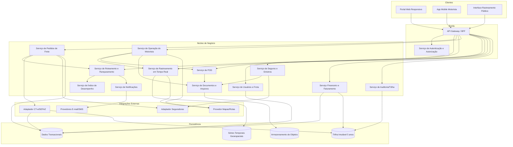
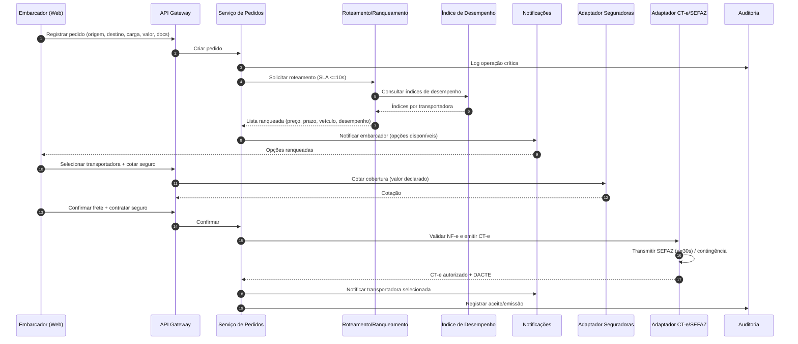
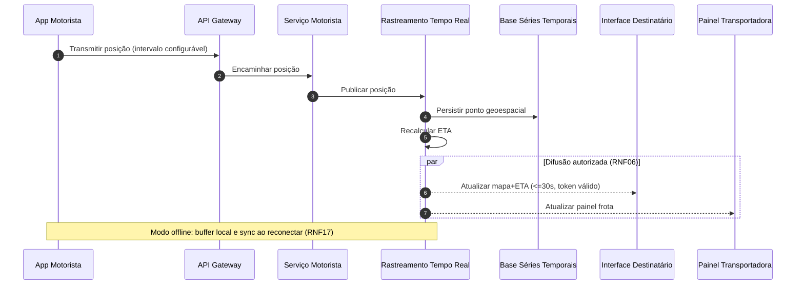
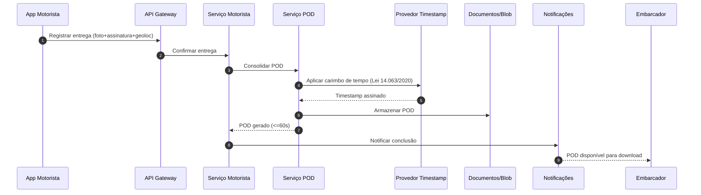

# Relatório Técnico de Arquitetura de Software
## Plataforma de Logística e Rastreamento de Cargas (G04) — AI4ES Time 2

---

## 1. Identificação das HUs

| HU | Título | Perfil | RFs Relacionados | RNFs Relacionados |
|----|--------|--------|------------------|-------------------|
| HU01 | Registrar pedido de frete | Embarcador | RF05, RF06, RF09, RF10 | RNF13 |
| HU02 | Selecionar transportadora e contratar seguro | Embarcador | RF11, RF12, RF16, RF17, RF41 | RNF13, RNF24 |
| HU03 | Acompanhar pedidos e receber POD | Embarcador | RF07, RF34, RF37, RF39 | RNF12 |
| HU04 | Abrir sinistro por avaria/extravio | Embarcador | RF42, RF43, RF44 | RNF24 |
| HU05 | Aceitar pedidos e gerenciar frota | Transportadora | RF03, RF13, RF14, RF15 | RNF12 |
| HU06 | Acompanhar operação em tempo real | Transportadora | RF25, RF26, RF30, RF32 | RNF15, RNF16, RNF06 |
| HU07 | Consultar demonstrativo de repasse | Transportadora | RF46, RF48 | RNF11 |
| HU08 | Executar coleta com evidências | Motorista | RF23, RF24, RF26 | RNF17, RNF21 |
| HU09 | Registrar entrega com assinatura | Motorista | RF27, RF37, RF38, RF40 | RNF10, RNF17, RNF21 |
| HU10 | Registrar ocorrência no transporte | Motorista | RF26, RF33, RF34, RF35 | RNF17 |
| HU11 | Rastrear carga sem cadastro | Destinatário | RF30, RF31, RF32 | RNF05, RNF06, RNF15 |
| HU12 | Receber notificações por etapa | Destinatário | RF33 | — |
| HU13 | Monitorar SLA e acionar contingência | Administrador | RF15, RF36, RF16 | RNF25 |
| HU14 | Acompanhar painel financeiro | Administrador | RF45, RF46, RF47, RF48, RF49 | RNF02, RNF11 |

---

## 2. Diagramas de Arquitetura (Mermaid)

### 2.1 Visão de Componentes (Alto Nível)

### 2.2 Sequência — HU01/HU02: Registro de Pedido → Roteamento → Seleção → CT-e

### 2.3 Sequência — HU06/HU11: Geolocalização e Rastreamento em Tempo Real

### 2.4 Sequência — HU09: Entrega com POD e Validade Jurídica

---

## 3. Decisões de Arquitetura

| ID | Decisão | Justificativa | Requisitos |
|----|---------|---------------|------------|
| AD01 | Arquitetura orientada a serviços com decomposição por domínio | Domínios heterogêneos (fiscal, rastreamento, financeiro) com ciclos de mudança e escala distintos | RNF16, RNF24 |
| AD02 | API Gateway/BFF por canal (web, mobile, público) | Diferentes perfis de acesso e políticas de segurança do link público | RF02, RNF05 |
| AD03 | Base especializada para séries temporais/geoespaciais separada da transacional | Alto volume de posições sem degradar operação | RNF16, RNF23 |
| AD04 | Ingestão de geolocalização via canal assíncrono/streaming | Absorver picos de atualização sem impactar leitura em tempo real | RNF15, RNF16 |
| AD05 | Camada offline-first no app do motorista com fila de sincronização | Garantir zero perda de eventos por conectividade | RF28, RNF17 |
| AD06 | Adaptadores de integração isolados com contrato versionado | Atualização independente de SEFAZ, seguradoras e mapas | RNF24 |
| AD07 | Trilha de auditoria imutável append-only segregada | Retenção legal de 5 anos para movimentos fiscais/financeiros | RF04, RNF11 |
| AD08 | Motor de regras configurável para roteamento, cancelamento e SLA | Critérios e políticas parametrizáveis por operação | RF08, RF11, RF12, RF15 |
| AD09 | Serviço de timestamp qualificado desacoplado do POD | Validade jurídica da assinatura eletrônica | RF38, RNF10 |
| AD10 | Criptografia em repouso segmentada para dados fiscais/financeiros/localização | Proteção AES-256 exigida | RNF02 |
| AD11 | Token único com expiração para link de rastreamento público | Acesso sem cadastro sem exposição de outros fretes | RF30, RNF05 |
| AD12 | Suporte a contingência CT-e com reconciliação posterior | Continuidade operacional offline SEFAZ | RF19, RNF07 |

---

## 4. Tabela de Componentes e Rastreabilidade

| Componente | Responsabilidade Principal | Comunica-se com | Origem (HU / Critério de Aceite) |
|------------|---------------------------|-----------------|----------------------------------|
| Serviço de Autenticação e Autorização | Autenticar perfis, MFA, tokens de sessão, controle de acesso por perfil | Gateway, Usuários | HU05, RF01/RF02, RNF03/RNF04 |
| Serviço de Usuários e Frota | Cadastro de perfis, motoristas e veículos vinculados | Auth, Pedidos | HU05 CA / RF01, RF03 |
| Serviço de Pedidos de Frete | Criar/consolidar/cancelar pedidos, upload docs, valor declarado | Roteamento, CT-e, Seguros, Notificações, Docs | HU01, HU03 / RF05–RF09 |
| Serviço de Roteamento e Ranqueamento | Rotear e ranquear transportadoras por critérios configuráveis | Pedidos, Desempenho, Notificações | HU02 CA / RF10–RF13, RNF13 |
| Serviço de Índice de Desempenho | Calcular e atualizar índices por entregas/prazos/ocorrências | Roteamento, Rastreamento | HU02 / RF16 |
| Serviço de Operação do Motorista | Ordens do dia, coleta, entrega, ocorrências, offline-sync | Rastreamento, POD, Docs, Notificações | HU08–HU10 / RF23–RF29 |
| Serviço de Rastreamento em Tempo Real | Ingestão de posição, ETA, difusão autorizada | Motorista, TSDB, Interface pública, Painéis | HU06, HU11 / RF25, RF30–RF32 |
| Adaptador CT-e/SEFAZ | Emitir/transmitir/cancelar CT-e, contingência, validar NF-e | Pedidos, Auditoria | HU02 CA / RF17–RF22, RNF07/RNF08 |
| Serviço de POD | Consolidar comprovante, timestamp, recusa | Motorista, Timestamp, Docs, Notificações | HU09 / RF37–RF40, RNF10 |
| Serviço de Seguros e Sinistros | Cotar/contratar seguro, abrir/acompanhar sinistro | Seguradoras, Docs, Notificações, Pedidos | HU02, HU04 / RF41–RF44 |
| Serviço Financeiro e Faturamento | Calcular frete/comissão, faturas, repasses, painel | Pedidos, Ledger, Auditoria | HU07, HU14 / RF45–RF49 |
| Serviço de Notificações | Envio e-mail/SMS, preferências, alertas SLA | Provedores MSG, demais serviços | HU12, HU13 / RF33–RF36 |
| Serviço de Documentos e Arquivos | Armazenar docs/fotos/POD estruturados | Blob, Pedidos, Sinistros | HU04 CA / RF09, RF44 |
| Serviço de Auditoria/Trilha | Registrar operações críticas imutáveis | Ledger, todos os serviços | RF04, RNF11 |
| Adaptador Seguradoras | Integrar cotação/contratação/status sinistro | Seguros, Notificações | HU04 / RF41–RF43 |
| Adaptador Mapas/Rotas | Rotas otimizadas e geocodificação | Motorista, Rastreamento | HU11 / RF29, RF32 |
| API Gateway / BFF | Roteamento de requisições, TLS, políticas por canal | Clientes, serviços | RF02, RNF01, RNF05 |
| Painel de Monitoramento | Métricas operacionais e SLA em tempo real | Rastreamento, Financeiro, Integrações | HU13 / RF36, RNF25 |

---

## 5. Bloqueios e Pendências

| ID | Descrição | Impacto | Necessário para resolver |
|----|-----------|---------|--------------------------|
| BL01 | Provedor/autoridade de carimbo de tempo qualificado não especificado | Validade jurídica do POD (RNF10) | Definir ICP/timestamp provider |
| BL02 | Regras de política de cancelamento (RF08) não detalhadas | Motor de regras incompleto | Definir janelas/tarifas de cancelamento |
| BL03 | Critérios de "SLA em risco" (RF36/HU13) não quantificados | Alertas de contingência ambíguos | Definir fórmula de risco (prazo × posição) |
| BL04 | Regras de inadimplência e ciclo de cobrança (RF49) ausentes | Painel financeiro incompleto | Definir política de faturamento/vencimento |
| BL05 | Contrato/SLAs das seguradoras parceiras não definidos | Integração de cotação incerta | Especificação de API por seguradora |
| BL06 | Formato/assinatura do link público e granularidade do token (RNF05) | Segurança de exposição | Definir política de expiração/escopo |
| BL07 | Fluxo de aceitação automática (RF12) vs manual não parametrizado | Ambiguidade de decisão | Definir regra padrão por embarcador |

---

## 6. Cobertura de Requisitos

**Requisitos Funcionais:** 49/49 endereçados.

| Faixa | Componente Principal |
|-------|----------------------|
| RF01–RF04 | Auth, Usuários/Frota, Auditoria |
| RF05–RF09 | Pedidos, Documentos |
| RF10–RF16 | Roteamento, Desempenho, Notificações |
| RF17–RF22 | Adaptador CT-e/SEFAZ |
| RF23–RF29 | Operação do Motorista, Mapas/Rotas |
| RF30–RF32 | Rastreamento Tempo Real |
| RF33–RF36 | Notificações, Monitoramento |
| RF37–RF40 | POD, Timestamp |
| RF41–RF44 | Seguros/Sinistros, Documentos |
| RF45–RF49 | Financeiro/Faturamento |

**Requisitos Não Funcionais:** 25/25 endereçados via AD01–AD12 e componentes de borda/persistência.

| Categoria | Cobertura |
|-----------|-----------|
| Segurança (RNF01–06) | Gateway/TLS, AES-256, MFA, tokens, difusão autorizada |
| Conformidade (RNF07–11) | Adaptador CT-e, LGPD, Timestamp, Ledger imutável |
| Disponibilidade/Desempenho (RNF12–17) | Serviços redundantes, ingestão assíncrona, offline-first |
| Usabilidade/Compat. (RNF18–21) | App mobile otimizado, portal responsivo |
| Infra/Dados (RNF22–25) | Backup, TSDB geoespacial, contratos versionados, monitoramento |

---

## 7. Gap Analysis

| Gap | Lacuna | Impacto Arquitetural | Ação Recomendada |
|-----|--------|----------------------|------------------|
| G01 | Validade jurídica do POD depende de autoridade de timestamp não definida (RNF10/RF38) | Risco de não conformidade legal | Selecionar provedor de carimbo qualificado e definir contrato de assinatura antes do design detalhado do POD |
| G02 | Estratégia de reconciliação da contingência CT-e (RF19) não descreve tratamento de rejeição SEFAZ pós-sincronização | Inconsistência fiscal | Especificar máquina de estados do CT-e com fila de reprocessamento e alertas |
| G03 | Ausência de definição de retenção/anonimização LGPD para geolocalização de motoristas (RNF09/RNF23) | Conflito entre retenção de séries temporais e minimização de dados | Definir política de expurgo/pseudonimização e base legal |
| G04 | Critérios quantitativos de SLA e ranqueamento (RF11/RF36) são "configuráveis" mas sem defaults | Motor de regras sem baseline testável | Definir pesos padrão e limiares de risco iniciais |
| G05 | Escalabilidade de geolocalização (RNF16) sem meta numérica (veículos simultâneos/frequência) | Dimensionamento de ingestão indefinido | Estabelecer capacidade-alvo (msgs/s) para dimensionar streaming e TSDB |
| G06 | Modo offline (RNF17) não define resolução de conflitos na sincronização (ex: eventos duplicados/ordem) | Risco de inconsistência de estados de frete | Definir estratégia de idempotência e ordenação por timestamp de dispositivo |
| G07 | Faturamento/inadimplência (RF47/RF49) sem integração de pagamento/cobrança especificada | Fluxo financeiro incompleto | Definir se há gateway de pagamento e ciclo de conciliação |
| G08 | Gestão de consentimento e preferências de notificação do destinatário (HU12) sem cadastro | Persistência de preferências ligada a token efêmero | Definir mecanismo de preferências vinculado ao frete/token |
| G09 | Não há requisito explícito de comunicação motorista↔transportadora (HU06 CA) além de notificação | Componente de mensageria não previsto nos RFs | Confirmar necessidade de canal de chat/voz e sua fonte |

---
*Fim do Relatório Canônico — AI4ES Time 2.*