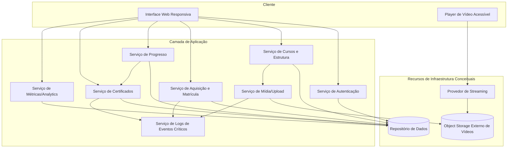
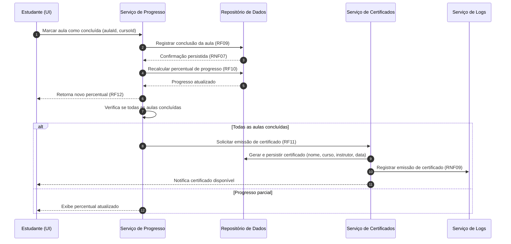
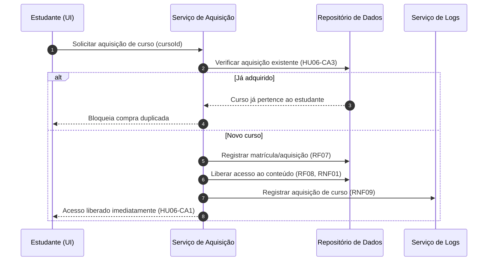

# Relatório Técnico de Arquitetura de Software
## Plataforma de Cursos em Vídeo (M01)

---

## 1. Identificação das HUs

| HU | Título | Perfil | RFs Relacionados | RNFs Relacionados |
|----|--------|--------|------------------|-------------------|
| HU01 | Criar e estruturar um curso | Instrutor | RF01, RF02, RF03, RF04 | RNF04, RNF09 |
| HU02 | Publicar e despublicar curso | Instrutor | RF05, RF08 | RNF01 |
| HU03 | Acompanhar matrículas do curso | Instrutor | RF13 | RNF06 |
| HU04 | Acompanhar engajamento por aula | Instrutor | RF14 | RNF06 |
| HU05 | Cadastrar-se na plataforma | Estudante | RF06, RF16 | RNF02 |
| HU06 | Adquirir um curso | Estudante | RF07, RF08 | RNF01, RNF09 |
| HU07 | Assistir aulas e acompanhar progresso | Estudante | RF09, RF10, RF12 | RNF03, RNF07, RNF10 |
| HU08 | Receber e baixar certificado | Estudante | RF11, RF15 | RNF09 |
| HU09 | Acessar meus cursos adquiridos | Estudante | RF12 | RNF05 |
| — | Login/Logout (transversal) | Ambos | RF16 | RNF02 |

---

## 2. Diagramas de Arquitetura (Mermaid)

### 2.1 Diagrama de Componentes (visão macro)

### 2.2 Diagrama de Sequência — Marcar aula concluída e emitir certificado (HU07 + HU08)

### 2.3 Diagrama de Sequência — Aquisição de curso e liberação de acesso (HU06)

---

## 3. Decisões de Arquitetura

| ID | Decisão | Justificativa | Requisito Base |
|----|---------|---------------|----------------|
| DA01 | Separar armazenamento de vídeos em **object storage externo** desacoplado da aplicação | Escalabilidade e desacoplamento | RNF04 |
| DA02 | Entrega de vídeo via **streaming** por provedor dedicado, não por download integral | Desempenho de reprodução | RNF03 |
| DA03 | Autenticação centralizada com armazenamento de **senhas com hash seguro** | Segurança de credenciais | RNF02 |
| DA04 | **Autorização baseada em posse do curso** (guarda de acesso ao conteúdo) | Restrição de acesso | RNF01, RF08 |
| DA05 | Persistência **imediata e transacional** de cada conclusão de aula | Evitar perda de progresso | RNF07 |
| DA06 | Serviço de **Métricas/Analytics** separado do serviço transacional | Isolar carga analítica e cumprir SLA de 3s | RNF06, RF13, RF14 |
| DA07 | Emissão de certificado **disparada por evento** de conclusão total | Automação e rastreabilidade | RF11, HU08 |
| DA08 | Serviço de **Logs de eventos críticos** transversal | Manutenibilidade e auditoria | RNF09 |
| DA09 | Interface **responsiva** e player com controles acessíveis | Usabilidade/Acessibilidade | RNF05, RNF08, RNF10 |
| DA10 | Estado de publicação do curso desacoplado do acesso já concedido | Manter acesso pós-despublicação | HU02-CA2 |

---

## 4. Tabela de Componentes e Rastreabilidade

| Componente | Responsabilidade Principal | Comunica-se com | Origem (HU / Critério de Aceite) |
|------------|----------------------------|-----------------|----------------------------------|
| Interface Web Responsiva | Renderizar telas para instrutor/estudante em múltiplos dispositivos | Todos os serviços de aplicação | HU09-CA1, RNF05, RNF08 |
| Player de Vídeo Acessível | Reproduzir vídeo via streaming com controles básicos de acessibilidade | Provedor de Streaming | HU07-CA1, RNF03, RNF10 |
| Serviço de Autenticação | Cadastro, login/logout, hash de senha, validação de e-mail/senha | Repositório de Dados | HU05, RF06, RF16, RNF02 |
| Serviço de Cursos e Estrutura | CRUD de cursos, módulos, aulas; reordenação; publicação/despublicação | Repositório, Serviço de Mídia | HU01, HU02, RF01–RF05 |
| Serviço de Mídia/Upload | Gerenciar upload de vídeos para object storage | Object Storage, Serviço de Logs | HU01-CA3, RF03, RNF04 |
| Serviço de Aquisição e Matrícula | Registrar compra, impedir duplicidade, liberar acesso | Repositório, Serviço de Logs | HU06, RF07, RF08, RNF01 |
| Serviço de Progresso | Registrar conclusão de aula, calcular percentual, disparar certificado | Repositório, Serviço de Certificados | HU07, RF09, RF10, RF12, RNF07 |
| Serviço de Certificados | Emitir e disponibilizar certificado em PDF para download | Repositório, Serviço de Logs | HU08, RF11, RF15 |
| Serviço de Métricas/Analytics | Calcular matrículas por curso e engajamento por aula | Repositório | HU03, HU04, RF13, RF14, RNF06 |
| Serviço de Logs de Eventos Críticos | Registrar aquisição, emissão de certificado e erros de upload | Aquisição, Certificados, Mídia | RNF09 |
| Repositório de Dados | Persistir usuários, cursos, matrículas, progresso, certificados | Serviços de aplicação | Transversal |
| Object Storage Externo | Armazenar arquivos de vídeo desacoplados | Mídia, Streaming | RNF04 |
| Provedor de Streaming | Entregar vídeo progressivamente | Player, Object Storage | RNF03 |

---

## 5. Bloqueios e Pendências

| ID | Descrição | Impacto | Severidade |
|----|-----------|---------|------------|
| BL01 | Não há especificação do **meio de pagamento** para aquisição (RF07). Fluxo de compra assume liberação direta. | Impede design completo do fluxo financeiro | Alta |
| BL02 | Ausência de política de **transcodificação/formatos de vídeo** e qualidades adaptativas. | Afeta RNF03 e experiência de streaming | Média |
| BL03 | Não definido se métricas (HU03) são **tempo real ou defasagem até 1h** — critério dá margem a ambas. | Define arquitetura síncrona vs. batch | Média |
| BL04 | Não há definição sobre **papéis/permissões** (um usuário pode ser instrutor e estudante?). | Modelagem de identidade e autorização | Média |
| BL05 | "Visualização" de aula (RF14) não tem definição operacional (o que conta como view). | Ambiguidade na métrica de engajamento | Média |
| BL06 | Não especificado se despublicação impacta novas visualizações de aula já em progresso. | Regras de acesso | Baixa |

---

## 6. Cobertura de Requisitos

**Requisitos Funcionais:** 16/16 cobertos.

| RF | Componente Responsável |
|----|------------------------|
| RF01–RF05 | Serviço de Cursos e Estrutura (+ Mídia p/ RF03) |
| RF06, RF16 | Serviço de Autenticação |
| RF07, RF08 | Serviço de Aquisição e Matrícula |
| RF09, RF10, RF12 | Serviço de Progresso |
| RF11, RF15 | Serviço de Certificados |
| RF13, RF14 | Serviço de Métricas/Analytics |

**Requisitos Não Funcionais:** 10/10 endereçados.

| RNF | Tratamento Arquitetural |
|-----|-------------------------|
| RNF01 | DA04 – guarda de autorização por posse |
| RNF02 | DA03 – hash seguro no Serviço de Autenticação |
| RNF03 | DA02 – streaming |
| RNF04 | DA01 – object storage externo |
| RNF05 | DA09 – UI responsiva |
| RNF06 | DA06 – serviço analítico separado |
| RNF07 | DA05 – persistência transacional imediata |
| RNF08 | DA09 – compatibilidade de navegadores |
| RNF09 | DA08 – serviço de logs |
| RNF10 | DA09 – player acessível |

---

## 7. Gap Analysis

| Gap | Lacuna Identificada | Impacto Arquitetural | Ação Recomendada |
|-----|---------------------|----------------------|------------------|
| G01 | **Pagamento não especificado** (RF07/HU06). Não há gateway, reembolso, ou modelo gratuito. | Componente financeiro inteiro ausente do design; integração externa impactará fluxo de aquisição. | Definir modelo de monetização e incluir Serviço de Pagamento/integração antes da implementação. |
| G02 | **Pipeline de vídeo** (transcodificação, thumbnails, DRM) não descrito. | RNF03/RNF04 dependem de processamento assíncrono não modelado. | Especificar processamento pós-upload e formatos suportados. |
| G03 | **Estratégia de atualização de métricas** ambígua (HU03-CA2). | Escolhe entre pipeline batch vs. consultas em tempo real, afetando RNF06. | Decidir SLA de defasagem e definir estratégia de agregação/cache. |
| G04 | **Modelo de identidade/papéis** indefinido. | Autorização e associação instrutor↔curso e estudante↔matrícula. | Definir se contas são unificadas com múltiplos papéis. |
| G05 | **Definição de "visualização"** de aula (RF14). | Coleta de eventos de engajamento e precisão das métricas. | Especificar evento de telemetria que conta como view. |
| G06 | **Retenção/segurança de certificados** e validação anti-fraude (verificação pública). | Integridade do certificado PDF (RF15). | Definir identificador único/verificável no certificado. |
| G07 | **Requisitos de recuperação/backup** não citados apesar de RNF07 exigir zero perda. | Confiabilidade de persistência. | Definir política de backup e tolerância a falhas. |
| G08 | **Notificações** (e-mail de boas-vindas, certificado emitido) não especificadas. | HU05/HU08 sugerem comunicação ao usuário. | Avaliar necessidade de Serviço de Notificação. |

---

*Relatório gerado pelo Sistema Multi-Agente AI4ES — Time 2. Design em nível conceitual, tecnologicamente neutro, salvo tecnologias literalmente citadas nos requisitos (object storage/S3, bcrypt, PDF).*