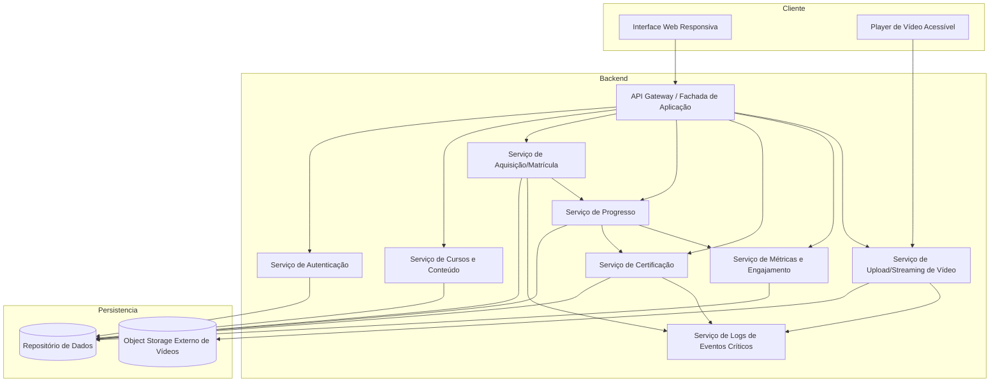
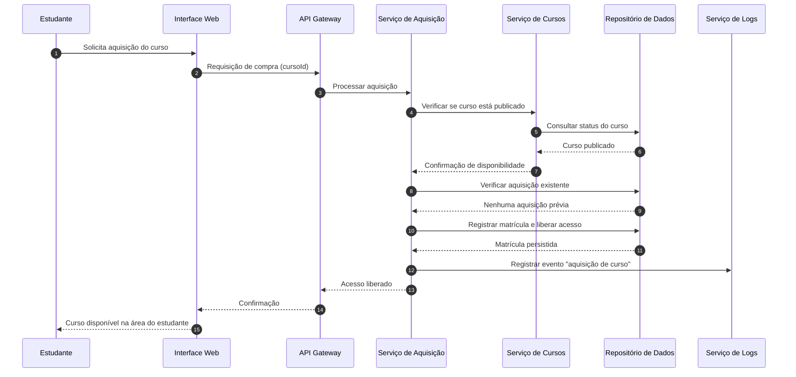
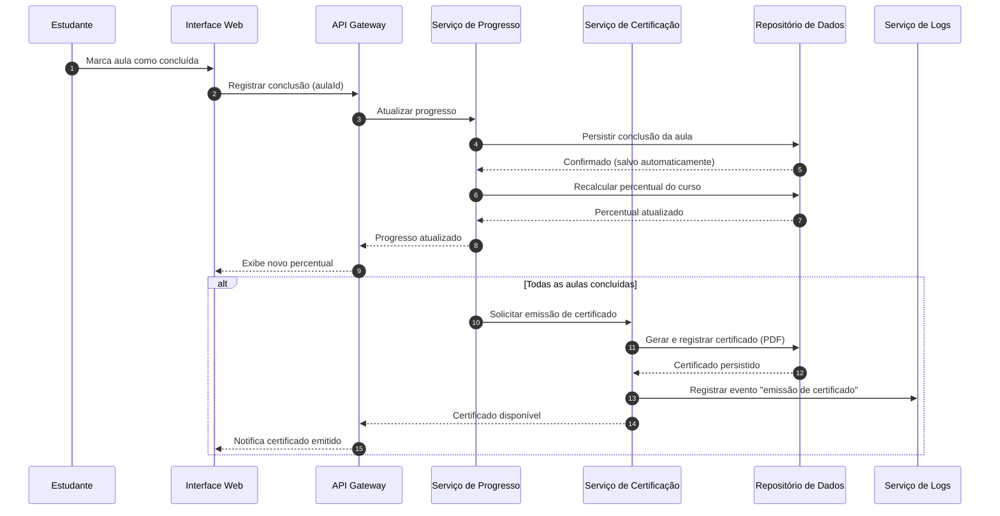
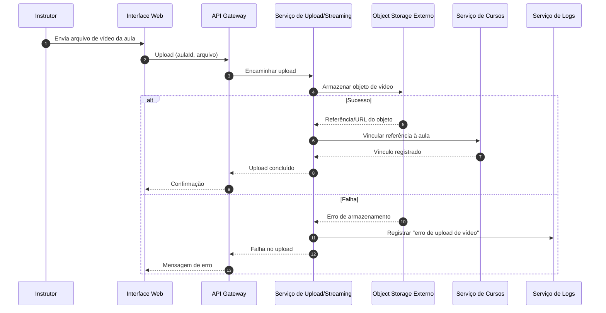

# Relatório Técnico de Arquitetura de Software
## Plataforma de Cursos em Vídeo (M01)

---

## 1. Identificação das HUs

| HU | Perfil | Título | RFs Relacionados | RNFs Relacionados |
|----|--------|--------|------------------|-------------------|
| HU01 | Instrutor | Criar e estruturar um curso | RF01, RF02, RF03, RF04 | RNF04 |
| HU02 | Instrutor | Publicar e despublicar curso | RF05 | RNF01 |
| HU03 | Instrutor | Acompanhar matrículas do curso | RF13 | RNF06 |
| HU04 | Instrutor | Acompanhar engajamento por aula | RF14 | RNF06 |
| HU05 | Estudante | Cadastrar-se na plataforma | RF06, RF16 | RNF02 |
| HU06 | Estudante | Adquirir um curso | RF07, RF08 | RNF01, RNF09 |
| HU07 | Estudante | Assistir aulas e acompanhar progresso | RF09, RF10, RF12 | RNF03, RNF07, RNF10 |
| HU08 | Estudante | Receber e baixar certificado | RF11, RF15 | RNF09 |
| HU09 | Estudante | Acessar cursos adquiridos | RF12 | RNF05 |

**Requisitos transversais:** RNF05 (responsividade), RNF08 (compatibilidade), RNF09 (logs) e RNF16/RF16 (autenticação) permeiam múltiplas HUs.

---

## 2. Diagramas de Arquitetura (Mermaid)

### 2.1 Diagrama de Componentes (visão macro)

### 2.2 Diagrama de Sequência — Aquisição e Liberação de Acesso (HU06 / RF07, RF08)

### 2.3 Diagrama de Sequência — Conclusão de Aula, Progresso e Certificado (HU07 / HU08)

### 2.4 Diagrama de Sequência — Upload de Vídeo (HU01 / RF03, RNF04)

---

## 3. Decisões de Arquitetura

| ID | Decisão | Justificativa | Requisito Origem |
|----|---------|---------------|------------------|
| DA01 | Separar responsabilidades em serviços de domínio (Cursos, Aquisição, Progresso, Certificação, Métricas, Mídia) | Isola regras de negócio e facilita evolução/manutenção | RNF09, geral |
| DA02 | Armazenamento de vídeos em **object storage externo desacoplado** da aplicação | Requisito explícito de escalabilidade | RNF04 |
| DA03 | Entrega de vídeo via **streaming**, sem download integral prévio | Requisito de desempenho | RNF03 |
| DA04 | Controle de acesso ao conteúdo condicionado à verificação de aquisição em cada requisição | Restrição de acesso exclusiva a quem adquiriu | RNF01, RF08 |
| DA05 | Armazenamento de senhas com hash seguro (ex.: bcrypt, citado no requisito) | Segurança de credenciais | RNF02 |
| DA06 | Persistência do progresso de forma atômica e imediata a cada conclusão | Evitar perda de progresso | RNF07, RF09 |
| DA07 | Emissão de certificado disparada por evento de conclusão total do curso | Automatiza RF11 e mantém consistência com progresso | RF11, HU08 |
| DA08 | Serviço de Métricas alimentado por eventos de matrícula/visualização/conclusão, com atualização de defasagem ≤ 1h | Atende meta de tempo real/1h e carga do painel | RF13, RF14, RNF06 |
| DA09 | Serviço centralizado de logs para eventos críticos | Manutenibilidade e auditoria | RNF09 |
| DA10 | Interface responsiva e compatível com navegadores modernos | Usabilidade multi-dispositivo | RNF05, RNF08 |
| DA11 | Player com controles básicos de acessibilidade | Acessibilidade | RNF10 |
| DA12 | Preservação do vínculo de acesso após despublicação do curso | Estudantes mantêm acesso ao adquirido | HU02 (critério) |

---

## 4. Tabela de Componentes e Rastreabilidade

| Componente | Responsabilidade Principal | Comunica-se com | Origem (HU / Critério de Aceite) |
|------------|---------------------------|-----------------|----------------------------------|
| Interface Web Responsiva | Renderizar telas em desktop/mobile e navegadores modernos | API Gateway, Player | HU05, HU09 / RNF05, RNF08 |
| Player de Vídeo Acessível | Reproduzir vídeo via streaming com controles de acessibilidade | Serviço de Mídia | HU07 / RNF03, RNF10 |
| API Gateway / Fachada | Rotear requisições, aplicar autenticação/autorização | Todos os serviços de backend | RF16 / transversal |
| Serviço de Autenticação | Cadastro, login/logout, validação de credenciais, hash de senha | Repositório de Dados | HU05 / RF06, RF16, RNF02 |
| Serviço de Cursos e Conteúdo | CRUD de cursos, módulos, aulas; publicação/despublicação; vínculo de vídeo | Repositório, Serviço de Mídia, Aquisição | HU01, HU02 / RF01–RF05 |
| Serviço de Aquisição/Matrícula | Processar compra, impedir duplicidade, liberar acesso | Serviço de Cursos, Progresso, Logs, Repositório | HU06 / RF07, RF08, RNF01 |
| Serviço de Progresso | Registrar conclusão de aula, calcular percentual, persistir com segurança | Certificação, Métricas, Repositório | HU07 / RF09, RF10, RF12, RNF07 |
| Serviço de Certificação | Emitir certificado ao concluir 100%, gerar PDF, disponibilizar download | Progresso, Repositório, Logs | HU08 / RF11, RF15 |
| Serviço de Métricas e Engajamento | Calcular matrículas por curso, visualizações e taxa de conclusão por aula | Progresso, Aquisição, Repositório | HU03, HU04 / RF13, RF14, RNF06 |
| Serviço de Upload/Streaming de Vídeo | Gerenciar upload para object storage e entrega via streaming | Object Storage, Serviço de Cursos, Logs | HU01, HU07 / RF03, RNF03, RNF04 |
| Serviço de Logs de Eventos Críticos | Registrar aquisição, emissão de certificado e erros de upload | Aquisição, Certificação, Mídia | RNF09 |
| Repositório de Dados | Persistir usuários, cursos, matrículas, progresso, certificados | Serviços de domínio | Transversal |
| Object Storage Externo | Armazenar arquivos de vídeo desacoplados da aplicação | Serviço de Mídia | RNF04 |

---

## 5. Bloqueios e Pendências

| ID | Descrição | Tipo | Impacto |
|----|-----------|------|---------|
| BL01 | **Meio de pagamento não especificado** — RF07/HU06 falam em "adquirir" mas não definem gateway, moeda, reembolso ou fluxo de pagamento gratuito/pago | Bloqueio funcional | Alto — impede fechar o fluxo de aquisição |
| BL02 | Critério de "visualização" de aula (RF14) não definido — não há regra sobre o que conta como uma visualização | Pendência de regra | Médio — afeta métrica de engajamento |
| BL03 | Não há definição de política de retenção/formato de vídeo (codec, tamanho máximo, transcodificação) | Pendência técnica | Médio — impacta upload/streaming |
| BL04 | Modelo de recuperação de senha e verificação de e-mail não especificado | Pendência funcional | Médio — segurança/UX de conta |
| BL05 | Perfis e autorização (papel instrutor vs estudante) não formalizados como requisito explícito, embora implícitos | Pendência de modelo | Médio — impacta controle de acesso |
| BL06 | Comportamento em "tempo real" das métricas (RF13/HU03) versus defasagem de 1h precisa ser confirmado | Ambiguidade | Baixo |

---

## 6. Cobertura de Requisitos

### Requisitos Funcionais

| RF | Coberto por | Status |
|----|-------------|--------|
| RF01 | Serviço de Cursos | ✅ |
| RF02 | Serviço de Cursos | ✅ |
| RF03 | Serviço de Mídia + Object Storage | ✅ |
| RF04 | Serviço de Cursos | ✅ |
| RF05 | Serviço de Cursos | ✅ |
| RF06 | Serviço de Autenticação | ✅ |
| RF07 | Serviço de Aquisição | ⚠️ (dependente de BL01) |
| RF08 | Serviço de Aquisição + Autorização | ✅ |
| RF09 | Serviço de Progresso | ✅ |
| RF10 | Serviço de Progresso | ✅ |
| RF11 | Serviço de Certificação | ✅ |
| RF12 | Serviço de Progresso + UI | ✅ |
| RF13 | Serviço de Métricas | ✅ |
| RF14 | Serviço de Métricas | ⚠️ (dependente de BL02) |
| RF15 | Serviço de Certificação | ✅ |
| RF16 | Serviço de Autenticação | ✅ |

### Requisitos Não Funcionais

| RNF | Coberto por | Status |
|-----|-------------|--------|
| RNF01 | DA04, autorização por aquisição | ✅ |
| RNF02 | Serviço de Autenticação (hash) | ✅ |
| RNF03 | Serviço de Mídia (streaming) | ✅ |
| RNF04 | Object Storage externo | ✅ |
| RNF05 | Interface Web Responsiva | ✅ |
| RNF06 | Serviço de Métricas (pré-agregação) | ✅ |
| RNF07 | Serviço de Progresso (persistência atômica) | ✅ |
| RNF08 | Interface Web | ✅ |
| RNF09 | Serviço de Logs | ✅ |
| RNF10 | Player Acessível | ✅ |

**Cobertura geral:** 26/26 requisitos endereçados no design; 2 RFs com dependência de esclarecimento (BL01, BL02).

---

## 7. Gap Analysis

| Gap | Descrição | Impacto Arquitetural | Ação Recomendada |
|-----|-----------|----------------------|-------------------|
| G01 — Fluxo de pagamento ausente | RF01 menciona "preço" e RF07 "adquirir", mas não há requisito de processamento de pagamento, confirmação ou tratamento de falha transacional | Requer possível integração com provedor de pagamento externo e tratamento de consistência entre pagamento e liberação de acesso | Especificar fluxo de pagamento (gratuito x pago), estados da transação e política de reembolso; definir compensação em caso de falha pós-pagamento |
| G02 — Definição de "visualização" | RF14 depende de métrica não definida | Serviço de Métricas precisa de evento de rastreamento no player | Definir gatilho (ex.: início de reprodução, X% assistido) e instrumentar o player |
| G03 — Transcodificação/formatos de vídeo | RNF03/RNF04 exigem streaming, mas não há requisito sobre preparação do vídeo | Pode exigir pipeline de processamento de mídia assíncrono | Definir formatos aceitos, necessidade de transcodificação adaptativa e limites de tamanho |
| G04 — Gestão de conta (recuperação de senha, verificação de e-mail) | HU05 só cobre cadastro | Serviço de Autenticação incompleto | Adicionar requisitos de reset de senha e confirmação de e-mail |
| G05 — Modelo de autorização por papéis | Instrutor/Estudante são implícitos | Autorização precisa distinguir papéis para RF01–RF05 vs RF06–RF15 | Formalizar RBAC (papéis e permissões) como requisito |
| G06 — Integridade certificado após despublicação/edição | HU02 garante acesso pós-despublicação, mas edição de curso após conclusão pode afetar certificado | Certificado deve ser imutável (snapshot dos dados na emissão) | Definir que o certificado congela nome do curso/instrutor/data no momento da emissão |
| G07 — Consistência de métricas vs "tempo real" | HU03 pede "tempo real ou defasagem de 1h" | Estratégia de agregação (síncrona vs batch) impacta RNF06 | Confirmar SLA de atualização e adotar pré-agregação para cumprir carga em 3s |
| G08 — Reordenação após publicação | HU01 permite reordenar "antes da publicação"; comportamento pós-publicação indefinido | Impacta integridade do progresso já registrado | Definir regras de edição de estrutura para cursos já adquiridos |

---

*Fim do Relatório Canônico — AI4ES Time 2.*