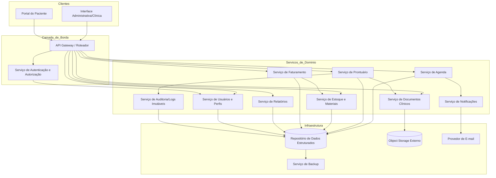
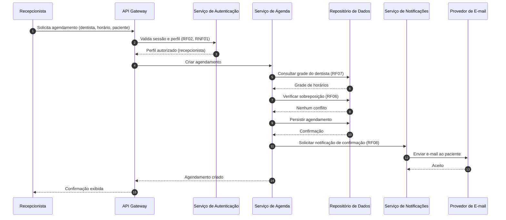
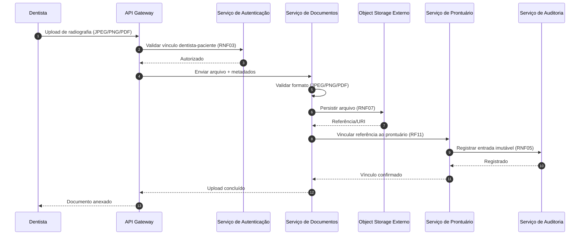
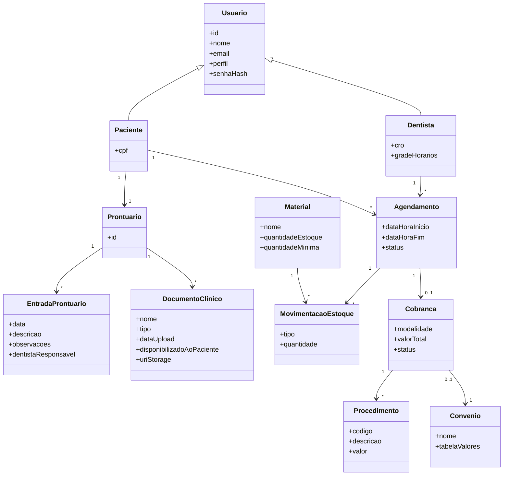

# Relatório Técnico de Arquitetura de Software
## Sistema de Gestão de Clínica Odontológica (M02) — AI4ES Time 2

---

## 1. Identificação das HUs

| HU | Título | Perfil | RFs Relacionados | RNFs Relacionados |
|----|--------|--------|------------------|-------------------|
| HU01 | Visualizar agenda unificada dos dentistas | Recepcionista | RF03, RF04 | RNF06, RNF09 |
| HU02 | Agendar, cancelar e remarcar consulta | Recepcionista | RF05, RF06, RF07, RF08 | RNF01 |
| HU03 | Registrar pagamento de cobrança | Recepcionista | RF20, RF21 | RNF01 |
| HU04 | Registrar procedimento no prontuário | Dentista | RF09, RF10, RF13 | RNF05 |
| HU05 | Anexar radiografias e documentos clínicos | Dentista | RF11 | RNF03, RNF07 |
| HU06 | Consultar prontuário completo do paciente | Dentista | RF09, RF12 | RNF02, RNF03 |
| HU07 | Gerar cobrança após atendimento | Dentista | RF17, RF18, RF19, RF20 | — |
| HU08 | Gerenciar dentistas e grades de horário | Administrador | RF01, RF03, RF07 | — |
| HU09 | Gerenciar materiais e alertas de estoque | Administrador | RF14, RF15, RF16, RF17 | — |
| HU10 | Consultar relatório de faturamento | Administrador | RF22 | — |
| HU11 | Acessar agendamentos pelo portal | Paciente | RF23, RF24 | RNF01, RNF09, RNF10 |
| HU12 | Acessar e baixar documentos clínicos | Paciente | RF23, RF25 | RNF03, RNF07 |

**Requisitos transversais (aplicam-se a todas as HUs):** RF02 (RBAC), RNF01, RNF04, RNF08, RNF11.

---

## 2. Diagramas de Arquitetura (Mermaid)

### 2.1 Diagrama de Componentes (Visão de Alto Nível)

### 2.2 Diagrama de Sequência — HU02 (Agendar consulta com verificação de sobreposição)

### 2.3 Diagrama de Sequência — HU05 (Upload de documento clínico)

### 2.4 Diagrama de Classes (Domínio Principal)

---

## 3. Decisões de Arquitetura

| ID | Decisão | Justificativa | Requisitos |
|----|---------|---------------|-----------|
| DA01 | Separar domínios em serviços com fronteiras claras (agenda, prontuário, documentos, estoque, faturamento) | Isolamento de responsabilidades e escalabilidade seletiva | RNF08, RNF07 |
| DA02 | Serviço central de Autenticação/Autorização com controle por perfil (RBAC) | RF02 exige restrição por perfil; centraliza política de acesso | RF01, RF02, RNF01, RNF04 |
| DA03 | Armazenamento de documentos clínicos em object storage externo desacoplado | Exigência explícita de escalabilidade e desacoplamento | RNF07, RF11, RF25 |
| DA04 | Camada de controle de acesso a documentos por vínculo dentista-paciente + flag de disponibilização | Garante confidencialidade e visibilidade seletiva ao paciente | RNF03, RF25, HU12 |
| DA05 | Serviço de Auditoria com log imutável para prontuário | Rastreabilidade obrigatória de alterações clínicas | RNF05, RF13 |
| DA06 | Serviço de Notificações assíncrono via provedor de e-mail | Desacopla envio de e-mail do fluxo transacional de agendamento | RF08 |
| DA07 | Verificação de sobreposição na camada de domínio da Agenda com bloqueio transacional | Impede dois atendimentos simultâneos para o mesmo dentista | RF06, HU02 |
| DA08 | Interface web responsiva única com portal do paciente segregado | Atende múltiplos dispositivos e navegadores | RNF09, RNF10, RF23 |
| DA09 | Senhas com hash seguro (bcrypt) e expiração de sessão em 30 min | Requisitos de segurança explícitos | RNF01, RNF04 |
| DA10 | Backup automático diário com retenção mínima de 30 dias | Exigência de continuidade de dados | RNF11 |
| DA11 | Grade de horários versionada — alterações afetam somente agendamentos futuros | Critério de aceite HU08 | RF07, HU08 |
| DA12 | Motor de precificação aplica tabela de convênio automaticamente | Critério HU07 | RF19, RF20 |

---

## 4. Tabela de Componentes e Rastreabilidade

| Componente | Responsabilidade Principal | Comunica-se com | Origem (HU / Critério de Aceite) |
|------------|---------------------------|-----------------|----------------------------------|
| API Gateway / Roteador | Roteamento, entrada única, aplicação de política de sessão | Clientes, Autenticação, todos os serviços de domínio | RNF01 / HU02, HU11 |
| Serviço de Autenticação e Autorização | Autenticar usuários, aplicar RBAC por perfil, encerrar sessões inativas | Gateway, Serviço de Usuários | RF01, RF02, RNF01, RNF04 / HU02, HU06, HU11 |
| Serviço de Usuários e Perfis | Cadastro de usuários, perfis, dentistas e grades de horário | Autenticação, Repositório de Dados | RF01, RF03, RF07 / HU08 |
| Serviço de Agenda | Manter agendas individuais, agenda unificada, agendar/cancelar/remarcar, validar sobreposição | Gateway, Notificações, Repositório | RF03–RF07 / HU01 (agenda diária/semanal, filtro), HU02 (bloqueio de sobreposição) |
| Serviço de Prontuário | Registrar/consultar procedimentos, vincular documentos, garantir rastreabilidade | Documentos, Auditoria, Repositório | RF09, RF10, RF12, RF13 / HU04, HU06 (histórico cronológico decrescente, busca por nome/CPF) |
| Serviço de Documentos Clínicos | Upload, validação de formato, metadados e controle de acesso a arquivos | Object Storage, Prontuário, Autenticação | RF11, RF25, RNF03, RNF07 / HU05, HU12 |
| Serviço de Estoque e Materiais | Cadastro de materiais, entradas/saídas, alerta de estoque mínimo, consumo por atendimento | Faturamento, Repositório | RF14–RF17 / HU09 (alerta destacado, reposição pelo alerta) |
| Serviço de Faturamento | Cadastro de procedimentos/convênios, geração de cobrança, registro de pagamento | Estoque, Repositório, Relatórios | RF18–RF21 / HU03 (pagamento total/parcial), HU07 (tabela de convênio) |
| Serviço de Relatórios | Gerar relatórios de faturamento por período/dentista/modalidade, exportar CSV/PDF | Faturamento, Repositório | RF22 / HU10 (filtros, totais, exportação) |
| Serviço de Notificações | Enviar e-mails de confirmação/cancelamento/remarcação | Agenda, Provedor de E-mail | RF08 / HU02 |
| Serviço de Auditoria / Logs Imutáveis | Registrar alterações de prontuário de forma imutável | Prontuário, Repositório | RF13, RNF05 / HU04 |
| Repositório de Dados Estruturados | Persistência transacional dos dados do domínio | Todos os serviços, Backup | Transversal |
| Object Storage Externo | Armazenar arquivos clínicos de forma desacoplada e escalável | Serviço de Documentos | RNF07 / HU05, HU12 |
| Provedor de E-mail | Entrega efetiva de mensagens ao paciente | Notificações | RF08 |
| Serviço de Backup | Backup automático diário com retenção ≥ 30 dias | Repositório de Dados | RNF11 |
| Interface Administrativa/Clínica | UI responsiva para admin, recepcionista e dentista | Gateway | RNF09, RNF10 / HU01–HU10 |
| Portal do Paciente | UI segregada para autoatendimento do paciente | Gateway | RF23–RF25 / HU11, HU12 |

---

## 5. Bloqueios e Pendências

| ID | Descrição | Impacto | Tipo |
|----|-----------|---------|------|
| BL01 | RNF02 cita conformidade com "normas do CFO" sem especificar quais normas (retenção de prontuário, assinatura digital) | Pode exigir retenção prolongada e assinatura eletrônica de registros clínicos | Bloqueio regulatório |
| BL02 | Não há definição do provedor de autenticação nem de mecanismo de MFA | Afeta desenho do fluxo de login | Pendência |
| BL03 | RF08 não define comportamento em falha de envio de e-mail (retry, dead-letter) | Risco de paciente não notificado | Pendência |
| BL04 | Pagamento parcial (HU03) sem regra sobre parcelamento, juros ou registro de múltiplos pagamentos | Ambiguidade no modelo de Cobrança | Pendência |
| BL05 | RNF08 (99,5% uptime) e RNF06 (agenda < 3s) sem definição de volumetria/número de dentistas | Dificulta dimensionamento e testes de carga | Pendência |
| BL06 | Não especificado limite de tamanho/tipo de arquivo além dos formatos citados | Afeta validação e custos de storage | Pendência |
| BL07 | Ausência de requisito sobre quem "disponibiliza" documento ao paciente e como reverter | Afeta modelo de flag de visibilidade (HU12) | Pendência |

---

## 6. Cobertura de Requisitos

### Requisitos Funcionais
| RF | Coberto por | Status |
|----|-------------|--------|
| RF01 | Serviço de Usuários / Autenticação | ✅ |
| RF02 | Autenticação/Autorização (RBAC) | ✅ |
| RF03 | Serviço de Agenda | ✅ |
| RF04 | Serviço de Agenda (visão unificada) | ✅ |
| RF05 | Serviço de Agenda | ✅ |
| RF06 | Serviço de Agenda (validação de sobreposição) | ✅ |
| RF07 | Serviço de Usuários (grade de horários) | ✅ |
| RF08 | Serviço de Notificações | ✅ |
| RF09 | Serviço de Prontuário | ✅ |
| RF10 | Serviço de Prontuário | ✅ |
| RF11 | Serviço de Documentos + Object Storage | ✅ |
| RF12 | Serviço de Prontuário (controle de acesso) | ✅ |
| RF13 | Prontuário + Auditoria | ✅ |
| RF14–RF17 | Serviço de Estoque | ✅ |
| RF18–RF21 | Serviço de Faturamento | ✅ |
| RF22 | Serviço de Relatórios | ✅ |
| RF23 | Portal do Paciente | ✅ |
| RF24 | Portal + Serviço de Agenda | ✅ |
| RF25 | Portal + Serviço de Documentos | ✅ |

**Cobertura RF: 25/25 (100%)**

### Requisitos Não Funcionais
| RNF | Coberto por | Status |
|-----|-------------|--------|
| RNF01 | Autenticação (sessão 30min) | ✅ |
| RNF02 | Repositório + política de dados (parcial — ver BL01) | ⚠️ Parcial |
| RNF03 | Serviço de Documentos (controle de acesso) | ✅ |
| RNF04 | Autenticação (hash bcrypt) | ✅ |
| RNF05 | Serviço de Auditoria (log imutável) | ✅ |
| RNF06 | Serviço de Agenda (otimização de leitura) | ✅ |
| RNF07 | Object Storage Externo | ✅ |
| RNF08 | Arquitetura de serviços + infra | ⚠️ Parcial (BL05) |
| RNF09 | UI responsiva | ✅ |
| RNF10 | Compatibilidade navegadores | ✅ |
| RNF11 | Serviço de Backup | ✅ |

**Cobertura RNF: 9/11 plena, 2 parciais**

---

## 7. Gap Analysis

| # | Lacuna Identificada | Impacto Arquitetural | Ação Recomendada |
|---|---------------------|----------------------|------------------|
| G01 | Normas do CFO não detalhadas (RNF02, BL01) | Pode exigir retenção legal específica de prontuário e assinatura digital de registros clínicos, alterando o modelo de Auditoria e retenção | Levantar requisitos legais junto ao cliente; prever suporte a assinatura eletrônica e política de retenção configurável |
| G02 | Ausência de tratamento de falha de notificação (BL03) | E-mail é dependência externa; falha silenciosa quebra critério de aceite HU02 | Adotar padrão assíncrono com fila, política de retry e registro de status de entrega |
| G03 | Modelo de pagamento parcial incompleto (BL04) | Entidade Cobrança precisa suportar múltiplos pagamentos e saldo residual | Definir agregado Pagamento com histórico; especificar regras de status (aberto/parcial/quitado) |
| G04 | Falta de volumetria e metas de escala (BL05) | Dimensionamento de infra, cache de agenda e SLA de 99,5% indefinidos | Solicitar estimativa de nº de dentistas, pacientes e concorrência; definir estratégia de leitura otimizada para RNF06 |
| G05 | Reversão/controle de disponibilização de documentos ao paciente (BL07) | Impacta modelo de visibilidade e auditoria de acesso (HU12) | Modelar flag de disponibilização com histórico e permissão explícita do dentista |
| G06 | Sem requisito de logs de acesso a dados clínicos (leitura) | LGPD frequentemente exige rastreio de acessos, não só de alterações | Estender Serviço de Auditoria para registrar acessos de leitura a prontuários e documentos |
| G07 | Integração com convênios externos não especificada (RF19) | Se tabelas de convênio forem externas, exige integração; hoje assumido como cadastro interno | Confirmar se convênios são geridos manualmente ou via integração externa |
| G08 | Não há requisito de gestão de consentimento LGPD do paciente | Necessário para conformidade completa com RNF02 | Prever módulo de consentimento e portabilidade/eliminação de dados |

---

**Conclusão:** A arquitetura proposta cobre 100% dos requisitos funcionais e a maioria dos não funcionais, organizando-se em serviços de domínio desacoplados com fronteiras claras. Os principais riscos concentram-se em conformidade regulatória (CFO/LGPD), resiliência de notificações e definição de volumetria para metas de desempenho e disponibilidade. Recomenda-se priorizar a resolução dos bloqueios BL01, BL04 e BL05 antes do início da implementação.