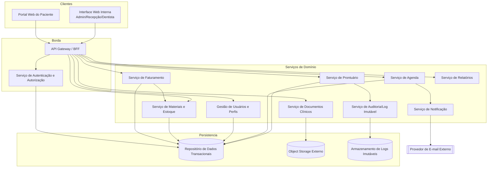
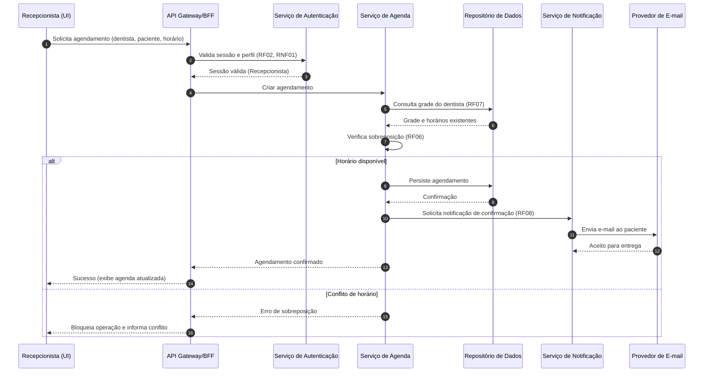
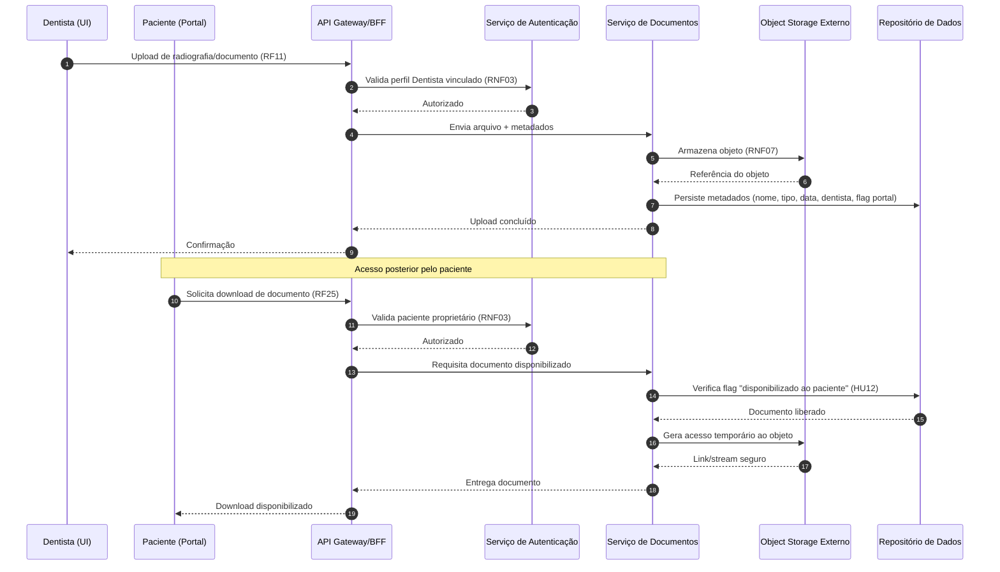
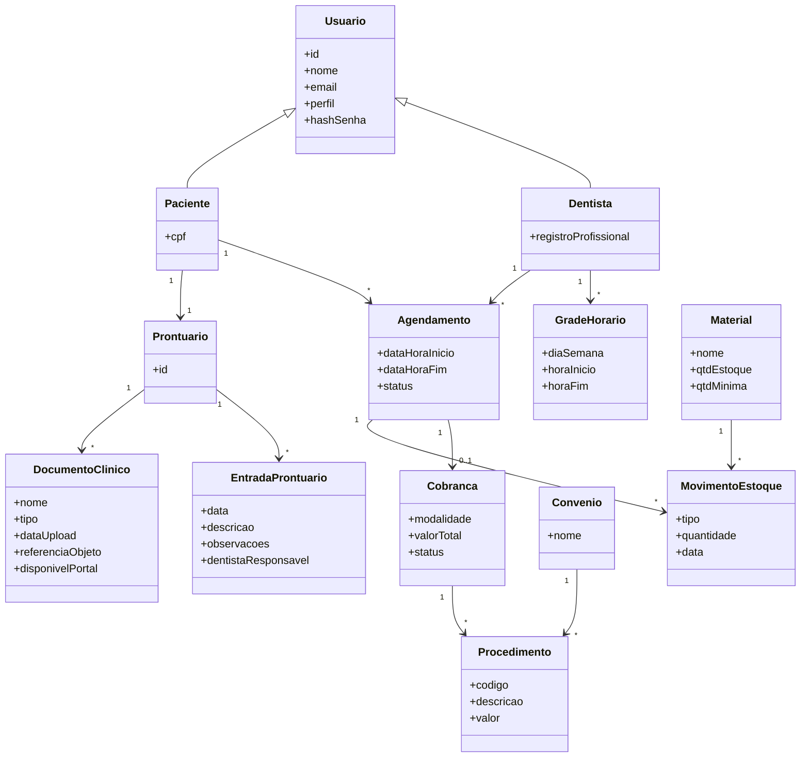

# Relatório Técnico de Arquitetura de Software
## Sistema de Gestão de Clínica Odontológica (M02) — AI4ES Time 2

---

## 1. Identificação das HUs

| HU | Perfil | Título | RFs Relacionados | RNFs Relacionados |
|----|--------|--------|------------------|-------------------|
| HU01 | Recepcionista | Visualizar agenda unificada dos dentistas | RF03, RF04 | RNF06, RNF09 |
| HU02 | Recepcionista | Agendar, cancelar e remarcar consulta | RF05, RF06, RF07, RF08 | RNF01 |
| HU03 | Recepcionista | Registrar pagamento de cobrança | RF20, RF21 | RNF01 |
| HU04 | Dentista | Registrar procedimento no prontuário | RF09, RF10, RF13 | RNF05 |
| HU05 | Dentista | Anexar radiografias e documentos clínicos | RF11 | RNF03, RNF07 |
| HU06 | Dentista | Consultar prontuário completo | RF09, RF12 | RNF02, RNF03 |
| HU07 | Dentista | Gerar cobrança após atendimento | RF17, RF18, RF19, RF20 | — |
| HU08 | Administrador | Gerenciar dentistas e grades de horário | RF01, RF07 | — |
| HU09 | Administrador | Gerenciar materiais e alertas de estoque | RF14, RF15, RF16 | — |
| HU10 | Administrador | Consultar relatório de faturamento | RF22 | RNF06 |
| HU11 | Paciente | Acessar agendamentos pelo portal | RF23, RF24 | RNF01, RNF09 |
| HU12 | Paciente | Acessar e baixar documentos clínicos | RF23, RF25 | RNF03, RNF07 |

**Requisitos transversais** (não vinculados a HU única): RF02 (RBAC), RNF04, RNF08, RNF10, RNF11.

---

## 2. Diagramas de Arquitetura (Mermaid)

### 2.1 Diagrama de Componentes (Visão Macro)

### 2.2 Diagrama de Sequência — HU02 (Agendar consulta com verificação de conflito e notificação)

### 2.3 Diagrama de Sequência — HU05/HU12 (Upload e download com controle de acesso)

### 2.4 Diagrama de Classes (Domínio Central)

---

## 3. Decisões de Arquitetura

| ID | Decisão | Justificativa | Requisitos |
|----|---------|---------------|------------|
| DA01 | Separação lógica entre **Interface Interna** e **Portal do Paciente** através de um BFF/Gateway comum | Perfis clínicos e paciente têm superfícies de acesso e privilégios distintos; isola exposição de dados clínicos internos | RF23, RNF03, HU12 |
| DA02 | **Autorização baseada em perfil (RBAC)** centralizada no serviço de autenticação | Restrição de funcionalidades por perfil e vínculo dentista-paciente | RF02, RNF03 |
| DA03 | **Serviço de Documentos desacoplado** apoiado em Object Storage externo | Radiografias/documentos exigem armazenamento escalável fora do servidor de aplicação | RF11, RNF07 |
| DA04 | **Serviço de Auditoria com log imutável** separado do repositório transacional | Rastreabilidade e imutabilidade das alterações de prontuário | RF13, RNF05 |
| DA05 | **Serviço de Notificação assíncrono** com integração a provedor de e-mail externo | Desacopla envio de e-mails do fluxo de agendamento, evitando bloqueio | RF08 |
| DA06 | **Verificação de sobreposição transacional** no serviço de Agenda | Garantir consistência forte contra duplo agendamento | RF06 |
| DA07 | **Controle de sessão com expiração por inatividade** no serviço de autenticação | Encerramento automático de sessões inativas | RNF01 |
| DA08 | **Armazenamento de senhas com hash forte** (bcrypt citado literalmente no requisito) | Segurança de credenciais | RNF04 |
| DA09 | **Modelo de "disponibilização explícita" de documentos** ao paciente via flag | Paciente só vê o que o dentista libera; anotações internas ficam ocultas | HU12, RNF03 |
| DA10 | **Rotina de backup diário automatizado** com retenção mínima de 30 dias | Requisito de continuidade e recuperação | RNF11 |
| DA11 | Interface **responsiva e multi-navegador** entregue pelas camadas de UI | Uso em dispositivos móveis/desktop e navegadores modernos | RNF09, RNF10 |

> **Nota de Neutralidade:** exceto onde o requisito cita literalmente (ex.: bcrypt em RNF04, object storage em RNF07), nenhuma tecnologia concreta é prescrita — descrevem-se responsabilidades e interfaces conceituais.

---

## 4. Tabela de Componentes e Rastreabilidade

| Componente | Responsabilidade Principal | Comunica-se com | Origem (HU / Critério de Aceite) |
|------------|---------------------------|-----------------|----------------------------------|
| Interface Web Interna | UI responsiva para admin, recepção e dentista | API Gateway/BFF | HU01–HU10 / RNF09, RNF10 |
| Portal Web do Paciente | UI para paciente autenticado (agenda, documentos) | API Gateway/BFF | HU11, HU12 / RF23 |
| API Gateway / BFF | Roteamento, agregação e ponto único de entrada | Todos os serviços de domínio, Auth | RF02 / segurança de borda |
| Serviço de Autenticação e Autorização | Login, sessão, expiração, RBAC, vínculo dentista-paciente | Gateway, Repositório de Dados | RF02, RNF01, RNF03, RNF04 |
| Gestão de Usuários e Perfis | Cadastro de usuários, perfis e dentistas | Repositório de Dados | RF01 / HU08 |
| Serviço de Agenda | Grades, agendamentos, verificação de conflito | Repositório, Notificação | RF03–RF07 / HU01, HU02, HU08 |
| Serviço de Notificação | Disparo assíncrono de e-mails de status | Provedor de E-mail | RF08 / HU02 |
| Serviço de Prontuário | Registro/consulta de procedimentos e histórico | Repositório, Auditoria | RF09, RF10, RF12, RF13 / HU04, HU06 |
| Serviço de Documentos Clínicos | Upload/download, metadados, disponibilização | Object Storage, Repositório | RF11, RF25 / HU05, HU12 |
| Serviço de Materiais e Estoque | Cadastro, movimentações, alertas de mínimo | Repositório, Faturamento | RF14–RF17 / HU09 |
| Serviço de Faturamento | Procedimentos, convênios, cobranças, pagamentos | Repositório, Estoque | RF17–RF21 / HU03, HU07 |
| Serviço de Relatórios | Relatórios de faturamento com filtros e exportação | Repositório | RF22 / HU10 |
| Serviço de Auditoria (Log Imutável) | Registro imutável de alterações de prontuário | Armazenamento de Logs | RF13, RNF05 / HU04 |
| Repositório de Dados Transacionais | Persistência de dados de domínio | Serviços de domínio | Transversal |
| Object Storage Externo | Armazenamento escalável de arquivos clínicos | Serviço de Documentos | RNF07 |
| Armazenamento de Logs Imutáveis | Retenção de trilha de auditoria | Serviço de Auditoria | RNF05 |
| Provedor de E-mail Externo | Entrega de notificações por e-mail | Serviço de Notificação | RF08 |

---

## 5. Bloqueios e Pendências

| ID | Descrição | Impacto | Severidade |
|----|-----------|---------|------------|
| BL01 | Formato de integração com provedor de e-mail e política de retentativa não especificados | Confiabilidade da notificação (RF08) | Média |
| BL02 | Regras de pagamento parcial (HU03) não detalham juros, parcelamento ou saldo residual | Modelagem de Cobrança | Média |
| BL03 | Requisitos não definem política de retenção/expurgo de dados clínicos além do backup (LGPD ciclo de vida) | Conformidade RNF02 | Alta |
| BL04 | Não há definição de MFA nem política de complexidade de senha | Segurança (RNF04) | Baixa |
| BL05 | Formato de "link/stream temporário" para documentos no portal não especificado | Segurança de download (RNF03) | Média |
| BL06 | RNF08 (99,5% uptime) não define arquitetura de redundância/failover | Disponibilidade | Média |
| BL07 | Integração de tabelas de convênio (importação/atualização de valores) não especificada | Faturamento (RF19) | Média |

---

## 6. Cobertura de Requisitos

**Requisitos Funcionais:** RF01–RF25 → **100% cobertos** por componentes.

| Faixa | Componente responsável |
|-------|------------------------|
| RF01–RF02 | Usuários + Autenticação |
| RF03–RF08 | Agenda + Notificação |
| RF09–RF13 | Prontuário + Auditoria |
| RF14–RF17 | Estoque (RF17 também Faturamento) |
| RF18–RF22 | Faturamento + Relatórios |
| RF23–RF25 | Portal + Documentos |

**Requisitos Não Funcionais:** RNF01–RNF11 → **100% endereçados** (ver Decisões DA01–DA11).

| RNF | Tratamento |
|-----|-----------|
| RNF01 | DA07 — expiração de sessão |
| RNF02 | Conformidade LGPD/CFO (parcial — ver BL03) |
| RNF03 | DA02, DA09 — controle de acesso a documentos |
| RNF04 | DA08 — hash de senha |
| RNF05 | DA04 — log imutável |
| RNF06 | Otimização de leitura da agenda/relatórios |
| RNF07 | DA03 — object storage externo |
| RNF08 | Estratégia de disponibilidade (parcial — BL06) |
| RNF09 | DA11 — UI responsiva |
| RNF10 | DA11 — multi-navegador |
| RNF11 | DA10 — backup diário |

**HUs:** HU01–HU12 → **100% mapeadas** para componentes e critérios de aceite.

---

## 7. Gap Analysis

| Gap | Descrição da Lacuna | Impacto Arquitetural | Ação Recomendada |
|-----|---------------------|----------------------|------------------|
| GAP01 | **Ciclo de vida de dados LGPD** (RNF02) — falta política de anonimização, direito ao esquecimento e retenção de dados clínicos | Risco de não conformidade legal; pode exigir mecanismos de expurgo/anonimização | Definir política de retenção e endpoints de gestão de dados pessoais junto ao DPO |
| GAP02 | **Estratégia de alta disponibilidade** (RNF08) não detalhada | Sem redundância definida, 99,5% pode não ser alcançado | Especificar redundância, health-checks e plano de failover |
| GAP03 | **Pagamentos parciais e conciliação** (HU03) subespecificados | Ambiguidade no modelo de Cobrança e status | Detalhar regras de saldo, múltiplos pagamentos e reconciliação |
| GAP04 | **Confirmação de entrega de notificação** (RF08) — não há tratamento de falha de e-mail | E-mail não entregue pode gerar ausência do paciente | Introduzir fila com retentativa e log de status de notificação |
| GAP05 | **Gestão de tabelas de convênio** (RF19) — origem/atualização não definida | Impacta cálculo automático de valores (HU07) | Definir mecanismo de importação/versionamento de tabelas |
| GAP06 | **Consentimento de compartilhamento de documentos** (HU12) | Falta trilha de quem/quando disponibilizou documento ao paciente | Registrar evento de disponibilização na auditoria |
| GAP07 | **Segurança de download portal** (RNF03) — mecanismo de acesso temporário indefinido | Risco de exposição de URLs de object storage | Adotar acesso mediado com credenciais temporárias e expiração |
| GAP08 | **Performance da agenda unificada** (RNF06) com muitos dentistas | Consulta ampla pode exceder 3s | Definir estratégia de leitura otimizada/paginação/cache de leitura |
| GAP09 | **Integração de estoque ↔ atendimento** (RF17) — momento do débito de material não definido | Inconsistência de saldo se consumo não for atômico com atendimento | Definir transação/evento de baixa de estoque vinculado ao atendimento |
| GAP10 | **Política de senha/MFA** (RNF04) | Superfície de autenticação limitada a hash | Avaliar MFA para perfis com dados sensíveis (dentista/admin) |

---

*Fim do Relatório Canônico — AI4ES Time 2.*