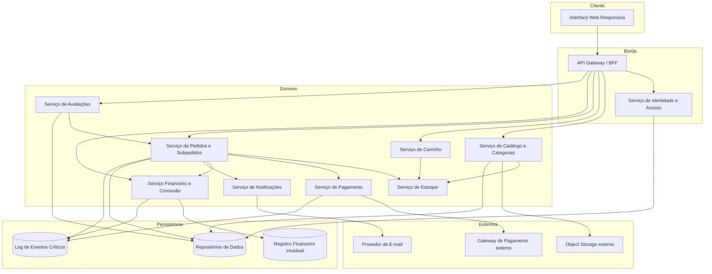
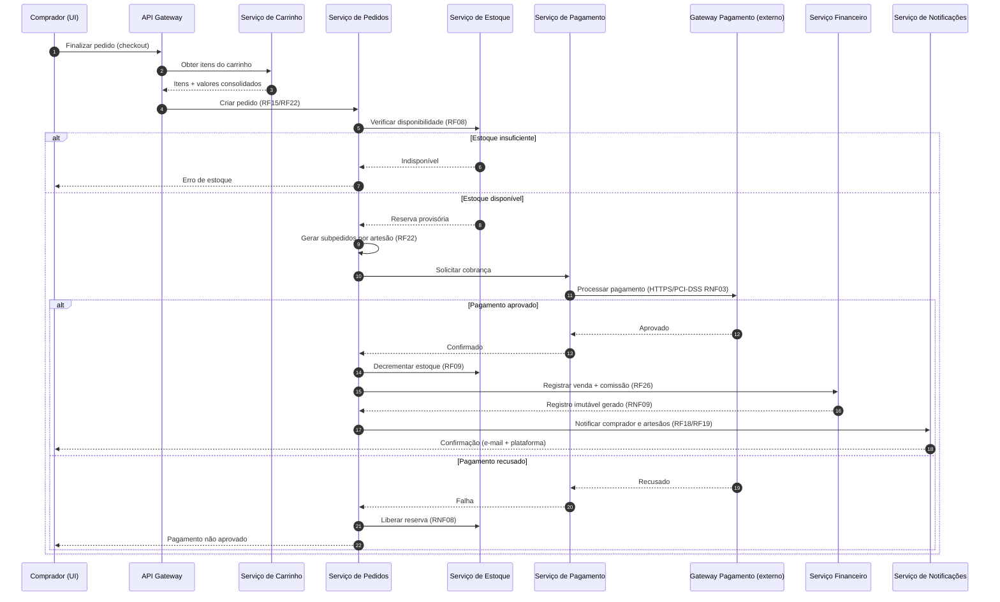
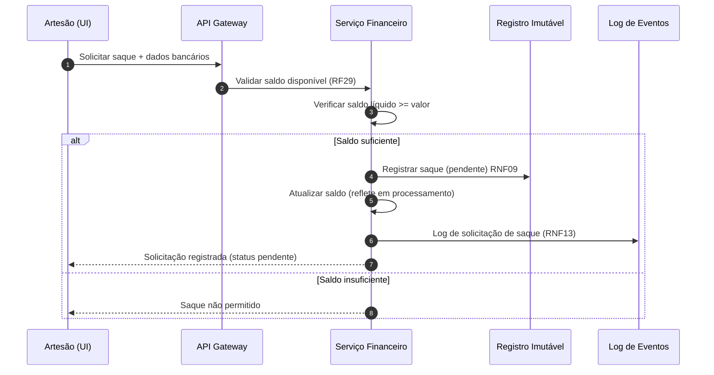
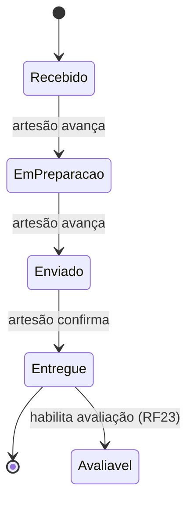

# Relatório Técnico de Arquitetura de Software
## Marketplace de Produtos Artesanais (M03)

---

## 1. Identificação das HUs

| HU | Título | Perfil | RFs Relacionados | RNFs Relacionados |
|----|--------|--------|------------------|-------------------|
| HU01 | Cadastrar produto com fotos | Artesão | RF04, RF06 | RNF04, RNF07 |
| HU02 | Gerenciar estoque dos produtos | Artesão | RF07, RF08, RF09 | RNF08 |
| HU03 | Acompanhar e atualizar status dos pedidos | Artesão | RF19, RF20, RF21 | RNF13 |
| HU04 | Visualizar painel financeiro | Artesão | RF26, RF28, RF29 | RNF06, RNF09 |
| HU05 | Solicitar saque do saldo disponível | Artesão | RF30 | RNF09, RNF13 |
| HU06 | Responder avaliações | Artesão | RF25 | — |
| HU07 | Navegar e pesquisar produtos | Comprador | RF10, RF11, RF24 | RNF05, RNF07 |
| HU08 | Adicionar ao carrinho e finalizar compra | Comprador | RF13-RF18, RF22 | RNF03, RNF08 |
| HU09 | Acompanhar status dos pedidos | Comprador | RF21, RF22 | RNF07 |
| HU10 | Avaliar produto após entrega | Comprador | RF23 | — |
| HU11 | Gerenciar categorias | Administrador | RF12 | RNF01 |
| HU12 | Configurar percentual de comissão | Administrador | RF26, RF27 | RNF09, RNF13 |

**Escopo transversal:** RF01–RF03 (Identidade), RNF01, RNF02, RNF10, RNF11, RNF12.

---

## 2. Diagramas de Arquitetura (Mermaid)

### 2.1 Diagrama de Componentes (Visão Macro)

### 2.2 Diagrama de Sequência — Finalização de Compra (HU08 / RF16–RF22, RNF08)

### 2.3 Diagrama de Sequência — Solicitação de Saque (HU05 / RF30)

### 2.4 Diagrama de Estados — Ciclo de Vida do Subpedido (RF20)

---

## 3. Decisões de Arquitetura

| # | Decisão | Justificativa | Requisitos |
|---|---------|---------------|-----------|
| AD01 | Separação de serviços de domínio (Catálogo, Pedidos, Financeiro, Avaliações) | Isola responsabilidades e permite escalar catálogo/busca independentemente | RNF05, RNF12 |
| AD02 | Object storage externo para fotos | Desacopla mídia do servidor de aplicação | RNF04 |
| AD03 | Não persistir dados de cartão; delegar ao gateway externo | Conformidade PCI-DSS | RNF03 |
| AD04 | Processamento de checkout transacional com reserva/rollback de estoque | Garante consistência entre pagamento e estoque | RF08, RF09, RNF08 |
| AD05 | Registro financeiro imutável (ledger append-only) | Rastreabilidade de vendas, comissões e saques | RNF09 |
| AD06 | Pedido raiz composto por subpedidos por artesão | Suporte a múltiplos vendedores por compra | RF22 |
| AD07 | Comissão versionada por data de venda (snapshot) | Alterações afetam somente vendas futuras | RF27, HU12 |
| AD08 | Serviço de Notificações assíncrono (e-mail + plataforma) | Desacopla envio de fluxo transacional | RF18, RF19, RF21 |
| AD09 | Autenticação central com perfis múltiplos por usuário | Um usuário pode ser comprador e artesão | RF03, RNF01 |
| AD10 | Hash seguro de senhas (ex. bcrypt) e log de eventos críticos | Segurança e manutenibilidade | RNF02, RNF13 |
| AD11 | Camada BFF/Gateway para UI responsiva única | Compatibilidade multi-navegador e mobile | RNF07, RNF10 |

---

## 4. Tabela de Componentes e Rastreabilidade

| Componente | Responsabilidade Principal | Comunica-se com | Origem (HU / Critério de Aceite) |
|-----------|----------------------------|-----------------|----------------------------------|
| Interface Web Responsiva | Renderizar UI adaptável, busca em tempo real | API Gateway | HU07 (busca em tempo real), RNF07, RNF10 |
| API Gateway / BFF | Roteamento, agregação, controle de acesso por perfil | Todos os serviços de domínio | RNF01, HU08 |
| Serviço de Identidade e Acesso | Cadastro, login/logout, perfis múltiplos, hash de senha | Gateway, Repositórios | HU (RF01–RF03), RNF01, RNF02 |
| Serviço de Catálogo e Categorias | CRUD de produtos e categorias, publicação | Estoque, Object Storage, Avaliações | HU01, HU11 (RF04–RF06, RF10–RF12) |
| Serviço de Estoque | Controle de quantidade, reserva, decremento, bloqueio de estoque zero | Catálogo, Carrinho, Pedidos | HU02 (RF07–RF09) |
| Serviço de Carrinho | Gerenciar itens, quantidades e totais | Estoque, Pedidos | HU08 (RF13–RF15) |
| Serviço de Pedidos e Subpedidos | Criar pedido, gerar subpedidos, status, orquestração de checkout | Estoque, Pagamento, Financeiro, Notificações | HU08, HU09, HU03 (RF16–RF22) |
| Serviço de Pagamento | Integração com gateway externo, transação | Gateway Pagamento externo, Pedidos | HU08 (RF16, RF17), RNF03, RNF08 |
| Serviço Financeiro e Comissão | Calcular/reter comissão, saldo, painel, saques, ledger | Pedidos, Registro Imutável | HU04, HU05, HU12 (RF26–RF30) |
| Serviço de Avaliações | Registrar notas/comentários, média, resposta do artesão | Pedidos, Catálogo | HU06, HU10 (RF23–RF25) |
| Serviço de Notificações | Enviar e-mails e notificações in-app | Provedor de E-mail, Pedidos | HU03, HU08 (RF18, RF19, RF21) |
| Object Storage externo | Armazenar fotos de produtos | Catálogo | HU01, RNF04 |
| Gateway de Pagamento externo | Processar cobranças (cartão/PIX) | Serviço de Pagamento | RF17, RNF03 |
| Registro Financeiro Imutável (Ledger) | Persistir vendas, comissões e saques de forma imutável | Financeiro | RNF09 |
| Log de Eventos Críticos | Registrar eventos sensíveis | Pedidos, Pagamento, Financeiro | RNF13, HU12 |

---

## 5. Bloqueios e Pendências

| ID | Descrição | Impacto | Severidade |
|----|-----------|---------|-----------|
| BL01 | Requisitos não definem quem executa a transferência bancária do saque nem seu status "processado" (processo manual ou integrado?) | Fluxo de saque incompleto | Alta |
| BL02 | Não há definição de tratamento de estorno/cancelamento de pedido pós-pagamento | Impacta ledger, estoque e comissão | Alta |
| BL03 | Regra de repasse de comissão quando pedido tem múltiplos artesãos não detalha comissão por subpedido | Ambiguidade financeira | Média |
| BL04 | RNF12 (99,5%) exige estratégia de redundância não especificada (infra fora do escopo abstrato) | Definição de infra pendente | Média |
| BL05 | "Resultados em tempo real" (HU07/HU09) não define mecanismo (polling vs. push) | Decisão técnica pendente | Baixa |
| BL06 | Política de moderação de comentários de avaliação não especificada | Risco de conteúdo abusivo | Baixa |

---

## 6. Cobertura de Requisitos

**Requisitos Funcionais:** 30/30 cobertos.

| Faixa | Componente Responsável |
|-------|------------------------|
| RF01–RF03 | Serviço de Identidade e Acesso |
| RF04–RF12 | Catálogo/Categorias + Estoque |
| RF13–RF15 | Serviço de Carrinho |
| RF16–RF22 | Pedidos + Pagamento + Notificações |
| RF23–RF25 | Serviço de Avaliações |
| RF26–RF30 | Serviço Financeiro e Comissão |

**Requisitos Não Funcionais:** 13/13 endereçados.

| RNF | Endereçamento |
|-----|---------------|
| RNF01 | Controle de acesso por perfil (Gateway/Identidade) |
| RNF02 | Hash seguro de senhas (Identidade) |
| RNF03 | Pagamento via gateway externo, sem persistir cartão |
| RNF04 | Object Storage externo |
| RNF05 | Catálogo otimizado / indexação de busca |
| RNF06 | Painel financeiro com dados pré-agregados |
| RNF07 | UI responsiva |
| RNF08 | Checkout transacional com rollback |
| RNF09 | Ledger imutável |
| RNF10 | Compatibilidade multi-navegador (BFF) |
| RNF11 | LGPD — tratamento de dados pessoais (transversal) |
| RNF12 | Disponibilidade via redundância (ver BL04) |
| RNF13 | Log de eventos críticos |

⚠️ RNF11 (LGPD) requer detalhamento de retenção/consentimento — parcialmente coberto.

---

## 7. Gap Analysis

| Gap | Descrição | Impacto Arquitetural | Ação Recomendada |
|-----|-----------|----------------------|------------------|
| G01 — Ciclo de saque | Não há definição de processamento efetivo da transferência (manual/PSP) | Serviço Financeiro incompleto; risco de inconsistência de saldo | Definir integração ou fluxo administrativo de aprovação de saque com estados claros |
| G02 — Cancelamento/estorno | Ausência de fluxo reverso de pedido | Ledger e estoque podem divergir | Especificar processo de estorno com compensação no ledger e reposição de estoque |
| G03 — Comissão por subpedido | Comissão descrita "por venda", mas pedidos têm múltiplos artesãos | Cálculo financeiro ambíguo | Definir comissão aplicada no nível do subpedido de cada artesão |
| G04 — LGPD operacional | Requisito genérico sem detalhes de consentimento/exclusão | Necessidade de gestão de dados pessoais | Definir políticas de retenção, anonimização e direito ao esquecimento |
| G05 — Reclassificação de categoria | HU11 exige notificação ao artesão, mas comportamento dos produtos "órfãos" indefinido | Produtos podem ficar sem categoria válida | Definir estado "sem categoria" e prazo de reclassificação |
| G06 — Atualização em tempo real | Mecanismo de status/busca em tempo real não especificado | Escolha entre polling/websocket afeta escalabilidade | Definir estratégia de atualização e limites de latência |
| G07 — Disponibilidade 99,5% | Sem estratégia de resiliência definida | Meta de SLA sem garantia arquitetural | Definir redundância, health checks e plano de recuperação |
| G08 — Moderação de conteúdo | Sem regras para comentários abusivos | Risco reputacional/legal | Definir política de moderação e denúncia |

---

*Relatório gerado pelo Sistema Multi-Agente AI4ES — Time 2, seguindo o Template Canônico de 7 Seções e a Regra de Neutralidade Tecnológica.*