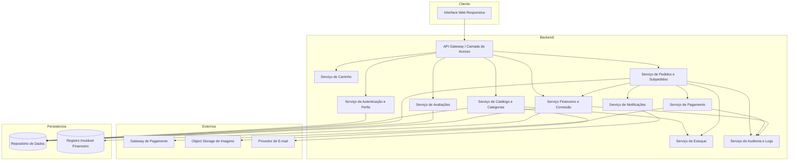
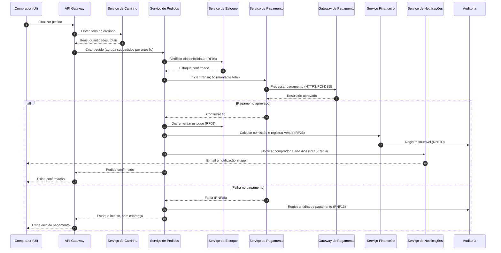
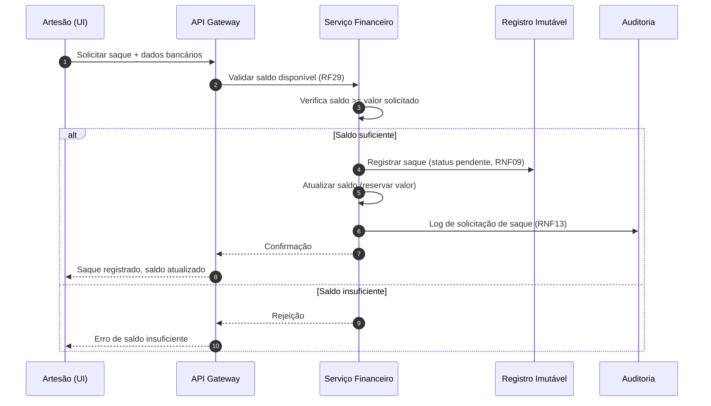

# Relatório Técnico de Arquitetura de Software
## Marketplace de Produtos Artesanais (M03)

---

## 1. Identificação das HUs

| HU | Título | Perfil | RFs Relacionados | RNFs Relacionados |
|----|--------|--------|------------------|-------------------|
| HU01 | Cadastrar produto com fotos | Artesão | RF04, RF06 | RNF04, RNF07 |
| HU02 | Gerenciar estoque dos produtos | Artesão | RF07, RF08, RF09 | RNF08 |
| HU03 | Acompanhar e atualizar status dos pedidos | Artesão | RF19, RF20, RF22 | RNF12, RNF13 |
| HU04 | Visualizar painel financeiro | Artesão | RF26, RF28, RF29 | RNF06, RNF09 |
| HU05 | Solicitar saque do saldo disponível | Artesão | RF29, RF30 | RNF09, RNF11, RNF13 |
| HU06 | Responder avaliações de compradores | Artesão | RF25 | RNF07 |
| HU07 | Navegar e pesquisar produtos | Comprador | RF08, RF10, RF11, RF24 | RNF05, RNF07 |
| HU08 | Adicionar ao carrinho e finalizar compra | Comprador | RF13-RF18, RF22 | RNF03, RNF08 |
| HU09 | Acompanhar status dos pedidos | Comprador | RF21, RF22 | RNF07, RNF12 |
| HU10 | Avaliar produto após entrega | Comprador | RF23, RF24 | RNF07 |
| HU11 | Gerenciar categorias | Administrador | RF12 | RNF01 |
| HU12 | Configurar percentual de comissão | Administrador | RF26, RF27 | RNF09, RNF13 |

---

## 2. Diagramas de Arquitetura (Mermaid)

### 2.1 Diagrama de Componentes (visão macro)

### 2.2 Diagrama de Sequência — Finalização de Pedido com Pagamento (HU08)

### 2.3 Diagrama de Sequência — Solicitação de Saque (HU05)

---

## 3. Decisões de Arquitetura

| ID | Decisão | Justificativa | Requisitos |
|----|---------|---------------|------------|
| DA01 | Separação em serviços por domínio (Catálogo, Pedidos, Financeiro, Avaliações) | Isola responsabilidades e permite escalonamento independente de áreas de alta carga | RNF05, RNF06, RNF12 |
| DA02 | Armazenamento de imagens em object storage externo | Desacopla arquivos binários do servidor de aplicação | RNF04 |
| DA03 | Transação de pagamento com garantia atômica (saga/compensação lógica) | Garantir que falha não gere cobrança nem decremento de estoque | RNF08 |
| DA04 | Registro financeiro imutável (append-only ledger) | Rastreabilidade e conformidade fiscal | RNF09, RNF11 |
| DA05 | Pedido composto por subpedidos por artesão | Permitir múltiplos vendedores em uma compra e status individual | RF22 |
| DA06 | Comissão calculada no momento da venda com percentual "congelado" | Alterações futuras não afetam registros já processados | RF27, HU12 |
| DA07 | Delegação de dados de cartão ao gateway (não armazenar) | Conformidade PCI-DSS | RNF03 |
| DA08 | Serviço de notificações assíncrono (e-mail + in-app) | Desacoplamento e resiliência do fluxo principal | RF18, RF19, HU03 |
| DA09 | Controle de acesso por perfil na camada de gateway | Restrição de áreas administrativas/vendedor | RNF01, RF01, RF03 |
| DA10 | Hash seguro de senhas (bcrypt indicado no requisito) | Segurança de credenciais | RNF02 |

---

## 4. Tabela de Componentes e Rastreabilidade

| Componente | Responsabilidade Principal | Comunica-se com | Origem (HU / Critério de Aceite) |
|------------|----------------------------|-----------------|----------------------------------|
| Interface Web Responsiva | Apresentação responsiva multi-dispositivo e multi-navegador | API Gateway | HU07-HU10 / RNF07, RNF10 |
| API Gateway / Camada de Acesso | Roteamento, autenticação e autorização por perfil | Todos os serviços | RNF01 / RF01, RF03 |
| Serviço de Autenticação e Perfis | Cadastro, login/logout, gestão de perfis múltiplos, hash de senha | Gateway, Repositório | HU01-HU12 / RF01, RF02, RF03, RNF02 |
| Serviço de Catálogo e Categorias | CRUD de produtos, publicação, categorias, busca | Estoque, Object Storage, Repositório | HU01, HU07, HU11 / RF04-RF06, RF10-RF12 |
| Serviço de Estoque | Controle de quantidade, bloqueio estoque zero, decremento | Catálogo, Pedidos | HU02 / RF07, RF08, RF09 |
| Serviço de Carrinho | Gestão de itens, quantidades e totais | Gateway, Pedidos | HU08 / RF13, RF14, RF15 |
| Serviço de Pedidos e Subpedidos | Criação de pedido, agrupamento por artesão, status | Estoque, Pagamento, Financeiro, Notificações | HU03, HU08, HU09 / RF16, RF20, RF21, RF22 |
| Serviço de Pagamento | Orquestração transacional com gateway externo | Gateway de Pagamento, Pedidos, Auditoria | HU08 / RF16, RF17, RNF03, RNF08 |
| Serviço Financeiro e Comissão | Cálculo/retenção de comissão, saldo, saques, painel | Registro Imutável, Repositório, Auditoria | HU04, HU05, HU12 / RF26-RF30 |
| Serviço de Avaliações | Registro de notas/comentários, média, respostas | Pedidos, Repositório | HU06, HU10 / RF23, RF24, RF25 |
| Serviço de Notificações | Envio de e-mail e notificações in-app | Provedor de E-mail, UI | HU03, HU08 / RF18, RF19 |
| Serviço de Auditoria e Logs | Registro de eventos críticos e logs | Pedidos, Pagamento, Financeiro | RNF13 / HU12 |
| Object Storage de Imagens | Armazenamento externo de fotos de produtos | Catálogo | HU01 / RNF04 |
| Registro Imutável Financeiro | Append-only de vendas, comissões e saques | Financeiro | RNF09 / HU04, HU05 |
| Repositório de Dados | Persistência de entidades de domínio | Serviços de negócio | Todos |

---

## 5. Bloqueios e Pendências

| ID | Descrição | Impacto | Status |
|----|-----------|---------|--------|
| BL01 | Fluxo de repasse efetivo ao artesão (processamento externo do saque) não especificado — apenas "pendente/processado" | Alto | Requer definição de negócio |
| BL02 | Política de reembolso/cancelamento de pedidos e reversão de comissão ausente | Alto | Pendente |
| BL03 | Momento exato de disponibilização do saldo (imediato pós-venda ou pós-entrega) não definido | Médio | Pendente |
| BL04 | Regra de "estoque reservado" durante checkout concorrente não especificada | Médio | Requer decisão técnica |
| BL05 | Provedor específico de pagamento e método (PIX vs cartão) deixado em aberto (RF17) | Médio | Aguardando definição |
| BL06 | Atualização de status "em tempo real" (HU09) — mecanismo de push não especificado | Baixo | Pendente |

---

## 6. Cobertura de Requisitos

**Requisitos Funcionais:** 30/30 endereçados.

| Faixa | Componente Responsável Principal |
|-------|----------------------------------|
| RF01-RF03 | Serviço de Autenticação e Perfis |
| RF04-RF12 | Serviço de Catálogo / Estoque |
| RF13-RF22 | Carrinho, Pedidos, Pagamento, Notificações |
| RF23-RF25 | Serviço de Avaliações |
| RF26-RF30 | Serviço Financeiro e Comissão |

**Requisitos Não Funcionais:** 13/13 endereçados (ver DA01-DA10 e Tabela de Componentes).

| RNF | Tratamento |
|-----|-----------|
| RNF01, RNF02 | Gateway + Autenticação (DA09, DA10) |
| RNF03, RNF08 | Serviço de Pagamento (DA03, DA07) |
| RNF04 | Object Storage (DA02) |
| RNF05, RNF06 | Separação de serviços + indexação de busca (DA01) |
| RNF07, RNF10 | Interface Responsiva |
| RNF09 | Registro Imutável (DA04) |
| RNF11 | Conformidade LGPD transversal |
| RNF12 | Arquitetura de serviços independentes |
| RNF13 | Serviço de Auditoria e Logs |

---

## 7. Gap Analysis

| Gap | Descrição | Impacto Arquitetural | Ação Recomendada |
|-----|-----------|----------------------|------------------|
| G01 — Reembolso e estorno | Requisitos cobrem venda mas não cancelamento/reembolso, que afeta comissão, saldo e estoque | Alta — exige lógica compensatória no ledger e reversão de estoque | Definir política e criar caso de uso de estorno com reversão financeira |
| G02 — Liquidação de saque | Falta definição de como o valor sai da plataforma para o banco do artesão | Alta — pode exigir integração com API bancária/gateway de payout | Especificar integração de payout e ciclo de liquidação |
| G03 — Concorrência de estoque | Compras simultâneas do mesmo item podem gerar overselling | Média — requer reserva/locking transacional no checkout | Adotar reserva temporária de estoque durante o checkout (DA03) |
| G04 — Janela de disponibilidade de saldo | Indefinido se saldo fica disponível imediatamente ou após entrega/prazo | Média — impacta cálculo de saldo líquido e risco financeiro | Definir período de retenção (escrow) antes de liberar saque |
| G05 — Notificação em tempo real | HU09 exige status "em tempo real" sem definir mecanismo (polling/push) | Média — impacta escolha de canal de comunicação | Definir estratégia de atualização assíncrona |
| G06 — Moderação de conteúdo | Avaliações e comentários públicos sem regra de moderação/abuso | Baixa — pode exigir fluxo administrativo | Avaliar necessidade de moderação de avaliações |
| G07 — Retenção e exclusão LGPD | RNF11 exige conformidade mas não há RF de exclusão/portabilidade de dados | Média — exige endpoints de gestão de dados pessoais | Especificar fluxos de consentimento, exclusão e exportação de dados |
| G08 — Reclassificação de produtos | HU11 notifica artesão ao remover categoria, mas não define estado do produto órfão | Baixa — impacta integridade do catálogo | Definir categoria padrão ou bloqueio de produtos órfãos |

---

*Fim do Relatório Canônico de Arquitetura — AI4ES Time 2.*