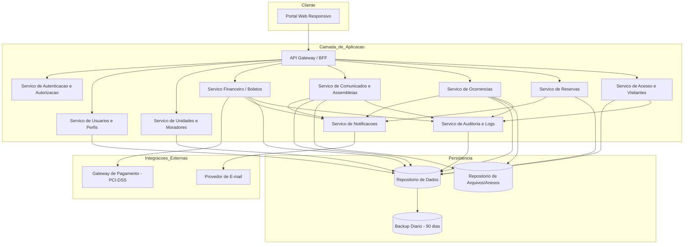
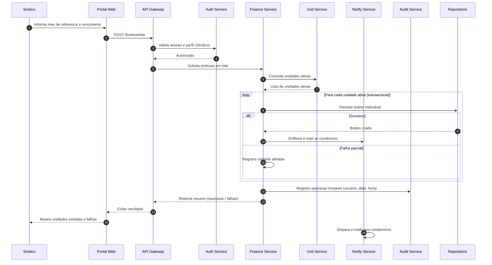
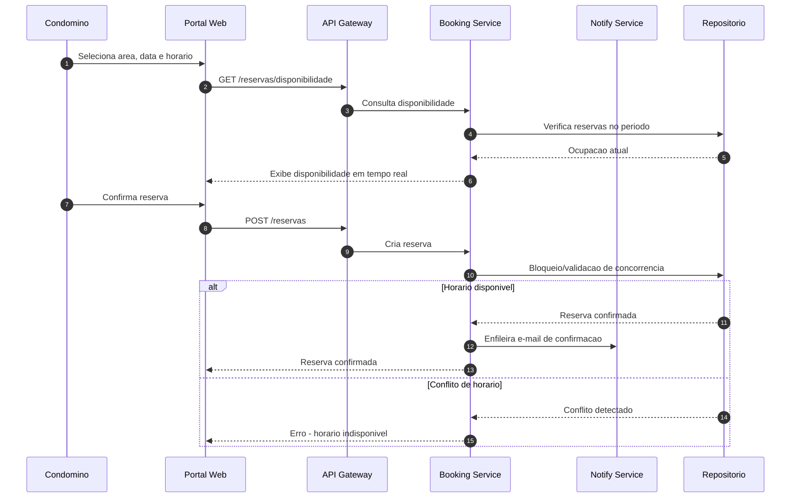
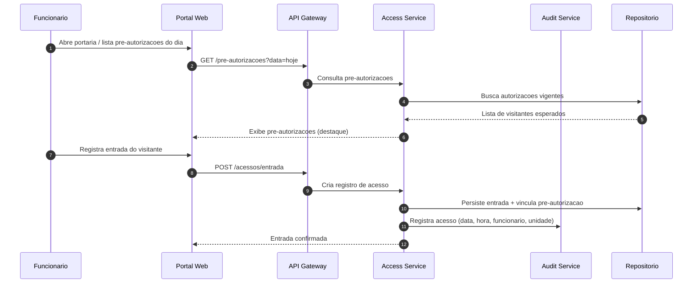

# Relatório Técnico de Arquitetura de Software
## Sistema de Administração de Condomínio Residencial (M04)

---

## 1. Identificação das HUs

| HU | Título | Perfil | RFs Relacionados | RNFs Relevantes |
|----|--------|--------|------------------|-----------------|
| HU01 | Cadastrar unidades e moradores | Síndico | RF04, RF05, RF06, RF07 | RNF04 |
| HU02 | Emitir boletos em lote | Síndico | RF09, RF10, RF13, RF17 | RNF05, RNF11 |
| HU03 | Acompanhar inadimplências | Síndico | RF15 | RNF08 |
| HU04 | Publicar comunicados | Síndico | RF16, RF17 | RNF13 |
| HU05 | Gerenciar ocorrências | Síndico | RF23, RF24 | RNF13 |
| HU06 | Criar e registrar assembleias | Síndico | RF18, RF19, RF20 | RNF13 |
| HU07 | Gerenciar áreas comuns e reservas | Síndico | RF25, RF27, RF28, RF29 | RNF08 |
| HU08 | Visualizar e pagar boleto pelo portal | Condômino | RF10, RF11, RF12 | RNF03, RNF05 |
| HU09 | Reservar área comum | Condômino | RF26, RF27, RF28 | RNF08 |
| HU10 | Registrar e acompanhar ocorrência | Condômino | RF21, RF24 | RNF13 |
| HU11 | Pré-autorizar entrada de visitante | Condômino | RF31 | RNF04 |
| HU12 | Acompanhar assembleias e consultar atas | Condômino | RF20 | RNF07 |
| HU13 | Registrar entrada e saída de visitantes | Funcionário | RF22, RF30, RF32 | RNF06 |
| HU14 | Consultar pré-autorizações de acesso | Funcionário | RF32, RF33 | RNF06 |

**Perfis identificados:** Síndico, Condômino, Funcionário e Administrador (RF01–RF03).

---

## 2. Diagramas de Arquitetura (Mermaid)

### 2.1 Diagrama de Componentes (Visão Macro)

### 2.2 Diagrama de Sequência — Emissão de Boletos em Lote (HU02)

### 2.3 Diagrama de Sequência — Reserva de Área Comum sem Sobreposição (HU09/RF27)

### 2.4 Diagrama de Sequência — Registro de Visitante Pré-autorizado (HU13/HU11)

---

## 3. Decisões de Arquitetura

| ID | Decisão | Justificativa | Requisitos Atendidos |
|----|---------|---------------|----------------------|
| DA01 | Arquitetura modular orientada a serviços de domínio, mediada por API Gateway/BFF | Isola contextos (financeiro, reservas, acesso) e escala módulos críticos independentemente | RNF07, RNF08 |
| DA02 | Serviço de Autenticação/Autorização centralizado com RBAC | Restrição de acesso por perfil e expiração de sessão em 30 min | RF01, RF02, RF03, RNF01, RNF02 |
| DA03 | Serviço de Notificações assíncrono desacoplado por fila | Envio de e-mails (comunicados, ocorrências, reservas, boletos) sem bloquear a operação principal | RF17, RF24, RNF07 |
| DA04 | Serviço de Auditoria com registro imutável append-only | Rastreabilidade financeira e de acessos exigida | RNF05, RNF06, RNF13 |
| DA05 | Integração de pagamento delegada a gateway externo, sem armazenar dados de cartão | Conformidade PCI-DSS | RF11, RF12, RNF03 |
| DA06 | Emissão em lote processada em transação com registro de falhas parciais | Garantir consistência sem corromper unidades bem-sucedidas | RF13, RNF11 |
| DA07 | Controle de concorrência/otimização de leitura para painel e calendário | Atender tempo de resposta ≤ 3s | RF15, RF29, RNF08 |
| DA08 | Desativação lógica (soft delete) para moradores | Preservar histórico sem exclusão física | RF07 |
| DA09 | Repositório de arquivos dedicado para anexos (atas PDF, fotos de ocorrências) | Separar blobs de dados transacionais | RF19, RF21, HU06, HU10 |
| DA10 | Rotina de backup diário com retenção de 90 dias e política de dados pessoais LGPD | Recuperação e conformidade | RNF04, RNF12 |
| DA11 | Restrição de concorrência a nível de agregado de reserva para evitar sobreposição | Impedir reservas duplas no mesmo horário | RF27 |

---

## 4. Tabela de Componentes e Rastreabilidade

| Componente | Responsabilidade Principal | Comunica-se com | Origem (HU / Critério de Aceite) |
|------------|---------------------------|-----------------|----------------------------------|
| Portal Web Responsivo | Interface única para todos os perfis, responsiva e multi-navegador | API Gateway | Todas HUs; RNF09, RNF10 |
| API Gateway / BFF | Roteamento, agregação e ponto único de entrada | Todos os serviços | Transversal |
| Auth Service | Autenticação, sessão (30 min), autorização RBAC, hash de senha | Gateway, User Service | HU (login); RF01–RF03, RNF01, RNF02 |
| User Service | Cadastro de usuários/perfis (síndico, condômino, funcionário, admin) | Auth, DB | RF01; HU01 |
| Unit Service | CRUD de unidades, moradores, veículos, vínculo proprietário/inquilino, desativação lógica | DB, Finance | RF04–RF08; HU01 (CPF único, múltiplos moradores) |
| Finance Service | Config. taxa, emissão individual e em lote, integração pagamento, status, inadimplência | PayGW, Notify, Audit, Unit, DB | RF09–RF15; HU02, HU03, HU08 |
| Comm Service | Comunicados, fixação no topo, assembleias, atas com anexos | Notify, FileStore, Audit, DB | RF16–RF20; HU04, HU06, HU12 |
| Issue Service | Registro/categorização/status de ocorrências, anexos, histórico | Notify, FileStore, Audit, DB | RF21–RF24; HU05, HU10 |
| Booking Service | Cadastro de áreas, regras, reservas, controle de sobreposição, cancelamento, calendário | Notify, DB | RF25–RF29; HU07, HU09 |
| Access Service | Registro entrada/saída visitantes, pré-autorizações, histórico por unidade | Audit, DB | RF30–RF33; HU11, HU13, HU14 |
| Notify Service | Envio assíncrono de e-mails de eventos | MailGW, Comm, Issue, Booking, Finance | RF17, RF24; HU02, HU04, HU05, HU06, HU09, HU10 |
| Audit Service | Registro imutável de operações financeiras, acessos e eventos críticos | Todos os serviços, DB | RNF05, RNF06, RNF13 |
| Payment Gateway (externo) | Processar e confirmar pagamentos sem armazenar cartão | Finance | RF11, RF12; RNF03; HU08 |
| E-mail Provider (externo) | Entrega de e-mails | Notify | RF17, RF24 |
| Repositório de Dados | Persistência transacional | Serviços de domínio, Backup | Transversal; RNF12 |
| Repositório de Arquivos | Armazenamento de anexos (PDF/fotos) | Comm, Issue | HU06, HU10 |
| Rotina de Backup | Backup diário, retenção 90 dias | Repositório de Dados | RNF12 |

---

## 5. Bloqueios e Pendências

| ID | Descrição | Impacto | Ação Necessária |
|----|-----------|---------|-----------------|
| BL01 | Gateway de pagamento específico não definido (RF11) | Bloqueia detalhamento da integração de confirmação/webhook | Definir provedor e modelo de callback |
| BL02 | Regras de reajuste/multa/juros sobre boletos inadimplentes não especificadas | Cálculo financeiro incompleto | Cliente deve definir política de mora |
| BL03 | Não há especificação de perfil "Administrador" além de existir (RF01) | Escopo de permissões do admin indefinido | Detalhar funcionalidades exclusivas do admin |
| BL04 | Fluxo de votação/quórum em assembleias não requisitado | Assembleias limitadas a agenda + ata | Confirmar se votação é escopo futuro |
| BL05 | Método de pagamento suportado (cartão/PIX/boleto bancário) não claro | Afeta modelagem da integração | Esclarecer meios de pagamento |
| BL06 | Política de retenção LGPD para visitantes e ex-moradores não detalhada | Risco de conformidade | Definir prazos de anonimização/expurgo |

---

## 6. Cobertura de Requisitos

**Requisitos Funcionais:** 33/33 mapeados.

| Grupo | RFs | Componente(s) |
|-------|-----|---------------|
| Usuários/Acesso | RF01–RF03 | Auth Service, User Service |
| Unidades/Moradores | RF04–RF08 | Unit Service |
| Financeiro | RF09–RF15 | Finance Service, Payment GW |
| Comunicados/Assembleias | RF16–RF20 | Comm Service, Notify Service |
| Ocorrências | RF21–RF24 | Issue Service, Notify Service |
| Reservas | RF25–RF29 | Booking Service |
| Acesso/Visitantes | RF30–RF33 | Access Service |

**Requisitos Não Funcionais:** 13/13 endereçados.

| RNF | Tratamento Arquitetural |
|-----|-------------------------|
| RNF01 | Auth Service com expiração de sessão |
| RNF02 | Hash seguro no Auth Service |
| RNF03 | Delegação PCI-DSS ao gateway externo |
| RNF04 | Políticas LGPD, soft delete, controle de dados pessoais |
| RNF05 | Audit Service imutável em operações financeiras |
| RNF06 | Audit Service em acessos de visitantes |
| RNF07 | Arquitetura modular, notificações assíncronas |
| RNF08 | Otimização de leitura para painel e calendário |
| RNF09 | Portal responsivo |
| RNF10 | Compatibilidade multi-navegador |
| RNF11 | Emissão em lote transacional com registro de falhas |
| RNF12 | Rotina de backup diário / 90 dias |
| RNF13 | Audit Service para eventos críticos |

**Cobertura de HUs:** 14/14 (HU01–HU14) mapeadas a componentes.

---

## 7. Gap Analysis

| # | Lacuna Identificada | Impacto Arquitetural | Ação Recomendada |
|---|---------------------|----------------------|------------------|
| G01 | **Modelo de confirmação de pagamento** (webhook vs. polling) não definido em RF11/RF12 | Afeta idempotência e consistência do status do boleto | Definir contrato de callback assíncrono idempotente com o gateway |
| G02 | **Cálculo de inadimplência** (multa/juros) ausente | Painel RF15/HU03 exibe "valor" e "dias em atraso" mas sem regra de acréscimo | Especificar fórmula financeira e configurabilidade |
| G03 | **Notificações apenas por e-mail** — sem canais alternativos (push/SMS) | RNF07 exige acesso 24/7; e-mail pode ter latência | Avaliar canal complementar e política de reentrega/falha |
| G04 | **Concorrência em reservas (RF27)** sem estratégia de bloqueio definida | Risco de sobreposição sob alta concorrência | Adotar controle transacional/lock otimista no agregado reserva |
| G05 | **Perfil Administrador** sem funcionalidades detalhadas | Matriz RBAC incompleta | Definir permissões e telas exclusivas do administrador |
| G06 | **Gestão de anexos** (tamanho, tipos, antivírus) não especificada em HU06/HU10 | Risco de segurança e storage | Definir limites, validação de tipo e varredura de arquivos |
| G07 | **Retenção e anonimização LGPD** de visitantes e histórico não detalhada | Conformidade RNF04 incompleta | Definir política de expurgo/anonimização por tipo de dado |
| G08 | **Reversão de pagamento manual** (RF14) sem tratamento de correção/estorno | Auditoria financeira pode ficar inconsistente | Definir fluxo de estorno auditável |
| G09 | **Escalabilidade do painel/calendário** apenas com meta de 3s (RNF08) sem volume esperado | Dimensionamento indefinido | Levantar volumetria (nº unidades/reservas) para projeção de carga |
| G10 | **Falha parcial no lote (RNF11)** — sem mecanismo de reprocessamento das unidades afetadas | Operação manual pós-falha | Prever reemissão seletiva das unidades que falharam |

---

*Fim do Relatório Canônico — AI4ES Time 2.*