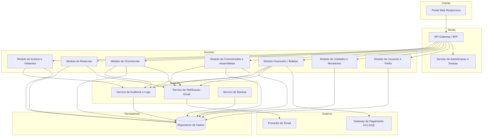
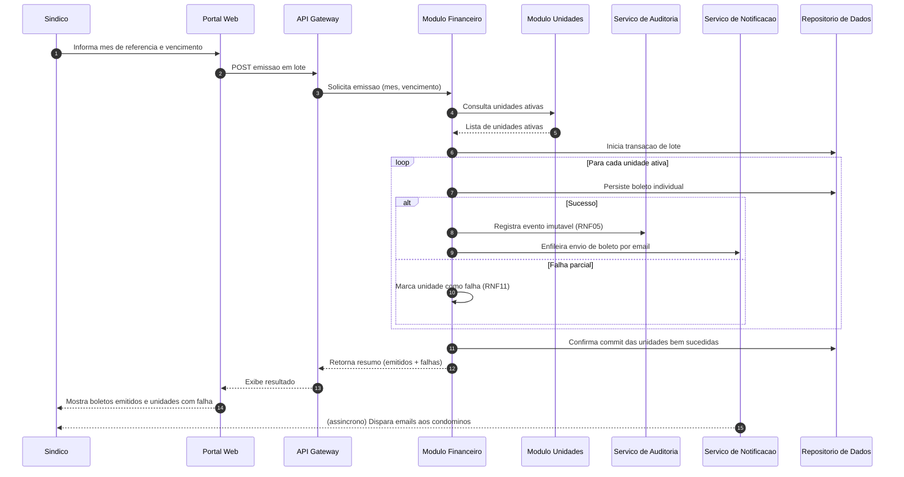
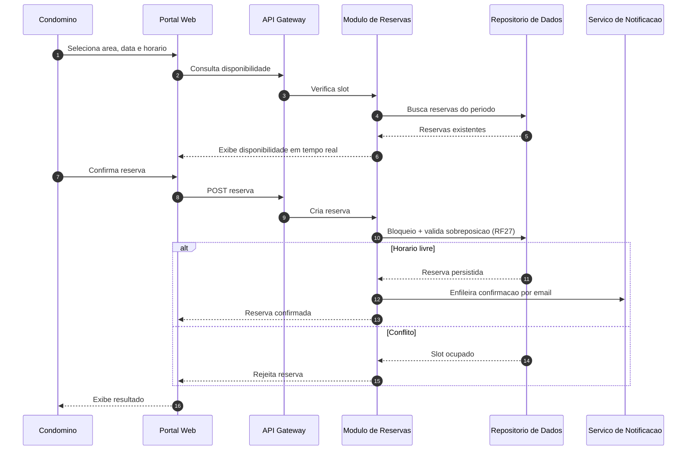
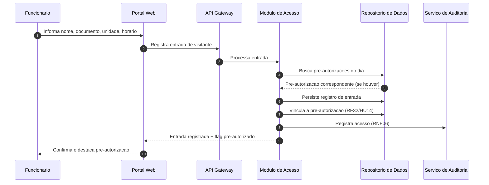

# Relatório Técnico de Arquitetura de Software
## Sistema de Administração de Condomínio Residencial (M04)

---

## 1. Identificação das HUs

| HU | Título | Perfil | RFs Relacionados | RNFs Relacionados |
|----|--------|--------|------------------|-------------------|
| HU01 | Cadastrar unidades e moradores | Síndico | RF04, RF05, RF06, RF07, RF08 | RNF04 |
| HU02 | Emitir boletos em lote | Síndico | RF09, RF10, RF13, RF17 | RNF05, RNF11, RNF13 |
| HU03 | Acompanhar inadimplências | Síndico | RF15 | RNF08 |
| HU04 | Publicar comunicados | Síndico | RF16, RF17 | RNF13 |
| HU05 | Gerenciar ocorrências | Síndico | RF22, RF23, RF24 | RNF13 |
| HU06 | Criar e registrar assembleias | Síndico | RF18, RF19, RF20, RF17 | RNF13 |
| HU07 | Gerenciar áreas comuns e reservas | Síndico | RF25, RF27, RF29 | RNF08 |
| HU08 | Visualizar e pagar boleto pelo portal | Condômino | RF10, RF11, RF12 | RNF03, RNF05 |
| HU09 | Reservar área comum | Condômino | RF26, RF27, RF28 | RNF08 |
| HU10 | Registrar e acompanhar ocorrência | Condômino | RF21, RF23, RF24 | RNF13 |
| HU11 | Pré-autorizar entrada de visitante | Condômino | RF31, RF32 | RNF04 |
| HU12 | Acompanhar assembleias e consultar atas | Condômino | RF20 | RNF07 |
| HU13 | Registrar entrada e saída de visitantes | Funcionário | RF30, RF32, RF33 | RNF06, RNF13 |
| HU14 | Consultar pré-autorizações de acesso | Funcionário | RF32, RF30 | RNF06 |

**HUs de suporte transversal** (derivadas de RF01–RF03): autenticação, autorização por perfil e gerenciamento de sessão são pré-condições para todas as HUs.

---

## 2. Diagramas de Arquitetura (Mermaid)

### 2.1 Diagrama de Componentes (Visão Macro)

### 2.2 Diagrama de Sequência — HU02: Emissão de Boletos em Lote (RNF11 transacional)

### 2.3 Diagrama de Sequência — HU09: Reserva de Área Comum (RF27 anti-sobreposição)

### 2.4 Diagrama de Sequência — HU13: Registro de Visitante com Pré-autorização

---

## 3. Decisões de Arquitetura

| ID | Decisão | Justificativa | Requisitos Atendidos |
|----|---------|---------------|----------------------|
| AD01 | Arquitetura modular orientada a domínios com camada de borda (API Gateway/BFF) | Isola responsabilidades por contexto (financeiro, reservas, acesso) e centraliza autenticação/autorização | RF02, RNF07 |
| AD02 | Serviço central de Autenticação e Sessão com expiração automática | Autenticação obrigatória e encerramento de sessões inativas em 30 min | RF01, RF03, RNF01 |
| AD03 | Autorização baseada em perfis (RBAC) aplicada na borda | Restrição de funcionalidades por perfil | RF02 |
| AD04 | Serviço de Notificação assíncrono desacoplado | Notificações por e-mail não bloqueiam operações de negócio; melhora resiliência | RF17, RF24, RNF07 |
| AD05 | Serviço de Auditoria com registros imutáveis (append-only) | Rastreabilidade financeira e de acessos garantida independente do módulo | RNF05, RNF06, RNF13 |
| AD06 | Emissão em lote com controle transacional por item + relatório de falhas | Falha parcial não corrompe demais unidades | RNF11 |
| AD07 | Integração com gateway externo sem armazenamento de dados de cartão | Conformidade PCI-DSS; sistema recebe apenas tokens/confirmações | RF11, RF12, RNF03 |
| AD08 | Desativação lógica (soft-delete) de moradores | Preservação de histórico sem exclusão física | RF07 |
| AD09 | Validação de sobreposição no momento da persistência (bloqueio) | Garante ausência de reservas concorrentes conflitantes | RF27 |
| AD10 | Camada de tratamento de dados pessoais com controle de acesso e minimização | Conformidade LGPD para moradores, funcionários e visitantes | RNF04 |
| AD11 | Portal único responsivo multi-perfil | Acesso 24/7 em desktop/mobile e navegadores modernos | RNF07, RNF09, RNF10 |
| AD12 | Rotina de backup automático diário com retenção configurável | Continuidade e recuperação de dados | RNF12 |

---

## 4. Tabela de Componentes e Rastreabilidade

| Componente | Responsabilidade Principal | Comunica-se com | Origem (HU / Critério de Aceite) |
|-----------|----------------------------|-----------------|----------------------------------|
| Portal Web Responsivo | Interface multi-perfil para síndico, condômino e funcionário | API Gateway | HU01–HU14 / RNF09, RNF10 |
| API Gateway / BFF | Roteamento, agregação e ponto único de entrada | Todos os módulos de domínio, Auth | RF02 / todas as HUs |
| Serviço de Autenticação e Sessão | Autenticar, encerrar sessão, expirar sessão inativa, hash de senha | Gateway, Módulo de Usuários | RF01, RF03 / RNF01, RNF02 |
| Módulo de Usuários e Perfis | Cadastro de usuários e controle de perfis/RBAC | Auth, Repositório | RF01, RF02 / HU (transversal) |
| Módulo de Unidades e Moradores | CRUD de unidades, moradores, vínculos, veículos, soft-delete | Repositório, Financeiro | HU01 / RF04–RF08 |
| Módulo Financeiro / Boletos | Configuração de taxas, emissão individual e em lote, status, inadimplência, pagamentos manuais | Gateway Pagamento, Notificação, Auditoria, Repositório | HU02, HU03, HU08 / RF09–RF15 |
| Módulo de Comunicados e Assembleias | Publicar comunicados, fixar, criar assembleias, registrar atas, anexos | Notificação, Repositório | HU04, HU06, HU12 / RF16–RF20 |
| Módulo de Ocorrências | Registro, categorização, atualização de status, histórico, anexos | Notificação, Auditoria, Repositório | HU05, HU10 / RF21–RF24 |
| Módulo de Reservas | Cadastro de áreas, regras, disponibilidade, anti-sobreposição, cancelamento, calendário | Notificação, Repositório | HU07, HU09 / RF25–RF29 |
| Módulo de Acesso e Visitantes | Registro entrada/saída, pré-autorizações, vínculo, histórico por unidade | Auditoria, Repositório | HU11, HU13, HU14 / RF30–RF33 |
| Serviço de Notificação (E-mail) | Envio assíncrono de e-mails de eventos | Módulos de domínio, Provedor de E-mail | HU02, HU04, HU05, HU06, HU09, HU10 / RF17, RF24 |
| Serviço de Auditoria e Logs | Registros imutáveis financeiros/acessos e logs críticos | Financeiro, Acesso, Comunicados, Ocorrências, Repositório | RNF05, RNF06, RNF13 |
| Serviço de Backup | Backup automático diário com retenção | Repositório | RNF12 |
| Gateway de Pagamento (externo) | Processar e confirmar pagamentos PCI-DSS | Módulo Financeiro | HU08 / RF11, RF12, RNF03 |
| Repositório de Dados | Persistência dos dados dos domínios | Todos os módulos | Todas as HUs |

---

## 5. Bloqueios e Pendências

| ID | Descrição | Impacto | Responsável sugerido |
|----|-----------|---------|----------------------|
| BL01 | Gateway de pagamento específico não definido (contrato, tokens, webhooks de confirmação) | Bloqueia detalhamento de RF11/RF12 | Product Owner / Financeiro |
| BL02 | Provedor de e-mail e política de reenvio/falha de notificação não especificados | Afeta RF17, RF24 e confiabilidade de notificações | Arquitetura |
| BL03 | Regras de cálculo de multa/juros de inadimplência não descritas nos requisitos | Painel de inadimplência pode exigir lógica ausente | Negócio |
| BL04 | Política de retenção LGPD (prazo de anonimização/expurgo) não definida | Impacta RNF04 e soft-delete (RF07) | Jurídico / DPO |
| BL05 | Meio de disponibilização/hospedagem de anexos (PDFs de atas, fotos de ocorrências) não especificado | Afeta HU06, HU10 | Arquitetura |
| BL06 | Requisito de escala (nº de condôminos/unidades simultâneos) ausente | Dificulta dimensionar RNF07/RNF08 | Product Owner |

---

## 6. Cobertura de Requisitos

**Requisitos Funcionais:** 33/33 mapeados.

| Faixa | Componente responsável |
|-------|------------------------|
| RF01–RF03 | Auth + Módulo de Usuários |
| RF04–RF08 | Módulo de Unidades e Moradores |
| RF09–RF15 | Módulo Financeiro |
| RF16–RF20 | Módulo de Comunicados e Assembleias |
| RF21–RF24 | Módulo de Ocorrências |
| RF25–RF29 | Módulo de Reservas |
| RF30–RF33 | Módulo de Acesso e Visitantes |

**Requisitos Não Funcionais:** 13/13 endereçados.

| RNF | Tratamento arquitetural |
|-----|-------------------------|
| RNF01 | AD02 — expiração de sessão |
| RNF02 | Auth — hash seguro de senha |
| RNF03 | AD07 — sem armazenamento de cartão |
| RNF04 | AD10 — camada LGPD (pendência BL04) |
| RNF05 | AD05 — auditoria imutável financeira |
| RNF06 | AD05 — auditoria de acessos |
| RNF07 | AD01/AD11 — disponibilidade 24/7 |
| RNF08 | Otimização de consultas painel/calendário |
| RNF09 | AD11 — portal responsivo |
| RNF10 | AD11 — compatibilidade navegadores |
| RNF11 | AD06 — emissão em lote transacional |
| RNF12 | AD12 — backup diário |
| RNF13 | AD05 — logs de eventos críticos |

**Cobertura de HUs:** HU01–HU14 (100%) rastreadas na Seção 4.

---

## 7. Gap Analysis

| Gap | Descrição da Lacuna | Impacto Arquitetural | Ação Recomendada |
|-----|---------------------|----------------------|------------------|
| G01 | **Ausência de gestão de sessão MFA/recuperação de senha** — requisitos cobrem login/logout e hash, mas não recuperação de senha nem reset | Fluxo de conta incompleto; risco de suporte manual | Especificar fluxo de "esqueci minha senha" com token temporário |
| G02 | **Notificações apenas por e-mail** — RNF07 prevê acesso 24/7, mas não há canal alternativo (push/SMS) nem tratamento de falha de entrega | Notificações críticas (boletos, ocorrências) podem falhar silenciosamente | Definir política de retry e log de entrega no Serviço de Notificação |
| G03 | **Confirmação de pagamento via webhook não especificada** — RF12 exige atualização automática, mas o mecanismo (webhook vs. polling) é omisso | Impacta confiabilidade de RF12 e idempotência | Definir endpoint de callback idempotente e reconciliação periódica |
| G04 | **Regras de negócio de inadimplência incompletas** — não há multa, juros nem régua de cobrança | Painel (RF15) pode entregar dados insuficientes ao síndico | Levantar regras financeiras com o negócio |
| G05 | **Concorrência em reservas** — RF27 exige impedir sobreposição, mas não há definição de tratamento de requisições simultâneas | Risco de duplo-booking sob concorrência | Adotar bloqueio/constraint de unicidade no nível de persistência |
| G06 | **Gestão de anexos** — atas em PDF (HU06) e fotos de ocorrência (HU10) sem definição de armazenamento, limites e validação de tipo | Segurança (upload) e desempenho não endereçados | Especificar validação, limites de tamanho e antivírus para uploads |
| G07 | **Ciclo de vida do visitante em aberto** — RF30/HU13 preveem saída pendente, mas não há tratamento de visitas sem saída registrada (fim de dia) | Histórico (RF33) pode ficar inconsistente | Definir política de fechamento automático/alerta de visitas em aberto |
| G08 | **Escalabilidade e observabilidade** — RNF07/RNF08 definem metas, mas faltam requisitos de monitoração e alertas de SLA | Dificulta garantir uptime 99,5% e tempos de resposta | Incluir métricas, health checks e alertas na fase de projeto detalhado |
| G09 | **Conflito de exclusão vs. LGPD** — RF07 mantém histórico (soft-delete) enquanto RNF04 exige direito de exclusão LGPD | Tensão entre retenção e "direito ao esquecimento" | Definir anonimização como estratégia para conciliar ambos |
| G10 | **Papel do administrador subutilizado** — RF01 cita perfil "administrador", mas nenhuma HU descreve suas funções | Perfil sem responsabilidades mapeadas | Especificar funcionalidades administrativas (gestão de síndicos, config global) |

---

*Fim do Relatório Canônico — AI4ES Time 2.*