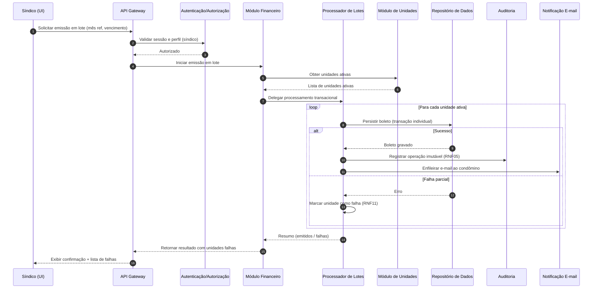
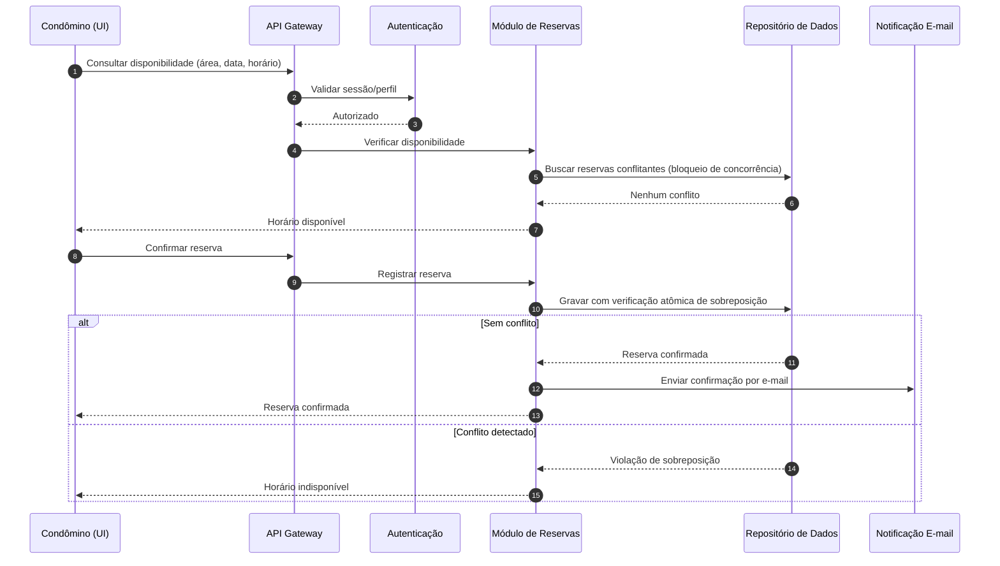
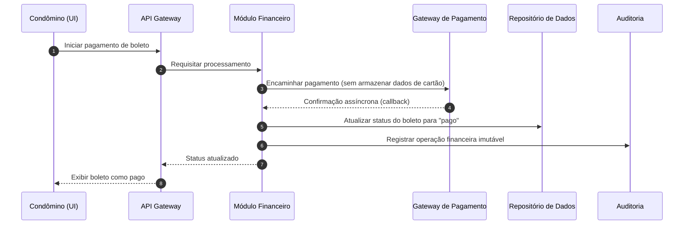

# Relatório Técnico de Arquitetura de Software
## Sistema de Administração de Condomínio Residencial (M04)

---

## 1. Identificação das HUs

| HU | Perfil | Título | RFs Relacionados | RNFs Relacionados |
|----|--------|--------|------------------|-------------------|
| HU01 | Síndico | Cadastrar unidades e moradores | RF04, RF05, RF06, RF07, RF08 | RNF04 |
| HU02 | Síndico | Emitir boletos em lote | RF09, RF10, RF13, RF17 | RNF05, RNF11, RNF13 |
| HU03 | Síndico | Acompanhar inadimplências | RF15 | RNF08 |
| HU04 | Síndico | Publicar comunicados | RF16, RF17 | RNF13 |
| HU05 | Síndico | Gerenciar ocorrências | RF22, RF23, RF24 | RNF13 |
| HU06 | Síndico | Criar e registrar assembleias | RF18, RF19, RF17 | RNF04 |
| HU07 | Síndico | Gerenciar áreas comuns e reservas | RF25, RF27, RF28, RF29 | RNF08 |
| HU08 | Condômino | Visualizar e pagar boleto | RF10, RF11, RF12 | RNF03, RNF05 |
| HU09 | Condômino | Reservar área comum | RF26, RF27, RF28 | RNF08 |
| HU10 | Condômino | Registrar e acompanhar ocorrência | RF21, RF23, RF24 | RNF13 |
| HU11 | Condômino | Pré-autorizar visitante | RF31, RF32 | RNF04, RNF06 |
| HU12 | Condômino | Acompanhar assembleias e atas | RF20 | RNF07 |
| HU13 | Funcionário | Registrar entrada/saída visitantes | RF30, RF32, RF33 | RNF06 |
| HU14 | Funcionário | Consultar pré-autorizações | RF32, RF31 | RNF06 |

Transversais a todas as HUs: RF01, RF02, RF03 (autenticação/autorização), RNF01, RNF02, RNF07, RNF09, RNF10, RNF12.

---

## 2. Diagramas de Arquitetura (Mermaid)

### 2.1 Visão de Componentes (Alto Nível)

```mermaid
graph TD
    subgraph Cliente
        UI[Portal Web Responsivo]
    end

    subgraph Borda
        GW[API Gateway / Roteador]
        AUTH[Serviço de Autenticação e Autorização]
    end

    subgraph Núcleo de Negócio
        USR[Módulo de Usuários e Perfis]
        UNI[Módulo de Unidades e Moradores]
        FIN[Módulo Financeiro / Boletos]
        COM[Módulo de Comunicados e Assembleias]
        OCO[Módulo de Ocorrências]
        RES[Módulo de Reservas]
        ACS[Módulo de Controle de Acesso e Visitantes]
    end

    subgraph Serviços de Apoio
        NOT[Serviço de Notificação por E-mail]
        AUD[Serviço de Auditoria / Logs Imutáveis]
        FILE[Serviço de Armazenamento de Anexos]
        SCHED[Agendador / Processador de Lotes]
    end

    subgraph Externo
        PAY[Gateway de Pagamento - PCI-DSS]
    end

    subgraph Persistência
        DB[(Repositório de Dados)]
        BKP[(Backup Diário)]
    end

    UI --> GW
    GW --> AUTH
    GW --> USR
    GW --> UNI
    GW --> FIN
    GW --> COM
    GW --> OCO
    GW --> RES
    GW --> ACS

    FIN --> PAY
    FIN --> SCHED
    COM --> NOT
    OCO --> NOT
    RES --> NOT
    FIN --> NOT

    USR --> DB
    UNI --> DB
    FIN --> DB
    COM --> DB
    OCO --> DB
    RES --> DB
    ACS --> DB

    FIN --> AUD
    ACS --> AUD
    COM --> AUD
    OCO --> AUD

    OCO --> FILE
    COM --> FILE

    DB --> BKP
```

### 2.2 Sequência — HU02: Emissão de Boletos em Lote (transacional)



### 2.3 Sequência — HU09/RF27: Reserva sem Sobreposição



### 2.4 Sequência — HU13/HU08: Confirmação de Pagamento via Gateway



---

## 3. Decisões de Arquitetura

| ID | Decisão | Justificativa | Requisitos |
|----|---------|---------------|-----------|
| AD01 | Arquitetura modular orientada a domínios (portal único + serviços de negócio) | Domínios coesos (financeiro, reservas, acesso) com baixo acoplamento facilitam manutenção e escala | RNF07, Manutenibilidade |
| AD02 | Camada central de Autenticação/Autorização mediando todas as requisições | Aplicação uniforme de RBAC por perfil e expiração de sessão | RF01, RF02, RF03, RNF01 |
| AD03 | Serviço de Notificação por E-mail desacoplado e assíncrono (fila) | Evita bloqueio de operações de negócio; garante entrega dos avisos | RF17, RF24, HU04, HU06, HU09, HU10 |
| AD04 | Serviço de Auditoria com registros imutáveis (append-only) | Requisito explícito de rastreabilidade financeira e de acesso | RNF05, RNF06, RNF13 |
| AD05 | Processador de Lotes para emissão de boletos com transação por unidade | Garante isolamento de falha parcial sem corromper demais unidades | RF13, RNF11 |
| AD06 | Não armazenamento de dados de cartão; delegação total ao gateway | Conformidade PCI-DSS | RNF03 |
| AD07 | Controle de concorrência atômico nas reservas | Impede sobreposição em condições de corrida | RF27 |
| AD08 | Desativação lógica (soft delete) de moradores | Preservar histórico sem exclusão física | RF07 |
| AD09 | Serviço de Armazenamento de Anexos separado (fotos, atas PDF, presença) | Isolar binários da base transacional | HU06, HU10, HU12 |
| AD10 | Persistência centralizada com backup diário e retenção de 90 dias | Continuidade e recuperação de dados | RNF12 |
| AD11 | Portal web responsivo e compatível com navegadores modernos | Acesso móvel/desktop | RNF09, RNF10 |
| AD12 | Camada de tratamento de dados pessoais com princípios de minimização/consentimento | Conformidade LGPD | RNF04 |

---

## 4. Tabela de Componentes e Rastreabilidade

| Componente | Responsabilidade Principal | Comunica-se com | Origem (HU / Critério de Aceite) |
|------------|---------------------------|-----------------|----------------------------------|
| Portal Web Responsivo | Interface única para todos os perfis; adaptação móvel/desktop | API Gateway | Todas as HUs; RNF09, RNF10 |
| API Gateway / Roteador | Ponto único de entrada; roteamento e validação de sessão | Autenticação, Módulos de negócio | RF02, RF03 |
| Serviço de Autenticação e Autorização | Login/logout, RBAC por perfil, expiração de sessão | API Gateway, Módulo de Usuários | RF01–RF03; RNF01, RNF02 |
| Módulo de Usuários e Perfis | Cadastro de usuários e atribuição de perfis | Autenticação, Repositório | RF01; HU01 |
| Módulo de Unidades e Moradores | CRUD de unidades, moradores, vínculos, veículos, soft delete | Repositório, Financeiro | RF04–RF08; HU01 (CPF único, múltiplos moradores) |
| Módulo Financeiro / Boletos | Configuração de taxa, emissão individual/lote, status, inadimplência, pagamentos manuais | Gateway Pagamento, Processador de Lotes, Notificação, Auditoria | RF09–RF15; HU02, HU03, HU08 |
| Processador de Lotes / Agendador | Execução transacional de emissão em lote com controle de falhas | Financeiro, Repositório, Notificação | RF13; HU02 (indicar falhas); RNF11 |
| Módulo de Comunicados e Assembleias | Publicação de comunicados fixáveis, criação de assembleias, registro de atas | Notificação, Armazenamento de Anexos, Repositório | RF16–RF20; HU04, HU06, HU12 |
| Módulo de Ocorrências | Registro por condômino/funcionário, categorização, mudança de status, histórico | Notificação, Armazenamento de Anexos, Auditoria | RF21–RF24; HU05, HU10 |
| Módulo de Reservas | Cadastro de áreas, regras, verificação de sobreposição, cancelamento, calendário | Notificação, Repositório | RF25–RF29; HU07, HU09 |
| Módulo de Controle de Acesso e Visitantes | Registro entrada/saída, pré-autorizações, vínculo, histórico | Auditoria, Repositório | RF30–RF33; HU11, HU13, HU14 |
| Serviço de Notificação por E-mail | Envio assíncrono de avisos (comunicados, status, reservas, boletos) | Módulos de negócio (fila) | RF17, RF24; HU02, HU04, HU06, HU09, HU10 |
| Serviço de Auditoria / Logs Imutáveis | Registro append-only de eventos críticos e financeiros | Financeiro, Acesso, Comunicados, Ocorrências | RNF05, RNF06, RNF13 |
| Serviço de Armazenamento de Anexos | Guarda de fotos, atas PDF, listas de presença | Ocorrências, Comunicados | HU06, HU10, HU12 |
| Gateway de Pagamento (externo) | Processar e confirmar pagamentos; conformidade PCI-DSS | Módulo Financeiro | RF11, RF12; RNF03; HU08 |
| Repositório de Dados | Persistência transacional dos domínios | Todos os módulos, Backup | Todas as HUs; RNF11 |
| Serviço de Backup | Backup diário automático, retenção 90 dias | Repositório de Dados | RNF12 |

---

## 5. Bloqueios e Pendências

| ID | Descrição | Impacto | Responsável sugerido |
|----|-----------|---------|----------------------|
| BL01 | Gateway de pagamento específico e modelo de callback/webhook não definidos | Bloqueia detalhamento de RF11/RF12 e fluxo de conciliação | Product Owner + Financeiro |
| BL02 | Regras de cálculo de inadimplência (juros, multa, correção) não especificadas | RF15/HU03 incompleto — painel pode divergir da cobrança real | Área financeira do condomínio |
| BL03 | Política de retenção LGPD e prazos de anonimização de visitantes não definidos | Afeta RNF04/RNF06 e ciclo de vida dos dados | DPO / Jurídico |
| BL04 | Provedor de e-mail e SLA de entrega não definidos | Impacta confiabilidade das notificações | Infraestrutura |
| BL05 | Regras de reembolso/estorno em cancelamento de reserva não especificadas | Lacuna em RF28 quando reserva envolver taxa | Product Owner |
| BL06 | Não há definição de idempotência para callbacks de pagamento | Risco de dupla confirmação de boleto | Arquitetura |

---

## 6. Cobertura de Requisitos

**Requisitos Funcionais:** 33/33 cobertos.

| Faixa | Cobertura |
|-------|-----------|
| RF01–RF03 (Acesso) | Autenticação/Autorização + Usuários |
| RF04–RF08 (Unidades) | Módulo de Unidades e Moradores |
| RF09–RF15 (Financeiro) | Módulo Financeiro + Processador de Lotes + Gateway |
| RF16–RF20 (Comunicados/Assembleias) | Módulo de Comunicados e Assembleias + Notificação |
| RF21–RF24 (Ocorrências) | Módulo de Ocorrências + Notificação |
| RF25–RF29 (Reservas) | Módulo de Reservas |
| RF30–RF33 (Acesso/Visitantes) | Módulo de Controle de Acesso + Auditoria |

**Requisitos Não Funcionais:** 13/13 endereçados.

| RNF | Tratamento arquitetural |
|-----|-------------------------|
| RNF01 | AUTH com expiração de sessão de 30 min |
| RNF02 | Armazenamento de senha com hash seguro |
| RNF03 | AD06 — não armazenar dados de cartão |
| RNF04 | AD12 — camada de tratamento LGPD (pendência BL03) |
| RNF05 | Serviço de Auditoria imutável |
| RNF06 | Registro de acesso de visitante em Auditoria |
| RNF07 | Modularidade + backup + design 24/7 |
| RNF08 | Consultas otimizadas em painel/calendário (≤3s) |
| RNF09 | Portal responsivo |
| RNF10 | Compatibilidade com navegadores modernos |
| RNF11 | Processador de Lotes transacional por unidade |
| RNF12 | Serviço de Backup diário, retenção 90 dias |
| RNF13 | Auditoria/Logs de eventos críticos |

---

## 7. Gap Analysis

| # | Lacuna Identificada | Impacto Arquitetural | Ação Recomendada |
|---|---------------------|----------------------|------------------|
| G01 | Ausência de especificação de regras de juros/multa sobre inadimplência | Painel de inadimplência (RF15) pode exibir valores inconsistentes com a cobrança efetiva | Definir motor de regras de cobrança configurável antes da implementação do módulo financeiro |
| G02 | Falta de definição de idempotência e retry nos callbacks do gateway | Risco de dupla baixa de boleto ou inconsistência de status | Especificar chave de idempotência e conciliação assíncrona (BL06) |
| G03 | LGPD sem detalhamento de consentimento, anonimização e direito ao esquecimento | Retenção indevida de dados pessoais de visitantes/moradores | Definir política de ciclo de vida de dados com DPO; anonimizar histórico de visitantes após prazo legal |
| G04 | Não há requisito de MFA nem política de complexidade de senha | Segurança de acesso limitada a hash + sessão | Avaliar autenticação multifator para perfil síndico/administrador |
| G05 | Escalabilidade das notificações em massa (emissão em lote + comunicados) não dimensionada | Picos de envio de e-mail podem degradar desempenho | Dimensionar fila e throttling do Serviço de Notificação |
| G06 | Ausência de requisito sobre concorrência em pré-autorização vs. registro de entrada | Possível vínculo duplicado entre pré-autorização e visita (HU14 critério 3) | Definir bloqueio/estado transacional na vinculação pré-autorização→visita |
| G07 | Não há especificação de auditoria para operações de cadastro de unidades/moradores | RNF13 cobre apenas eventos listados; alterações cadastrais ficam sem trilha | Estender escopo de auditoria a operações cadastrais sensíveis (LGPD) |
| G08 | Formato/limite de anexos (fotos de ocorrência, atas PDF) não definido | Impacto no Serviço de Armazenamento e desempenho | Definir tipos permitidos, tamanho máximo e antivírus de upload |
| G09 | Regras de detecção de sobreposição parcial de horários não detalhadas | RF27 pode falhar em reservas com intervalos que se cruzam parcialmente | Especificar granularidade de slots e regra de interseção de intervalos |
| G10 | Requisito de disponibilidade 99,5% sem definição de redundância/failover | Meta de uptime pode não ser atingível sem estratégia de HA | Definir estratégia de redundância e monitoramento (fora do design abstrato atual) |

---

*Fim do Relatório Canônico — AI4ES Time 2 / M04.*