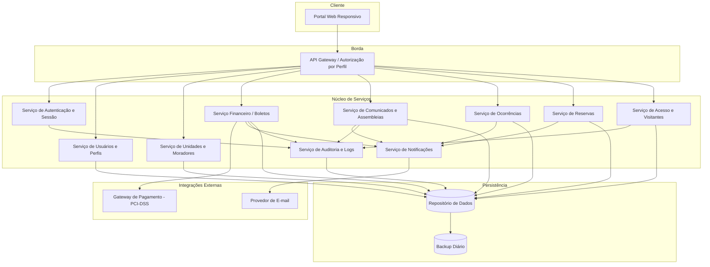
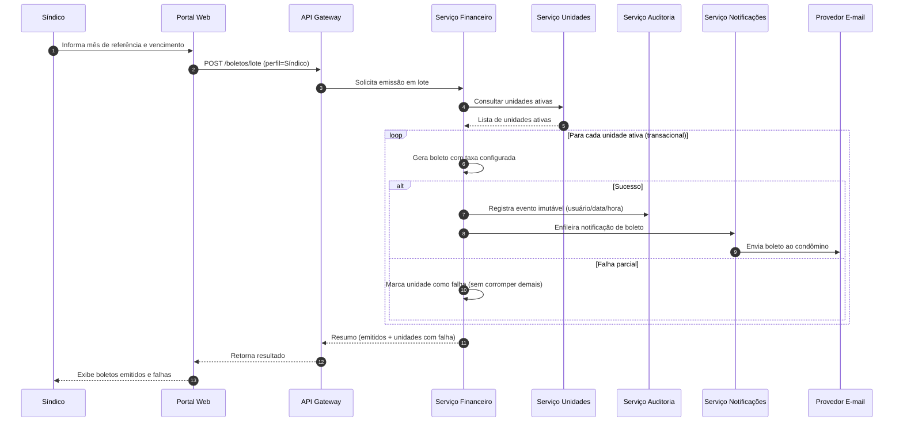
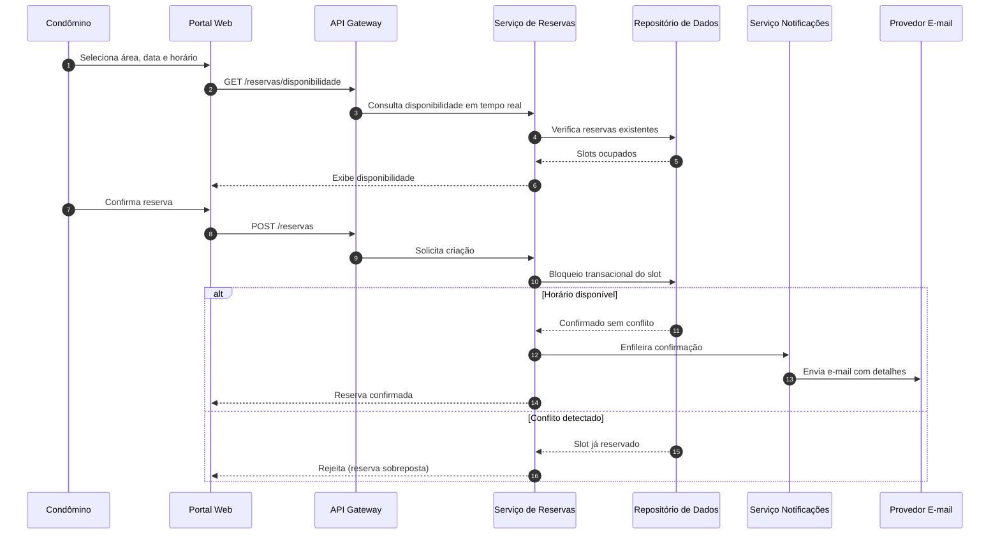
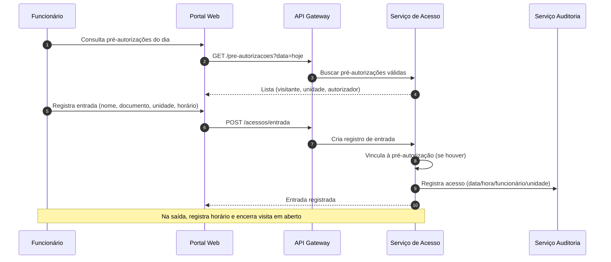

# Relatório Técnico de Arquitetura de Software
## Sistema de Administração de Condomínio Residencial (M04)

---

## 1. Identificação das HUs

| HU | Título | Perfil | RFs Relacionados | RNFs Relevantes |
|----|--------|--------|------------------|-----------------|
| HU01 | Cadastrar unidades e moradores | Síndico | RF04, RF05, RF06, RF07, RF08 | RNF04, RNF09 |
| HU02 | Emitir boletos em lote | Síndico | RF09, RF10, RF13, RF17(analogia e-mail) | RNF05, RNF11, RNF13 |
| HU03 | Acompanhar inadimplências | Síndico | RF15 | RNF08, RNF05 |
| HU04 | Publicar comunicados | Síndico | RF16, RF17 | RNF13 |
| HU05 | Gerenciar ocorrências | Síndico | RF21, RF22, RF23, RF24 | RNF13 |
| HU06 | Criar e registrar assembleias | Síndico | RF18, RF19, RF20 | RNF13 |
| HU07 | Gerenciar áreas comuns e reservas | Síndico | RF25, RF27, RF28, RF29 | RNF08 |
| HU08 | Visualizar e pagar boleto | Condômino | RF10, RF11, RF12 | RNF03, RNF07 |
| HU09 | Reservar área comum | Condômino | RF26, RF27, RF28 | RNF08, RNF07 |
| HU10 | Registrar e acompanhar ocorrência | Condômino | RF21, RF23, RF24 | RNF04 |
| HU11 | Pré-autorizar visitante | Condômino | RF31, RF32 | RNF04, RNF06 |
| HU12 | Acompanhar assembleias / atas | Condômino | RF20 | RNF09 |
| HU13 | Registrar entrada/saída de visitantes | Funcionário | RF30, RF32, RF33 | RNF06, RNF13 |
| HU14 | Consultar pré-autorizações | Funcionário | RF32, RF31 | RNF06 |

**Perfis identificados (RF01):** Síndico, Condômino, Funcionário, Administrador.

---

## 2. Diagramas de Arquitetura (Mermaid)

### 2.1 Diagrama de Componentes (Visão Macro)

### 2.2 Diagrama de Sequência — Emissão de Boletos em Lote (HU02 / RF13 / RNF11)

### 2.3 Diagrama de Sequência — Reserva de Área Comum sem Sobreposição (HU09 / RF27)

### 2.4 Diagrama de Sequência — Registro de Visitante com Pré-autorização (HU13 / HU14)

---

## 3. Decisões de Arquitetura

| ID | Decisão | Justificativa | Requisitos Relacionados |
|----|---------|---------------|-------------------------|
| DA01 | Arquitetura orientada a serviços por domínio (Usuários, Financeiro, Reservas, Acesso, Comunicação, Ocorrências) | Delimita fronteiras de negócio e facilita evolução independente | Todos |
| DA02 | Camada única de autorização por perfil no Gateway | Centraliza RF02 e reduz duplicação de regras | RF02, RNF01 |
| DA03 | Serviço de Notificações desacoplado e assíncrono | Evita bloqueio de operações principais no envio de e-mails | RF17, RF24, HU02, HU06, HU09 |
| DA04 | Serviço de Auditoria com registros imutáveis (append-only) | Atende rastreabilidade financeira e de acesso | RNF05, RNF06, RNF13 |
| DA05 | Isolamento do processamento de pagamento via gateway externo, sem persistir dados de cartão | Conformidade PCI-DSS | RF11, RNF03 |
| DA06 | Emissão de boletos em lote com semântica transacional por item + relatório de falhas | Falha parcial não corrompe o lote | RF13, RNF11, HU02 |
| DA07 | Controle de concorrência (bloqueio) na criação de reservas | Impede reservas sobrepostas | RF27, HU09 |
| DA08 | Desativação lógica (soft-delete) de moradores/entidades | Preserva histórico | RF07, RF33 |
| DA09 | Rotina de backup diário com retenção mínima de 90 dias | Confiabilidade e recuperação | RNF12 |
| DA10 | Portal responsivo compatível com navegadores modernos | Acesso multi-dispositivo | RNF09, RNF10 |
| DA11 | Encerramento de sessão por inatividade (30 min) na camada de sessão | Segurança | RNF01 |
| DA12 | Armazenamento de senhas com hash seguro | Segurança de credenciais | RNF02 |

---

## 4. Tabela de Componentes e Rastreabilidade

| Componente | Responsabilidade Principal | Comunica-se com | Origem (HU / Critério de Aceite) |
|------------|----------------------------|-----------------|----------------------------------|
| Portal Web Responsivo | Interface para todos os perfis, responsiva e multi-navegador | API Gateway | RNF09, RNF10; todas as HUs |
| API Gateway | Roteamento e autorização por perfil | Todos os serviços | RF02, RNF01 |
| Serviço de Autenticação e Sessão | Login/logout, hash de senha, expiração de sessão | Serviço de Usuários, Auditoria | RF03, RNF01, RNF02 |
| Serviço de Usuários e Perfis | Cadastro de usuários e perfis (síndico, condômino, funcionário, admin) | Autenticação, Auditoria | RF01; HU01 |
| Serviço de Unidades e Moradores | CRUD de unidades, moradores, vínculos, veículos, desativação lógica | Financeiro, Repositório | RF04–RF08; HU01 (CPF único, múltiplos moradores) |
| Serviço Financeiro / Boletos | Taxas, emissão individual/lote, status, pagamento manual, inadimplência | Gateway Pagamento, Notificações, Auditoria | RF09–RF15; HU02, HU03, HU08 |
| Serviço de Comunicados e Assembleias | Publicação de comunicados, assembleias, atas, anexos | Notificações, Auditoria | RF16–RF20; HU04, HU06, HU12 |
| Serviço de Ocorrências | Registro, categorização, status e histórico de ocorrências | Notificações, Auditoria | RF21–RF24; HU05, HU10 |
| Serviço de Reservas | Cadastro de áreas, regras, calendário, controle de sobreposição, cancelamento | Notificações, Repositório | RF25–RF29; HU07, HU09 |
| Serviço de Acesso e Visitantes | Registro entrada/saída, pré-autorizações, histórico | Auditoria, Repositório | RF30–RF33; HU11, HU13, HU14 |
| Serviço de Notificações | Envio assíncrono de e-mails | Provedor de E-mail | RF17, RF24; HU02, HU04, HU06, HU09, HU10 |
| Serviço de Auditoria e Logs | Registros imutáveis de operações críticas e financeiras | Repositório | RNF05, RNF06, RNF13 |
| Gateway de Pagamento (externo) | Processamento/confirmação de pagamento PCI-DSS | Serviço Financeiro | RF11, RF12, RNF03; HU08 |
| Provedor de E-mail (externo) | Entrega de mensagens | Serviço de Notificações | RF17, RF24 |
| Repositório de Dados | Persistência das entidades de domínio | Todos os serviços | RNF12 |
| Rotina de Backup | Backup diário, retenção 90 dias | Repositório de Dados | RNF12 |

---

## 5. Bloqueios e Pendências

| ID | Bloqueio / Pendência | Impacto | Necessita definição de |
|----|----------------------|---------|------------------------|
| B01 | Perfil "Administrador" (RF01) não possui HU nem funcionalidades descritas | Escopo indefinido | Product Owner |
| B02 | Gateway de pagamento específico e formato de boleto não definidos | Bloqueia RF10, RF11 | Área financeira/negócio |
| B03 | Regras de cálculo de multa/juros por inadimplência não especificadas | RF15/HU03 incompletos | Regras de negócio |
| B04 | Política de armazenamento de anexos (fotos, PDFs de ata) não definida | HU06, HU10, HU12 | Arquitetura + Compliance |
| B05 | Critérios de retenção LGPD e anonimização de visitantes não detalhados | RNF04 | Jurídico/DPO |
| B06 | Não há requisito de MFA nem política de complexidade de senha | Reforço de RNF01/RNF02 | Segurança |
| B07 | Volume esperado (nº unidades/usuários) não informado | Dimensionamento p/ RNF07, RNF08 | Negócio |

---

## 6. Cobertura de Requisitos

**Requisitos Funcionais:** 33/33 mapeados a componentes.

| Faixa | Componente Responsável | Status |
|-------|------------------------|--------|
| RF01–RF03 | Usuários / Autenticação | ✅ Coberto |
| RF04–RF08 | Unidades e Moradores | ✅ Coberto |
| RF09–RF15 | Financeiro / Boletos | ✅ Coberto |
| RF16–RF20 | Comunicados e Assembleias | ✅ Coberto |
| RF21–RF24 | Ocorrências | ✅ Coberto |
| RF25–RF29 | Reservas | ✅ Coberto |
| RF30–RF33 | Acesso e Visitantes | ✅ Coberto |

**Requisitos Não Funcionais:** 13/13 endereçados.

| RNF | Tratamento Arquitetural | Status |
|-----|-------------------------|--------|
| RNF01 | Sessão com timeout 30 min | ✅ |
| RNF02 | Hash seguro de senha | ✅ |
| RNF03 | Isolamento PCI-DSS, sem dados de cartão | ✅ |
| RNF04 | Conformidade LGPD (parcial — ver B05) | ⚠️ Parcial |
| RNF05 | Auditoria imutável financeira | ✅ |
| RNF06 | Auditoria de acessos | ✅ |
| RNF07 | Disponibilidade 24/7 (depende de infra — B07) | ⚠️ Parcial |
| RNF08 | Otimização de painel/calendário (depende de B07) | ⚠️ Parcial |
| RNF09 | Portal responsivo | ✅ |
| RNF10 | Compatibilidade navegadores | ✅ |
| RNF11 | Emissão em lote transacional | ✅ |
| RNF12 | Backup diário 90 dias | ✅ |
| RNF13 | Logs de eventos críticos | ✅ |

**HUs:** 14/14 cobertas.

---

## 7. Gap Analysis

| Gap | Descrição | Impacto Arquitetural | Ação Recomendada |
|-----|-----------|----------------------|------------------|
| G01 — Perfil Administrador sem escopo | RF01 cita "administrador" mas nenhuma HU/RF define suas ações | Risco de subespecificação de autorização (RF02) | Elicitar responsabilidades do admin (gestão de condomínios? configuração global?) e criar HUs |
| G02 — Gestão de anexos ausente | Atas, fotos de ocorrência e listas de presença exigem armazenamento de arquivos, sem requisito de tamanho/formato/segurança | Componente de armazenamento de arquivos não previsto no design | Definir requisito de armazenamento de mídia, limites e controle de acesso |
| G03 — Regras financeiras incompletas | Não há definição de juros/multa, parcelamento ou reemissão de boleto vencido | HU03/RF15 podem exigir motor de cálculo adicional | Especificar regras de inadimplência com o cliente |
| G04 — LGPD sem detalhamento operacional | RNF04 genérico; falta política de consentimento, direito de exclusão e retenção de dados de visitantes | Impacta modelagem de dados e rotinas de anonimização | Definir com DPO ciclo de vida dos dados pessoais |
| G05 — Métricas de escala ausentes | RNF07 (99,5%) e RNF08 (3s) sem volume/carga base | Impossível dimensionar redundância e caching abstrato | Levantar volumetria e definir SLAs de infraestrutura |
| G06 — Notificações apenas por e-mail | Todas as notificações usam e-mail; sem fallback nem preferências | Ponto único de comunicação; e-mail pode falhar | Avaliar canais adicionais e registro de entrega |
| G07 — Ausência de segurança reforçada de acesso | Sem MFA, política de senha ou bloqueio por tentativas | Fortalece RNF01/RNF02 | Incluir requisitos de segurança de autenticação |
| G08 — Concorrência em reservas | RF27 exige impedir sobreposição, mas não define comportamento em disputa simultânea | Necessário mecanismo de bloqueio/idempotência explícito | Formalizar estratégia de controle de concorrência |
| G09 — Encerramento de visitas em aberto | HU13 encerra visita na saída, mas não trata visitas nunca encerradas | Dados de acesso podem ficar inconsistentes | Definir política de encerramento automático/relatório |

---

*Fim do Relatório Canônico — AI4ES Time 2.*