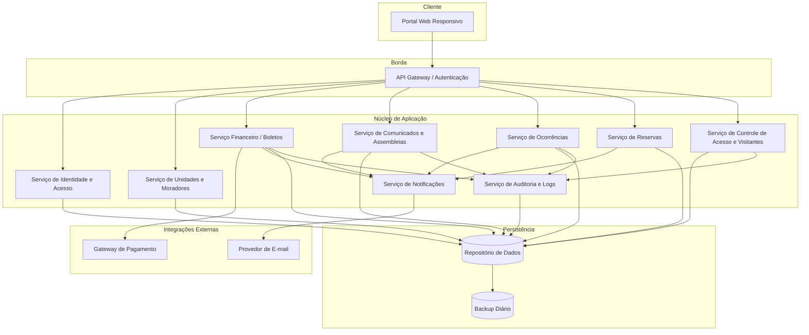
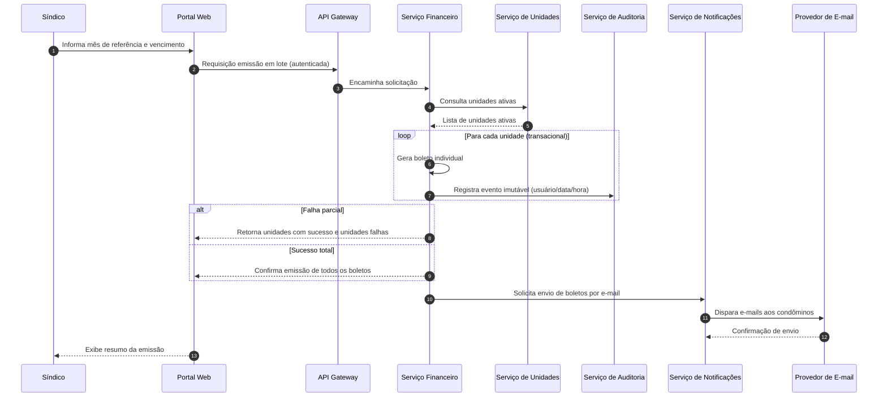
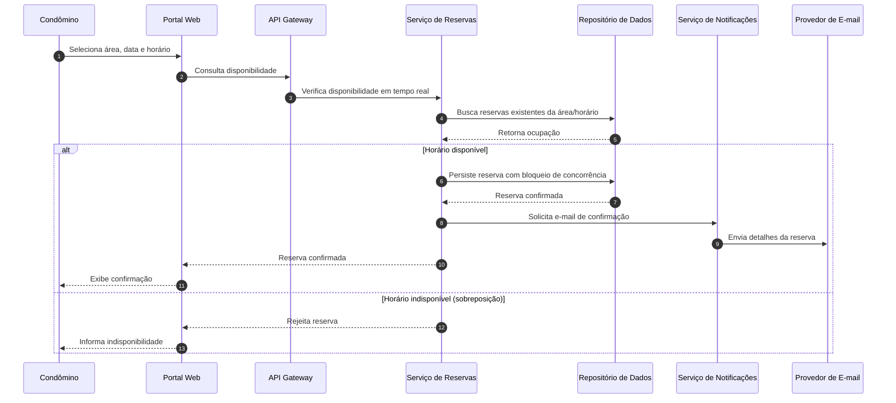
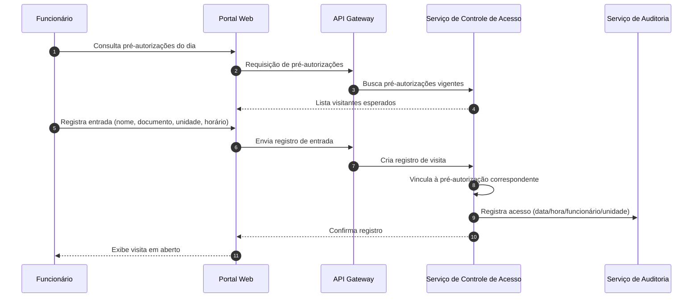

# Relatório Técnico de Arquitetura de Software
## Sistema de Administração de Condomínio Residencial (M04)

---

## 1. Identificação das HUs

| HU | Título | Perfil | RFs Relacionados | RNFs Relevantes |
|----|--------|--------|------------------|-----------------|
| HU01 | Cadastrar unidades e moradores | Síndico | RF04, RF05, RF06, RF07, RF08 | RNF04 |
| HU02 | Emitir boletos em lote | Síndico | RF09, RF10, RF13, RF17 | RNF05, RNF11 |
| HU03 | Acompanhar inadimplências | Síndico | RF15 | RNF08 |
| HU04 | Publicar comunicados | Síndico | RF16, RF17 | RNF13 |
| HU05 | Gerenciar ocorrências | Síndico | RF21, RF22, RF23, RF24 | RNF13 |
| HU06 | Criar e registrar assembleias | Síndico | RF18, RF19, RF20 | RNF13 |
| HU07 | Gerenciar áreas comuns e reservas | Síndico | RF25, RF27, RF28, RF29 | RNF08 |
| HU08 | Visualizar e pagar boleto pelo portal | Condômino | RF10, RF11, RF12 | RNF03, RNF05 |
| HU09 | Reservar área comum | Condômino | RF26, RF27, RF28 | RNF08 |
| HU10 | Registrar e acompanhar ocorrência | Condômino | RF21, RF24 | RNF13 |
| HU11 | Pré-autorizar entrada de visitante | Condômino | RF31, RF32 | RNF04, RNF06 |
| HU12 | Acompanhar assembleias e consultar atas | Condômino | RF20 | RNF07 |
| HU13 | Registrar entrada e saída de visitantes | Funcionário | RF30, RF32, RF33 | RNF06 |
| HU14 | Consultar pré-autorizações de acesso | Funcionário | RF31, RF32 | RNF06 |

**Perfis identificados (RF01):** Síndico, Condômino, Funcionário, Administrador.

---

## 2. Diagramas de Arquitetura (Mermaid)

### 2.1 Diagrama de Componentes (Visão Macro)

### 2.2 Diagrama de Sequência — Emissão de Boletos em Lote (HU02)

### 2.3 Diagrama de Sequência — Reserva de Área Comum (HU09/RF27)

### 2.4 Diagrama de Sequência — Registro de Visitante com Pré-autorização (HU13/HU14)

---

## 3. Decisões de Arquitetura

| ID | Decisão | Justificativa | Requisitos |
|----|---------|---------------|------------|
| DA01 | Arquitetura modular orientada a serviços de domínio (Financeiro, Reservas, Acesso, etc.) | Domínios com ciclos de vida e regras distintas; facilita manutenibilidade e escalabilidade seletiva | RNF07, RNF13 |
| DA02 | Camada de API Gateway centralizando autenticação e autorização por perfil | Enforcement único de RBAC e encerramento de sessão | RF02, RF03, RNF01 |
| DA03 | Serviço de Notificações desacoplado e assíncrono | Múltiplos gatilhos de e-mail (comunicados, ocorrências, reservas, boletos) sem acoplar regras de negócio | RF17, RF24, HU06, HU09 |
| DA04 | Serviço de Auditoria dedicado para registros imutáveis | Rastreabilidade financeira e de acessos independente da lógica de negócio | RNF05, RNF06, RNF13 |
| DA05 | Isolamento da integração de pagamento; tokenização, sem armazenar dados de cartão | Conformidade PCI-DSS | RF11, RF12, RNF03 |
| DA06 | Controle de concorrência com bloqueio na reserva de áreas comuns | Impedir sobreposição de reservas em requisições simultâneas | RF27 |
| DA07 | Emissão de boletos em lote com semântica transacional por unidade | Falha parcial não deve corromper as demais unidades | RF13, RNF11 |
| DA08 | Desativação lógica (soft delete) para moradores | Preservar histórico sem exclusão física | RF07 |
| DA09 | Portal único responsivo servindo os três perfis com views condicionadas ao papel | Compatibilidade e usabilidade multiplataforma | RNF09, RNF10 |
| DA10 | Rotina de backup automático diário com retenção configurável | Confiabilidade e recuperação de dados | RNF12 |

---

## 4. Tabela de Componentes e Rastreabilidade

| Componente | Responsabilidade Principal | Comunica-se com | Origem (HU / Critério de Aceite) |
|------------|---------------------------|-----------------|----------------------------------|
| Portal Web Responsivo | Interface única para síndico, condômino e funcionário, adaptável a mobile/desktop | API Gateway | HU01–HU14; RNF09, RNF10 |
| API Gateway / Autenticação | Roteamento, autenticação, autorização por perfil, controle de sessão | Portal, todos os serviços | RF02, RF03; RNF01 |
| Serviço de Identidade e Acesso | Gestão de usuários, perfis, hash de senha, login/logout | API Gateway, Repositório | RF01, RF02, RF03; RNF02 |
| Serviço de Unidades e Moradores | CRUD de unidades, moradores, vínculos, veículos, desativação lógica | Serviço Financeiro, Repositório | HU01 (bloco/número obrigatórios, CPF único, múltiplos moradores); RF04–RF08 |
| Serviço Financeiro / Boletos | Configuração de taxas, emissão individual/lote, status, pagamentos externos, inadimplência | Gateway de Pagamento, Unidades, Notificações, Auditoria | HU02, HU03, HU08; RF09–RF15 |
| Serviço de Comunicados e Assembleias | Publicação de comunicados, fixação, criação de assembleias, atas e anexos | Notificações, Auditoria, Repositório | HU04, HU06, HU12; RF16–RF20 |
| Serviço de Ocorrências | Registro, categorização, atualização de status, histórico, anexos | Notificações, Auditoria, Repositório | HU05, HU10; RF21–RF24 |
| Serviço de Reservas | Cadastro de áreas, regras, disponibilidade, prevenção de sobreposição, cancelamento, calendário | Notificações, Repositório | HU07, HU09; RF25–RF29 |
| Serviço de Controle de Acesso e Visitantes | Registro entrada/saída, pré-autorizações, vínculo, histórico por unidade | Auditoria, Repositório | HU11, HU13, HU14; RF30–RF33 |
| Serviço de Notificações | Envio assíncrono de e-mails disparados por eventos de domínio | Provedor de E-mail, serviços de domínio | HU02, HU04, HU05, HU06, HU07, HU09, HU10; RF17, RF24 |
| Serviço de Auditoria e Logs | Registros imutáveis financeiros/acessos e logs de eventos críticos | Repositório, serviços de domínio | RNF05, RNF06, RNF13 |
| Gateway de Pagamento (externo) | Processamento e confirmação de pagamentos sob PCI-DSS | Serviço Financeiro | HU08; RF11, RF12; RNF03 |
| Provedor de E-mail (externo) | Entrega de mensagens de notificação | Serviço de Notificações | RF17, RF24 |
| Repositório de Dados | Persistência dos dados de domínio | Todos os serviços | Todos os RFs; RNF12 |
| Rotina de Backup | Backup diário e retenção mínima 90 dias | Repositório de Dados | RNF12 |

---

## 5. Bloqueios e Pendências

| ID | Descrição | Impacto | Responsável Sugerido |
|----|-----------|---------|----------------------|
| BL01 | Requisitos não definem funcionalidades do perfil **Administrador** (RF01) além de sua existência | Perfil sem escopo de permissões definido | Product Owner |
| BL02 | Gateway de pagamento específico e modelo de conciliação não especificados | Design de integração de RF11/RF12 pendente | Arquiteto + Financeiro |
| BL03 | Regra de reajuste/histórico de valores de taxa condominial (RF09) não detalhada | Ambiguidade em versionamento de taxas | PO |
| BL04 | Política de retenção LGPD (anonimização/expurgo) de moradores/visitantes não definida (RNF04) | Conflito potencial com retenção de histórico (RF07, RF33) | DPO/Jurídico |
| BL05 | Critério de "morador ativo" para emissão em lote (HU02) não explicitado versus RF07 | Divergência na geração de boletos | PO |
| BL06 | Não há requisito de quórum/votação em assembleias, apenas registro de ata | Limita escopo funcional de assembleias | PO |
| BL07 | Meio de notificação limitado a e-mail; sem fallback (push/SMS) para RNF07 24/7 | Risco de não entrega de avisos críticos | PO |

---

## 6. Cobertura de Requisitos

### Requisitos Funcionais

| Faixa | Situação | Componente Responsável |
|-------|----------|------------------------|
| RF01–RF03 | ✅ Coberto | Identidade e Acesso / API Gateway |
| RF04–RF08 | ✅ Coberto | Unidades e Moradores |
| RF09–RF15 | ✅ Coberto | Financeiro / Boletos |
| RF16–RF20 | ✅ Coberto | Comunicados e Assembleias |
| RF21–RF24 | ✅ Coberto | Ocorrências |
| RF25–RF29 | ✅ Coberto | Reservas |
| RF30–RF33 | ✅ Coberto | Controle de Acesso e Visitantes |

**Cobertura RF: 33/33 (100%).**

### Requisitos Não Funcionais

| RNF | Situação | Tratamento Arquitetural |
|-----|----------|-------------------------|
| RNF01 | ✅ | Gateway com timeout de sessão de 30 min |
| RNF02 | ✅ | Hash seguro no Serviço de Identidade |
| RNF03 | ✅ | Isolamento PCI-DSS; sem armazenar cartão |
| RNF04 | ⚠️ Parcial | Depende de política LGPD (BL04) |
| RNF05 | ✅ | Serviço de Auditoria (registros imutáveis) |
| RNF06 | ✅ | Auditoria de acessos de visitantes |
| RNF07 | ⚠️ Parcial | Arquitetura modular; SLA de infra a definir |
| RNF08 | ✅ | Otimização de consultas de painel/calendário |
| RNF09 | ✅ | Portal responsivo |
| RNF10 | ✅ | Compatibilidade com navegadores modernos |
| RNF11 | ✅ | Emissão em lote transacional (DA07) |
| RNF12 | ✅ | Rotina de Backup diária |
| RNF13 | ✅ | Serviço de Auditoria e Logs |

---

## 7. Gap Analysis

| # | Lacuna Identificada | Impacto Arquitetural | Ação Recomendada |
|---|---------------------|----------------------|------------------|
| G01 | **Escopo do perfil Administrador indefinido** | Modelo de RBAC incompleto; possível refatoração de permissões | Definir matriz de permissões por perfil antes da implementação do Serviço de Identidade |
| G02 | **Conflito histórico vs. LGPD** — RF07/RF33 exigem retenção, RNF04 exige minimização | Necessidade de estratégia de anonimização preservando integridade referencial | Especificar política de ciclo de vida do dado com DPO; prever pseudonimização em Auditoria |
| G03 | **Integração de pagamento genérica** | Fluxos de confirmação, reembolso e webhook não modelados | Definir contrato de callback do gateway; projetar idempotência na confirmação (RF12) |
| G04 | **Concorrência de reservas sob alta carga** | Risco de sobreposição em picos (RF27) | Confirmar estratégia de bloqueio otimista/pessimista e testes de concorrência |
| G05 | **Falta de definição de reprocessamento na emissão em lote** | Unidades falhas (RNF11) precisam de reemissão controlada | Especificar fluxo de reprocessamento seletivo pós-falha parcial |
| G06 | **Canal único de notificação (e-mail)** | E-mails podem falhar; sem confirmação de leitura | Avaliar fila com retry e canais alternativos; registrar status de entrega |
| G07 | **Ausência de gestão de anexos/documentos** (atas PDF, fotos de ocorrências) | Necessário componente de armazenamento de arquivos não citado nos requisitos | Definir serviço/repositório de arquivos e limites de tamanho/formato |
| G08 | **Desempenho de painéis (RNF08) sem estratégia definida** | Consultas de inadimplência e calendário podem degradar | Prever visões materializadas/indexação e cache de leitura |
| G09 | **Assembleias sem votação/quórum** | Escopo pode expandir futuramente | Confirmar com PO se é fora de escopo definitivo |
| G10 | **Métrica de disponibilidade 99,5% (RNF07)** sem requisitos de redundância | SLA depende de topologia de infraestrutura não especificada | Definir estratégia de redundância, health-check e failover com time de infra |

---

*Relatório gerado pelo Sistema Multi-Agente AI4ES — Time 2. Design em nível conceitual, neutro quanto a tecnologias, conforme diretrizes de neutralidade tecnológica.*