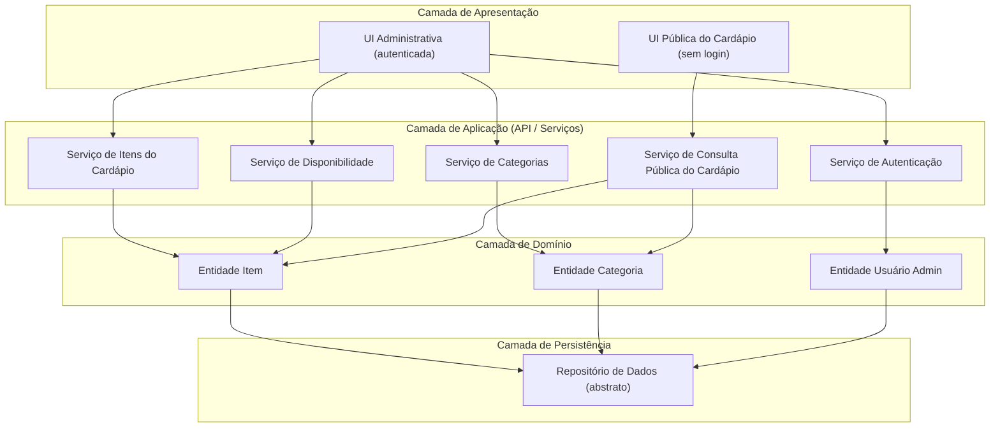
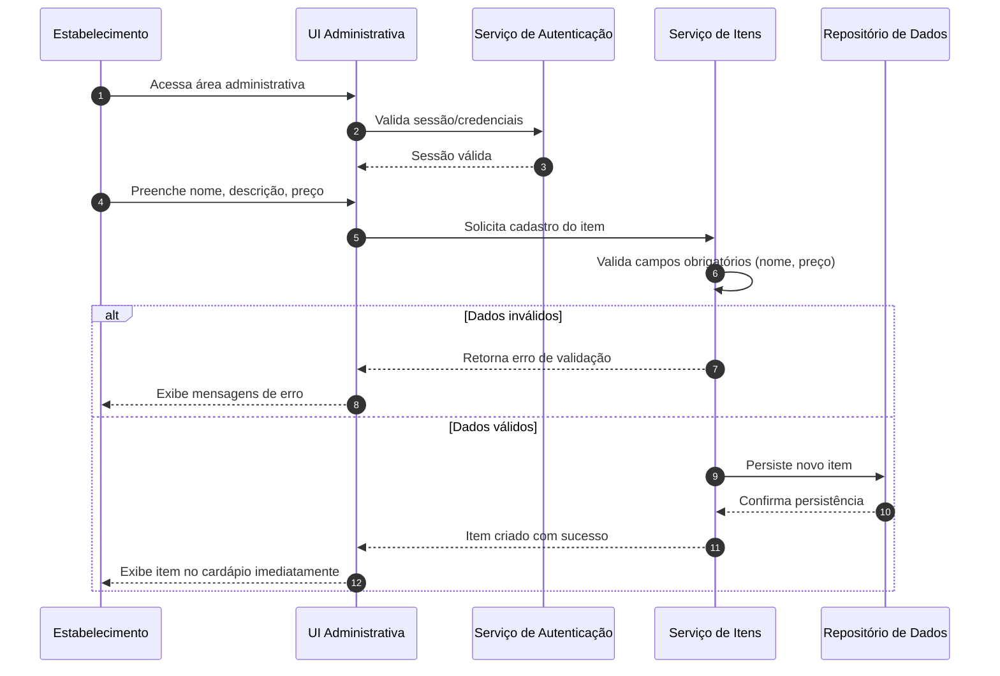
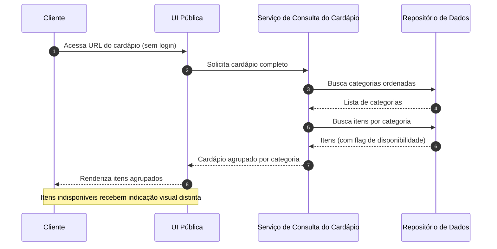
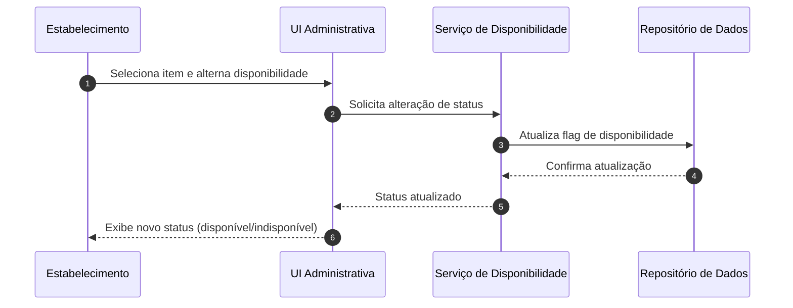

# Relatório Técnico de Arquitetura de Software
## Sistema de Cardápio Online — Restaurante (P01)

---

## 1. Identificação das HUs

| HU | Título | Perfil | RFs Relacionados | RNFs Relacionados |
|----|--------|--------|------------------|-------------------|
| HU01 | Cadastrar item no cardápio | Estabelecimento | RF01 | RNF03, RNF05 |
| HU02 | Organizar itens por categoria | Estabelecimento | RF04, RF05 | RNF03, RNF05 |
| HU03 | Editar item do cardápio | Estabelecimento | RF02 | RNF03, RNF05 |
| HU04 | Marcar item como indisponível | Estabelecimento | RF06, RF07 | RNF03, RNF05 |
| HU05 | Remover item do cardápio | Estabelecimento | RF03 | RNF03, RNF05 |
| HU06 | Visualizar cardápio sem cadastro | Cliente | RF08, RF11 | RNF01, RNF02, RNF04, RNF06, RNF07 |
| HU07 | Navegar por categorias | Cliente | RF09 | RNF01, RNF02, RNF07 |
| HU08 | Identificar itens indisponíveis | Cliente | RF10 | RNF01, RNF07 |

**Síntese de perfis:**
- **Estabelecimento (Administrador):** área autenticada com CRUD de itens/categorias e gestão de disponibilidade (HU01–HU05).
- **Cliente:** acesso público, sem autenticação, apenas leitura (HU06–HU08).

---

## 2. Diagramas de Arquitetura (Mermaid)

### 2.1 Diagrama de Componentes (Visão Macro)

### 2.2 Diagrama de Sequência — HU01 (Cadastrar item)

### 2.3 Diagrama de Sequência — HU06/HU07/HU08 (Visualização pública)

### 2.4 Diagrama de Sequência — HU04 (Marcar/reativar disponibilidade)

---

## 3. Decisões de Arquitetura

| ID | Decisão | Justificativa | Requisito |
|----|---------|---------------|-----------|
| DA01 | Separação em duas frentes de apresentação: **UI Pública** e **UI Administrativa** | Isola o acesso anônimo do acesso autenticado, reduzindo superfície de risco | RF08, RNF03 |
| DA02 | Arquitetura em camadas (Apresentação → Aplicação → Domínio → Persistência) | Modularidade e facilidade de evolução | RNF05 |
| DA03 | Serviços de aplicação segmentados por responsabilidade (Item, Categoria, Disponibilidade, Consulta) | Coesão alta e baixo acoplamento; facilita novas funcionalidades | RNF05 |
| DA04 | Disponibilidade modelada como **atributo de estado** do item, não exclusão | Permite indicação visual sem remoção (soft state) | RF06, RF07, RF10 |
| DA05 | Consulta pública otimizada em serviço dedicado (leitura) | Atende meta de carregamento ≤ 3s | RNF02 |
| DA06 | Autenticação obrigatória apenas na camada administrativa | Cliente acessa sem fricção; admin protegido | RF08, RNF03 |
| DA07 | Relação Item ↔ Categoria como **1:N** (item pertence a uma única categoria) | Definido no critério de aceite da HU02 | RF05, HU02 |
| DA08 | Atributo de ordenação nas categorias | Ordem controlável pelo estabelecimento | HU02 (critério) |
| DA09 | Camada de apresentação responsiva e aderente a WCAG 2.1 nível A | Usabilidade e acessibilidade | RNF01, RNF06, RNF07 |
| DA10 | Repositório abstrato desacoplando domínio da tecnologia de persistência | Neutralidade tecnológica e testabilidade | RNF05 |

---

## 4. Tabela de Componentes e Rastreabilidade

| Componente | Responsabilidade Principal | Comunica-se com | Origem (HU / Critério de Aceite) |
|------------|---------------------------|-----------------|----------------------------------|
| UI Pública do Cardápio | Renderizar cardápio agrupado por categoria, responsivo e acessível, sem login | Serviço de Consulta do Cardápio | HU06, HU07, HU08 / acesso por URL sem barreira |
| UI Administrativa | Prover interface autenticada de gestão de itens e categorias | Serviço de Autenticação, Item, Categoria, Disponibilidade | HU01–HU05 / validação e confirmação |
| Serviço de Autenticação | Validar credenciais e sessão do estabelecimento | UI Administrativa, Entidade Usuário Admin | RNF03 / HU01–HU05 |
| Serviço de Itens do Cardápio | CRUD de itens; validar campos obrigatórios (nome, preço) | UI Administrativa, Entidade Item, Repositório | HU01, HU03, HU05 / campos obrigatórios validados |
| Serviço de Categorias | Criar/editar/remover categorias, associar itens, gerir ordem | UI Administrativa, Entidade Categoria, Repositório | HU02 / criação livre, ordem controlável |
| Serviço de Disponibilidade | Alternar status disponível/indisponível preservando o item | UI Administrativa, Entidade Item, Repositório | HU04 / desfazer a qualquer momento |
| Serviço de Consulta do Cardápio | Fornecer cardápio público agrupado por categoria com flags de disponibilidade | UI Pública, Repositório | HU06, HU07, HU08 / itens por categoria |
| Entidade Item | Representar item (nome, descrição, preço, categoria, disponibilidade) | Repositório | HU01, HU03, HU04 |
| Entidade Categoria | Representar categoria (nome, ordem) e coleção de itens | Repositório | HU02 |
| Entidade Usuário Admin | Representar credenciais do estabelecimento | Repositório | RNF03 |
| Repositório de Dados (abstrato) | Persistir e recuperar entidades de forma tecnologicamente neutra | Todas as entidades | RNF05 |

---

## 5. Bloqueios e Pendências

| ID | Descrição | Severidade | Necessita decisão de |
|----|-----------|-----------|----------------------|
| BL01 | Não há especificação sobre gestão de múltiplos estabelecimentos (multi-tenant) ou usuário único | Média | Product Owner |
| BL02 | Não definido processo de recuperação/reset de senha da área administrativa | Média | PO / Segurança |
| BL03 | RF03 define remoção definitiva, mas não há política de auditoria/histórico de exclusão | Baixa | PO |
| BL04 | Não especificado se preço tem moeda, formato ou faixa de valores válidos | Média | PO |
| BL05 | RNF04 (99% disponibilidade) não define estratégia de infraestrutura/monitoramento | Média | Arquitetura de Infra |
| BL06 | Não há requisito sobre upload de imagens dos itens (comum em cardápios) | Baixa | PO |
| BL07 | Ausência de definição sobre paginação/limite de itens por categoria | Baixa | PO |

---

## 6. Cobertura de Requisitos

### Requisitos Funcionais

| RF | Coberto por Componente | Status |
|----|------------------------|--------|
| RF01 | Serviço de Itens | ✅ Coberto |
| RF02 | Serviço de Itens | ✅ Coberto |
| RF03 | Serviço de Itens | ✅ Coberto |
| RF04 | Serviço de Categorias | ✅ Coberto |
| RF05 | Serviço de Categorias | ✅ Coberto |
| RF06 | Serviço de Disponibilidade | ✅ Coberto |
| RF07 | Serviço de Disponibilidade | ✅ Coberto |
| RF08 | UI Pública / Serviço de Consulta | ✅ Coberto |
| RF09 | Serviço de Consulta do Cardápio | ✅ Coberto |
| RF10 | UI Pública / Serviço de Consulta | ✅ Coberto |
| RF11 | UI Pública / Serviço de Consulta | ✅ Coberto |

### Requisitos Não Funcionais

| RNF | Tratamento Arquitetural | Status |
|-----|-------------------------|--------|
| RNF01 | UI responsiva (DA09) | ✅ Coberto |
| RNF02 | Serviço de consulta dedicado à leitura (DA05) | ⚠️ Parcial — depende de infra |
| RNF03 | Serviço de Autenticação (DA06) | ✅ Coberto |
| RNF04 | Requer estratégia de infra (BL05) | ⚠️ Parcial |
| RNF05 | Arquitetura em camadas modular (DA02, DA03) | ✅ Coberto |
| RNF06 | UI aderente a navegadores modernos (DA09) | ✅ Coberto |
| RNF07 | UI aderente a WCAG 2.1 A (DA09) | ✅ Coberto |

**Cobertura funcional: 11/11 (100%).**
**Cobertura não funcional: 5 plenos + 2 parciais (dependentes de infraestrutura).**

---

## 7. Gap Analysis

| # | Lacuna Identificada | Impacto Arquitetural | Ação Recomendada |
|---|---------------------|----------------------|------------------|
| G01 | **Modelo de tenancy indefinido** (BL01) | Afeta modelagem de dados, isolamento e autenticação. Retrabalho alto se decidido tardiamente | Definir com PO se é single ou multi-estabelecimento antes do design de persistência |
| G02 | **Validação de preço não especificada** (BL04) | Risco de dados inconsistentes; afeta regra de domínio da Entidade Item | Definir formato monetário, casas decimais e valores válidos |
| G03 | **Gestão de imagens ausente** (BL06) | Cardápios geralmente exibem fotos; impacta storage e RNF02 (peso de carregamento) | Confirmar escopo; se aplicável, prever armazenamento e otimização de mídia |
| G04 | **Estratégia de disponibilidade 99%** (BL05) | RNF04 não tem contraparte no design abstrato; requer redundância e monitoramento | Elaborar plano de infraestrutura e SLA com equipe de operações |
| G05 | **Recuperação de senha admin** (BL02) | Fluxo de segurança incompleto; risco de bloqueio operacional | Especificar fluxo de reset e política de senhas |
| G06 | **Exclusão sem auditoria** (BL03) | Perda irreversível de dados; ausência de rastreabilidade | Avaliar soft-delete ou log de auditoria para itens removidos |
| G07 | **Ausência de paginação/limites** (BL07) | Cardápios extensos podem degradar RNF02 | Definir estratégia de carregamento (lazy loading/paginação) |
| G08 | **Métricas de desempenho não instrumentadas** | RNF02 sem meio de verificação | Prever pontos de medição de tempo de resposta na consulta pública |

### Recomendações prioritárias ao time de desenvolvimento
1. **Resolver G01 e G02 antes de iniciar a modelagem de persistência** — são decisões estruturais.
2. **Formalizar plano de infraestrutura** para RNF02 e RNF04, únicos requisitos com cobertura parcial.
3. **Consolidar o fluxo de segurança administrativo** (autenticação + recuperação de senha) como épico dedicado.
4. **Validar escopo de mídia (imagens)**, pois altera significativamente estimativas de armazenamento e desempenho.

---

*Relatório gerado pelo Sistema Multi-Agente de Design de Software (AI4ES — Time 2), em conformidade com o Template Canônico de 7 Seções e a Regra de Neutralidade Tecnológica.*