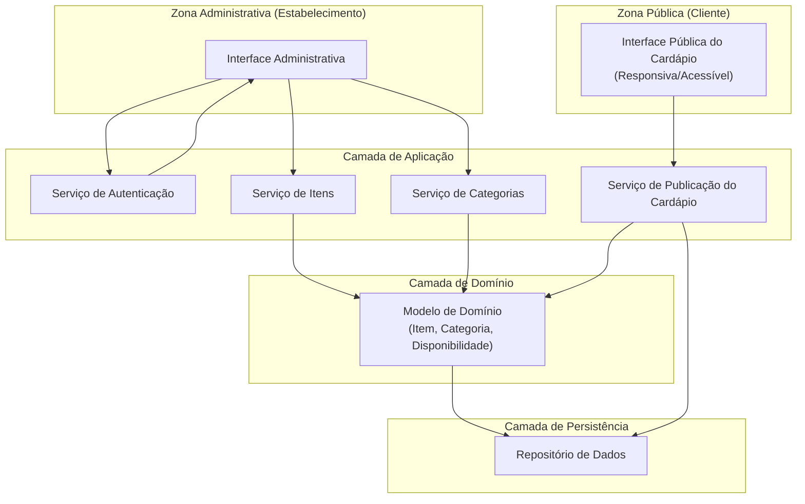
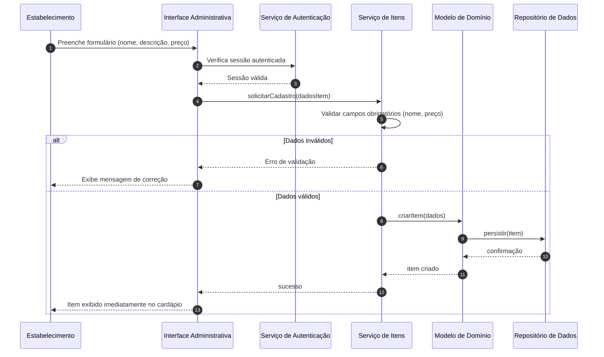
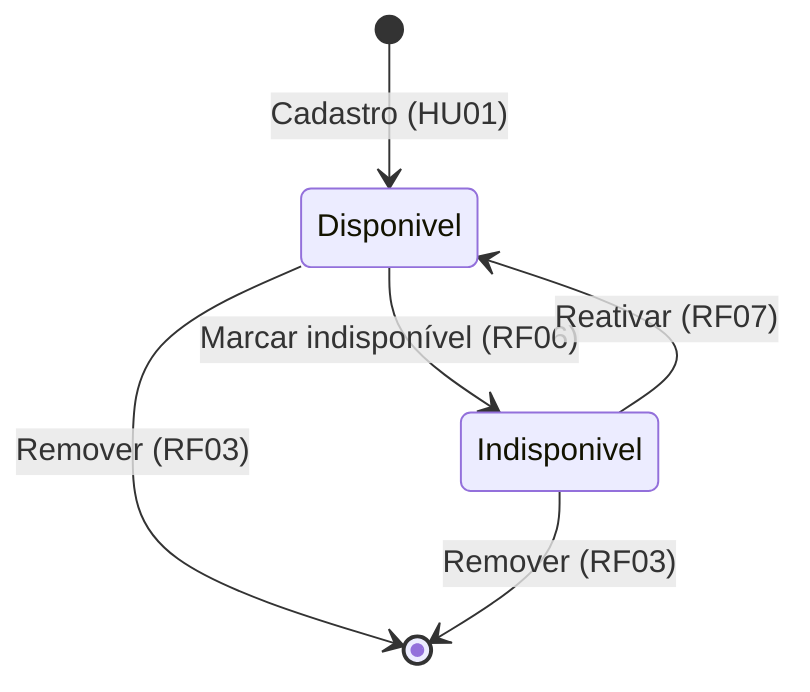

# Relatório Técnico de Arquitetura de Software
## Sistema de Cardápio Online — Restaurante (P01)

---

## 1. Identificação das HUs

| HU | Perfil | Descrição resumida | RFs relacionados | RNFs relacionados |
|----|--------|--------------------|------------------|-------------------|
| HU01 | Estabelecimento | Cadastrar item com nome, descrição e preço | RF01 | RNF03, RNF05 |
| HU02 | Estabelecimento | Criar categorias e associar itens, com ordenação | RF04, RF05 | RNF05 |
| HU03 | Estabelecimento | Editar dados de item existente | RF02 | RNF03, RNF05 |
| HU04 | Estabelecimento | Marcar/reativar item como indisponível | RF06, RF07 | RNF05 |
| HU05 | Estabelecimento | Remover item com confirmação | RF03 | RNF03, RNF05 |
| HU06 | Cliente | Visualizar cardápio sem cadastro/login | RF08 | RNF01, RNF02, RNF04, RNF06, RNF07 |
| HU07 | Cliente | Navegar por categorias | RF09 | RNF01, RNF07 |
| HU08 | Cliente | Identificar itens indisponíveis | RF10, RF11 | RNF01, RNF07 |

**Observações de identificação:**
- HU04 abrange RF06 (marcar indisponível) e RF07 (reativar) — par simétrico de estado.
- RF11 (exibir nome/descrição/preço) sustenta HU07 e HU08 na renderização.
- HU02 traz critério extra de **ordenação de categorias**, não coberto explicitamente nos RFs (ver Gap Analysis).

---

## 2. Diagramas de Arquitetura (Mermaid)

### 2.1 Diagrama de Componentes (visão macro)



### 2.2 Diagrama de Sequência — Cadastro de Item (HU01)



### 2.3 Diagrama de Sequência — Visualização Pública com Indisponibilidade (HU06/HU07/HU08)

```mermaid
sequenceDiagram
    autonumber
    participant CLI as Cliente
    participant UIC as Interface Pública
    participant PUB as Serviço de Publicação
    participant DM as Modelo de Domínio
    participant REP as Repositório de Dados

    CLI->>UIC: Acessa URL do cardápio (sem login)
    UIC->>PUB: obterCardapio()
    PUB->>DM: montarCardapioAgrupado()
    DM->>REP: buscarCategoriasOrdenadas()
    REP-->>DM: categorias
    DM->>REP: buscarItensPorCategoria()
    REP-->>DM: itens (com flag disponibilidade)
    DM-->>PUB: estrutura agrupada por categoria
    PUB-->>UIC: cardápio (itens + status)
    UIC->>UIC: Renderizar responsivo/acessível
    UIC-->>CLI: Exibe itens agrupados;<br/>indisponíveis com indicação visual
```

### 2.4 Diagrama de Estados — Ciclo de Disponibilidade do Item (HU04)



---

## 3. Decisões de Arquitetura

| ID | Decisão | Justificativa | Requisitos |
|----|---------|---------------|------------|
| DA01 | Separação em duas zonas de interface: **Pública** (cliente) e **Administrativa** (estabelecimento) | Isolar acesso autenticado do acesso livre; reduz superfície de segurança | RF08, RNF03 |
| DA02 | Arquitetura em camadas modulares (Apresentação, Aplicação, Domínio, Persistência) | Atende manutenibilidade e adição de funcionalidades | RNF05 |
| DA03 | **Serviço de Publicação** dedicado à leitura do cardápio, separado dos serviços de escrita administrativa | Otimiza desempenho de leitura e disponibilidade pública | RNF02, RNF04 |
| DA04 | Disponibilidade modelada como **estado/flag** do item, não como exclusão | Preserva item no cardápio com indicação visual | RF06, RF07, RF10 |
| DA05 | Autenticação por usuário/senha aplicada apenas à zona administrativa | Cliente acessa sem fricção; admin protegido | RNF03, RF08 |
| DA06 | Modelo de associação **Item → 1 Categoria** (cardinalidade 1:N) | Critério de aceite HU02: item pertence a apenas uma categoria | RF05, HU02 |
| DA07 | Atributo de **ordem** na entidade Categoria | Critério HU02: ordenação controlável pelo estabelecimento | HU02 |
| DA08 | Responsividade e acessibilidade tratadas na camada de Apresentação pública | Isola requisitos de UI do domínio | RNF01, RNF06, RNF07 |
| DA09 | Remoção de item exige confirmação na camada de apresentação antes de acionar serviço | Critério HU05 | RF03, HU05 |
| DA10 | Neutralidade tecnológica: repositório abstraído por interface | Permite escolha posterior de tecnologia de persistência | RNF05 |

---

## 4. Tabela de Componentes e Rastreabilidade

| Componente | Responsabilidade Principal | Comunica-se com | Origem (HU / Critério de Aceite) |
|------------|----------------------------|-----------------|----------------------------------|
| Interface Pública do Cardápio | Renderizar cardápio agrupado, responsivo e acessível, sem autenticação; sinalizar indisponíveis | Serviço de Publicação | HU06, HU07, HU08 / acesso por URL, mobile, indicação visual |
| Interface Administrativa | Formulários de CRUD de itens/categorias e gestão de disponibilidade | Serviço de Autenticação, Serviço de Itens, Serviço de Categorias | HU01–HU05 / validação, confirmação |
| Serviço de Autenticação | Validar credenciais (usuário/senha) e sessão da área admin | Interface Administrativa | HU01–HU05 / RNF03 |
| Serviço de Itens | Cadastrar, editar, remover, marcar/reativar itens; validar campos obrigatórios | Interface Administrativa, Modelo de Domínio | HU01, HU03, HU04, HU05 / nome e preço obrigatórios, confirmação de exclusão |
| Serviço de Categorias | Criar, editar, remover categorias; associar itens; controlar ordem | Interface Administrativa, Modelo de Domínio | HU02 / criar/nomear, item em 1 categoria, ordenação |
| Serviço de Publicação do Cardápio | Montar visão de leitura agrupada por categoria com status de disponibilidade | Interface Pública, Modelo de Domínio, Repositório | HU06, HU07, HU08 / RF09, RF10, RF11 |
| Modelo de Domínio (Item, Categoria, Disponibilidade) | Encapsular regras: associação, estados de disponibilidade, integridade | Serviços de Itens/Categorias/Publicação, Repositório | RF04–RF07 / DA04, DA06 |
| Repositório de Dados | Persistir e recuperar itens e categorias de forma abstrata | Modelo de Domínio, Serviço de Publicação | Todos os RF de persistência |

---

## 5. Bloqueios e Pendências

| ID | Tipo | Descrição | Impacto | Status |
|----|------|-----------|---------|--------|
| BL01 | Pendência | Não há definição de política de gestão de usuários administrativos (cadastro, recuperação de senha, múltiplos usuários) | Afeta escopo do Serviço de Autenticação | Aberto |
| BL02 | Pendência | Comportamento ao remover uma **categoria** que contém itens associados não especificado (itens ficam órfãos? impede remoção?) | Integridade referencial | Aberto |
| BL03 | Pendência | Formato/moeda e regras de validação de **preço** (mínimo, casas decimais) não definidos | Validação em HU01/HU03 | Aberto |
| BL04 | Pendência | RNF02/RNF04 (desempenho e disponibilidade) sem definição de estratégia de infraestrutura/cache — depende de decisão de deploy | Verificação de RNF | Aberto |
| BL05 | Esclarecimento | Não há suporte a imagens de itens nos requisitos, comum em cardápios — confirmar se está fora de escopo | Escopo de domínio | Aberto |
| BL06 | Pendência | Ausência de idempotência/tratamento de concorrência em edições simultâneas | Consistência de dados | Aberto |

---

## 6. Cobertura de Requisitos

### Requisitos Funcionais

| RF | Coberto por | Status |
|----|-------------|--------|
| RF01 | Serviço de Itens, HU01 | ✅ Coberto |
| RF02 | Serviço de Itens, HU03 | ✅ Coberto |
| RF03 | Serviço de Itens, HU05 | ✅ Coberto |
| RF04 | Serviço de Categorias, HU02 | ✅ Coberto |
| RF05 | Serviço de Categorias, HU02 | ✅ Coberto |
| RF06 | Serviço de Itens (estado), HU04 | ✅ Coberto |
| RF07 | Serviço de Itens (estado), HU04 | ✅ Coberto |
| RF08 | Interface Pública, HU06 | ✅ Coberto |
| RF09 | Serviço de Publicação, HU07 | ✅ Coberto |
| RF10 | Interface Pública, HU08 | ✅ Coberto |
| RF11 | Serviço de Publicação/Interface Pública | ✅ Coberto |

### Requisitos Não Funcionais

| RNF | Tratado por | Status |
|-----|-------------|--------|
| RNF01 Usabilidade | Interface Pública responsiva (DA08) | ✅ Coberto |
| RNF02 Desempenho | Serviço de Publicação dedicado (DA03) | ⚠️ Parcial (depende de infra — BL04) |
| RNF03 Segurança | Serviço de Autenticação (DA05) | ✅ Coberto |
| RNF04 Disponibilidade | Separação leitura/escrita (DA03) | ⚠️ Parcial (depende de infra — BL04) |
| RNF05 Manutenibilidade | Arquitetura em camadas (DA02) | ✅ Coberto |
| RNF06 Compatibilidade | Interface Pública padrão web (DA08) | ✅ Coberto |
| RNF07 Acessibilidade | Interface Pública WCAG 2.1 A (DA08) | ✅ Coberto |

**Cobertura Funcional: 11/11 (100%). Cobertura Não Funcional: 5 plenos / 2 parciais dependentes de infraestrutura.**

---

## 7. Gap Analysis

| # | Lacuna Identificada | Impacto Arquitetural | Ação Recomendada |
|---|---------------------|----------------------|------------------|
| G01 | **Remoção de categoria com itens associados** não especificada (BL02) | Risco de itens órfãos ou perda de dados; ambiguidade na integridade do domínio | Definir regra: bloquear remoção com itens, ou realocar/desassociar. Modelar restrição no Domínio |
| G02 | **Ordenação de itens dentro da categoria** não mencionada (só ordenação de categorias em HU02) | Experiência do cliente inconsistente na renderização | Confirmar se itens têm ordem manual ou alfabética; adicionar atributo `ordem` se necessário |
| G03 | **Gestão de usuários administrativos** ausente (BL01) | Escopo indefinido do Serviço de Autenticação; risco de subestimar esforço | Especificar fluxo de credenciais, recuperação e multiplicidade de usuários |
| G04 | **Validação e formato de preço** não detalhados (BL03) | Divergência de implementação e possível erro de dados | Definir regras de moeda, precisão decimal e limites |
| G05 | **Estratégia de desempenho/disponibilidade** (RNF02/RNF04) sem plano concreto (BL04) | RNFs não verificáveis; risco de não atender SLAs | Definir estratégia de cache/CDN e monitoração em fase de deploy (fora do design abstrato) |
| G06 | **Suporte a imagens de itens** não previsto (BL05) | Cardápio pode não atender expectativa de mercado | Validar escopo com stakeholder; impacto no modelo de Item e armazenamento |
| G07 | **Concorrência em edições simultâneas** (BL06) | Possível sobrescrita silenciosa de dados | Adotar controle de versão/optimistic locking no Repositório |
| G08 | **Auditoria/histórico de alterações** ausente | Sem rastreabilidade de mudanças de preço/disponibilidade | Avaliar necessidade de log de auditoria conforme regras do negócio |
| G09 | **Feedback de "reflexão imediata"** (HU01/HU03) sem definição de mecanismo (cache invalidation) | Critério de aceite pode falhar se houver camada de cache | Garantir invalidação/sincronização entre escrita admin e leitura pública |

---

*Fim do Relatório Canônico — AI4ES Time 2.*