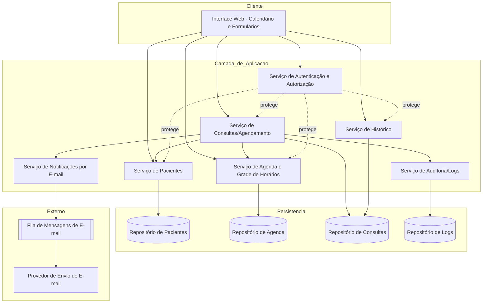
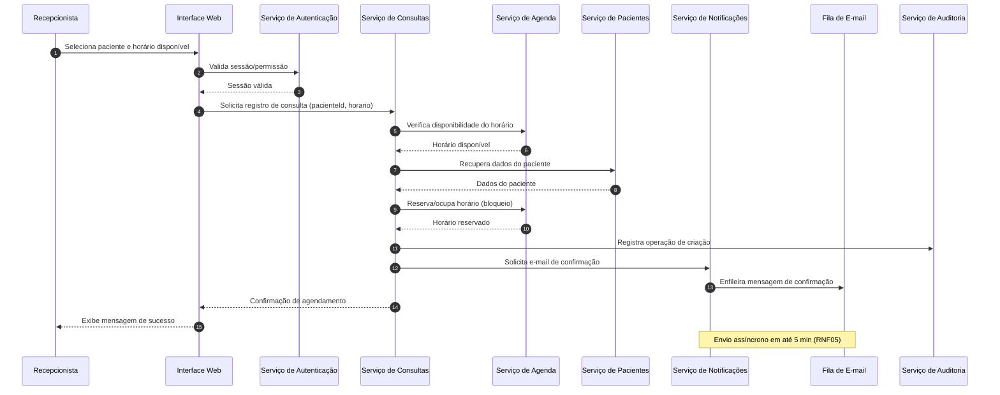
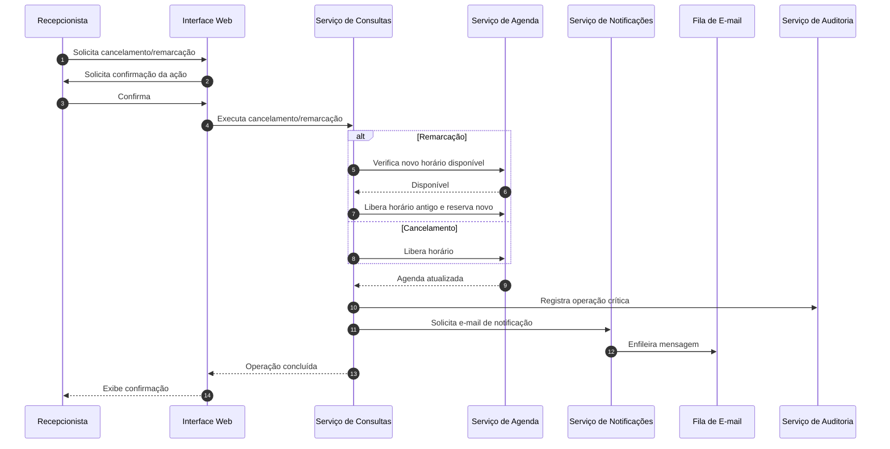
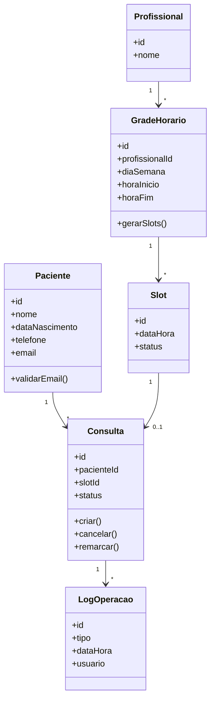

# Relatório Técnico de Arquitetura de Software
## Sistema de Agenda de Clínica — Agendador de Consultas para Clínica Pequena (P02)

---

## 1. Identificação das HUs

| HU | Título | Perfil | RFs Relacionados | RNFs Relacionados |
|----|--------|--------|------------------|-------------------|
| HU01 | Cadastrar paciente | Recepcionista | RF01, RF02 | RNF01, RNF02 |
| HU02 | Pesquisar paciente | Recepcionista | RF03 | RNF01, RNF04 |
| HU03 | Visualizar agenda do profissional | Recepcionista | RF04, RF11 | RNF03, RNF04, RNF07 |
| HU04 | Registrar agendamento | Recepcionista | RF05, RF06, RF09 | RNF05, RNF08 |
| HU05 | Cancelar agendamento | Recepcionista | RF07, RF10 | RNF05, RNF08 |
| HU06 | Remarcar agendamento | Recepcionista | RF06, RF08, RF10 | RNF05, RNF08 |
| HU07 | Consultar histórico do paciente | Recepcionista | RF12 | RNF01, RNF04 |
| HU08 | Receber confirmação de agendamento por e-mail | Paciente | RF09 | RNF05, RNF06 |
| HU09 | Receber notificação de cancelamento/remarcação | Paciente | RF10 | RNF05, RNF06 |

**Observações de identificação:**
- HU01 menciona validação de CPF duplicado (critério de aceite), mas RF01 não lista o campo CPF → ver Seção 7 (Gap Analysis).
- As notificações por e-mail (HU08/HU09) são funcionalidades passivas do ponto de vista do paciente e demandam um componente assíncrono de envio (RNF05).

---

## 2. Diagramas de Arquitetura (Mermaid)

### 2.1 Diagrama de Componentes (Visão Macro)

### 2.2 Diagrama de Sequência — Registrar Agendamento (HU04)

### 2.3 Diagrama de Sequência — Cancelar/Remarcar Consulta (HU05/HU06)

### 2.4 Diagrama de Classes (Domínio)

---

## 3. Decisões de Arquitetura

| ID | Decisão | Justificativa | Requisito de Origem |
|----|---------|---------------|---------------------|
| DA01 | Separar o domínio em serviços coesos (Pacientes, Agenda, Consultas, Notificações, Auditoria) | Facilita manutenção e rastreabilidade de logs por operação | RNF08, escopo funcional |
| DA02 | Envio de e-mail via mecanismo assíncrono (fila + worker) | Garantir a resposta rápida da UI e cumprir janela de 5 min sem bloquear a transação | RNF05, HU08, HU09 |
| DA03 | Controle de concorrência/bloqueio no Slot ao reservar | Impedir agendamento duplo no mesmo horário | RF06, HU04 |
| DA04 | Camada de autenticação/autorização transversal a todos os serviços | Restringir acesso a usuários autenticados por perfil | RNF01 |
| DA05 | Grade de horários gera Slots derivados; consultas ocupam Slots | Modelo simples para exibição de disponível/ocupado e liberação em cancelamento | RF04, RF11, HU03 |
| DA06 | Histórico derivado do repositório de Consultas com status | Evita duplicação de dados; histórico é uma projeção/consulta | RF12, HU07 |
| DA07 | Aplicar princípios de minimização e proteção de dados pessoais (LGPD) na persistência | Conformidade legal | RNF02 |
| DA08 | Interface web responsiva compatível com navegadores modernos, com visão calendário diária/semanal | Usabilidade e compatibilidade | RNF03, RNF07 |
| DA09 | Registro de logs de operações críticas (criação, cancelamento, remarcação) | Auditoria e manutenibilidade | RNF08 |

> **Nota de Neutralidade:** Nenhum produto/fornecedor específico é prescrito. Termos como "Fila de Mensagens", "Provedor de Envio de E-mail" e "Repositório" descrevem responsabilidades conceituais, cuja implementação concreta será decidida pelo time de desenvolvimento.

---

## 4. Tabela de Componentes e Rastreabilidade

| Componente | Responsabilidade Principal | Comunica-se com | Origem (HU / Critério de Aceite) |
|------------|----------------------------|-----------------|----------------------------------|
| Interface Web | Exibir formulários, calendário (diário/semanal), confirmar ações e apresentar mensagens | Serviços de Aplicação | HU03, HU04, HU05 (confirmação), RNF03, RNF07 |
| Serviço de Autenticação e Autorização | Autenticar usuários e restringir acesso por perfil (recepcionista/admin) | UI, demais serviços | RNF01 |
| Serviço de Pacientes | Cadastrar, editar, pesquisar pacientes; validar e-mail e unicidade | UI, Repositório de Pacientes, Serviço de Consultas | HU01, HU02, RF01–RF03 |
| Serviço de Agenda e Grade de Horários | Configurar grade, gerar slots, verificar disponibilidade, reservar/liberar horários | UI, Serviço de Consultas, Repositório de Agenda | HU03, RF04, RF11, RF06 |
| Serviço de Consultas/Agendamento | Registrar, cancelar e remarcar consultas; orquestrar reserva, notificação e log | UI, Agenda, Pacientes, Notificações, Auditoria | HU04, HU05, HU06, RF05–RF08 |
| Serviço de Histórico | Projetar consultas realizadas/canceladas por paciente | UI, Repositório de Consultas | HU07, RF12 |
| Serviço de Notificações por E-mail | Compor e enfileirar e-mails de confirmação/notificação | Serviço de Consultas, Fila de E-mail | HU08, HU09, RF09, RF10, RNF05 |
| Fila de Mensagens de E-mail | Desacoplar e garantir entrega assíncrona | Serviço de Notificações, Provedor de Envio | RNF05, RNF06 |
| Provedor de Envio de E-mail | Entregar mensagens ao destinatário | Fila de E-mail | RNF05 |
| Serviço de Auditoria/Logs | Registrar operações críticas (criação, cancelamento, remarcação) | Serviço de Consultas, Repositório de Logs | RNF08 |
| Repositório de Pacientes | Persistir dados cadastrais conforme LGPD | Serviço de Pacientes | RNF02, RF01 |
| Repositório de Agenda | Persistir grade e status de slots | Serviço de Agenda | RF11, RF04 |
| Repositório de Consultas | Persistir consultas e status | Serviço de Consultas, Histórico | RF05, RF12 |
| Repositório de Logs | Persistir logs de auditoria | Serviço de Auditoria | RNF08 |

---

## 5. Bloqueios e Pendências

| ID | Descrição | Severidade | Impacto |
|----|-----------|------------|---------|
| BL01 | **Inconsistência de CPF:** HU01 exige impedir cadastro duplicado por CPF, mas RF01 não inclui o campo CPF nos dados obrigatórios | Alta | Impede definição do modelo de dados de Paciente e regra de unicidade |
| BL02 | **Ausência de gestão de profissionais:** o sistema referencia "profissional" (RF04, RF11) mas não há RF para cadastro/gestão de profissionais | Média | Grade de horários pressupõe entidade Profissional não especificada |
| BL03 | **Política de retenção/exclusão LGPD indefinida:** RNF02 cita conformidade mas não define retenção, consentimento ou anonimização | Média | Afeta design de persistência e ciclo de vida de dados pessoais |
| BL04 | **Tratamento de falha no envio de e-mail:** RNF05 define prazo, mas não há requisito para reprocessamento/retentativa em caso de falha | Média | Necessário para confiabilidade (RNF05/RNF06) |
| BL05 | **Regras de cancelamento/remarcação temporais:** não há definição de prazo mínimo, limite de remarcações ou janela permitida | Baixa | Pode gerar retrabalho se descoberto tardiamente |
| BL06 | **Perfil "administrador" sem funcionalidades:** RNF01 cita administrador, mas nenhuma HU descreve suas ações | Baixa | Escopo do perfil admin indefinido |

---

## 6. Cobertura de Requisitos

### Requisitos Funcionais
| RF | Coberto por | Status |
|----|-------------|--------|
| RF01 | Serviço de Pacientes / Repositório de Pacientes | ✅ Coberto |
| RF02 | Serviço de Pacientes | ✅ Coberto |
| RF03 | Serviço de Pacientes | ✅ Coberto |
| RF04 | Serviço de Agenda / UI | ✅ Coberto |
| RF05 | Serviço de Consultas | ✅ Coberto |
| RF06 | Serviço de Agenda (bloqueio de slot) | ✅ Coberto |
| RF07 | Serviço de Consultas | ✅ Coberto |
| RF08 | Serviço de Consultas / Agenda | ✅ Coberto |
| RF09 | Serviço de Notificações | ✅ Coberto |
| RF10 | Serviço de Notificações | ✅ Coberto |
| RF11 | Serviço de Agenda e Grade | ✅ Coberto |
| RF12 | Serviço de Histórico | ✅ Coberto |

### Requisitos Não Funcionais
| RNF | Abordagem Arquitetural | Status |
|-----|------------------------|--------|
| RNF01 | Serviço de Autenticação transversal | ✅ Coberto |
| RNF02 | Persistência com minimização (DA07) | ⚠️ Parcial (ver BL03) |
| RNF03 | UI calendário diário/semanal | ✅ Coberto |
| RNF04 | Projeções/consultas otimizadas de agenda | ⚠️ Parcial (requer definição de estratégia de performance) |
| RNF05 | Envio assíncrono via fila | ✅ Coberto |
| RNF06 | Fila desacoplada + disponibilidade | ⚠️ Parcial (infra não detalhada) |
| RNF07 | Interface web multi-navegador | ✅ Coberto |
| RNF08 | Serviço de Auditoria/Logs | ✅ Coberto |

**Resumo:** 12/12 RFs cobertos; 5/8 RNFs plenamente cobertos, 3 parciais dependentes de decisões de infraestrutura/política.

---

## 7. Gap Analysis

| ID | Lacuna Identificada | Impacto Arquitetural | Ação Recomendada |
|----|---------------------|----------------------|------------------|
| GAP01 | Campo CPF ausente em RF01, mas exigido em critério de HU01 | Modelo de dados e regra de unicidade indefinidos | Alinhar com stakeholders: incluir CPF em RF01 ou remover regra de CPF; definir chave de unicidade (e-mail e/ou CPF) |
| GAP02 | Entidade Profissional não especificada por RF | Grade de horários e agenda dependem dela | Criar requisito de cadastro/gestão de profissionais e associação a grades |
| GAP03 | Política LGPD não detalhada (consentimento, retenção, exclusão) | Ciclo de vida de dados pessoais e criptografia | Definir política de retenção, base legal e mecanismos de anonimização/exclusão |
| GAP04 | Falta de estratégia de retentativa de e-mail | Confiabilidade do envio (RNF05/RNF06) | Especificar reprocessamento, dead-letter e monitoramento da fila |
| GAP05 | Requisito de desempenho (2s) sem estratégia definida | Estratégia de leitura/indexação de agenda | Definir metas de indexação, paginação e cache conceitual de disponibilidade |
| GAP06 | Escopo do perfil administrador indefinido | Modelo de autorização incompleto | Detalhar HUs do administrador (gestão de usuários, grades, relatórios) |
| GAP07 | Regras de negócio temporais de cancelamento/remarcação ausentes | Validações no Serviço de Consultas | Definir prazos mínimos, limites e janelas permitidas |
| GAP08 | Ausência de requisito de fuso horário / conflitos de agenda multi-profissional | Modelagem de Slot e disponibilidade | Confirmar se há múltiplos profissionais simultâneos e tratamento de fuso |
| GAP09 | Não há requisito de exportação/relatórios de histórico | Possível necessidade futura do Serviço de Histórico | Validar necessidade de relatórios com stakeholders |

---

*Fim do Relatório Canônico — AI4ES Time 2.*