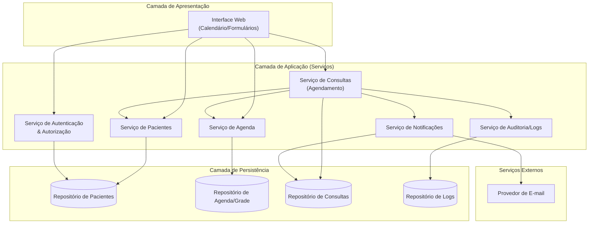
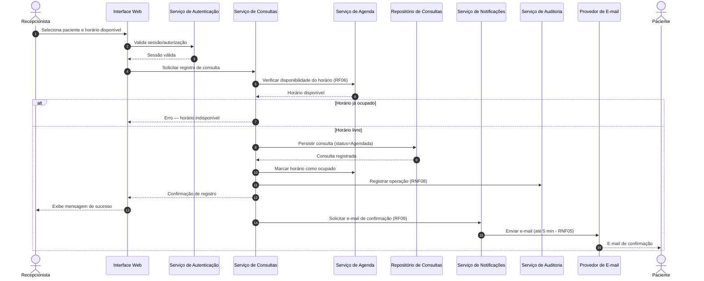
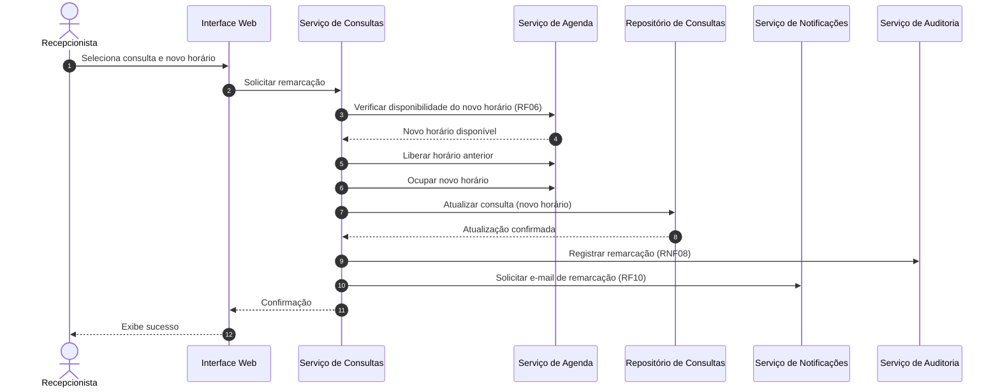
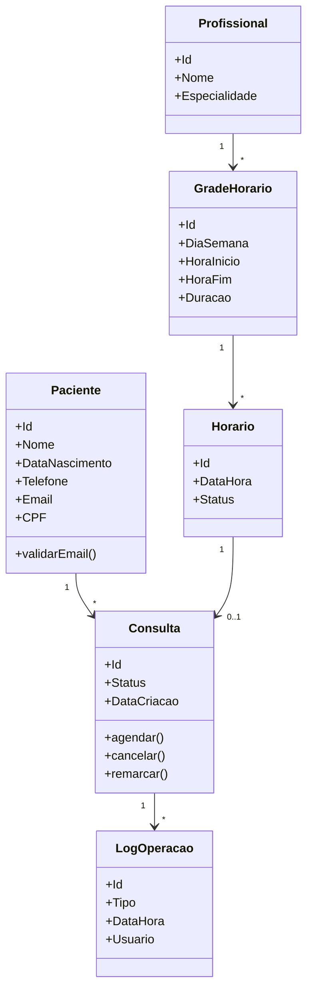

# Relatório Técnico de Arquitetura de Software
## Sistema Agendador de Consultas para Clínica Pequena (P02)

---

## 1. Identificação das HUs

| HU | Título | Perfil | RFs Relacionados | RNFs Relacionados |
|------|--------|--------|------------------|-------------------|
| HU01 | Cadastrar paciente | Recepcionista | RF01, RF02 | RNF01, RNF02 |
| HU02 | Pesquisar paciente | Recepcionista | RF03 | RNF04 |
| HU03 | Visualizar agenda do profissional | Recepcionista | RF04, RF11 | RNF03, RNF04, RNF07 |
| HU04 | Registrar agendamento | Recepcionista | RF05, RF06, RF09 | RNF05, RNF08 |
| HU05 | Cancelar agendamento | Recepcionista | RF07, RF10 | RNF08 |
| HU06 | Remarcar agendamento | Recepcionista | RF06, RF08, RF10 | RNF08 |
| HU07 | Consultar histórico do paciente | Recepcionista | RF12 | RNF04 |
| HU08 | Receber confirmação por e-mail | Paciente | RF09 | RNF05, RNF06 |
| HU09 | Receber notificação de cancelamento/remarcação | Paciente | RF10 | RNF05 |

**Observação de escopo:** RNF01 (autenticação) e RNF02 (LGPD) são requisitos transversais que não possuem HU explícita associada — ver Gap Analysis.

---

## 2. Diagramas de Arquitetura (Mermaid)

### 2.1 Diagrama de Componentes (Visão Macro)

### 2.2 Diagrama de Sequência — Registrar Agendamento (HU04)

### 2.3 Diagrama de Sequência — Remarcar Agendamento (HU06)

### 2.4 Diagrama de Classes (Modelo de Domínio)

---

## 3. Decisões de Arquitetura

| ID | Decisão | Justificativa | Requisito(s) |
|----|---------|---------------|--------------|
| DA01 | Arquitetura em camadas (Apresentação, Aplicação/Serviços, Persistência) com serviços de domínio bem delimitados. | Baixa complexidade da clínica pequena; favorece manutenibilidade sem overhead de microsserviços. | RNF08 |
| DA02 | Serviço de Notificações desacoplado e assíncrono do fluxo de agendamento. | Permite cumprir o SLA de "até 5 min" (RNF05) sem bloquear a resposta da UI; tolera indisponibilidade momentânea do provedor de e-mail. | RF09, RF10, RNF05 |
| DA03 | Validação de disponibilidade centralizada no Serviço de Consultas com verificação atômica no Repositório de Consultas. | Garante a regra de exclusividade de horário (RF06) e evita condição de corrida entre agendamentos concorrentes. | RF06 |
| DA04 | Serviço de Auditoria transversal registrando operações críticas (criar, cancelar, remarcar). | Atende rastreabilidade de operações sensíveis. | RNF08 |
| DA05 | Camada de autenticação/autorização como guarda de entrada para todas as operações. | Restringe acesso a usuários autenticados por perfil (recepcionista/administrador). | RNF01 |
| DA06 | Modelo de Grade de Horários que gera "slots" (Horario) associados ao profissional. | Suporta configuração da grade (RF11) e cálculo de disponibilidade (RF04). | RF04, RF11 |
| DA07 | Interface de calendário renderizada no cliente com carregamento otimizado da agenda. | Atende visões diária/semanal e meta de desempenho de 2s. | RNF03, RNF04 |
| DA08 | Consulta preserva histórico via status (Realizada/Cancelada) em vez de exclusão física. | Suporta histórico do paciente e conformidade LGPD (rastreabilidade). | RF12, RNF02 |

---

## 4. Tabela de Componentes e Rastreabilidade

| Componente | Responsabilidade Principal | Comunica-se com | Origem (HU / Critério de Aceite) |
|------------|----------------------------|-----------------|----------------------------------|
| Interface Web | Renderizar formulários, calendário (diário/semanal) e mensagens de confirmação | Serviço de Autenticação, Pacientes, Agenda, Consultas | HU03/CA calendário; HU04/CA confirmação; RNF03, RNF07 |
| Serviço de Autenticação & Autorização | Validar identidade e perfil dos usuários | Interface Web, Repositório de Pacientes/Usuários | RNF01 |
| Serviço de Pacientes | Cadastrar, editar e pesquisar pacientes; validar e-mail e duplicidade | Interface Web, Repositório de Pacientes | HU01/CA obrigatórios+validação+duplicidade; HU02/CA busca parcial |
| Serviço de Agenda | Gerenciar grade de horários e calcular disponibilidade (livre/ocupado) | Serviço de Consultas, Repositório de Agenda | HU03; RF04, RF11 |
| Serviço de Consultas | Registrar, cancelar, remarcar consultas; garantir exclusividade de horário | Agenda, Pacientes, Notificações, Auditoria, Repositório de Consultas | HU04, HU05, HU06; RF05–RF08 |
| Serviço de Notificações | Compor e enviar e-mails de confirmação/cancelamento/remarcação | Serviço de Consultas, Provedor de E-mail, Repositório de Consultas | HU08, HU09; RF09, RF10, RNF05 |
| Serviço de Auditoria/Logs | Registrar operações críticas com usuário e timestamp | Serviço de Consultas, Repositório de Logs | RNF08 |
| Repositório de Pacientes | Persistir dados cadastrais em conformidade com LGPD | Serviço de Pacientes, Autenticação | HU01; RNF02 |
| Repositório de Agenda/Grade | Persistir grade de horários e status dos slots | Serviço de Agenda | RF11 |
| Repositório de Consultas | Persistir consultas e histórico com status | Serviço de Consultas, Notificações | RF12; HU07 |
| Repositório de Logs | Persistir trilha de auditoria | Serviço de Auditoria | RNF08 |
| Provedor de E-mail (externo) | Entregar mensagens ao paciente | Serviço de Notificações | HU08, HU09 |

---

## 5. Bloqueios e Pendências

| ID | Descrição | Severidade | Impacto |
|----|-----------|-----------|---------|
| BL01 | **Inconsistência CPF:** HU01/CA menciona duplicidade por CPF, mas RF01 não lista CPF entre os campos de cadastro. | Alta | Modelo de dados e regra de unicidade ambíguos. |
| BL02 | **Notificação ao paciente sem canal definido além de e-mail:** pacientes sem e-mail não recebem confirmações. | Média | Fluxo HU08/HU09 pode falhar para parte dos pacientes. |
| BL03 | **Ausência de definição de "consulta realizada":** não há RF que marque uma consulta como concluída, mas RF12/HU07 exigem status "realizada". | Média | Impossível popular histórico corretamente sem regra de transição de status. |
| BL04 | **Gestão de usuários/perfis não especificada:** RNF01 cita administrador, mas nenhuma HU descreve cadastro/gestão desses usuários. | Média | Escopo de autenticação incompleto. |
| BL05 | **Política de retenção/anonimização LGPD (RNF02) não detalhada.** | Alta | Risco de não conformidade legal. |
| BL06 | **Múltiplos profissionais:** requisitos citam "o profissional" no singular, sem esclarecer se a clínica possui um ou vários. | Média | Impacta modelagem de agenda e navegação da UI. |

---

## 6. Cobertura de Requisitos

### Requisitos Funcionais
| RF | Coberto por | Status |
|----|-------------|--------|
| RF01 | Serviço de Pacientes | ✅ |
| RF02 | Serviço de Pacientes | ✅ |
| RF03 | Serviço de Pacientes | ✅ |
| RF04 | Serviço de Agenda + Interface Web | ✅ |
| RF05 | Serviço de Consultas | ✅ |
| RF06 | Serviço de Consultas + Agenda (verificação atômica) | ✅ |
| RF07 | Serviço de Consultas | ✅ |
| RF08 | Serviço de Consultas | ✅ |
| RF09 | Serviço de Notificações | ✅ |
| RF10 | Serviço de Notificações | ✅ |
| RF11 | Serviço de Agenda (grade) | ✅ |
| RF12 | Serviço de Consultas + Repositório de Consultas | ✅ (⚠ ver BL03) |

### Requisitos Não Funcionais
| RNF | Coberto por | Status |
|-----|-------------|--------|
| RNF01 | Serviço de Autenticação | ✅ |
| RNF02 | Repositório de Pacientes (política) | ⚠ Parcial (BL05) |
| RNF03 | Interface Web (calendário) | ✅ |
| RNF04 | Otimização de carga da agenda | ✅ (a validar em teste) |
| RNF05 | Serviço de Notificações assíncrono | ✅ |
| RNF06 | Estratégia de disponibilidade da plataforma | ⚠ Depende de infraestrutura |
| RNF07 | Interface Web (compatibilidade navegadores) | ✅ |
| RNF08 | Serviço de Auditoria/Logs | ✅ |

**Cobertura funcional: 12/12 (100%).** **Cobertura não funcional: 6/8 plena, 2 parciais.**

---

## 7. Gap Analysis

| Gap | Descrição da Lacuna | Impacto Arquitetural | Ação Recomendada |
|-----|---------------------|----------------------|------------------|
| G01 – Campo CPF | Divergência entre RF01 (sem CPF) e HU01 (unicidade por CPF). | Define chave de unicidade e estrutura do cadastro. | Confirmar com stakeholder se CPF é obrigatório; ajustar RF01 e a regra de duplicidade. |
| G02 – Status de conclusão da consulta | Não há evento/ação para transicionar consulta de "Agendada" → "Realizada". | Histórico (RF12/HU07) fica incompleto. | Definir gatilho (manual pela recepcionista ou automático pós-horário) e incluir RF correspondente. |
| G03 – Conformidade LGPD detalhada | RNF02 sem política concreta de consentimento, retenção e anonimização. | Impacta persistência, logs e ciclo de vida de dados pessoais. | Especificar políticas de retenção, direito ao esquecimento e criptografia de dados sensíveis. |
| G04 – Gestão de usuários/perfil administrador | Perfil administrador citado sem HU de gestão. | Módulo de administração ausente do escopo. | Criar HU para gestão de usuários e definir matriz de permissões por perfil. |
| G05 – Falha na entrega de e-mail | RNF05 define SLA, mas não há tratamento de falha/retentativa. | Confiabilidade da notificação. | Definir política de retentativa, dead-letter e alerta ao operador; registrar em log. |
| G06 – Multiplicidade de profissionais | Ambiguidade sobre número de profissionais na clínica. | Modelo de agenda e navegação da UI. | Confirmar quantidade; se múltiplos, adicionar filtro/seleção de profissional na agenda. |
| G07 – Meta de desempenho (RNF04) | 2s de carga da agenda sem definição de volume esperado de dados. | Estratégia de indexação/paginação da agenda. | Definir volumetria e estabelecer testes de carga com critério de aceite mensurável. |
| G08 – Disponibilidade (RNF06) | 99% de uptime sem definição de infraestrutura/monitoramento. | Requer estratégia de deploy, backup e monitoramento. | Definir plano de contingência, backup e observabilidade (fora do design abstrato). |
| G09 – Fuso horário/reserva concorrente | Não especificado tratamento de concorrência entre duas recepcionistas. | Reforça necessidade de verificação atômica (DA03). | Confirmar controle de concorrência otimista/pessimista no registro de consulta. |

---

*Fim do Relatório Canônico — AI4ES Time 2.*