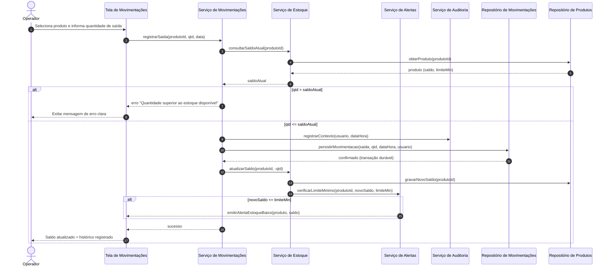
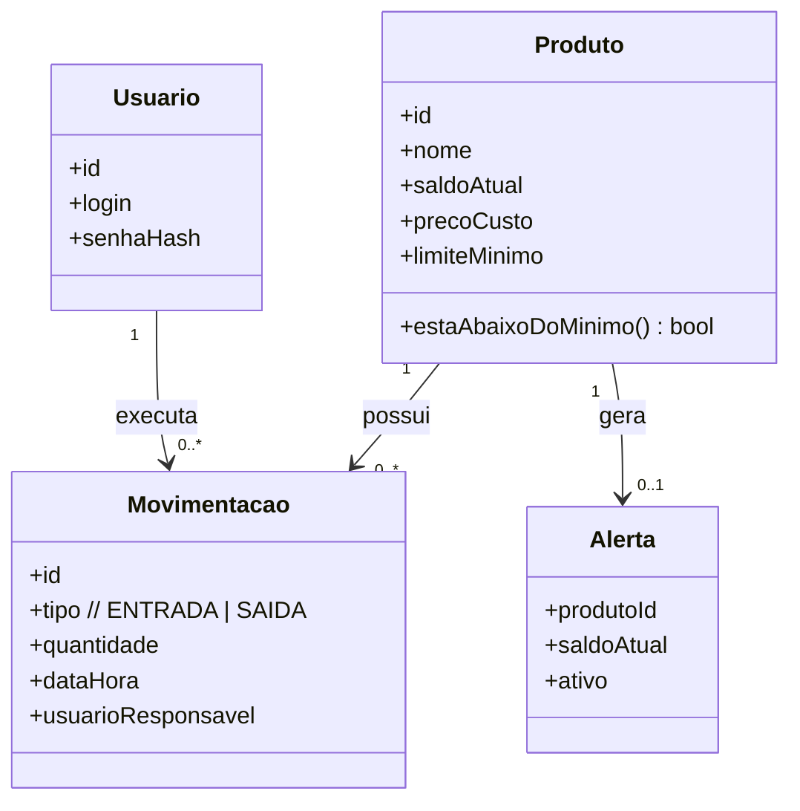

# Relatório Técnico de Arquitetura de Software
### Sistema de Controle de Estoque para Loja Física (P03)
**AI4ES — Time 2 · Relatório Canônico de Arquitetura**

---

## 1. Identificação das HUs

| HU | Título | Perfil | RFs Relacionados | RNFs Relacionados |
|----|--------|--------|------------------|-------------------|
| HU01 | Cadastrar produto | Operador | RF01, RF12 | RNF04, RNF08 |
| HU02 | Registrar entrada de mercadoria | Operador | RF04, RF07, RF11, RF12 | RNF03, RNF04, RNF08 |
| HU03 | Registrar saída de produto | Operador | RF05, RF06, RF07, RF11 | RNF03, RNF04, RNF08 |
| HU04 | Ser alertado sobre estoque baixo | Operador | RF08, RF09 | RNF04 |
| HU05 | Configurar limite mínimo por produto | Operador | RF08, RF02 | — |
| HU06 | Consultar saldo atual do estoque | Operador | RF10, RF09 | RNF05 |
| HU07 | Consultar histórico de movimentações | Operador | RF11 | RNF05, RNF08 |
| HU08 | Exportar dados em CSV | Operador | RF10, RF11 | RNF07 |

**HUs transversais implícitas:** Autenticação (RNF06), Edição de produto (RF02 → HU05/gestão), Remoção de produto (RF03) — ver Gap Analysis.

---

## 2. Diagramas de Arquitetura (Mermaid)

### 2.1 Diagrama de Componentes (visão macro — aplicação desktop local)

```mermaid
graph TD
    subgraph Camada_Apresentacao["Camada de Apresentação (Desktop)"]
        UI_Login["Tela de Autenticação"]
        UI_Produto["Tela de Produtos"]
        UI_Mov["Tela de Movimentações"]
        UI_Consulta["Tela de Consulta de Estoque"]
        UI_Hist["Tela de Histórico"]
        UI_Alerta["Painel de Alertas"]
    end

    subgraph Camada_Aplicacao["Camada de Aplicação (Serviços)"]
        S_Auth["Serviço de Autenticação"]
        S_Produto["Serviço de Produtos"]
        S_Estoque["Serviço de Estoque/Saldo"]
        S_Mov["Serviço de Movimentações"]
        S_Alerta["Serviço de Alertas"]
        S_Export["Serviço de Exportação CSV"]
        S_Audit["Serviço de Rastreabilidade/Auditoria"]
    end

    subgraph Camada_Dominio["Camada de Domínio"]
        E_Produto["Entidade Produto"]
        E_Mov["Entidade Movimentação"]
        E_Usuario["Entidade Usuário"]
        R_Estoque["Regras de Saldo/Limite"]
    end

    subgraph Camada_Persistencia["Camada de Persistência (Banco Embarcado Local)"]
        Repo_Produto["Repositório de Produtos"]
        Repo_Mov["Repositório de Movimentações"]
        Repo_Usuario["Repositório de Usuários"]
        DB[("Banco Embarcado Local")]
    end

    UI_Login --> S_Auth
    UI_Produto --> S_Produto
    UI_Mov --> S_Mov
    UI_Consulta --> S_Estoque
    UI_Hist --> S_Mov
    UI_Alerta --> S_Alerta

    S_Auth --> Repo_Usuario
    S_Produto --> Repo_Produto
    S_Mov --> S_Estoque
    S_Mov --> S_Audit
    S_Mov --> Repo_Mov
    S_Estoque --> Repo_Produto
    S_Estoque --> S_Alerta
    S_Alerta --> UI_Alerta
    S_Export --> Repo_Produto
    S_Export --> Repo_Mov

    S_Produto --> E_Produto
    S_Mov --> E_Mov
    S_Estoque --> R_Estoque
    S_Auth --> E_Usuario

    Repo_Produto --> DB
    Repo_Mov --> DB
    Repo_Usuario --> DB
```

### 2.2 Diagrama de Sequência — Registro de Saída (HU03, RF05/RF06/RF07/RF09)

### 2.3 Diagrama de Classes (Domínio)

---

## 3. Decisões de Arquitetura

| ID | Decisão | Justificativa | Requisito de Origem |
|----|---------|---------------|---------------------|
| DA01 | **Arquitetura em camadas (Apresentação → Aplicação → Domínio → Persistência)** monolítica de aplicação desktop única. | Requisito é desktop local, single-user por sessão autenticada; camadas garantem manutenibilidade sem complexidade distribuída. | RNF01, RNF02 |
| DA02 | **Persistência local em banco embarcado**, sem servidor externo. | Exigência explícita de operação local. | RNF02 |
| DA03 | **Transações duráveis para lançamentos**: gravação da movimentação confirmada (commit) *antes* de sinalizar sucesso à UI. | Nenhum lançamento pode ser perdido em fechamento inesperado. | RNF03 |
| DA04 | **Saldo materializado no Produto + histórico imutável de Movimentações.** | Consultas de saldo ≤2s mesmo com volume; histórico serve à rastreabilidade. | RNF05, RF07 |
| DA05 | **Serviço de Alertas reativo ao evento de atualização de saldo.** | Alerta deve surgir imediatamente ao cruzar o limite e persistir até reposição. | RF09, HU04 |
| DA06 | **Serviço de Auditoria transversal** injeta usuário + data/hora em todo lançamento. | Rastreabilidade obrigatória. | RNF08 |
| DA07 | **Autenticação como gate de entrada** anterior a qualquer operação. | Acesso protegido por usuário/senha. | RNF06 |
| DA08 | **Índices em (produto, data)** no repositório de movimentações. | Desempenho de consulta/histórico filtrado por produto e período. | RNF05, RF11 |
| DA09 | **Serviço de Exportação desacoplado** que lê repositórios e gera CSV em diretório escolhido. | Backup/análise externa sem acoplar formato à persistência. | RNF07, HU08 |
| DA10 | **Validações de domínio centralizadas** (nome único, inteiros positivos, limite não negativo). | Consistência das regras de HU01/HU02/HU05. | RF01, RF06, RF08 |

---

## 4. Tabela de Componentes e Rastreabilidade

| Componente | Responsabilidade Principal | Comunica-se com | Origem (HU / Critério de Aceite) |
|------------|----------------------------|-----------------|----------------------------------|
| Tela de Autenticação | Coletar credenciais e iniciar sessão | Serviço de Autenticação | RNF06 |
| Serviço de Autenticação | Validar usuário/senha, manter sessão | Repositório de Usuários, todos os fluxos | RNF06, RNF08 |
| Tela de Produtos | Cadastrar/editar/remover e pesquisar produtos | Serviço de Produtos | HU01, RF01–RF03, RF12 |
| Serviço de Produtos | Regras de cadastro, unicidade de nome, edição, limite mínimo | Repositório de Produtos, Domínio | HU01 (nome obrigatório, sem duplicidade), HU05, RF02, RF08 |
| Tela de Movimentações | Registrar entradas e saídas | Serviço de Movimentações | HU02, HU03 |
| Serviço de Movimentações | Orquestrar lançamento, validar saldo, gravar histórico durável | Serviço de Estoque, Auditoria, Repositório de Movimentações | HU02, HU03, RF04–RF06, RNF03 |
| Serviço de Estoque/Saldo | Calcular e atualizar saldo, verificar limite | Repositório de Produtos, Serviço de Alertas | RF07, RF10, HU02 (saldo imediato), HU03 |
| Serviço de Alertas | Detectar e manter alertas de estoque baixo | Serviço de Estoque, Painel de Alertas | HU04, RF09 (persistir até reposição) |
| Painel de Alertas | Exibir alerta destacado com produto e saldo | Serviço de Alertas | HU04 (destaque visual, identificação) |
| Tela de Consulta de Estoque | Listar todos os produtos com saldo/limite, ordenar, destacar baixos | Serviço de Estoque | HU06, RF10 |
| Tela de Histórico | Filtrar por produto e período, ordem cronológica decrescente | Serviço de Movimentações | HU07, RF11 |
| Serviço de Rastreabilidade/Auditoria | Anexar usuário, data e hora a cada lançamento | Serviço de Movimentações, Serviço de Autenticação | RNF08, HU07 |
| Serviço de Exportação CSV | Gerar arquivo CSV em diretório escolhido, confirmar sucesso | Repositório de Produtos, Repositório de Movimentações | HU08, RNF07 |
| Repositório de Produtos | Persistir/consultar produtos e saldos | Banco Embarcado Local | RF01–RF03, RF07, RF10 |
| Repositório de Movimentações | Persistir/consultar histórico com índices | Banco Embarcado Local | RF04, RF05, RF11 |
| Repositório de Usuários | Persistir/consultar credenciais | Banco Embarcado Local | RNF06 |
| Banco Embarcado Local | Armazenamento durável local | Repositórios | RNF02, RNF03 |

---

## 5. Bloqueios e Pendências

| ID | Descrição | Severidade | Tipo |
|----|-----------|------------|------|
| BL01 | RF03 (remoção de produto) **não possui HU nem critério de aceite**: não está definido o comportamento quando o produto possui movimentações no histórico (exclusão física vs. inativação lógica). | Alta | Regra de negócio |
| BL02 | RNF06 define autenticação, mas **não há definição de gestão de usuários** (cadastro, perfis, recuperação de senha). Só existe o perfil "Operador". | Média | Escopo |
| BL03 | Não há política definida de **backup/retenção** além da exportação manual CSV; RNF03 exige durabilidade mas não frequência de checkpoints. | Média | Confiabilidade |
| BL04 | RNF04 ("três interações") carece de definição precisa de "interação" (clique? tela? campo?), dificultando validação objetiva. | Baixa | Ambiguidade |
| BL05 | Comportamento do saldo ao **editar preço de custo / renomear produto** e impacto no histórico não especificado (RF02). | Média | Regra de negócio |
| BL06 | Não especificado se **estorno/correção de lançamento** é permitido (movimentações são imutáveis?). | Média | Regra de negócio |

---

## 6. Cobertura de Requisitos

### Requisitos Funcionais
| RF | Coberto por | Status |
|----|-------------|--------|
| RF01 | Serviço de Produtos / Tela de Produtos | ✅ |
| RF02 | Serviço de Produtos (edição) | ⚠️ Parcial (ver BL05) |
| RF03 | Serviço de Produtos (remoção) | ⚠️ Parcial (ver BL01) |
| RF04 | Serviço de Movimentações | ✅ |
| RF05 | Serviço de Movimentações | ✅ |
| RF06 | Serviço de Movimentações (validação de saldo) | ✅ |
| RF07 | Serviço de Estoque | ✅ |
| RF08 | Serviço de Produtos (limite mínimo) | ✅ |
| RF09 | Serviço de Alertas / Painel de Alertas | ✅ |
| RF10 | Tela de Consulta de Estoque | ✅ |
| RF11 | Tela de Histórico / Serviço de Movimentações | ✅ |
| RF12 | Serviço de Produtos (pesquisa por nome) | ✅ |

### Requisitos Não Funcionais
| RNF | Coberto por | Status |
|-----|-------------|--------|
| RNF01 | Aplicação desktop (camada de apresentação) | ✅ |
| RNF02 | Banco Embarcado Local | ✅ |
| RNF03 | DA03 (transações duráveis) | ✅ |
| RNF04 | Design de UI (3 interações) | ⚠️ Verificável só em UX (BL04) |
| RNF05 | DA04/DA08 (saldo materializado, índices) | ✅ |
| RNF06 | Serviço de Autenticação | ✅ |
| RNF07 | Serviço de Exportação CSV | ✅ |
| RNF08 | Serviço de Auditoria | ✅ |

**Cobertura funcional:** 10/12 plena, 2/12 parcial.
**Cobertura não funcional:** 7/8 plena, 1/8 dependente de validação UX.

---

## 7. Gap Analysis

| # | Lacuna Identificada | Impacto Arquitetural | Ação Recomendada |
|---|---------------------|----------------------|------------------|
| G01 | **Remoção de produto com histórico** (BL01/RF03). | Exclusão física quebraria integridade referencial do histórico (RF11/RNF08). | Adotar **inativação lógica** (flag `ativo`); produto some da consulta mas preserva movimentações. Definir HU específica. |
| G02 | **Ausência de gestão de usuários** (BL02). | Autenticação sem cadastro de credenciais impede primeiro acesso; RNF08 exige "usuário responsável". | Especificar HU de administração de usuários (ao menos criação inicial/seed) e política de senha. |
| G03 | **Imutabilidade vs. correção de lançamentos** (BL06). | Define se histórico é append-only ou permite ajuste; afeta modelo de dados e auditoria. | Definir estratégia de **estorno por lançamento compensatório** para manter rastreabilidade sem edição destrutiva. |
| G04 | **Durabilidade x fechamento inesperado** (RNF03/BL03). | Precisa de commit atômico por lançamento e recuperação de estado consistente na reabertura. | Confirmar transação antes do feedback de sucesso; incluir teste de crash-recovery na suíte de qualidade. |
| G05 | **Métrica de usabilidade "3 interações"** (RNF04/BL04). | Sem definição, o requisito é inauditável. | Formalizar definição de "interação" e criar checklist de UX validável. |
| G06 | **Impacto de edição de produto no histórico** (RF02/BL05). | Renomear/reprecificar pode distorcer relatórios históricos. | Registrar snapshot do nome/dado relevante no momento da movimentação, ou versionar produto. |
| G07 | **Volume e desempenho do CSV** (RNF07). | Exportação de grande volume pode bloquear a UI. | Executar exportação em processo assíncrono/streaming com feedback de progresso. |
| G08 | **Concorrência de sessão** não especificada. | Mesmo sendo desktop local, múltiplas instâncias no mesmo banco podem causar corridas no saldo. | Definir bloqueio de instância única ou controle transacional otimista sobre o saldo. |
| G09 | **Persistência e reexibição de alertas** (RF09/HU04). | Alerta deve persistir até reposição — exige estado consultável, não apenas notificação efêmera. | Modelar alerta como estado derivado consultável (produto abaixo do mínimo), recalculado a cada carga/lançamento. |

---

> **Nota de Neutralidade Tecnológica:** Este relatório descreve responsabilidades e interfaces conceituais. Termos como "banco embarcado local", "aplicação desktop" e "CSV" derivam literalmente dos requisitos (RNF01, RNF02, RNF07). Nenhum produto, framework ou fornecedor específico foi prescrito.