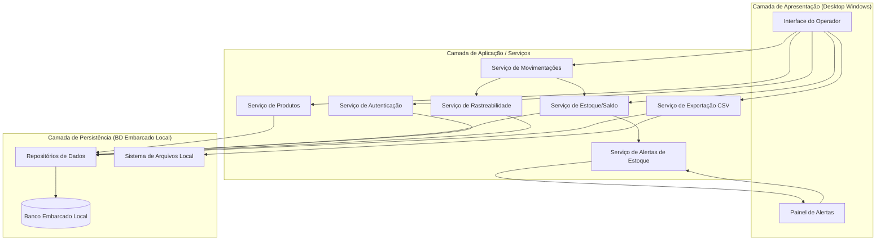
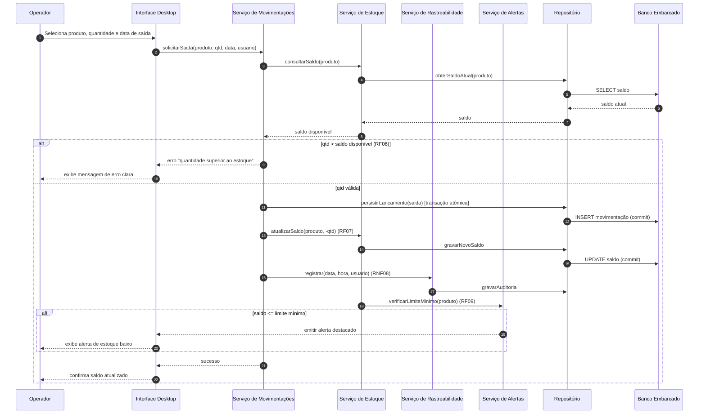
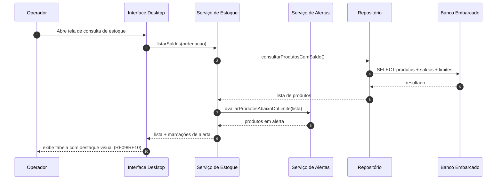
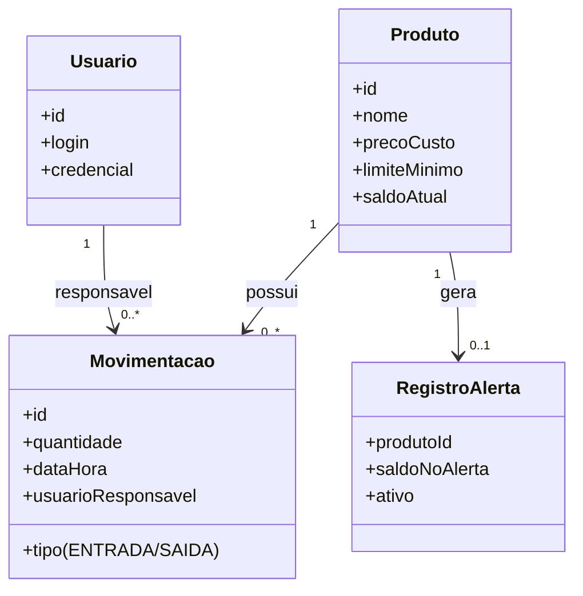

# Relatório Técnico de Arquitetura de Software
## Sistema de Controle de Estoque para Loja Física (P03)

---

## 1. Identificação das HUs

| HU | Título | Perfil | RFs Relacionados | RNFs Relacionados |
|----|--------|--------|------------------|-------------------|
| HU01 | Cadastrar produto | Operador | RF01 | RNF02, RNF06, RNF08 |
| HU02 | Registrar entrada de mercadoria | Operador | RF04, RF07 | RNF03, RNF08 |
| HU03 | Registrar saída de produto | Operador | RF05, RF06, RF07 | RNF03, RNF08 |
| HU04 | Ser alertado sobre estoque baixo | Operador | RF09 | RNF04 |
| HU05 | Configurar limite mínimo por produto | Operador | RF08 | — |
| HU06 | Consultar saldo atual do estoque | Operador | RF10, RF12 | RNF05 |
| HU07 | Consultar histórico de movimentações | Operador | RF11 | RNF05, RNF08 |
| HU08 | Exportar dados em CSV | Operador | — | RNF07 |
| (transversais) | Editar/Remover produto | Operador | RF02, RF03 | RNF06 |

> Observação: RF02 e RF03 não possuem HU dedicada (ver Seção 7 — Gap Analysis).

---

## 2. Diagramas de Arquitetura (Mermaid)

### 2.1 Diagrama de Componentes (visão macro)

### 2.2 Diagrama de Sequência — Registro de Saída (HU03)

### 2.3 Diagrama de Sequência — Consulta com Alerta (HU06/HU04)

### 2.4 Diagrama de Classes (modelo de domínio)

---

## 3. Decisões de Arquitetura

| ID | Decisão | Justificativa | Requisito de Origem |
|----|---------|---------------|---------------------|
| DA01 | Arquitetura em camadas (Apresentação / Aplicação / Persistência) num único aplicativo desktop | Aplicação local monousuário/monoestação sem servidor externo | RNF01, RNF02 |
| DA02 | Persistência em banco de dados **embarcado local** | Requisito explícito de operação sem servidor externo | RNF02 |
| DA03 | Operações de lançamento executadas em **transações atômicas com commit imediato** | Garantir que nenhum lançamento seja perdido em fechamento inesperado | RNF03 |
| DA04 | Serviço de Estoque centraliza a lógica de saldo e dispara verificação de limite após cada lançamento | Consistência do saldo (RF07) e trigger de alerta (RF09) em um único ponto | RF07, RF09 |
| DA05 | Serviço de Rastreabilidade transversal registrando data/hora/usuário em todo lançamento | Rastreabilidade padronizada | RNF08 |
| DA06 | Validação de saída (qtd ≤ saldo) na camada de aplicação antes da persistência | Impedir estoque negativo de forma confiável | RF06 |
| DA07 | Serviço de Exportação isolado escrevendo em arquivo CSV no sistema de arquivos local | Backup/análise externa desacoplado do domínio | RNF07 |
| DA08 | Autenticação obrigatória no início da sessão, identidade propagada aos serviços | Segurança de acesso e preenchimento do usuário responsável | RNF06, RNF08 |
| DA09 | Índices/consultas otimizadas para saldo e histórico | Atender teto de 2s mesmo com grande volume | RNF05 |
| DA10 | Alertas mantidos como estado persistente até reposição acima do limite | Alerta deve persistir até normalização | RF09 (HU04) |

---

## 4. Tabela de Componentes e Rastreabilidade

| Componente | Responsabilidade Principal | Comunica-se com | Origem (HU / Critério de Aceite) |
|------------|---------------------------|-----------------|----------------------------------|
| Interface do Operador (UI) | Renderizar telas, capturar entradas, limitar operações a ≤3 interações | Todos os serviços de aplicação | HU01–HU08 / RNF04 |
| Painel de Alertas | Exibir alertas destacados de estoque baixo | Serviço de Alertas | HU04 (destaque visual, persistência) / RF09 |
| Serviço de Autenticação | Validar usuário/senha e iniciar sessão | UI, Repositório | RNF06 |
| Serviço de Produtos | Cadastrar, editar, remover, pesquisar e configurar limite mínimo | UI, Repositório | HU01, HU05 / RF01, RF02, RF03, RF08, RF12 |
| Serviço de Movimentações | Registrar entradas e saídas, validar saída, consultar histórico | UI, Serviço de Estoque, Rastreabilidade, Repositório | HU02, HU03, HU07 / RF04, RF05, RF06, RF11 |
| Serviço de Estoque/Saldo | Calcular e atualizar saldo, listar saldos ordenados, checar limite | Movimentações, Alertas, Repositório | HU06 / RF07, RF10 |
| Serviço de Alertas de Estoque | Avaliar limite mínimo e gerar/persistir alertas ativos | Estoque, Painel de Alertas | HU04, HU06 / RF09 |
| Serviço de Rastreabilidade | Registrar data/hora/usuário de cada lançamento | Movimentações, Repositório | HU02, HU03, HU07 / RNF08 |
| Serviço de Exportação CSV | Gerar arquivo CSV, escolher diretório, confirmar sucesso | UI, Repositório, Sistema de Arquivos | HU08 / RNF07 |
| Repositório de Dados | Abstrair acesso e persistência transacional | Todos os serviços, Banco Embarcado | RNF02, RNF03 |
| Banco Embarcado Local | Armazenar dados localmente sem servidor | Repositório | RNF02 |
| Sistema de Arquivos Local | Destino dos arquivos de exportação | Serviço de Exportação | HU08 |

---

## 5. Bloqueios e Pendências

| ID | Descrição | Severidade | Impacto |
|----|-----------|-----------|---------|
| BP01 | Modelo de gestão de usuários indefinido: RNF06/RNF08 exigem usuário responsável, mas não há HU para cadastro/gestão de usuários nem perfis distintos | Alta | Impede especificar tabela de usuários e fluxo de administração |
| BP02 | RF02 (editar) e RF03 (remover) sem HU nem critérios de aceite — sem regras sobre remoção de produto com movimentações históricas | Alta | Risco de perda de integridade referencial no histórico |
| BP03 | "Grande volume de registros" (RNF05) não quantificado | Média | Sem baseline para validar teto de 2s |
| BP04 | Comportamento de exportação (HU08): não define se exporta tudo ou aplica filtros; formato de datas e encoding do CSV não especificados | Média | Ambiguidade na implementação do exportador |
| BP05 | RF04/RF05 permitem informar a data manualmente, mas RNF08 exige data/hora do sistema — possível conflito entre data do evento e data de registro | Média | Definir dois campos: data do evento vs. timestamp de auditoria |
| BP06 | Política de backup/recuperação após crash (RNF03) não detalhada além da atomicidade | Baixa | Estratégia de recuperação a definir |

---

## 6. Cobertura de Requisitos

### Requisitos Funcionais
| RF | Coberto por | Status |
|----|-------------|--------|
| RF01 | Serviço de Produtos | ✅ |
| RF02 | Serviço de Produtos | ⚠️ (sem HU/critérios) |
| RF03 | Serviço de Produtos | ⚠️ (sem HU/critérios) |
| RF04 | Serviço de Movimentações | ✅ |
| RF05 | Serviço de Movimentações | ✅ |
| RF06 | Serviço de Movimentações (validação) | ✅ |
| RF07 | Serviço de Estoque | ✅ |
| RF08 | Serviço de Produtos | ✅ |
| RF09 | Serviço de Alertas | ✅ |
| RF10 | Serviço de Estoque + UI | ✅ |
| RF11 | Serviço de Movimentações | ✅ |
| RF12 | Serviço de Produtos (busca) | ✅ |

### Requisitos Não Funcionais
| RNF | Tratado por | Status |
|-----|-------------|--------|
| RNF01 | Camada de Apresentação Desktop Windows | ✅ |
| RNF02 | Banco Embarcado Local / Repositório | ✅ |
| RNF03 | Transações atômicas (DA03) | ✅ |
| RNF04 | UI orientada a ≤3 interações | ⚠️ (validar em design de UX) |
| RNF05 | Consultas otimizadas (DA09) | ⚠️ (falta baseline de volume) |
| RNF06 | Serviço de Autenticação | ✅ |
| RNF07 | Serviço de Exportação CSV | ✅ |
| RNF08 | Serviço de Rastreabilidade | ✅ |

**Cobertura funcional:** 10/12 plenamente cobertos; 2 parciais (RF02/RF03 sem HU).
**Cobertura não funcional:** 6/8 plenamente; 2 parciais (RNF04/RNF05 dependem de detalhamento).

---

## 7. Gap Analysis

| # | Lacuna | Impacto Arquitetural | Ação Recomendada |
|---|--------|----------------------|------------------|
| G01 | **Gestão de usuários ausente**: RNF06 e RNF08 exigem autenticação e usuário responsável, mas não há requisito para criar/administrar usuários | Sem definição de entidade Usuário, perfis e onboarding; bloqueia auditoria completa | Criar HU de administração de usuários e definir se há perfis (admin/operador) |
| G02 | **RF02/RF03 sem regras**: editar e remover produto não têm critérios de aceite | Remoção de produto com histórico pode quebrar integridade referencial | Definir soft-delete/inativação em vez de exclusão física; especificar critérios |
| G03 | **Conflito data do evento × data de auditoria** (RF04/RF05 vs RNF08) | Ambiguidade sobre qual data exibir no histórico | Modelar dois campos distintos: `dataMovimentacao` (informada) e `timestampRegistro` (sistema) |
| G04 | **RNF05 sem métrica de volume** | Impossível dimensionar índices e validar 2s | Solicitar volume esperado (nº de produtos/movimentações) e definir estratégia de paginação |
| G05 | **Exportação CSV subespecificada** (HU08) | Encoding, separador, escopo (filtrado vs total) indefinidos | Definir layout do CSV, encoding UTF-8, e se respeita filtros de tela |
| G06 | **Ausência de requisito de recuperação pós-crash** além de atomicidade (RNF03) | Estratégia de integridade limitada a transações | Especificar checkpoints/journaling do banco embarcado |
| G07 | **Concorrência não especificada** | Assume-se monousuário local; multiestação não previsto | Confirmar se é single-station; caso contrário, revisar controle de concorrência de saldo |
| G08 | **Internacionalização/formatos monetários e numéricos** não tratados (preço de custo) | Parsing/validação de valores | Definir formato de moeda e precisão decimal |

---

*Fim do Relatório Canônico — AI4ES Time 2.*