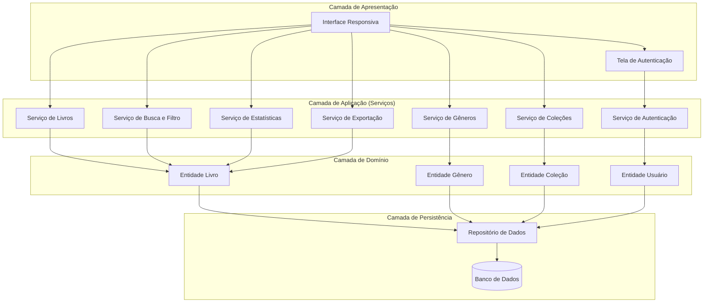
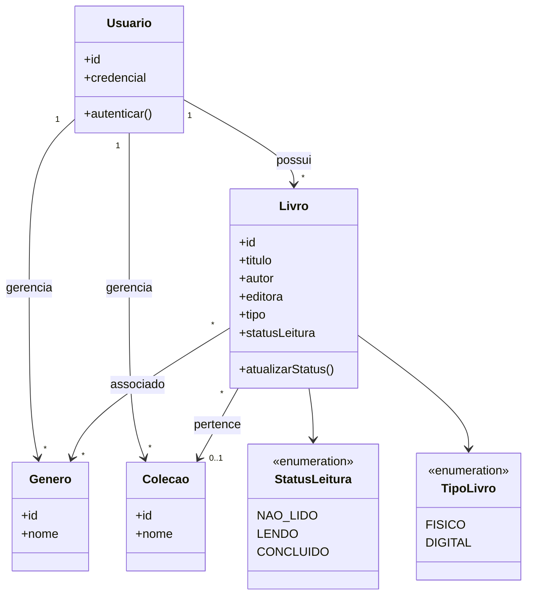
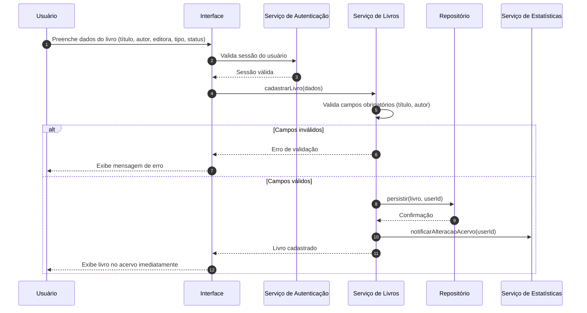
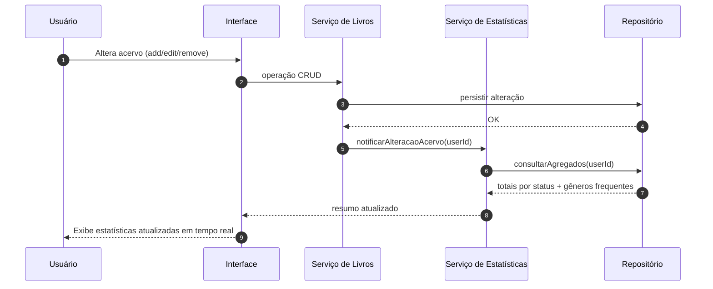

# Relatório Técnico de Arquitetura de Software
### Sistema de Catalogação de Livros — Biblioteca Pessoal (P04)

---

## 1. Identificação das HUs

| HU | Título | RFs Associados | RNFs Associados | Ator |
|------|--------|----------------|-----------------|------|
| HU01 | Cadastrar livro | RF01, RF04, RF13 | RNF01, RNF04 | Usuário |
| HU02 | Atualizar status de leitura | RF05, RF04 | RNF05 | Usuário |
| HU03 | Organizar livros por gênero | RF06, RF08 | RNF04 | Usuário |
| HU04 | Organizar livros por coleção | RF07, RF08 | RNF04 | Usuário |
| HU05 | Filtrar o acervo | RF09 | RNF02, RNF03 | Usuário |
| HU06 | Pesquisar livros por título ou autor | RF12 | RNF03 | Usuário |
| HU07 | Visualizar resumo do acervo | RF10, RF11 | RNF05 | Usuário |
| HU08 | Exportar o acervo | RF07(exp), RNF07 | RNF07 | Usuário |

**Observações de identificação:**
- RF02 e RF03 (editar/remover livro) são operações CRUD transversais implícitas em HU01 e no ciclo de vida do acervo, embora não tenham HU dedicada.
- RNF06 (compatibilidade de navegadores) é atendido no nível da camada de apresentação.

---

## 2. Diagramas de Arquitetura (Mermaid)

### 2.1 Diagrama de Componentes (Visão de Camadas)

### 2.2 Diagrama de Classes (Modelo de Domínio)

### 2.3 Diagrama de Sequência — HU01 (Cadastrar Livro)

### 2.4 Diagrama de Sequência — HU07 (Resumo em Tempo Real)

---

## 3. Decisões de Arquitetura

| ID | Decisão | Justificativa | Requisito Base |
|----|---------|---------------|----------------|
| DA01 | Arquitetura em camadas (Apresentação, Aplicação, Domínio, Persistência) | Separação de responsabilidades, testabilidade e manutenibilidade | RNF07 |
| DA02 | Isolamento de dados por usuário via chave de proprietário em todas as consultas | Garantir acervo estritamente pessoal | RNF01 |
| DA03 | Camada de apresentação responsiva e agnóstica de dispositivo | Suporte a mobile/desktop e navegadores modernos | RNF02, RNF06 |
| DA04 | Serviço de Estatísticas orientado a eventos/notificações do acervo | Atualização do resumo em tempo real | RNF05, RF10, RF11 |
| DA05 | Persistência em banco de dados com repositório abstrato | Durabilidade e ausência de perda de dados | RNF04 |
| DA06 | Serviço de Busca/Filtro com indexação de atributos consultáveis | Atender listagem/filtragem ≤ 2s independente de volume | RNF03, RF09, RF12 |
| DA07 | Modelagem de relação Livro↔Gênero (N:N) e Livro↔Coleção (N:1) | Um livro em múltiplos gêneros, mas em uma única coleção | RF08, HU03, HU04 |
| DA08 | Remoção de gênero/coleção apenas desvincula, não deleta livros | Preservar integridade do acervo | HU03, HU04 |
| DA09 | Serviço de Exportação desacoplado gerando CSV/JSON sob demanda | Backup pessoal sem afetar demais operações | RNF07, HU08 |
| DA10 | Status e Tipo modelados como enumerações fixas | Consistência de opções (não lido/lendo/concluído; físico/digital) | RF04, RF13 |

---

## 4. Tabela de Componentes e Rastreabilidade

| Componente | Responsabilidade Principal | Comunica-se com | Origem (HU / Critério de Aceite) |
|------------|---------------------------|-----------------|----------------------------------|
| Interface Responsiva | Renderizar telas, capturar entradas, exibir resultados dinâmicos | Todos os serviços | HU05 (atualização dinâmica), HU06, RNF02, RNF06 |
| Serviço de Autenticação | Autenticar usuário e garantir isolamento de sessão | Interface, Entidade Usuário | RNF01 |
| Serviço de Livros | CRUD de livros, validação de campos, gestão de status/tipo | Interface, Repositório, Serviço de Estatísticas | HU01, HU02 / "título e autor obrigatórios", RF02, RF03, RF05, RF13 |
| Serviço de Gêneros | Criar, renomear, remover gêneros e associar a livros | Interface, Repositório | HU03 / "criar, renomear, remover livremente" |
| Serviço de Coleções | Criar, renomear, remover coleções; associar 0..1 por livro | Interface, Repositório | HU04 / "apenas uma coleção por vez" |
| Serviço de Busca e Filtro | Filtragem multi-atributo combinável e busca parcial por título/autor | Interface, Repositório | HU05, HU06 / "combinar filtros", "resultados parciais" |
| Serviço de Estatísticas | Calcular totais por status e gêneros mais frequentes em tempo real | Interface, Repositório, Serviço de Livros | HU07 / "atualizadas automaticamente", RF10, RF11 |
| Serviço de Exportação | Gerar arquivo CSV/JSON com todos os campos para download | Interface, Repositório | HU08 / "escolher formato", "download pelo navegador" |
| Entidade Livro | Representar dados e regras do livro | Repositório | HU01, RF01 |
| Entidade Gênero | Representar gênero literário | Repositório | HU03 |
| Entidade Coleção | Representar coleção pessoal | Repositório | HU04 |
| Entidade Usuário | Representar proprietário do acervo | Serviço de Autenticação | RNF01 |
| Repositório de Dados | Abstrair persistência e consultas com filtro por usuário | Banco de Dados | RNF04, DA02 |
| Banco de Dados | Armazenar dados de forma durável | Repositório | RNF04 |

---

## 5. Bloqueios e Pendências

| ID | Descrição | Severidade | Tipo |
|----|-----------|-----------|------|
| BL01 | Mecanismo de autenticação não especificado (login/senha, provedor externo, tipo de credencial) | Alta | Requisito ambíguo |
| BL02 | Não há definição de cadastro/registro de novos usuários nem recuperação de acesso | Alta | Requisito ausente |
| BL03 | RNF03 exige ≤2s "independentemente do volume", mas não há limite máximo de registros nem estratégia de paginação definida | Média | Requisito de desempenho incompleto |
| BL04 | Diferenciação físico/digital (RF13) não define atributos específicos por tipo (ex.: formato de arquivo digital, localização física) | Baixa | Requisito ambíguo |
| BL05 | "Gêneros mais frequentes" (RF11) não define quantidade a exibir nem critério de desempate | Baixa | Regra de negócio indefinida |
| BL06 | Não há especificação de tratamento de dados na exportação quanto a privacidade/tamanho de arquivo | Baixa | Pendência menor |

---

## 6. Cobertura de Requisitos

### Requisitos Funcionais

| RF | Coberto por | Status |
|----|-------------|--------|
| RF01 | Serviço de Livros, Entidade Livro | ✅ |
| RF02 | Serviço de Livros (CRUD) | ✅ |
| RF03 | Serviço de Livros (CRUD) | ✅ |
| RF04 | Enum StatusLeitura | ✅ |
| RF05 | Serviço de Livros (atualizarStatus) | ✅ |
| RF06 | Serviço de Gêneros | ✅ |
| RF07 | Serviço de Coleções | ✅ |
| RF08 | Relações Livro↔Gênero / Livro↔Coleção | ✅ |
| RF09 | Serviço de Busca e Filtro | ✅ |
| RF10 | Serviço de Estatísticas | ✅ |
| RF11 | Serviço de Estatísticas | ✅ (regra a detalhar – BL05) |
| RF12 | Serviço de Busca e Filtro | ✅ |
| RF13 | Enum TipoLivro | ✅ (atributos a detalhar – BL04) |

### Requisitos Não Funcionais

| RNF | Coberto por | Status |
|-----|-------------|--------|
| RNF01 | Serviço de Autenticação, isolamento por usuário (DA02) | ⚠️ Parcial (BL01, BL02) |
| RNF02 | Interface Responsiva | ✅ |
| RNF03 | Serviço de Busca/Filtro com indexação (DA06) | ⚠️ Parcial (BL03) |
| RNF04 | Repositório + Banco de Dados | ✅ |
| RNF05 | Serviço de Estatísticas orientado a eventos | ✅ |
| RNF06 | Interface Responsiva | ✅ |
| RNF07 | Serviço de Exportação | ✅ |

**Cobertura funcional:** 13/13 RF endereçados. **Cobertura não funcional:** 5/7 plenos, 2 parciais.

---

## 7. Gap Analysis

| Gap | Descrição da Lacuna | Impacto Arquitetural | Ação Recomendada |
|-----|---------------------|----------------------|------------------|
| G01 — Autenticação | O modelo de autenticação e gestão de identidade não está especificado, embora RNF01 seja crítico | Sem definição clara, o Serviço de Autenticação e a fronteira de isolamento de dados ficam subespecificados, com risco de vazamento entre acervos | Definir método de autenticação, fluxo de registro e recuperação de acesso antes do desenvolvimento (resolve BL01/BL02) |
| G02 — Escalabilidade de consultas | RNF03 impõe teto de 2s "independente do volume" sem limites, sem paginação e sem estratégia de índices | Consultas de filtro/busca podem degradar em acervos grandes, violando o SLA | Definir paginação/lazy loading e índices sobre atributos filtráveis (título, autor, status, gênero, coleção, tipo) |
| G03 — Semântica físico/digital | RF13/HU01 diferenciam tipo, mas não definem atributos distintos por tipo | Modelo de domínio pode exigir especialização (herança/atributos condicionais) posteriormente, gerando retrabalho | Especificar campos exclusivos de cada tipo (ex.: formato/arquivo digital, localização física) |
| G04 — Regra de gêneros frequentes | RF11 não define nº de gêneros exibidos nem critério de desempate | Serviço de Estatísticas precisa de regra determinística para resultados consistentes | Definir top-N e critério de ordenação/desempate |
| G05 — Concorrência e tempo real | RNF05 exige atualização em tempo real, mas não há definição de sessão única vs. múltiplas abas/dispositivos | Estratégia de notificação/invalidação de estado precisa ser definida para consistência do resumo | Definir se o tempo real é por sessão local ou sincronizado entre dispositivos |
| G06 — Volume/limites de exportação | HU08 gera arquivo no navegador sem definição de volume máximo ou processamento assíncrono | Exportações muito grandes podem impactar a experiência (RNF02) | Definir se a exportação é síncrona; considerar geração assíncrona para acervos grandes |
| G07 — Edição/remoção de livro sem HU | RF02/RF03 não possuem HU dedicada nem critérios de aceite | Operações e validações de edição/remoção (ex.: confirmação, integridade de associações) ficam implícitas | Formalizar critérios de aceite para edição e remoção de livros |
| G08 — Auditoria e backup automático | RNF07 cobre exportação manual, mas não há backup automático nem versionamento | Risco de perda de dados fora do fluxo manual de exportação | Avaliar necessidade de backup automatizado no lado da persistência |

---

*Fim do Relatório Canônico — AI4ES Time 2.*