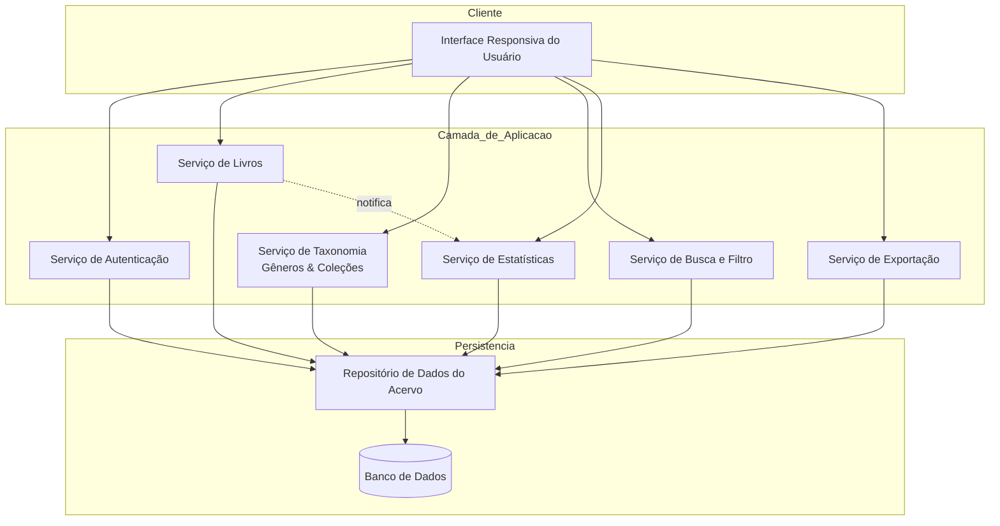
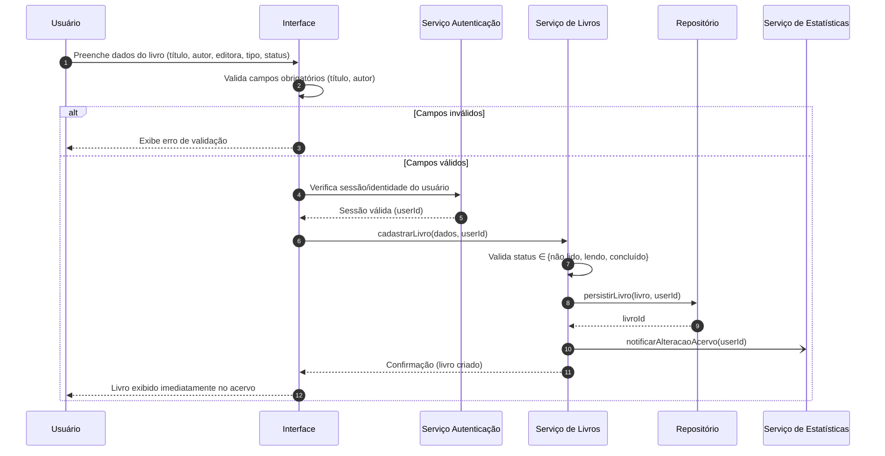
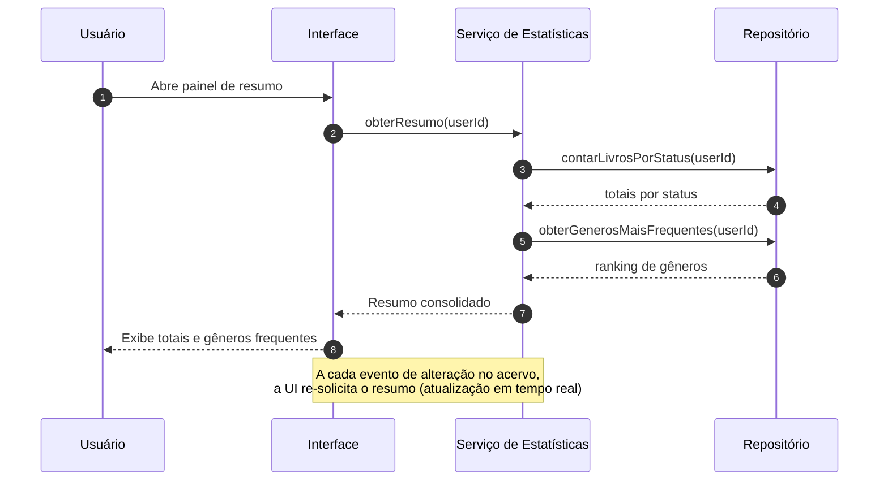
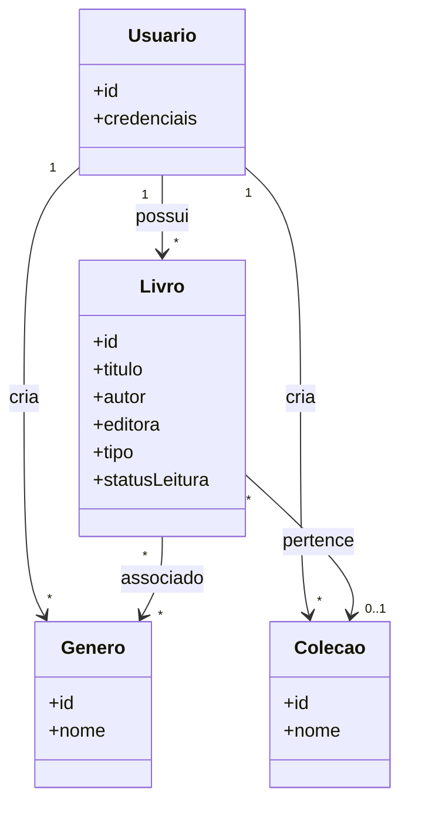

# Relatório Técnico de Arquitetura de Software
## Sistema de Catalogação de Livros — Biblioteca Pessoal (P04)

---

## 1. Identificação das HUs

| HU | Título | RFs Relacionados | RNFs Relacionados | Ator |
|----|--------|------------------|-------------------|------|
| HU01 | Cadastrar livro | RF01, RF04, RF13 | RNF01, RNF04 | Usuário |
| HU02 | Atualizar status de leitura | RF05, RF04 | RNF05 | Usuário |
| HU03 | Organizar livros por gênero | RF06, RF08 | RNF04 | Usuário |
| HU04 | Organizar livros por coleção | RF07, RF08 | RNF04 | Usuário |
| HU05 | Filtrar o acervo | RF09 | RNF03, RNF02 | Usuário |
| HU06 | Pesquisar por título/autor | RF12 | RNF03 | Usuário |
| HU07 | Visualizar resumo do acervo | RF10, RF11 | RNF05 | Usuário |
| HU08 | Exportar o acervo | RF07(export) | RNF07 | Usuário |

Observação: RF02 (editar livro) e RF03 (remover livro) são operações CRUD transversais suportadas por todas as HUs de manutenção do acervo, embora não tenham HU dedicada.

---

## 2. Diagramas de Arquitetura (Mermaid)

### 2.1 Diagrama de Componentes (visão macro)

### 2.2 Diagrama de Sequência — HU01 Cadastrar Livro

### 2.3 Diagrama de Sequência — HU07 Resumo em Tempo Real

### 2.4 Diagrama de Classes (modelo de domínio)

---

## 3. Decisões de Arquitetura

| ID | Decisão | Justificativa | Requisito de Origem |
|----|---------|---------------|---------------------|
| AD01 | Arquitetura em camadas (Interface → Aplicação/Serviços → Persistência) | Separação de responsabilidades, testabilidade e independência tecnológica | Geral |
| AD02 | Isolamento de dados por `userId` em todas as operações | Garantir acervo estritamente pessoal e isolado | RNF01 |
| AD03 | Serviço de Estatísticas desacoplado, acionado por notificação de alteração | Permitir atualização do resumo em tempo real | RNF05, HU07 |
| AD04 | Persistência delegada a Repositório abstrato sobre banco de dados | Durabilidade dos dados sem perda ao recarregar | RNF04 |
| AD05 | Serviço de Busca/Filtro dedicado com combinação dinâmica de critérios | Filtros combináveis e resposta em até 2s | RNF03, HU05, HU06 |
| AD06 | Remoção de gênero/coleção realiza desvinculação, não exclusão em cascata | Preservar livros ao remover taxonomia | HU03, HU04 |
| AD07 | Interface responsiva (design mobile-first) | Uso em dispositivos móveis e desktop | RNF02, RNF06 |
| AD08 | Exportação como serviço gerando arquivo para download no cliente | Backup em CSV/JSON | RNF07, HU08 |
| AD09 | Modelagem de associações: Livro↔Gênero (N:N) e Livro↔Coleção (N:1) | Regras de cardinalidade das HUs | HU03, HU04 |

---

## 4. Tabela de Componentes e Rastreabilidade

| Componente | Responsabilidade Principal | Comunica-se com | Origem (HU / Critério de Aceite) |
|------------|---------------------------|-----------------|----------------------------------|
| Interface Responsiva | Renderizar telas, validar entradas, atualização dinâmica | Todos os serviços de aplicação | RNF02, RNF06, HU01–HU08 |
| Serviço de Autenticação | Autenticar usuário e prover contexto de identidade | Interface, Repositório | RNF01 |
| Serviço de Livros | CRUD de livros, validação de status e tipo, notificação de alteração | Interface, Repositório, Serviço de Estatísticas | HU01, HU02 / RF01–RF05, RF13 |
| Serviço de Taxonomia | CRUD de gêneros e coleções, associação e desvinculação | Interface, Repositório | HU03, HU04 / RF06–RF08 |
| Serviço de Busca e Filtro | Filtragem multi-atributo combinável e busca parcial por título/autor | Interface, Repositório | HU05, HU06 / RF09, RF12 |
| Serviço de Estatísticas | Consolidar totais por status e gêneros frequentes em tempo real | Interface, Serviço de Livros, Repositório | HU07 / RF10, RF11, RNF05 |
| Serviço de Exportação | Gerar arquivo CSV/JSON do acervo para download | Interface, Repositório | HU08 / RNF07 |
| Repositório de Dados | Abstrair persistência e consultas isoladas por usuário | Banco de Dados, todos os serviços | RNF04, RNF01 |
| Banco de Dados | Armazenamento durável do acervo | Repositório | RNF04 |

---

## 5. Bloqueios e Pendências

| ID | Descrição | Severidade | Impacto |
|----|-----------|-----------|---------|
| B01 | Não há especificação do mecanismo/fluxo de autenticação (login, cadastro, recuperação de senha) | Alta | Bloqueia implementação plena de RNF01 |
| B02 | Não definido se aplicação é multiusuário com registro público ou usuário único | Alta | Afeta modelo de dados e onboarding |
| B03 | Ausência de definição do critério de ordenação/quantidade em "gêneros mais frequentes" (top N?) | Média | Afeta RF11 / HU07 |
| B04 | Não especificado comportamento offline nem sincronização | Baixa | Pode afetar RNF04 percebido |
| B05 | Estrutura de campos específicos para livro físico vs. digital não detalhada (ex.: localização física, formato de arquivo) | Média | Afeta RF13 / HU01 |
| B06 | Não há requisito sobre paginação da listagem, relevante ao desempenho | Média | Impacta RNF03 em acervos grandes |

---

## 6. Cobertura de Requisitos

| Requisito | Coberto? | Componente(s) Responsável(is) |
|-----------|----------|-------------------------------|
| RF01 | ✅ | Serviço de Livros |
| RF02 | ✅ | Serviço de Livros |
| RF03 | ✅ | Serviço de Livros |
| RF04 | ✅ | Serviço de Livros |
| RF05 | ✅ | Serviço de Livros |
| RF06 | ✅ | Serviço de Taxonomia |
| RF07 | ✅ | Serviço de Taxonomia |
| RF08 | ✅ | Serviço de Taxonomia |
| RF09 | ✅ | Serviço de Busca e Filtro |
| RF10 | ✅ | Serviço de Estatísticas |
| RF11 | ⚠️ | Serviço de Estatísticas (ver B03) |
| RF12 | ✅ | Serviço de Busca e Filtro |
| RF13 | ⚠️ | Serviço de Livros (ver B05) |
| RNF01 | ⚠️ | Serviço de Autenticação (ver B01/B02) |
| RNF02 | ✅ | Interface Responsiva |
| RNF03 | ⚠️ | Busca/Filtro + Repositório (ver B06) |
| RNF04 | ✅ | Repositório + Banco de Dados |
| RNF05 | ✅ | Serviço de Estatísticas |
| RNF06 | ✅ | Interface Responsiva |
| RNF07 | ✅ | Serviço de Exportação |

**Cobertura funcional:** 13/13 endereçados (2 com ressalvas).
**Cobertura não funcional:** 7/7 endereçados (2 com ressalvas).

---

## 7. Gap Analysis

| Gap | Descrição da Lacuna | Impacto Arquitetural | Ação Recomendada |
|-----|---------------------|----------------------|------------------|
| G01 — Autenticação subespecificada | RNF01 exige acesso protegido, mas não descreve fluxo, provedor de identidade ou modelo de sessão | Define fronteiras de segurança e o modelo multiusuário do Repositório | Especificar fluxo de login/registro e política de sessão antes do desenvolvimento |
| G02 — Escopo de usuários | Não está claro se há registro aberto ou instância pessoal única | Afeta modelagem de dados e isolamento | Definir com stakeholder o modelo de conta |
| G03 — Detalhamento de "gêneros mais frequentes" | RF11/HU07 não definem quantos gêneros exibir nem critério de empate | Regra de negócio do Serviço de Estatísticas | Definir top N e ordenação (ex.: top 5 por contagem) |
| G04 — Campos diferenciados físico/digital | RF13 diferencia tipos, mas não os atributos exclusivos de cada um | Modelo de domínio de Livro pode exigir subtipos/atributos condicionais | Levantar atributos específicos (formato, localização física, etc.) |
| G05 — Estratégia de desempenho | RNF03 impõe 2s independente de volume, sem menção a paginação/indexação | Design do Repositório e da Busca | Definir paginação e estratégia de indexação de consultas |
| G06 — Auditoria/histórico | HU02 registra "progresso ao longo do tempo" mas não há requisito de histórico de status | Poderia demandar entidade de histórico | Confirmar se histórico é necessário ou apenas estado atual |
| G07 — Volume e escalabilidade | Não há estimativa de tamanho do acervo por usuário | Dimensionamento de persistência e cache de estatísticas | Coletar métricas esperadas de volume |
| G08 — Concorrência de sessões | Não especificado comportamento com múltiplos dispositivos simultâneos | Consistência de dados e do resumo em tempo real | Definir política de sincronização/consistência |

---

*Fim do Relatório Canônico de Arquitetura — AI4ES Time 2.*