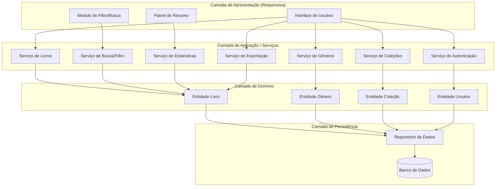
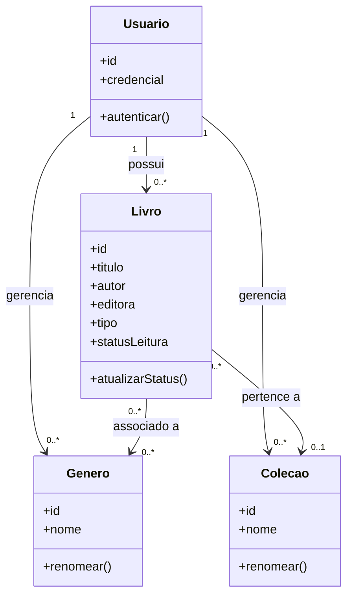
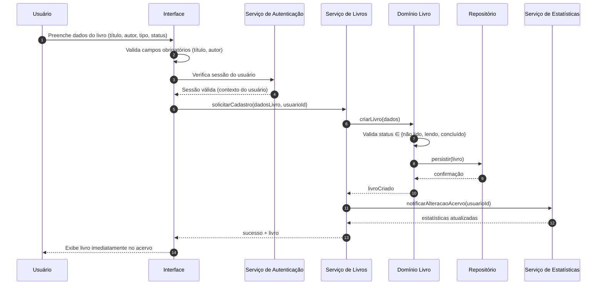
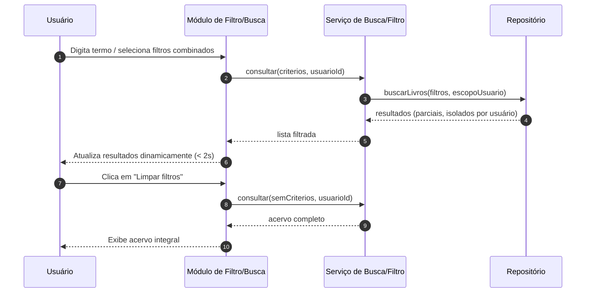

# Relatório Técnico de Arquitetura de Software
## Sistema de Catalogação de Livros — Biblioteca Pessoal (P04)

---

## 1. Identificação das HUs

| HU | Título | RFs Relacionados | RNFs Relacionados |
|----|--------|------------------|-------------------|
| HU01 | Cadastrar livro | RF01, RF04, RF13 | RNF01, RNF04 |
| HU02 | Atualizar status de leitura | RF05, RF04 | RNF05 |
| HU03 | Organizar livros por gênero | RF06, RF08 | RNF04 |
| HU04 | Organizar livros por coleção | RF07, RF08 | RNF04 |
| HU05 | Filtrar o acervo | RF09, RF13 | RNF03, RNF02 |
| HU06 | Pesquisar livros por título ou autor | RF12 | RNF03 |
| HU07 | Visualizar resumo do acervo | RF10, RF11 | RNF05 |
| HU08 | Exportar o acervo | (deriva de RNF07) | RNF07 |

**Observação:** Todas as HUs pertencem ao perfil único **Usuário**, com escopo estritamente pessoal e isolado (RNF01).

---

## 2. Diagramas de Arquitetura (Mermaid)

### 2.1 Diagrama de Componentes (visão macro)

### 2.2 Diagrama de Classes (Domínio)

### 2.3 Diagrama de Sequência — Cadastrar Livro (HU01)

### 2.4 Diagrama de Sequência — Filtrar/Pesquisar Acervo (HU05/HU06)

---

## 3. Decisões de Arquitetura

| ID | Decisão | Justificativa | Requisito(s) |
|----|---------|---------------|--------------|
| DA01 | Arquitetura em camadas (Apresentação, Aplicação, Domínio, Persistência) | Separação de responsabilidades, testabilidade e manutenibilidade | RNF07 |
| DA02 | Isolamento de dados por usuário em todas as consultas (escopo obrigatório) | Garantir acervo estritamente pessoal | RNF01 |
| DA03 | Autenticação como barreira transversal a todos os serviços | Proteger o acesso à aplicação | RNF01 |
| DA04 | Serviço de Estatísticas notificado por eventos de alteração do acervo | Resumo atualizado em tempo real | RNF05, RF10, RF11 |
| DA05 | Camada de apresentação responsiva e agnóstica de dispositivo | Uso em mobile e desktop, navegadores modernos | RNF02, RNF06 |
| DA06 | Serviço de Busca/Filtro desacoplado com suporte a múltiplos critérios combináveis | Filtragem dinâmica e desempenho | RF09, RF12, RNF03 |
| DA07 | Associação Livro–Gênero como N:N e Livro–Coleção como N:1 | Reflete regras de negócio das HU03/HU04 | RF08 |
| DA08 | Desvinculação (não exclusão) de livros ao remover gênero/coleção | Preservar acervo | HU03/HU04 critérios |
| DA09 | Serviço de Exportação gera artefato para download no navegador | Backup pessoal em CSV/JSON | RNF07, HU08 |
| DA10 | Persistência em banco de dados durável | Sem perda de dados ao recarregar | RNF04 |
| DA11 | Atributo `tipo` (físico/digital) modelado como campo de domínio do Livro | Diferenciação no cadastro e filtro | RF13 |

---

## 4. Tabela de Componentes e Rastreabilidade

| Componente | Responsabilidade Principal | Comunica-se com | Origem (HU / Critério de Aceite) |
|------------|---------------------------|-----------------|----------------------------------|
| Interface do Usuário | Renderizar telas responsivas, validar campos obrigatórios | Serviços de Aplicação | HU01 (validação título/autor), RNF02 |
| Serviço de Autenticação | Autenticar e prover contexto isolado do usuário | Interface, Entidade Usuário | RNF01 |
| Serviço de Livros | CRUD de livros, atualização de status, controle de tipo | Domínio Livro, Estatísticas | HU01, HU02, RF01–RF05, RF13 |
| Serviço de Gêneros | Criar/renomear/remover gêneros, associar a livros | Domínio Gênero, Domínio Livro | HU03, RF06, RF08 |
| Serviço de Coleções | Criar/renomear/remover coleções, associar (N:1) | Domínio Coleção, Domínio Livro | HU04, RF07, RF08 |
| Serviço de Busca/Filtro | Filtrar por atributos combinados e busca parcial | Repositório, Domínio Livro | HU05, HU06, RF09, RF12 |
| Serviço de Estatísticas | Calcular totais por status e gêneros frequentes em tempo real | Domínio Livro, Interface | HU07, RF10, RF11, RNF05 |
| Serviço de Exportação | Exportar acervo completo em CSV/JSON para download | Domínio Livro, Interface | HU08, RNF07 |
| Entidade Livro | Regras de domínio do livro e status | Repositório | RF01–RF05, RF13 |
| Entidade Gênero | Regras de domínio de gênero | Repositório | RF06 |
| Entidade Coleção | Regras de domínio de coleção | Repositório | RF07 |
| Entidade Usuário | Identidade e escopo pessoal | Repositório | RNF01 |
| Repositório de Dados | Abstração de persistência e consultas escopadas | Banco de Dados | RNF04, RNF03 |
| Banco de Dados | Armazenamento durável | Repositório | RNF04 |

---

## 5. Bloqueios e Pendências

| ID | Descrição | Severidade | Responsável sugerido |
|----|-----------|-----------|----------------------|
| B01 | Não há requisito de cadastro/registro de novo usuário nem recuperação de credencial, embora RNF01 exija autenticação. | Alta | Product Owner |
| B02 | Formato exato dos campos exportados (cabeçalhos CSV, esquema JSON) não especificado. | Média | Analista de Requisitos |
| B03 | "Gêneros mais frequentes" (RF11/HU07) não define quantidade (top N) nem critério de desempate. | Média | Product Owner |
| B04 | RNF03 exige < 2s "independentemente do volume" sem definir volume máximo esperado — necessita meta quantitativa. | Média | Arquitetura |
| B05 | Não há definição sobre edição/exclusão de campos de tipo (migração de físico ↔ digital). | Baixa | Analista |
| B06 | Comportamento de conflito ao associar livro a nova coleção quando já pertence a outra (substituição automática?) não especificado. | Baixa | Product Owner |

---

## 6. Cobertura de Requisitos

### Requisitos Funcionais
| RF | Coberto por | Status |
|----|-------------|--------|
| RF01 | Serviço de Livros / HU01 | ✅ |
| RF02 | Serviço de Livros | ✅ |
| RF03 | Serviço de Livros | ✅ |
| RF04 | Domínio Livro (enum status) | ✅ |
| RF05 | Serviço de Livros / HU02 | ✅ |
| RF06 | Serviço de Gêneros / HU03 | ✅ |
| RF07 | Serviço de Coleções / HU04 | ✅ |
| RF08 | Serviços Gênero/Coleção | ✅ |
| RF09 | Serviço de Busca/Filtro / HU05 | ✅ |
| RF10 | Serviço de Estatísticas / HU07 | ✅ |
| RF11 | Serviço de Estatísticas / HU07 | ✅ (pendência B03) |
| RF12 | Serviço de Busca / HU06 | ✅ |
| RF13 | Domínio Livro (tipo) | ✅ |

### Requisitos Não Funcionais
| RNF | Coberto por | Status |
|-----|-------------|--------|
| RNF01 | Serviço de Autenticação, DA02 | ✅ |
| RNF02 | Interface responsiva, DA05 | ✅ |
| RNF03 | Serviço de Busca, Repositório, DA06 | ✅ (meta a validar B04) |
| RNF04 | Persistência, DA10 | ✅ |
| RNF05 | Serviço de Estatísticas por evento, DA04 | ✅ |
| RNF06 | Camada de apresentação, DA05 | ✅ |
| RNF07 | Serviço de Exportação, DA09 | ✅ |

**Cobertura total: 13/13 RF e 7/7 RNF endereçados na arquitetura.**

---

## 7. Gap Analysis

| Gap | Descrição da Lacuna | Impacto Arquitetural | Ação Recomendada |
|-----|--------------------|--------------------|------------------|
| G01 — Ciclo de vida da conta | Autenticação exigida (RNF01), mas sem fluxos de registro, logout, recuperação de senha. | Serviço de Autenticação incompleto; impede operação real do isolamento por usuário. | Especificar HUs de gestão de conta (cadastro, login, logout, recuperação). |
| G02 — Especificação de exportação | Estrutura de CSV/JSON indefinida; associações (gêneros N:N, coleção) precisam de representação. | Risco de exportação inconsistente/não reimportável. | Definir esquema canônico de exportação incluindo relacionamentos. |
| G03 — Regra de "gêneros frequentes" | Sem definição de top N e desempate. | Serviço de Estatísticas ambíguo. | Definir parâmetro (ex.: top 5) e critério de ordenação. |
| G04 — Metas de desempenho | "Até 2s independentemente do volume" sem limite superior de dados. | Impacta estratégia de indexação/paginação. | Estabelecer volume-alvo e testes de carga; considerar paginação/índices no Repositório. |
| G05 — Importação de dados | Existe exportação (backup), mas nenhuma reimportação. | Backup sem restauração reduz valor do RNF07. | Avaliar HU futura de importação. |
| G06 — Auditoria/histórico de leitura | HU02 fala em "progresso ao longo do tempo", mas não há histórico persistido — apenas estado atual. | Estatísticas temporais impossíveis com modelo atual. | Decidir se registra histórico de mudanças de status. |
| G07 — Conflito de coleção | Regra N:1 sem tratamento de reassociação. | Ambiguidade no Serviço de Coleções. | Definir comportamento (substituir vínculo automaticamente). |
| G08 — Validação de duplicidade | Não há regra sobre livros duplicados no acervo. | Possível inconsistência de dados. | Definir política de unicidade (ou permitir duplicatas). |

---

*Fim do Relatório Canônico — AI4ES Time 2.*