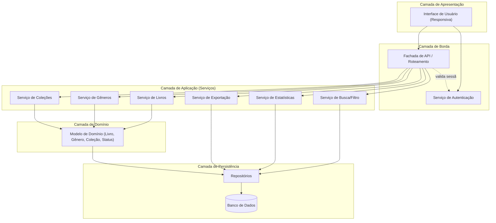
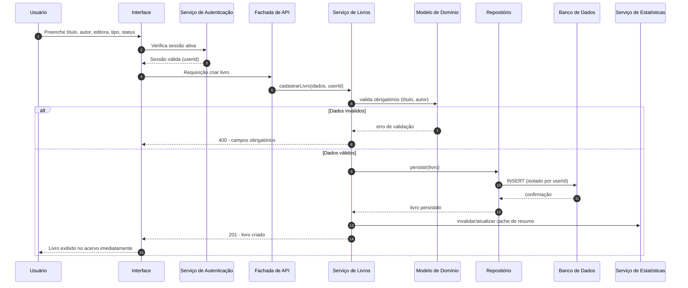
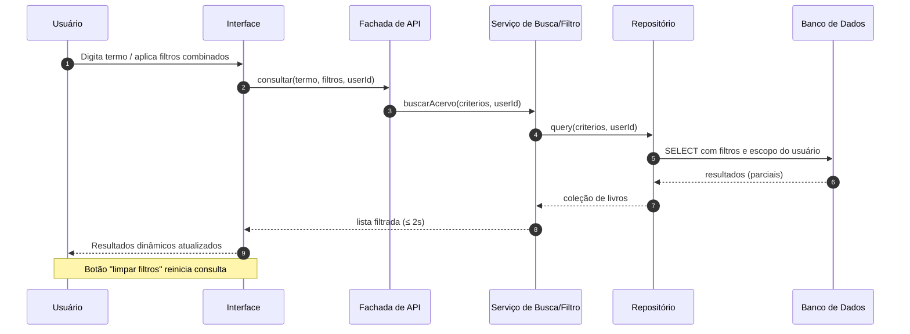
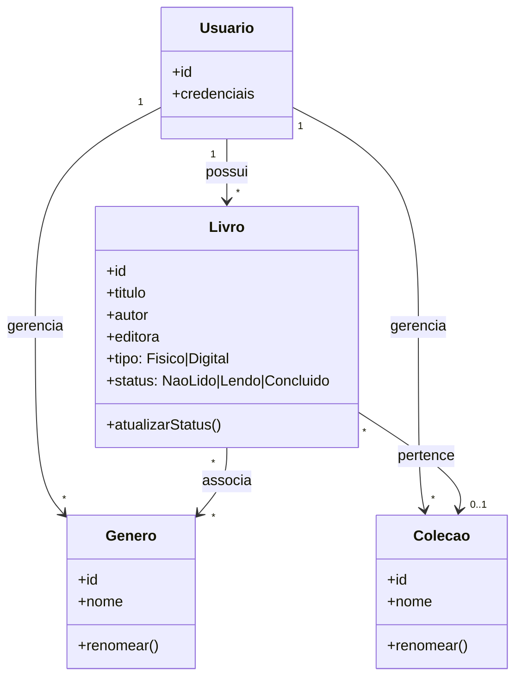

# Relatório Técnico de Arquitetura de Software
## Sistema de Catalogação de Livros — Biblioteca Pessoal (P04)

---

## 1. Identificação das HUs

| HU | Título | RFs Relacionados | RNFs Relacionados | Ator |
|----|--------|------------------|-------------------|------|
| HU01 | Cadastrar livro | RF01, RF04, RF13 | RNF01, RNF04 | Usuário |
| HU02 | Atualizar status de leitura | RF05, RF04 | RNF05 | Usuário |
| HU03 | Organizar livros por gênero | RF06, RF08 | RNF04 | Usuário |
| HU04 | Organizar livros por coleção | RF07, RF08 | RNF04 | Usuário |
| HU05 | Filtrar o acervo | RF09 | RNF03, RNF02 | Usuário |
| HU06 | Pesquisar livros por título ou autor | RF12 | RNF03 | Usuário |
| HU07 | Visualizar resumo do acervo | RF10, RF11 | RNF05 | Usuário |
| HU08 | Exportar o acervo | RF07(export) | RNF07 | Usuário |

**Requisitos transversais:** RNF01 (autenticação/isolamento por usuário), RNF02 (responsividade), RNF06 (compatibilidade multi-navegador) aplicam-se a todas as HUs.

---

## 2. Diagramas de Arquitetura (Mermaid)

### 2.1 Diagrama de Componentes (visão macro)

### 2.2 Diagrama de Sequência — HU01 (Cadastrar livro)

### 2.3 Diagrama de Sequência — HU05/HU06 (Filtrar e Pesquisar)

### 2.4 Diagrama de Classes (Domínio)

---

## 3. Decisões de Arquitetura

| ID | Decisão | Justificativa | Requisito de Origem |
|----|---------|---------------|---------------------|
| DA01 | Arquitetura em camadas (Apresentação, Aplicação, Domínio, Persistência) | Separação de responsabilidades e testabilidade para um domínio CRUD-cêntrico | Geral |
| DA02 | Autenticação obrigatória com isolamento de dados por usuário (multi-tenant lógico) | Acervo estritamente pessoal e isolado | RNF01 |
| DA03 | Serviço de Estatísticas com atualização orientada a eventos de escrita (invalidação/recálculo) | Resumo em tempo real a cada alteração | RNF05, HU07 |
| DA04 | Camada de persistência com repositórios abstratos sobre banco de dados | Persistência durável sem perda ao recarregar | RNF04 |
| DA05 | Serviço de Busca/Filtro com consultas indexadas e escopo de usuário | Listagem/filtragem ≤ 2s independente do volume | RNF03 |
| DA06 | Interface responsiva desacoplada via fachada de API | Suporte a mobile/desktop e múltiplos navegadores | RNF02, RNF06 |
| DA07 | Serviço de Exportação com geração de arquivos em formatos abertos (CSV/JSON) para download | Backup pessoal e interoperabilidade | RNF07, HU08 |
| DA08 | Associações modeladas como N:N (gênero) e 1:N (coleção); remoção apenas desvincula | Regras de HU03/HU04 | HU03, HU04 |
| DA09 | Neutralidade tecnológica: banco de dados, framework e navegador tratados como interfaces conceituais | Diretriz de projeto | Geral |

---

## 4. Tabela de Componentes e Rastreabilidade

| Componente | Responsabilidade Principal | Comunica-se com | Origem (HU / Critério de Aceite) |
|-----------|----------------------------|-----------------|----------------------------------|
| Interface de Usuário | Renderizar telas responsivas, capturar entradas, atualização dinâmica | Serviço de Autenticação, Fachada de API | HU01–HU08 / responsividade, atualização dinâmica |
| Serviço de Autenticação | Autenticar e manter sessão, fornecer userId para isolamento | Interface, Fachada de API | RNF01 / acervo isolado por usuário |
| Fachada de API | Rotear requisições, validar sessão, orquestrar serviços | Interface, Serviços de Aplicação, Autenticação | Geral |
| Serviço de Livros | CRUD de livros, validação de obrigatórios, tipo e status | Domínio, Repositório, Serviço de Estatísticas | HU01, HU02 / título e autor obrigatórios, status válido, tipo físico/digital |
| Serviço de Gêneros | Criar/renomear/remover gêneros; desvincular sem excluir livros | Domínio, Repositório | HU03 / criação livre, desvinculação ao remover |
| Serviço de Coleções | Criar/renomear/remover coleções; regra 1 coleção por livro | Domínio, Repositório | HU04 / uma coleção por livro, desvinculação ao remover |
| Serviço de Busca/Filtro | Consultas por atributos combinados e busca parcial por título/autor | Repositório, Fachada de API | HU05, HU06 / filtros combinados, busca parcial dinâmica |
| Serviço de Estatísticas | Calcular totais por status e gêneros mais frequentes em tempo real | Repositório, Serviço de Livros | HU07, HU02 / totais por status, gêneros frequentes, atualização automática |
| Serviço de Exportação | Gerar CSV/JSON com todos os campos e disponibilizar download | Repositório, Interface | HU08 / escolha de formato, todos os campos, download no navegador |
| Modelo de Domínio | Encapsular entidades e regras (Livro, Gênero, Coleção, Status) | Serviços de Aplicação, Repositório | RF04, RF08, RF13 / regras de negócio |
| Repositório | Abstrair acesso e persistência com escopo por usuário | Domínio, Banco de Dados | RNF04 / persistência durável |
| Banco de Dados | Armazenar dados de forma durável e isolada por usuário | Repositório | RNF04, RNF01 |

---

## 5. Bloqueios e Pendências

| ID | Descrição | Severidade | Necessita decisão de |
|----|-----------|------------|----------------------|
| BL01 | Método de autenticação não especificado (local, provedor externo, etc.) | Alta | Product Owner / Segurança |
| BL02 | Não há requisito de registro/gestão de conta de usuário (cadastro, recuperação de senha) apesar de exigir autenticação | Alta | Product Owner |
| BL03 | Estratégia para garantir ≤ 2s "independente do volume" (paginação, indexação) não especificada | Média | Arquitetura |
| BL04 | Não definido se exportação inclui gêneros/coleção associados ou apenas atributos do livro | Média | Product Owner |
| BL05 | Volume esperado de acervo e limites de escala não informados | Baixa | Product Owner |
| BL06 | Comportamento offline / PWA não especificado (afeta RNF02/RNF06) | Baixa | UX / Arquitetura |

---

## 6. Cobertura de Requisitos

### Requisitos Funcionais

| RF | Coberto por | Status |
|----|-------------|--------|
| RF01 | Serviço de Livros, Domínio | ✅ |
| RF02 | Serviço de Livros | ✅ |
| RF03 | Serviço de Livros | ✅ |
| RF04 | Modelo de Domínio (enum status) | ✅ |
| RF05 | Serviço de Livros (atualizarStatus) | ✅ |
| RF06 | Serviço de Gêneros | ✅ |
| RF07 | Serviço de Coleções | ✅ |
| RF08 | Domínio (associações N:N e 1:N) | ✅ |
| RF09 | Serviço de Busca/Filtro | ✅ |
| RF10 | Serviço de Estatísticas | ✅ |
| RF11 | Serviço de Estatísticas | ✅ |
| RF12 | Serviço de Busca/Filtro | ✅ |
| RF13 | Modelo de Domínio (tipo físico/digital) | ✅ |

### Requisitos Não Funcionais

| RNF | Coberto por | Status |
|-----|-------------|--------|
| RNF01 | Serviço de Autenticação, Repositório (escopo por usuário) | ⚠️ Parcial (BL01/BL02) |
| RNF02 | Interface responsiva | ✅ |
| RNF03 | Serviço de Busca/Filtro + indexação | ⚠️ Parcial (BL03) |
| RNF04 | Repositório + Banco de Dados | ✅ |
| RNF05 | Serviço de Estatísticas orientado a eventos | ✅ |
| RNF06 | Interface (padrões web multi-navegador) | ✅ |
| RNF07 | Serviço de Exportação | ✅ |

**Cobertura RF:** 13/13 (100%) · **Cobertura RNF:** 7/7 endereçados (2 com pendência).

---

## 7. Gap Analysis

| Gap | Descrição da Lacuna | Impacto Arquitetural | Ação Recomendada |
|-----|---------------------|----------------------|------------------|
| G01 — Ciclo de vida da conta | RNF01 exige autenticação, mas não há HU/RF de cadastro, login, logout ou recuperação de acesso. | Sem gestão de identidade, o isolamento por usuário fica indefinido; risco à segurança central. | Definir HUs de gestão de conta e o mecanismo de autenticação antes do desenvolvimento. |
| G02 — Desempenho sob volume | RNF03 promete ≤2s "independente do volume", sem estratégia definida. | Consultas de filtro/busca podem degradar sem paginação/indexação. | Especificar paginação, índices de busca e limites; validar com testes de carga. |
| G03 — Escopo da exportação | HU08 diz "todos os campos", mas não esclarece se inclui associações (gêneros/coleção). | Formato de saída CSV/JSON e estrutura de dados afetados. | Definir schema de exportação incluindo relações; validar com PO. |
| G04 — Integridade de associações | Remoção de gênero/coleção apenas desvincula; concorrência de edições não tratada. | Possível estado inconsistente em operações simultâneas. | Definir regras de integridade referencial e transacionalidade no domínio. |
| G05 — Estatísticas em tempo real | "Tempo real" (RNF05/HU07) pode implicar recálculo custoso a cada escrita. | Trade-off entre cache invalidável e recomputação. | Adotar recálculo incremental ou invalidação de cache; medir custo. |
| G06 — Feedback de erros/validação | Critérios cobrem obrigatoriedade, mas não mensagens/estados de erro de UX. | Impacta usabilidade (RNF02) e consistência de interface. | Especificar padrões de validação e mensagens de erro na UI. |
| G07 — Comportamento offline/PWA | Não especificado se a aplicação deve operar sem conexão. | Afeta arquitetura de sincronização e persistência local. | Confirmar com PO se offline é requisito; caso sim, planejar sincronização. |
| G08 — Auditoria e concorrência multi-dispositivo | Usuário pode acessar de mobile e desktop simultaneamente. | Necessidade de sincronização de estado entre sessões. | Definir estratégia de consistência entre sessões do mesmo usuário. |

---

*Fim do Relatório Canônico — AI4ES Time 2.*