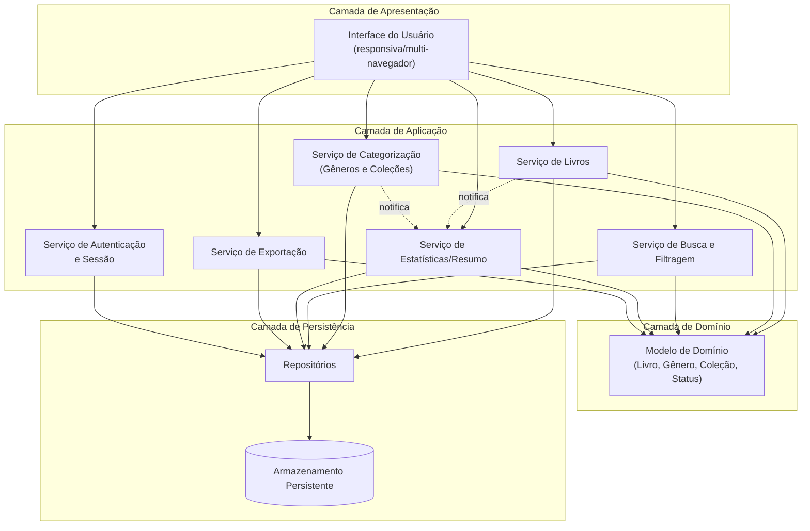
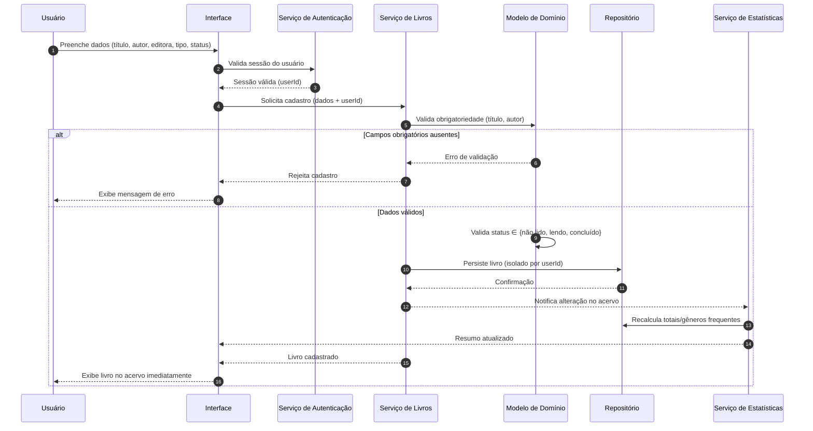
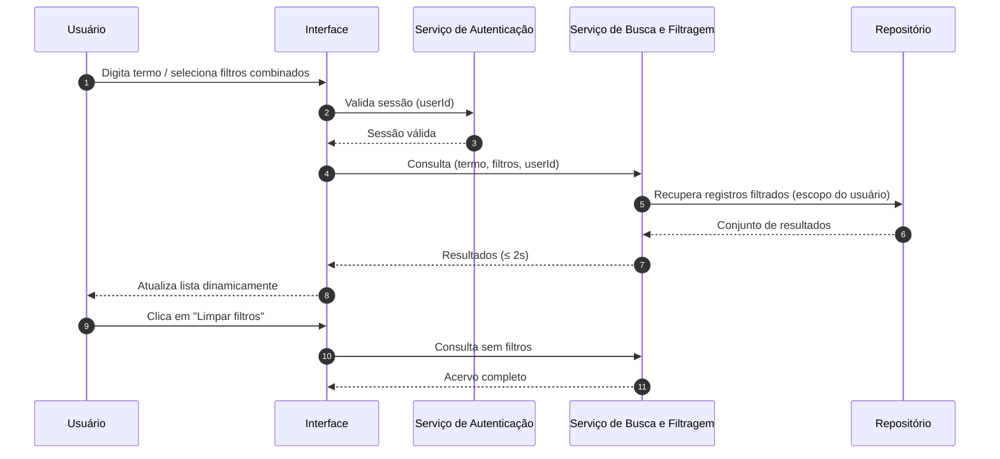
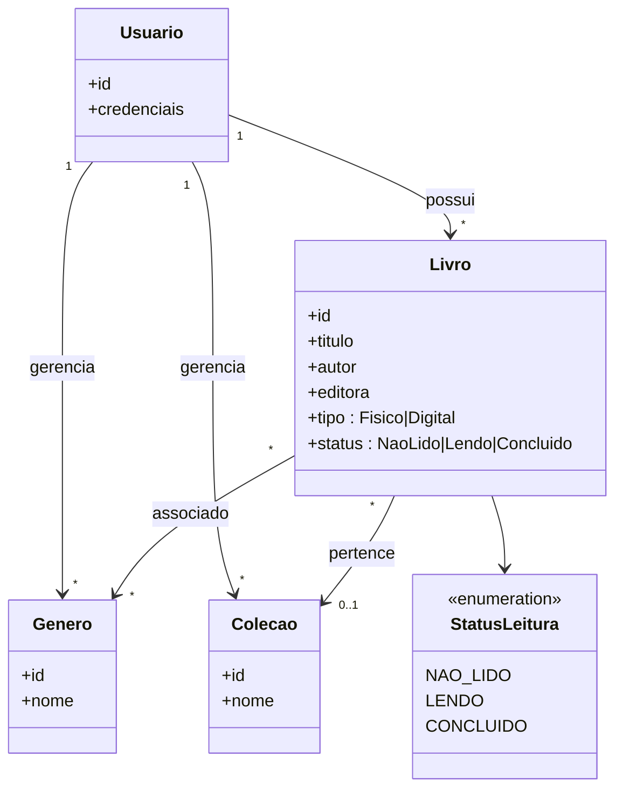

# Relatório Técnico de Arquitetura de Software
## Sistema de Catalogação de Livros — Biblioteca Pessoal (P04)

---

## 1. Identificação das HUs

| HU | Título | RFs Relacionados | RNFs Relacionados | Perfil |
|----|--------|------------------|-------------------|--------|
| HU01 | Cadastrar livro | RF01, RF04, RF13 | RNF01, RNF04 | Usuário |
| HU02 | Atualizar status de leitura | RF05, RF04 | RNF05 | Usuário |
| HU03 | Organizar livros por gênero | RF06, RF08 | RNF04 | Usuário |
| HU04 | Organizar livros por coleção | RF07, RF08 | RNF04 | Usuário |
| HU05 | Filtrar o acervo | RF09, RF13 | RNF03, RNF02 | Usuário |
| HU06 | Pesquisar livros por título ou autor | RF12 | RNF03 | Usuário |
| HU07 | Visualizar resumo do acervo | RF10, RF11 | RNF05 | Usuário |
| HU08 | Exportar o acervo | RF07 (dados), backup | RNF07 | Usuário |

**Requisitos transversais:** RNF01 (autenticação e isolamento por usuário), RNF02/RNF06 (responsividade/compatibilidade), RNF04 (persistência).

---

## 2. Diagramas de Arquitetura (Mermaid)

### 2.1 Diagrama de Componentes (visão macro)

### 2.2 Diagrama de Sequência — Cadastro de Livro (HU01) com atualização de resumo (HU07/RNF05)

### 2.3 Diagrama de Sequência — Filtragem e Busca (HU05/HU06)

### 2.4 Modelo de Domínio (Classes)

---

## 3. Decisões de Arquitetura

| ID | Decisão | Justificativa | Requisito(s) |
|----|---------|---------------|--------------|
| DA01 | Arquitetura em camadas (Apresentação, Aplicação, Domínio, Persistência). | Separação de responsabilidades; facilita manutenibilidade e testes. | RNF07 |
| DA02 | Todo acesso mediado por Serviço de Autenticação com escopo `userId` em todas as consultas. | Garante isolamento estrito do acervo pessoal. | RNF01 |
| DA03 | Serviço de Estatísticas atualizado por notificação/evento após operações de escrita. | Atende requisito de resumo em tempo real sem polling. | RNF05, RF10, RF11 |
| DA04 | Serviço de Busca/Filtragem dedicado, com indexação sobre atributos consultáveis. | Cumprir SLA de resposta ≤ 2s independentemente do volume. | RNF03, RF09, RF12 |
| DA05 | Persistência em banco de dados com repositórios abstratos. | Durabilidade dos dados; neutralidade tecnológica. | RNF04 |
| DA06 | Modelagem de associação N:N Livro-Gênero e 1:N Coleção-Livro; remoção de categoria apenas desvincula. | Reflete critérios de aceite de HU03/HU04. | RF06, RF07, RF08 |
| DA07 | Serviço de Exportação gera artefato (CSV/JSON) para download no cliente. | Backup pessoal portável. | RNF07, RF? |
| DA08 | Interface responsiva compatível com navegadores modernos. | Uso em desktop e mobile. | RNF02, RNF06 |
| DA09 | Campo `tipo` (físico/digital) como atributo de primeira classe, filtrável. | Diferenciação exigida no cadastro e nos filtros. | RF13, HU05 |

---

## 4. Tabela de Componentes e Rastreabilidade

| Componente | Responsabilidade Principal | Comunica-se com | Origem (HU / Critério de Aceite) |
|------------|---------------------------|-----------------|----------------------------------|
| Interface do Usuário | Renderizar telas responsivas, capturar entradas, exibir resultados dinâmicos e resumo. | Todos os serviços de aplicação | HU01–HU08 / responsividade e atualização dinâmica |
| Serviço de Autenticação | Autenticar usuário e propagar escopo (`userId`) garantindo isolamento. | UI, Repositórios | RNF01 / acervo estritamente pessoal |
| Serviço de Livros | CRUD de livros; validação de obrigatoriedade e status; gerenciar tipo físico/digital. | Modelo de Domínio, Repositório, Estatísticas | HU01, HU02 / título e autor obrigatórios; status válido |
| Serviço de Categorização | CRUD de gêneros e coleções; associar/desvincular livros. | Modelo de Domínio, Repositório, Estatísticas | HU03, HU04 / remover categoria não exclui livros |
| Serviço de Busca e Filtragem | Filtrar por múltiplos atributos combinados e pesquisa parcial por título/autor. | Repositório | HU05, HU06 / filtros combinados, busca parcial dinâmica |
| Serviço de Estatísticas/Resumo | Calcular totais por status e gêneros mais frequentes em tempo real. | Repositório, notificado por Livros/Categorização | HU07 / atualização automática a cada alteração |
| Serviço de Exportação | Gerar acervo completo em CSV/JSON para download. | Repositório, Modelo de Domínio | HU08 / escolha de formato, todos os campos |
| Modelo de Domínio | Regras de negócio: entidades Livro, Gênero, Coleção, StatusLeitura. | Serviços de aplicação | RF04, RF08, RF13 |
| Repositórios | Abstração de persistência com escopo por usuário. | Armazenamento Persistente | RNF04 |
| Armazenamento Persistente | Durabilidade dos dados sem perda ao recarregar. | Repositórios | RNF04 |

---

## 5. Bloqueios e Pendências

| ID | Pendência | Impacto | Severidade |
|----|-----------|---------|-----------|
| BL01 | Não há requisito explícito de **cadastro/registro de usuário** nem política de credenciais, apesar de RNF01 exigir autenticação. | Indefinição do fluxo de onboarding e recuperação de acesso. | Alta |
| BL02 | "Gêneros mais frequentes" (RF11) não define **quantidade** exibida (top N) nem critério de desempate. | Ambiguidade na implementação do resumo. | Média |
| BL03 | Não há definição de comportamento para **atributos "editora" e "tipo"** na exportação vs. campos obrigatórios (apenas título/autor obrigatórios). | Registros incompletos podem afetar exportação/estatística. | Baixa |
| BL04 | RNF03 exige ≤2s "independentemente do volume", mas não há limite máximo esperado de registros para dimensionamento de índices/paginação. | Dificuldade de validar SLA. | Média |
| BL05 | Não especifica se a busca (RF12) e filtros (RF09) devem operar de forma **combinada** entre si (busca textual + filtros ativos simultaneamente). | Divergência de UX. | Baixa |

---

## 6. Cobertura de Requisitos

### Requisitos Funcionais
| RF | Coberto por | Status |
|----|-------------|--------|
| RF01 | Serviço de Livros / HU01 | ✅ |
| RF02 | Serviço de Livros | ✅ |
| RF03 | Serviço de Livros | ✅ |
| RF04 | Modelo de Domínio (StatusLeitura) | ✅ |
| RF05 | Serviço de Livros / HU02 | ✅ |
| RF06 | Serviço de Categorização / HU03 | ✅ |
| RF07 | Serviço de Categorização / HU04 | ✅ |
| RF08 | Serviço de Categorização / Modelo | ✅ |
| RF09 | Serviço de Busca e Filtragem / HU05 | ✅ |
| RF10 | Serviço de Estatísticas / HU07 | ✅ |
| RF11 | Serviço de Estatísticas / HU07 | ✅ (ver BL02) |
| RF12 | Serviço de Busca e Filtragem / HU06 | ✅ |
| RF13 | Modelo de Domínio (tipo) / HU01 | ✅ |

### Requisitos Não Funcionais
| RNF | Coberto por | Status |
|-----|-------------|--------|
| RNF01 | Serviço de Autenticação (DA02) | ✅ |
| RNF02 | Interface responsiva (DA08) | ✅ |
| RNF03 | Serviço de Busca com indexação (DA04) | ✅ (ver BL04) |
| RNF04 | Repositórios + Armazenamento (DA05) | ✅ |
| RNF05 | Estatísticas por notificação (DA03) | ✅ |
| RNF06 | Interface multi-navegador (DA08) | ✅ |
| RNF07 | Serviço de Exportação (DA07) | ✅ |

**Cobertura total: 13/13 RF, 7/7 RNF.**

---

## 7. Gap Analysis

| Lacuna | Descrição | Impacto Arquitetural | Ação Recomendada |
|--------|-----------|----------------------|------------------|
| G01 — Ciclo de vida de credenciais | RNF01 exige autenticação, mas não há RF/HU de registro, login, logout, recuperação de senha. | Fluxo de identidade indefinido; risco de escopo de segurança incompleto. | Definir HU dedicada ao gerenciamento de conta e mecanismo de credenciais/sessão. |
| G02 — Parametrização de estatísticas | RF11 não define top N nem ordenação. | Implementação arbitrária do resumo. | Especificar quantidade e critério de desempate (ex.: top 5, ordem alfabética). |
| G03 — Estratégia de desempenho | RNF03 sem volume-alvo nem paginação especificada. | Difícil validar SLA e dimensionar índices. | Definir volume máximo esperado e adotar paginação/índices sobre atributos filtráveis. |
| G04 — Concorrência de sessões | Não especifica múltiplos dispositivos simultâneos do mesmo usuário. | Possíveis inconsistências de estado no resumo em tempo real. | Definir estratégia de sincronização/consistência entre sessões. |
| G05 — Integridade referencial na remoção | HU03/HU04 exigem desvinculação ao remover categoria; falta regra para exclusão de livro que impacta estatísticas em cache. | Estatísticas podem ficar temporariamente inconsistentes. | Garantir recálculo transacional ou invalidação de cache no evento de remoção. |
| G06 — Validação de exportação | HU08 exige "todos os campos", mas campos opcionais (editora, coleção) podem estar vazios. | Formato de saída inconsistente. | Definir representação de campos vazios em CSV/JSON. |
| G07 — Internacionalização/formato de dados | Não há requisito sobre codificação/idioma da exportação CSV. | Problemas de compatibilidade com ferramentas externas. | Padronizar codificação (ex.: UTF-8) e delimitadores na especificação. |

---

*Fim do Relatório Canônico — AI4ES Time 2.*