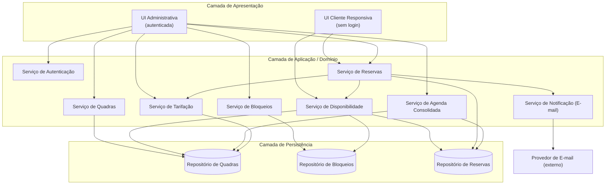
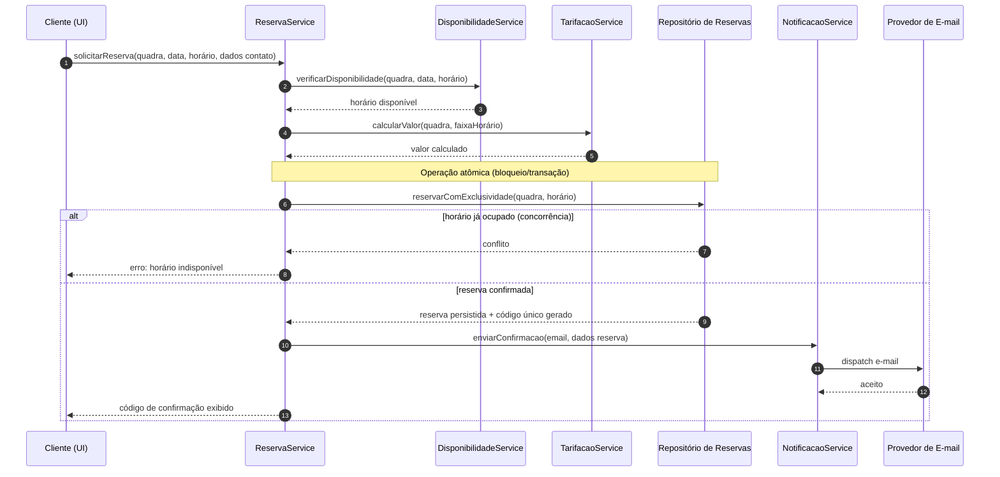
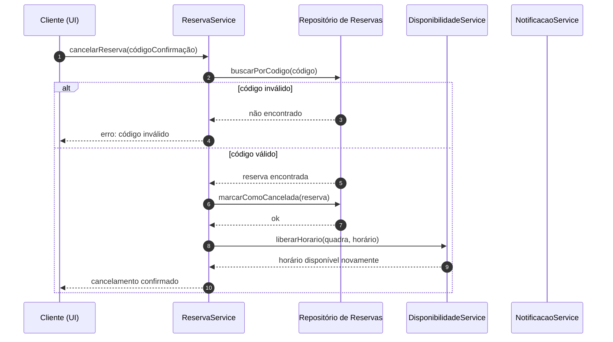
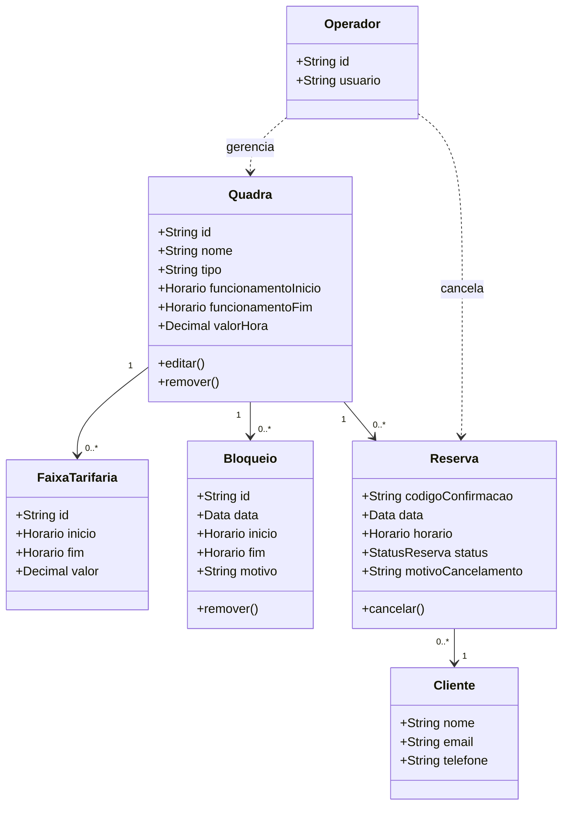

# Relatório Técnico de Arquitetura de Software
## Sistema de Reservas para Quadras Esportivas (P05)

---

## 1. Identificação das HUs

| HU | Título | Perfil | RFs Relacionados | RNFs Relacionados |
|----|--------|--------|------------------|-------------------|
| HU01 | Cadastrar quadra | Operador | RF01, RF02 | RNF03, RNF07 |
| HU02 | Bloquear horários para manutenção | Operador | RF03 | RNF03 |
| HU03 | Visualizar agenda consolidada | Operador | RF11 | RNF02, RNF03 |
| HU04 | Cancelar reserva com justificativa | Operador | RF09, RF10 | RNF03 |
| HU05 | Consultar disponibilidade sem cadastro | Cliente | RF04, RF07 | RNF01, RNF02, RNF06 |
| HU06 | Realizar reserva | Cliente | RF05, RF06, RF07, RF10 | RNF01, RNF05 |
| HU07 | Cancelar minha reserva | Cliente | RF08 | RNF01 |

**Requisitos transversais não vinculados diretamente a uma HU:** RF12 (valores diferenciados por faixa de horário), RNF04 (disponibilidade 24/7).

---

## 2. Diagramas de Arquitetura (Mermaid)

### 2.1 Diagrama de Componentes (Visão Macro)

### 2.2 Diagrama de Sequência — HU06 Realizar Reserva (com atomicidade RNF05)

### 2.3 Diagrama de Sequência — HU07 Cancelar reserva pelo cliente

### 2.4 Diagrama de Classes de Domínio

---

## 3. Decisões de Arquitetura

| ID | Decisão | Justificativa | Requisitos Atendidos |
|----|---------|---------------|----------------------|
| DA01 | Separação em dois canais de interface (UI Cliente pública e UI Administrativa autenticada) | Cliente consulta/reserva sem login; operador exige autenticação | RF04, RNF03, HU05 |
| DA02 | Modularização por serviços de domínio (Quadra, Bloqueio, Reserva, Disponibilidade, Tarifação, Notificação) | Permite incluir novas modalidades e regras com baixo acoplamento | RNF07 |
| DA03 | Confirmação de reserva mediante controle de exclusividade transacional/atômico sobre o par (quadra, horário) | Impede duplo agendamento em concorrência | RF07, RNF05, HU06 |
| DA04 | Geração de código de confirmação único e imutável por reserva | Serve como chave para cancelamento pelo cliente sem cadastro | RF06, RF08, HU07 |
| DA05 | Serviço de Notificação desacoplado da confirmação (dispatch assíncrono ao provedor externo) | Falha de e-mail não deve invalidar reserva já confirmada | RF10, HU04 |
| DA06 | Disponibilidade computada dinamicamente a partir de funcionamento − bloqueios − reservas | Fonte única de verdade para consulta e agenda | RF03, RF04, RF11 |
| DA07 | Serviço de Tarifação parametrizável por faixa de horário | Suporta valores diferenciados (horário nobre) | RF12 |
| DA08 | Camada de apresentação responsiva e compatível com navegadores modernos | Acesso mobile/desktop e cross-browser | RNF01, RNF06 |
| DA09 | Desenho voltado a operação contínua (componentes stateless na aplicação, estado em persistência) | Suporta regime 24/7 com 99% de disponibilidade | RNF04 |

---

## 4. Tabela de Componentes e Rastreabilidade

| Componente | Responsabilidade Principal | Comunica-se com | Origem (HU / Critério de Aceite) |
|-----------|----------------------------|-----------------|----------------------------------|
| UI Cliente Responsiva | Consulta de disponibilidade, realizar e cancelar reserva sem login | DisponibilidadeService, ReservaService | HU05, HU06, HU07 / RNF01, RNF06 |
| UI Administrativa | Gestão de quadras, bloqueios, agenda, cancelamentos e tarifas | AuthService e serviços de operador | HU01–HU04 / RNF03 |
| AuthService | Autenticar operador e proteger área administrativa | UI Administrativa | RNF03 / "acessível sem login" (contraste HU05) |
| QuadraService | Cadastrar, editar, remover quadras | RepoQuadra | HU01 / RF01, RF02 |
| BloqueioService | Criar e remover bloqueios de horário | RepoBloqueio | HU02 / RF03, "remover bloqueio a qualquer momento" |
| DisponibilidadeService | Calcular horários livres/ocupados por quadra e data | RepoQuadra, RepoBloqueio, RepoReserva | HU05 / RF04, RF07, RNF02 |
| ReservaService | Orquestrar reserva atômica, gerar código, cancelamento | DisponibilidadeService, TarifacaoService, RepoReserva, NotificacaoService | HU06, HU07, HU04 / RF05–RF09, RNF05 |
| AgendaService | Consolidar agenda diária de todas as quadras | RepoReserva, RepoQuadra | HU03 / RF11 |
| TarifacaoService | Calcular valor por hora e faixas diferenciadas | RepoQuadra | RF12 / HU01 |
| NotificacaoService | Enviar confirmações e avisos de cancelamento por e-mail | Provedor de E-mail | HU06, HU04 / RF10 |
| Repositório de Quadras | Persistir quadras e faixas tarifárias | QuadraService, DisponibilidadeService, AgendaService, TarifacaoService | RF01, RF02, RF12 |
| Repositório de Bloqueios | Persistir bloqueios de horário | BloqueioService, DisponibilidadeService | RF03 |
| Repositório de Reservas | Persistir reservas com garantia de unicidade horário/quadra | ReservaService, DisponibilidadeService, AgendaService | RF05–RF08, RNF05 |
| Provedor de E-mail | Entregar mensagens ao cliente | NotificacaoService | RF10 |

---

## 5. Bloqueios e Pendências

| ID | Descrição | Impacto | Necessário para |
|----|-----------|---------|-----------------|
| BL01 | Regras de gerenciamento de operadores não especificadas (cadastro, papéis, recuperação de senha) | Impede detalhar AuthService | RNF03 |
| BL02 | Política de retenção/expiração de reservas não confirmadas ou passadas não definida | Afeta persistência e agenda | RF11 |
| BL03 | Prazo/limite para cancelamento pelo cliente (ex.: antecedência mínima) não especificado | Regra de negócio de HU07 indefinida | HU07 |
| BL04 | Comportamento em caso de falha no envio de e-mail (retry, fila) não especificado | Confiabilidade da notificação | RF10, HU04 |
| BL05 | Definição das faixas de "horário nobre" (limites, sobreposição) ambígua | Cálculo de tarifa | RF12 |
| BL06 | Ausência de forma de o cliente recuperar código de confirmação perdido | Usabilidade/cancelamento | HU07 |

---

## 6. Cobertura de Requisitos

### Requisitos Funcionais
| RF | Coberto | Componente(s) |
|----|---------|---------------|
| RF01 | ✅ | QuadraService |
| RF02 | ✅ | QuadraService |
| RF03 | ✅ | BloqueioService |
| RF04 | ✅ | DisponibilidadeService, UI Cliente |
| RF05 | ✅ | ReservaService |
| RF06 | ✅ | ReservaService |
| RF07 | ✅ | DisponibilidadeService, ReservaService |
| RF08 | ✅ | ReservaService |
| RF09 | ✅ | ReservaService |
| RF10 | ✅ | NotificacaoService |
| RF11 | ✅ | AgendaService |
| RF12 | ✅ | TarifacaoService |

### Requisitos Não Funcionais
| RNF | Coberto | Abordagem |
|-----|---------|-----------|
| RNF01 | ✅ | UI responsiva (DA08) |
| RNF02 | ⚠️ Parcial | DisponibilidadeService otimizado; meta de 2s exige validação de desempenho não detalhada |
| RNF03 | ✅ | AuthService (DA01) |
| RNF04 | ⚠️ Parcial | Design stateless (DA09); estratégia de redundância/infra não especificada |
| RNF05 | ✅ | Reserva atômica (DA03) |
| RNF06 | ✅ | Compatibilidade cross-browser (DA08) |
| RNF07 | ✅ | Arquitetura modular (DA02) |

**Cobertura Funcional: 12/12 (100%). Cobertura Não Funcional: 5 plenos + 2 parciais.**

---

## 7. Gap Analysis

| # | Lacuna Identificada | Impacto Arquitetural | Ação Recomendada |
|---|---------------------|----------------------|------------------|
| G01 | **Gestão de identidade do operador** não especificada (criação de contas, papéis, MFA) | AuthService fica subespecificado; risco de segurança | Definir modelo de contas e política de senhas; considerar múltiplos operadores com auditoria |
| G02 | **Estratégia de garantia de atomicidade** (RNF05) descrita conceitualmente, sem definir mecanismo | Ponto crítico de concorrência; risco de double-booking | Especificar controle de concorrência (lock pessimista/constraint de unicidade) na fase de projeto detalhado |
| G03 | **Meta de desempenho de 2s (RNF02)** sem definição de volume/carga esperada | Dificulta validação e dimensionamento | Definir SLA quantitativo, volumes de quadras/reservas e estratégia de cache de disponibilidade |
| G04 | **Disponibilidade 99% 24/7 (RNF04)** sem estratégia de tolerância a falhas/backup | Sem plano de contingência | Definir requisitos de redundância, monitoramento e recuperação (RTO/RPO) |
| G05 | **Falha de notificação por e-mail** sem tratamento definido | Cliente pode não receber código embora reserva exista | Adotar dispatch assíncrono com reprocessamento; sempre exibir código na tela como fallback |
| G06 | **Recuperação de código de confirmação perdido** ausente | Cliente sem cadastro pode ficar impossibilitado de cancelar | Prever reenvio por e-mail informando dados de contato originais |
| G07 | **Regras de faixas tarifárias (RF12)** ambíguas (sobreposição, prioridade) | Cálculo de valor inconsistente | Definir modelo de faixas não sobrepostas e regra de resolução |
| G08 | **Ausência de fuso horário / DST** na modelagem de horários | Riscos em cálculo de disponibilidade e bloqueios | Padronizar tratamento temporal e formato de datas/horas |
| G09 | **Validação de dados de contato do cliente** (e-mail/telefone) não especificada | Impacta confiabilidade da notificação | Definir regras de validação de formato e verificação de e-mail |
| G10 | **Política de dados pessoais (LGPD)** para dados de contato não mencionada | Conformidade legal | Definir retenção, consentimento e anonimização de dados de clientes |

---

*Fim do Relatório Canônico — AI4ES Time 2.*