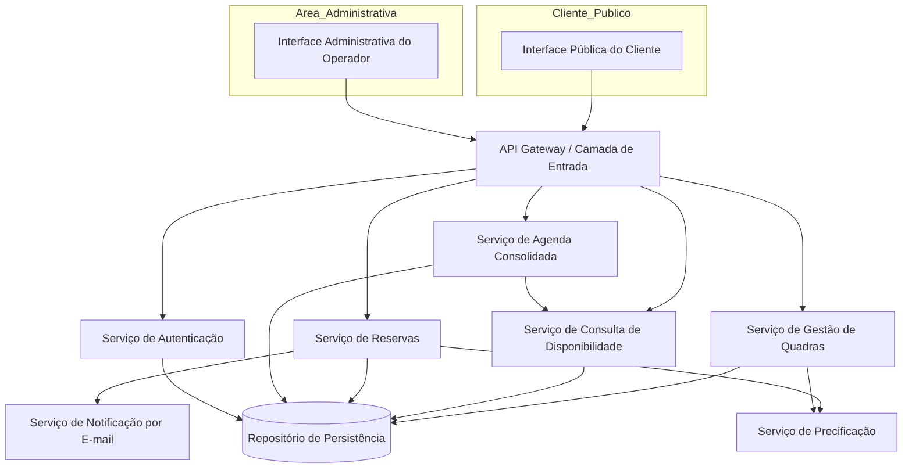
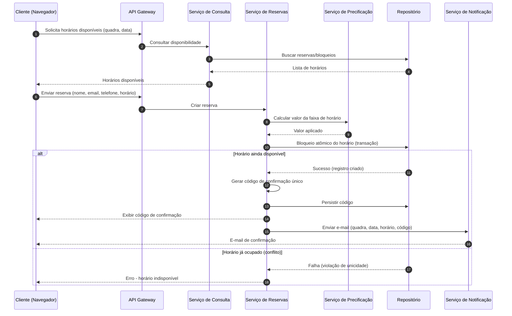
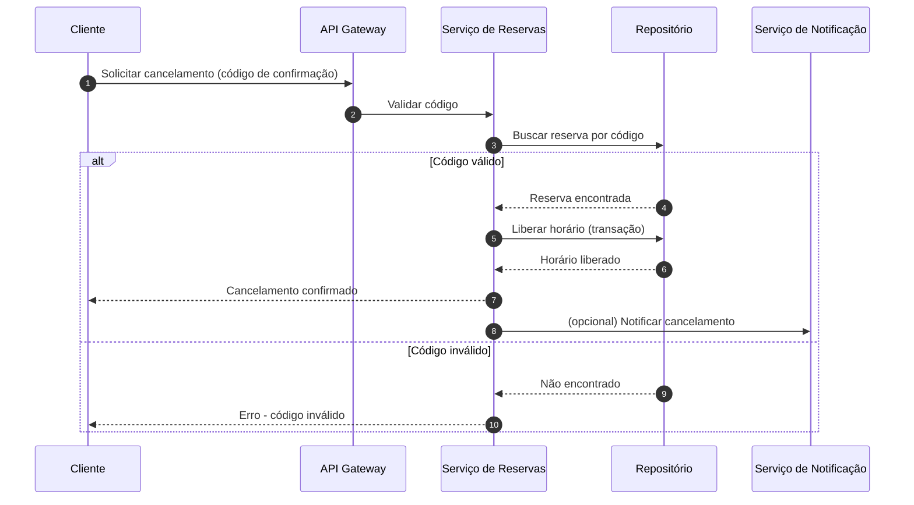
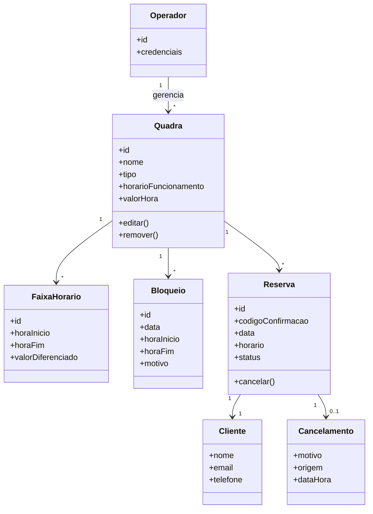

# Relatório Técnico de Arquitetura de Software
## Sistema de Reservas para Quadras Esportivas (P05)

---

## 1. Identificação das HUs

| HU | Título | Perfil | RFs Relacionados | RNFs Relacionados |
|----|--------|--------|------------------|-------------------|
| HU01 | Cadastrar quadra | Operador | RF01, RF02, RF12 | RF07-indireto, RNF03, RNF07 |
| HU02 | Bloquear horários para manutenção | Operador | RF03 | RNF03 |
| HU03 | Visualizar agenda consolidada | Operador | RF11 | RNF02, RNF03 |
| HU04 | Cancelar reserva com justificativa | Operador | RF09, RF10 | RNF03 |
| HU05 | Consultar disponibilidade sem cadastro | Cliente | RF04, RF07 | RNF01, RNF02, RNF06 |
| HU06 | Realizar reserva | Cliente | RF05, RF06, RF07, RF10 | RNF05, RNF01 |
| HU07 | Cancelar minha reserva | Cliente | RF08 | RNF05, RNF01 |

**Observação:** RF12 (valores por faixa de horário) não possui HU dedicada — ver Seção 7.

---

## 2. Diagramas de Arquitetura (Mermaid)

### 2.1 Diagrama de Componentes (visão macro)

### 2.2 Diagrama de Sequência — Realizar Reserva (HU06 / RF05, RF06, RF07, RF10, RNF05)

### 2.3 Diagrama de Sequência — Cancelamento pelo Cliente (HU07 / RF08)

### 2.4 Diagrama de Classes (modelo de domínio)

---

## 3. Decisões de Arquitetura

| ID | Decisão | Justificativa | Requisito |
|----|---------|---------------|-----------|
| DA01 | Separação entre Interface Pública (sem login) e Interface Administrativa (autenticada). | RF04/HU05 exige acesso sem cadastro; RNF03 exige proteção da área administrativa. | RF04, RNF03 |
| DA02 | Serviço de Reservas com operação de confirmação **atômica/transacional** e restrição de unicidade sobre (quadra, data, horário). | Impedir duplo agendamento em requisições simultâneas. | RF07, RNF05 |
| DA03 | Modularização por serviços de responsabilidade única (Quadras, Reservas, Consulta, Agenda, Precificação, Notificação). | Facilita inclusão de novas modalidades e evolução independente. | RNF07 |
| DA04 | Serviço de Notificação desacoplado e assíncrono. | Falhas no envio de e-mail não devem impedir a conclusão da reserva. | RF10, RNF04, RNF05 |
| DA05 | Serviço de Precificação separado, aplicando regras de faixa de horário. | Isolar regras de valor diferenciado (horário nobre). | RF12 |
| DA06 | Consulta de disponibilidade otimizada e servida com resposta ≤ 2s (leitura desacoplada de escrita). | Atender meta de desempenho do calendário. | RNF02 |
| DA07 | Interface do cliente responsiva e compatível com navegadores modernos. | Uso em dispositivos móveis e desktops. | RNF01, RNF06 |
| DA08 | Código de confirmação como identificador único e chave de operações do cliente (cancelamento sem login). | Permite cancelamento sem cadastro. | RF06, RF08 |

---

## 4. Tabela de Componentes e Rastreabilidade

| Componente | Responsabilidade Principal | Comunica-se com | Origem (HU / Critério de Aceite) |
|------------|---------------------------|-----------------|----------------------------------|
| Interface Pública do Cliente | Exibir disponibilidade, coletar dados de reserva e cancelamento, responsiva | API Gateway | HU05, HU06, HU07 / RNF01, RNF06 |
| Interface Administrativa do Operador | Gestão de quadras, bloqueios, agenda e cancelamentos | API Gateway | HU01–HU04 / RNF03 |
| API Gateway / Camada de Entrada | Roteamento, ponto único de acesso, encaminhar autenticação | Todos os serviços | Todas as HUs |
| Serviço de Autenticação | Autenticar/autorizar operador na área administrativa | API Gateway, Repositório | RNF03 / HU01–HU04 |
| Serviço de Gestão de Quadras | CRUD de quadras, bloqueios de horários, faixas de horário | Repositório, Precificação | HU01, HU02 / RF01, RF02, RF03 |
| Serviço de Consulta de Disponibilidade | Calcular horários livres/ocupados por quadra e data | Repositório, Agenda | HU05 / RF04, RF07, RNF02 |
| Serviço de Reservas | Criar reserva atômica, gerar código, cancelar, liberar horário | Repositório, Precificação, Notificação | HU06, HU07, HU04 / RF05–RF09, RNF05 |
| Serviço de Precificação | Calcular valor conforme hora e faixa (horário nobre) | Reservas, Gestão de Quadras | RF12 |
| Serviço de Agenda Consolidada | Consolidar ocupação diária de todas as quadras, navegação por data | Repositório, Consulta | HU03 / RF11 |
| Serviço de Notificação por E-mail | Enviar confirmações e avisos de cancelamento | Serviço de Reservas | HU04, HU06 / RF10 |
| Repositório de Persistência | Armazenar quadras, reservas, bloqueios, códigos, operadores | Todos os serviços | Transversal |

---

## 5. Bloqueios e Pendências

| ID | Descrição | Impacto | Status |
|----|-----------|---------|--------|
| BL01 | Não há definição de política de retenção/validade de reservas não confirmadas (hold temporário). | Afeta lógica de concorrência e liberação de horários. | Pendente esclarecimento |
| BL02 | RF12 não especifica critérios das faixas (dias da semana, feriados, múltiplas faixas). | Regras de precificação incompletas. | Pendente |
| BL03 | Não especificado provedor/mecanismo de envio de e-mail nem tratamento de falha/reenvio. | Confiabilidade da notificação. | Pendente |
| BL04 | RNF04 (99%) não define janela de manutenção nem métricas de SLA. | Estratégia de disponibilidade indefinida. | Pendente |
| BL05 | Não há definição sobre proteção contra abuso na reserva pública (rate limiting, verificação de e-mail/telefone). | Segurança e integridade de dados. | Pendente |
| BL06 | HU04 exige notificação de cancelamento; RF09 não menciona e-mail explicitamente — alinhamento necessário. | Escopo do fluxo de cancelamento pelo operador. | Menor |

---

## 6. Cobertura de Requisitos

### Requisitos Funcionais

| RF | Componente(s) Responsável(is) | Coberto |
|----|-------------------------------|---------|
| RF01 | Serviço de Gestão de Quadras | ✅ |
| RF02 | Serviço de Gestão de Quadras | ✅ |
| RF03 | Serviço de Gestão de Quadras | ✅ |
| RF04 | Serviço de Consulta / Interface Pública | ✅ |
| RF05 | Serviço de Reservas | ✅ |
| RF06 | Serviço de Reservas | ✅ |
| RF07 | Serviço de Reservas / Consulta | ✅ |
| RF08 | Serviço de Reservas | ✅ |
| RF09 | Serviço de Reservas | ✅ |
| RF10 | Serviço de Notificação | ✅ |
| RF11 | Serviço de Agenda Consolidada | ✅ |
| RF12 | Serviço de Precificação | ⚠️ Parcial (regras incompletas — BL02) |

### Requisitos Não Funcionais

| RNF | Tratamento Arquitetural | Coberto |
|-----|------------------------|---------|
| RNF01 | Interface responsiva | ✅ |
| RNF02 | Serviço de consulta otimizado (leitura desacoplada) | ✅ |
| RNF03 | Serviço de Autenticação na área administrativa | ✅ |
| RNF04 | Necessita definição de SLA/janela | ⚠️ Parcial (BL04) |
| RNF05 | Transação atômica no Serviço de Reservas | ✅ |
| RNF06 | Compatibilidade com navegadores modernos | ✅ |
| RNF07 | Arquitetura modular por serviços | ✅ |

---

## 7. Gap Analysis

| # | Lacuna Identificada | Impacto Arquitetural | Ação Recomendada |
|---|---------------------|----------------------|------------------|
| G01 | **Ausência de "hold"/reserva temporária** durante o preenchimento de dados pelo cliente. | Risco de má experiência (horário aparece disponível e falha na confirmação) sob concorrência. | Definir mecanismo de bloqueio temporário com expiração no Serviço de Reservas. |
| G02 | **Regras de precificação (RF12) subespecificadas** — quantidade de faixas, aplicação em feriados/fim de semana. | Modelo de dados e Serviço de Precificação incompletos. | Detalhar regras com o cliente antes da implementação. |
| G03 | **Falha e reenvio de e-mail não tratados.** | Cliente pode não receber código; confiabilidade comprometida. | Definir fila assíncrona com retentativas e exibir código sempre em tela (fallback já previsto). |
| G04 | **Sem gestão de identidade do cliente** — cancelamento depende apenas do código. | Código perdido = sem recuperação; possível enumeração de códigos. | Usar códigos não sequenciais/aleatórios e considerar validação por e-mail. |
| G05 | **RNF04 sem SLA mensurável** e sem definição de estratégia de resiliência. | Impossível validar disponibilidade 24/7. | Definir métricas, monitoramento e janela de manutenção. |
| G06 | **Proteção da reserva pública contra abuso** não especificada. | Vulnerabilidade a spam/reservas falsas. | Definir rate limiting e validação de contato. |
| G07 | **Fuso horário e horário de funcionamento** não detalhados para geração de slots. | Erros de cálculo de disponibilidade. | Padronizar tratamento de datas/horários e granularidade dos slots. |
| G08 | **Concorrência na agenda consolidada (RF11)** com atualizações em tempo real não especificada. | Operador pode ver dados desatualizados. | Definir estratégia de atualização/refresh da agenda. |
| G09 | **Divergência RF09 × HU04** sobre notificação de cancelamento pelo operador. | Escopo do fluxo. | Alinhar: adotar notificação por e-mail também no cancelamento pelo operador. |

---

*Relatório gerado pelo Sistema Multi-Agente AI4ES — Time 2, conforme Template Canônico de 7 Seções e Regra de Neutralidade Tecnológica.*