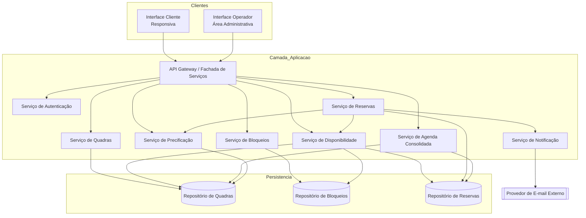
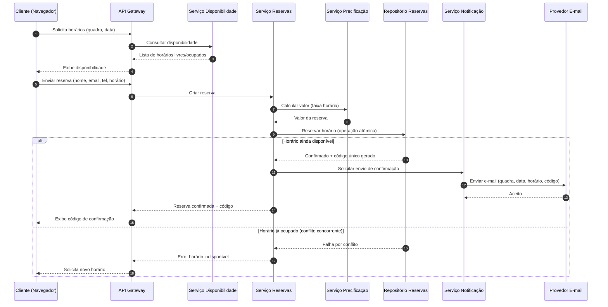
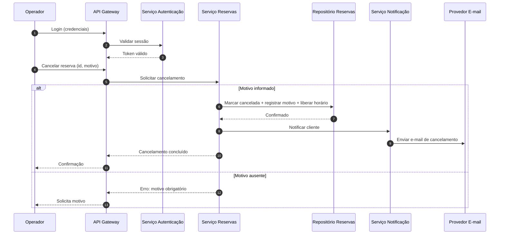
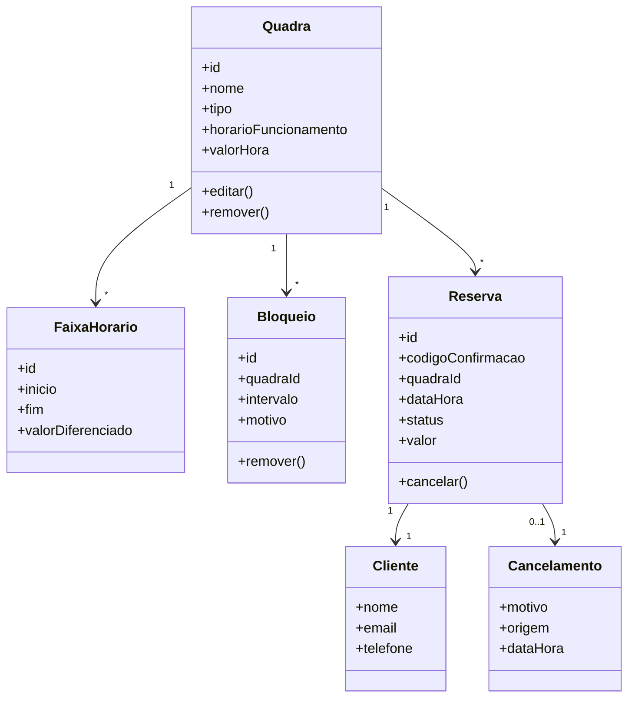

# Relatório Técnico de Arquitetura de Software
## Sistema de Reservas para Quadras Esportivas (P05)

---

## 1. Identificação das HUs

| HU | Perfil | Título | Requisitos Relacionados | Critérios de Aceite (resumo) |
|----|--------|--------|-------------------------|------------------------------|
| HU01 | Operador | Cadastrar quadra | RF01, RF02, RNF07 | Nome, tipo e valor obrigatórios; visível imediatamente na disponibilidade |
| HU02 | Operador | Bloquear horários para manutenção | RF03 | Horários bloqueados não aparecem como disponíveis; bloqueio removível |
| HU03 | Operador | Visualizar agenda consolidada | RF11 | Exibir todas quadras/horários do dia; navegação entre datas |
| HU04 | Operador | Cancelar reserva com justificativa | RF09, RF10 | Motivo obrigatório; cliente notificado por e-mail |
| HU05 | Cliente | Consultar disponibilidade sem cadastro | RF04, RNF01, RNF02 | Acesso sem login; ocupados exibidos como indisponíveis |
| HU06 | Cliente | Realizar reserva | RF05, RF06, RF07, RF10, RNF05 | Valida disponibilidade na confirmação; código exibido e enviado |
| HU07 | Cliente | Cancelar minha reserva | RF08 | Requer código válido; horário liberado imediatamente |

**Requisitos transversais:** RNF03 (autenticação operador), RNF04 (disponibilidade 24/7), RNF06 (compatibilidade navegadores), RF12 (valores diferenciados por faixa horária).

---

## 2. Diagramas de Arquitetura (Mermaid)

### 2.1 Diagrama de Componentes (Alto Nível)

### 2.2 Diagrama de Sequência — Realizar Reserva (HU06 / RF05-RF07 / RNF05)

### 2.3 Diagrama de Sequência — Cancelar Reserva pelo Operador (HU04 / RF09-RF10)

### 2.4 Diagrama de Classes Conceitual

---

## 3. Decisões de Arquitetura

| ID | Decisão | Justificativa | Requisitos |
|----|---------|---------------|------------|
| DA01 | Arquitetura modular orientada a serviços de domínio (Quadras, Bloqueios, Disponibilidade, Reservas, Precificação, Notificação) | Facilita inclusão de novas modalidades e evolução independente | RNF07, RF01 |
| DA02 | Separação de duas interfaces (Cliente pública e Operador autenticada) atrás de uma fachada/gateway | Cliente acessa sem login; operador exige autenticação | RF04, RNF03 |
| DA03 | Operação de confirmação de reserva atômica com controle de concorrência (bloqueio/reserva única por horário) | Impede duplo agendamento em requisições simultâneas | RF07, RNF05 |
| DA04 | Geração de código de confirmação único no ato da reserva | Permite cancelamento pelo cliente sem cadastro | RF06, RF08 |
| DA05 | Serviço de Disponibilidade agrega Quadras + Bloqueios + Reservas para compor a visão de horários livres | Bloqueios e reservas retiram horários da disponibilidade | RF03, RF04, RF11 |
| DA06 | Notificação assíncrona via provedor de e-mail externo, desacoplada da transação de reserva | Evita que falha de e-mail bloqueie a reserva; melhora disponibilidade | RF10, RNF04 |
| DA07 | Precificação como serviço isolado com faixas horárias configuráveis | Suporta horário nobre e valores diferenciados sem alterar núcleo | RF12 |
| DA08 | Interface cliente responsiva e compatível com navegadores modernos | Uso em mobile/desktop | RNF01, RNF06 |
| DA09 | Cache/otimização da consulta de disponibilidade | Carregar calendário em até 2s | RNF02 |

---

## 4. Tabela de Componentes e Rastreabilidade

| Componente | Responsabilidade Principal | Comunica-se com | Origem (HU / Critério de Aceite) |
|------------|----------------------------|-----------------|----------------------------------|
| Interface Cliente | Consulta pública de disponibilidade, criação e cancelamento de reserva; responsiva | API Gateway | HU05, HU06, HU07 / RNF01, RNF06 |
| Interface Operador | Administração de quadras, bloqueios, agenda e cancelamentos | API Gateway | HU01–HU04 / RNF03 |
| API Gateway / Fachada | Roteamento, exposição de endpoints, direcionamento a serviços | Todos os serviços | Transversal |
| Serviço de Autenticação | Autenticar e autorizar operador na área administrativa | API Gateway, Interface Operador | RNF03 / HU04 login |
| Serviço de Quadras | Cadastrar, editar, remover quadras e atributos | Repositório Quadras, Disponibilidade, Precificação | HU01 / RF01, RF02 |
| Serviço de Bloqueios | Criar/remover bloqueios de horário (manutenção/feriados) | Repositório Bloqueios, Disponibilidade | HU02 / RF03 |
| Serviço de Disponibilidade | Compor horários livres/ocupados por quadra e data | Repositórios Quadras/Bloqueios/Reservas | HU05 / RF04, RF07 |
| Serviço de Reservas | Criar reserva atômica, gerar código, cancelar | Disponibilidade, Precificação, Repositório Reservas, Notificação | HU06, HU07, HU04 / RF05–RF09, RNF05 |
| Serviço de Precificação | Calcular valor conforme faixa horária configurada | Repositório Quadras | RF12 / HU01 |
| Serviço de Agenda Consolidada | Montar visão diária de todas as quadras | Repositórios Reservas/Quadras | HU03 / RF11 |
| Serviço de Notificação | Enviar e-mails de confirmação e cancelamento | Provedor E-mail Externo | HU04, HU06 / RF10 |
| Repositório de Quadras | Persistir quadras e faixas horárias | Serviços de Quadras/Disponibilidade/Precificação | RF01, RF02, RF12 |
| Repositório de Bloqueios | Persistir bloqueios | Serviços Bloqueios/Disponibilidade | RF03 |
| Repositório de Reservas | Persistir reservas com garantia de unicidade por horário | Serviços Reservas/Disponibilidade/Agenda | RF05–RF09, RNF05 |
| Provedor de E-mail Externo | Entrega de mensagens ao cliente | Serviço de Notificação | RF10 |

---

## 5. Bloqueios e Pendências

| ID | Descrição | Severidade | Impacto |
|----|-----------|------------|---------|
| BL01 | Estratégia de controle de concorrência para garantir atomicidade (RNF05) não especificada nos requisitos | Alta | Risco de duplo agendamento; decisão técnica pendente |
| BL02 | Requisitos não definem existência de pagamento online, apesar de valor da hora e horário nobre | Média | Escopo financeiro ambíguo — assumido apenas informativo |
| BL03 | Política de expiração/tempo de retenção do horário durante o preenchimento da reserva não definida | Média | Possível bloqueio indevido de horários |
| BL04 | Não há definição de política de autenticação (fator, expiração de sessão, papéis múltiplos) | Média | RNF03 subespecificado |
| BL05 | Reenvio/tratamento de falha de e-mail (RF10) não especificado | Baixa | Cliente pode não receber confirmação |
| BL06 | Fuso horário e formato de datas/horários não especificados | Baixa | Ambiguidade em disponibilidade e agenda |

---

## 6. Cobertura de Requisitos

| Requisito | Coberto por | Status |
|-----------|-------------|--------|
| RF01 | Serviço de Quadras | ✅ |
| RF02 | Serviço de Quadras | ✅ |
| RF03 | Serviço de Bloqueios | ✅ |
| RF04 | Serviço de Disponibilidade + Interface Cliente | ✅ |
| RF05 | Serviço de Reservas | ✅ |
| RF06 | Serviço de Reservas (geração de código) | ✅ |
| RF07 | Serviço de Reservas + Disponibilidade | ✅ |
| RF08 | Serviço de Reservas (cancelamento por código) | ✅ |
| RF09 | Serviço de Reservas (cancelamento operador) | ✅ |
| RF10 | Serviço de Notificação | ✅ |
| RF11 | Serviço de Agenda Consolidada | ✅ |
| RF12 | Serviço de Precificação | ✅ |
| RNF01 | Interface Cliente responsiva | ✅ |
| RNF02 | Otimização consulta disponibilidade (DA09) | ⚠️ Parcial — meta de 2s precisa validação |
| RNF03 | Serviço de Autenticação | ✅ |
| RNF04 | Notificação assíncrona + arquitetura modular | ⚠️ Parcial — infra de 99% depende de operação |
| RNF05 | Reserva atômica (DA03) | ⚠️ Parcial — mecanismo pendente (BL01) |
| RNF06 | Interface compatível navegadores | ✅ |
| RNF07 | Arquitetura modular por serviços | ✅ |

---

## 7. Gap Analysis

| Gap | Descrição da Lacuna | Impacto Arquitetural | Ação Recomendada |
|-----|---------------------|----------------------|------------------|
| G01 — Atomicidade concorrente | Requisito exige impedir duplo agendamento (RNF05/RF07), mas não define o mecanismo | Núcleo de integridade do sistema; falha gera overbooking | Definir controle de concorrência (bloqueio otimista/pessimista ou restrição de unicidade) e testes de carga simultânea |
| G02 — Retenção temporária de horário | Sem "hold" durante preenchimento, dois clientes podem competir pelo mesmo slot | UX e integridade | Especificar janela de reserva temporária com expiração automática |
| G03 — Pagamento | Há valores e horário nobre, mas nenhum RF de cobrança | Escopo e possível integração externa | Confirmar com stakeholders se há transação financeira; se sim, incluir serviço de pagamento |
| G04 — Robustez de notificação | RF10 não trata falhas de envio de e-mail | Confiabilidade da comunicação | Definir fila com re-tentativas e status de entrega; exibir código sempre em tela |
| G05 — Autenticação detalhada | RNF03 não define método, papéis, expiração | Segurança | Definir política de autenticação e gestão de sessão do operador |
| G06 — Metas mensuráveis de desempenho/disponibilidade | RNF02 (2s) e RNF04 (99%) sem plano de verificação/monitoramento | Operação e SLA | Definir métricas, monitoramento e estratégia de cache/observabilidade |
| G07 — Fuso horário e localização | Datas/horários sem padronização | Disponibilidade e agenda | Padronizar fuso, formato e regras de feriados |
| G08 — LGPD / dados pessoais | Cliente informa nome, e-mail e telefone sem consentimento explícito descrito | Conformidade legal | Incluir política de privacidade, base legal e retenção de dados |
| G09 — Identificação de reserva sem login | Cancelamento depende apenas do código (RF08) | Risco de acesso indevido por adivinhação de código | Garantir códigos não sequenciais e de alta entropia |

---

> **Observação de Neutralidade Tecnológica:** Este relatório descreve responsabilidades e interfaces conceituais. Nenhum produto, framework ou banco de dados específico foi prescrito, em conformidade com as diretrizes do AI4ES — Time 2.