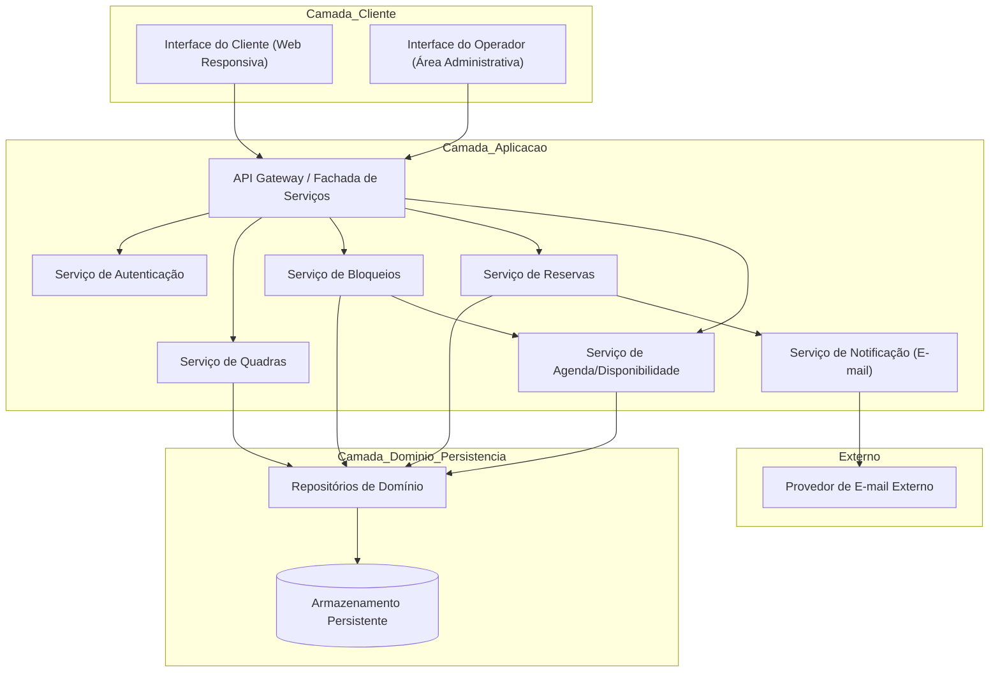
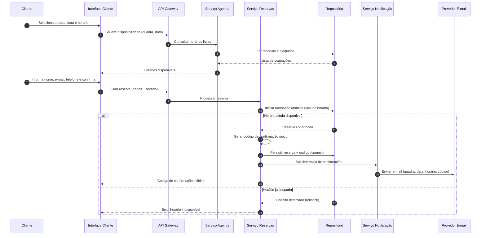
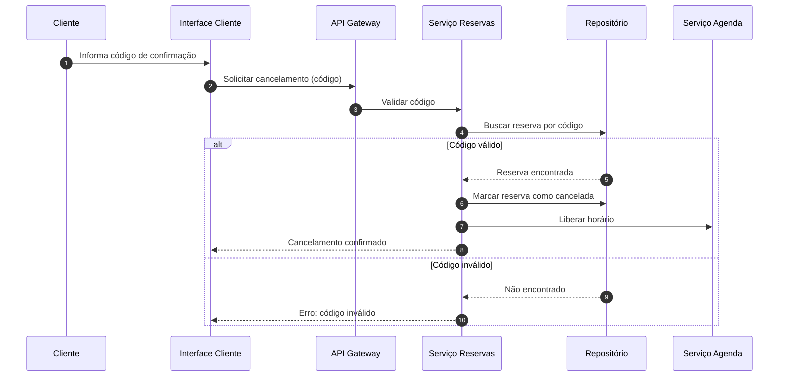
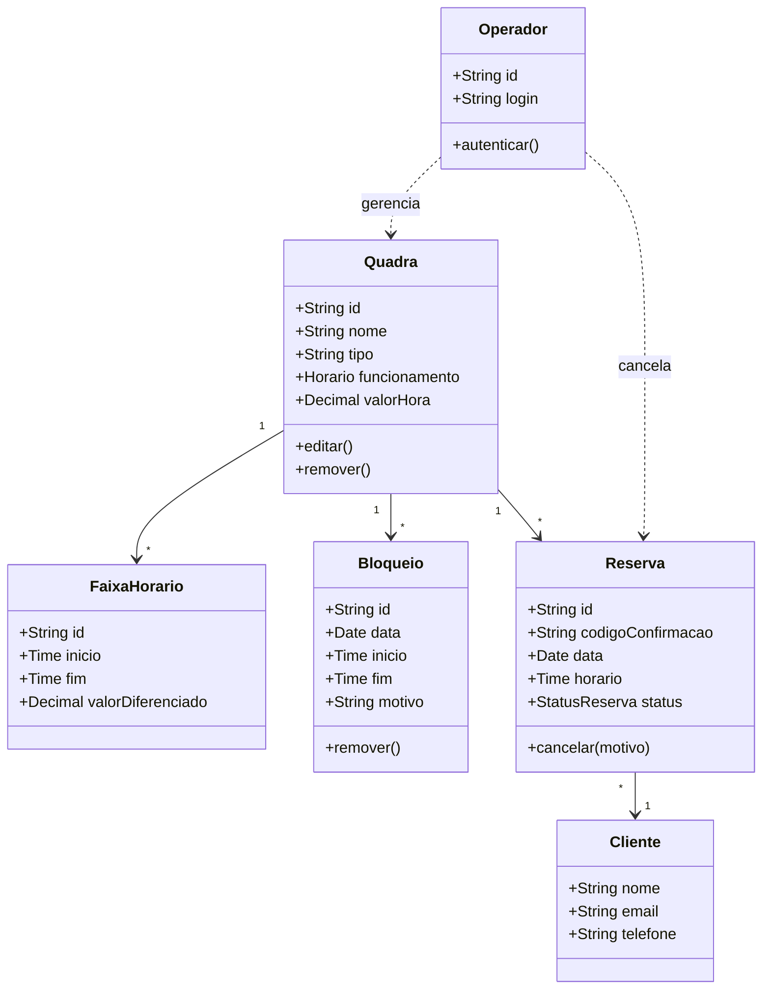

# Relatório Técnico de Arquitetura de Software
## Sistema de Reservas para Quadras Esportivas (P05)

---

## 1. Identificação das HUs

| HU | Título | Perfil | RFs Relacionados | RNFs Relacionados |
|----|--------|--------|------------------|-------------------|
| HU01 | Cadastrar quadra | Operador | RF01, RF02, RF12 | RNF03, RNF07 |
| HU02 | Bloquear horários para manutenção | Operador | RF03 | RNF03 |
| HU03 | Visualizar agenda consolidada | Operador | RF11 | RNF02, RNF03 |
| HU04 | Cancelar reserva com justificativa | Operador | RF09, RF10 | RNF03 |
| HU05 | Consultar disponibilidade sem cadastro | Cliente | RF04, RF07 | RNF01, RNF02, RNF06 |
| HU06 | Realizar reserva | Cliente | RF05, RF06, RF07, RF10 | RNF01, RNF05 |
| HU07 | Cancelar minha reserva | Cliente | RF08 | RNF01, RNF05 |

**Observações de cobertura de HU:** Todas as 7 HUs foram mapeadas. RF12 (valores por faixa de horário) é parcialmente coberto por HU01, mas não possui HU dedicada (ver Gap Analysis).

---

## 2. Diagramas de Arquitetura (Mermaid)

### 2.1 Diagrama de Componentes (Visão Macro)

### 2.2 Diagrama de Sequência — HU06 (Realizar Reserva com Atomicidade)

### 2.3 Diagrama de Sequência — HU07 (Cancelamento pelo Cliente)

### 2.4 Diagrama de Classes (Domínio)

---

## 3. Decisões de Arquitetura

| ID | Decisão | Justificativa | Requisitos Atendidos |
|----|---------|---------------|----------------------|
| DA01 | Arquitetura modular por serviços de domínio (Quadras, Reservas, Bloqueios, Agenda, Notificação) | Facilita inclusão de novas modalidades e evolução independente | RNF07 |
| DA02 | Separação de duas interfaces: pública (Cliente, sem login) e administrativa (Operador, autenticada) | Atende consulta pública e protege área administrativa | RF04, RNF03 |
| DA03 | Confirmação de reserva via transação atômica com controle de concorrência (lock/constraint de unicidade sobre quadra+data+horário) | Impede duplo agendamento em requisições simultâneas | RF07, RNF05 |
| DA04 | Geração de código de confirmação único como chave de operação do cliente | Permite cancelamento sem necessidade de cadastro/login | RF06, RF08 |
| DA05 | Serviço de Notificação assíncrono desacoplado do fluxo transacional | Evita que falha de e-mail comprometa a reserva; melhora confiabilidade | RF10, RNF04 |
| DA06 | Serviço de Agenda como projeção consolidada de reservas + bloqueios | Suporta visão consolidada (operador) e disponibilidade (cliente) com performance | RF11, RNF02 |
| DA07 | Interface do cliente responsiva e compatível com navegadores modernos | Requisito de usabilidade e compatibilidade | RNF01, RNF06 |
| DA08 | Modelo de precificação parametrizável por faixa de horário associado à quadra | Suporta valores diferenciados (horário nobre) | RF12 |

---

## 4. Tabela de Componentes e Rastreabilidade

| Componente | Responsabilidade Principal | Comunica-se com | Origem (HU / Critério de Aceite) |
|------------|---------------------------|-----------------|----------------------------------|
| Interface do Cliente | Exibir disponibilidade e capturar reservas/cancelamentos sem login | API Gateway | HU05, HU06, HU07 / "acessível pelo navegador sem login" |
| Interface do Operador | Painel administrativo para gestão de quadras, bloqueios, agenda e cancelamentos | API Gateway | HU01, HU02, HU03, HU04 |
| API Gateway / Fachada | Roteamento, aplicação de autenticação e orquestração de chamadas | Todos os serviços | RNF03, DA02 |
| Serviço de Autenticação | Autenticar operadores e proteger rotas administrativas | API Gateway | RNF03 / HU01-HU04 |
| Serviço de Quadras | Cadastrar, editar, remover quadras e faixas de valor | Repositório, Agenda | HU01 / RF01, RF02, RF12 |
| Serviço de Bloqueios | Criar e remover bloqueios de horário por manutenção/feriado | Repositório, Agenda | HU02 / RF03, "remover bloqueio a qualquer momento" |
| Serviço de Reservas | Criar reserva atômica, gerar código, cancelar reserva (cliente/operador) | Repositório, Agenda, Notificação | HU06, HU07, HU04 / RF05-RF09 |
| Serviço de Agenda/Disponibilidade | Consolidar reservas e bloqueios; retornar disponibilidade e agenda diária | Repositório | HU03, HU05 / RF04, RF11 |
| Serviço de Notificação | Enviar e-mails de confirmação e de cancelamento | Provedor de E-mail | HU04, HU06 / RF10, "notificado por e-mail" |
| Repositórios de Domínio | Persistência e controle de concorrência das entidades | Armazenamento | RNF05 |
| Armazenamento Persistente | Guardar quadras, reservas, bloqueios, códigos | Repositórios | RF01-RF12 |
| Provedor de E-mail Externo | Entrega efetiva das mensagens | Serviço de Notificação | RF10 |

---

## 5. Bloqueios e Pendências

| ID | Descrição | Severidade | Requisito Afetado |
|----|-----------|-----------|-------------------|
| BL01 | Não há especificação de política de retentativa/fallback caso o envio de e-mail falhe (RF10). O código é exibido em tela, mas a garantia de entrega não está definida. | Média | RF10, RNF04 |
| BL02 | Ausência de definição sobre expiração de reservas não confirmadas ou "pré-reservas" durante o preenchimento dos dados — janela de concorrência não especificada. | Alta | RF07, RNF05 |
| BL03 | Não há regra sobre confirmação de identidade no cancelamento pelo cliente além do código; risco de cancelamento indevido por vazamento de código. | Média | RF08 |
| BL04 | Requisitos não definem gestão de fuso horário / horário de verão, relevante para agenda 24/7. | Baixa | RF11, RNF04 |
| BL05 | Não especificado se pagamento é envolvido (existe valorHora, mas nenhum RF de cobrança). | Média | RF01, RF12 |

---

## 6. Cobertura de Requisitos

### Requisitos Funcionais

| RF | Coberto? | Componente(s) Responsável(is) |
|----|----------|-------------------------------|
| RF01 | ✅ | Serviço de Quadras |
| RF02 | ✅ | Serviço de Quadras |
| RF03 | ✅ | Serviço de Bloqueios |
| RF04 | ✅ | Serviço de Agenda / Interface Cliente |
| RF05 | ✅ | Serviço de Reservas |
| RF06 | ✅ | Serviço de Reservas |
| RF07 | ✅ | Serviço de Reservas + Repositório (atomicidade) |
| RF08 | ✅ | Serviço de Reservas |
| RF09 | ✅ | Serviço de Reservas |
| RF10 | ✅ | Serviço de Notificação |
| RF11 | ✅ | Serviço de Agenda / Interface Operador |
| RF12 | ✅ | Serviço de Quadras (FaixaHorario) |

### Requisitos Não Funcionais

| RNF | Coberto? | Abordagem Arquitetural |
|-----|----------|------------------------|
| RNF01 | ✅ | Interface Cliente responsiva (DA07) |
| RNF02 | ⚠️ Parcial | Serviço de Agenda como projeção consolidada; falta definição de estratégia de cache/otimização explícita |
| RNF03 | ✅ | Serviço de Autenticação + Gateway (DA02) |
| RNF04 | ⚠️ Parcial | Serviços desacoplados e notificação assíncrona; falta estratégia de redundância/monitoramento |
| RNF05 | ✅ | Transação atômica com constraint de unicidade (DA03) |
| RNF06 | ✅ | Interface compatível com navegadores modernos |
| RNF07 | ✅ | Arquitetura modular por serviços (DA01) |

**Cobertura total:** RFs 12/12 (100%); RNFs 5/7 plenos + 2 parciais.

---

## 7. Gap Analysis

| # | Lacuna Identificada | Impacto Arquitetural | Ação Recomendada |
|---|---------------------|----------------------|------------------|
| G01 | **Janela de concorrência de reserva (BL02).** Entre a consulta de disponibilidade e a confirmação existe intervalo em que dois clientes podem tentar o mesmo horário. RNF05 exige atomicidade apenas no commit. | Risco de má experiência e conflitos frequentes em horários de pico. | Definir mecanismo de pré-reserva com TTL ou lock otimista com validação final; documentar comportamento de expiração. |
| G02 | **Garantia de entrega de e-mail (BL01).** RF10 não define o que ocorre se o provedor falhar. | Cliente pode não receber código; impacto em confiabilidade percebida. | Introduzir fila com retentativa e status de notificação; código sempre disponível em tela como fallback primário. |
| G03 | **Segurança do código de cancelamento (BL03).** Código único é a única credencial do cliente. | Cancelamento indevido caso o código vaze. | Considerar verificação adicional (ex.: e-mail associado) ou link de cancelamento assinado enviado por e-mail. |
| G04 | **Precificação e cobrança.** Existe `valorHora` e faixas (RF12), mas nenhum RF de pagamento/cobrança. | Ambiguidade sobre se o sistema apenas exibe valores ou processa pagamentos — muda drasticamente o escopo. | Confirmar com stakeholders se pagamento é escopo. Caso positivo, prever Serviço de Pagamento e integração externa. |
| G05 | **Desempenho do calendário (RNF02).** Meta de 2s definida, mas sem estratégia de otimização especificada. | Risco de não atingir SLA com muitas quadras/reservas. | Definir projeção materializada/cache de disponibilidade por quadra-data e paginação por data. |
| G06 | **Disponibilidade 24/7 a 99% (RNF04).** Sem definição de redundância, backup ou monitoramento. | SLA pode não ser sustentável sem estratégia operacional. | Definir política de observabilidade, health-checks e redundância nos serviços críticos (Reservas/Agenda). |
| G07 | **Gestão de fuso horário (BL04).** Sistema 24/7 sem tratamento de timezone/horário de verão. | Reservas podem ser exibidas em horário incorreto. | Padronizar armazenamento de horários e política de exibição regional. |
| G08 | **Auditoria de cancelamentos.** RF09 exige motivo, mas não há trilha de auditoria especificada. | Dificuldade de rastreabilidade administrativa. | Registrar histórico imutável de cancelamentos (autor, motivo, timestamp). |

---

*Fim do Relatório Canônico de Arquitetura — AI4ES Time 2 / P05.*