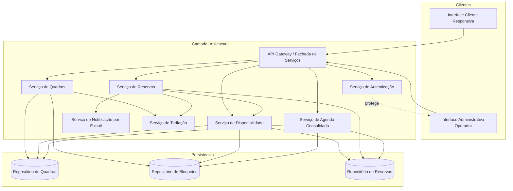
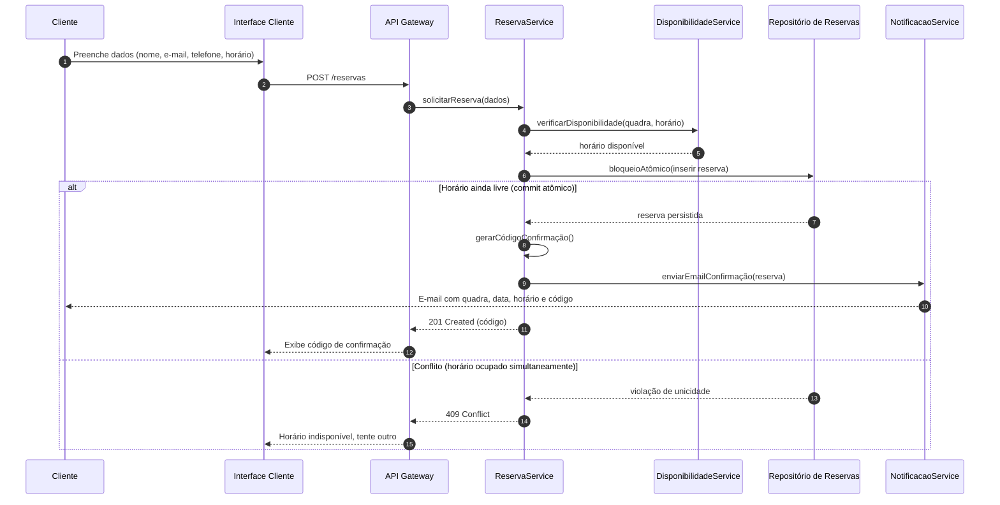
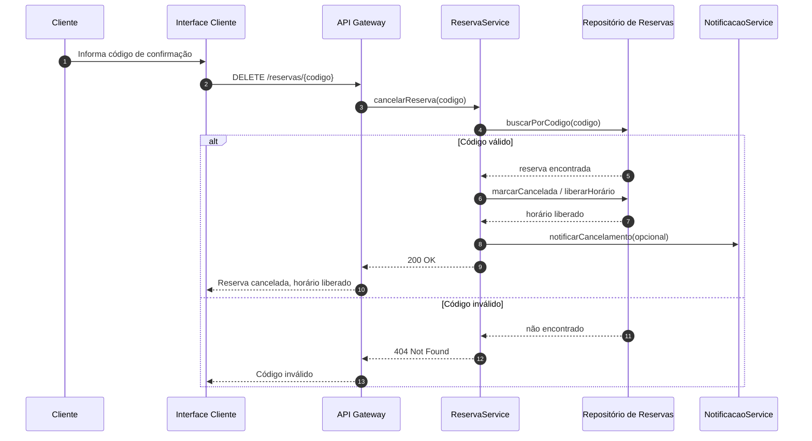
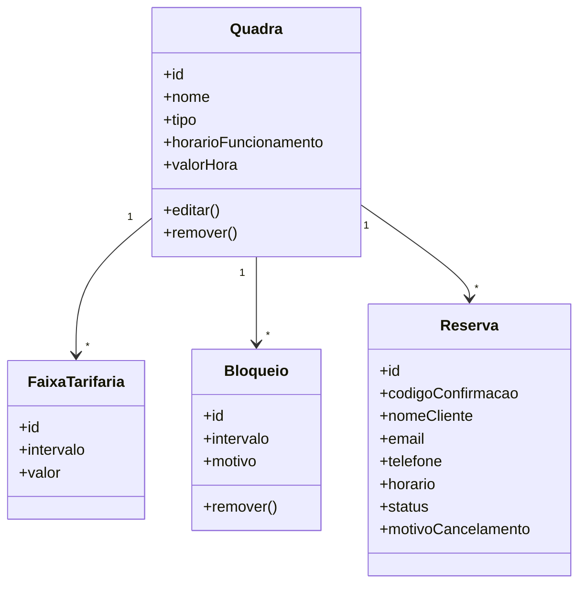

# Relatório Técnico de Arquitetura de Software
## Sistema de Reservas para Quadras Esportivas (P05)

---

## 1. Identificação das HUs

| HU | Perfil | Título | RFs Associados | RNFs Relevantes |
|----|--------|--------|----------------|-----------------|
| HU01 | Operador | Cadastrar quadra | RF01, RF12 | RNF03, RNF07 |
| HU02 | Operador | Bloquear horários para manutenção | RF03 | RNF03 |
| HU03 | Operador | Visualizar agenda consolidada | RF11 | RNF02, RNF03 |
| HU04 | Operador | Cancelar reserva com justificativa | RF09, RF10 | RNF03 |
| HU05 | Cliente | Consultar disponibilidade sem cadastro | RF04, RF07 | RNF01, RNF02, RNF06 |
| HU06 | Cliente | Realizar reserva | RF05, RF06, RF07, RF10 | RNF05, RNF01 |
| HU07 | Cliente | Cancelar minha reserva | RF08 | RNF05 |

**RFs sem HU explícita:** RF02 (editar/remover quadra) — derivável da gestão de quadras (HU01).

---

## 2. Diagramas de Arquitetura (Mermaid)

### 2.1 Diagrama de Componentes (Visão Macro)

### 2.2 Diagrama de Sequência — HU06 Realizar Reserva (com atomicidade RNF05)

### 2.3 Diagrama de Sequência — HU07 Cancelar Reserva pelo Cliente

### 2.4 Diagrama de Classes (Domínio)

---

## 3. Decisões de Arquitetura

| ID | Decisão | Justificativa | Requisito |
|----|---------|---------------|-----------|
| DA01 | Separação clara entre Interface Cliente (pública) e Interface Operador (autenticada) | Cliente acessa sem login; área administrativa protegida | RF04, RNF03 |
| DA02 | Modularização por serviços de domínio (Quadra, Disponibilidade, Reserva, Tarifação, Notificação) | Facilita inclusão de novas modalidades e evolução | RNF07 |
| DA03 | Confirmação de reserva via operação atômica com restrição de unicidade no repositório | Evita duplo agendamento em concorrência | RNF05, RF07 |
| DA04 | Geração de código de confirmação único como chave de acesso do cliente | Permite cancelamento sem cadastro/login | RF06, RF08 |
| DA05 | Notificação por e-mail desacoplada em serviço próprio | Reduz acoplamento e permite reenvios/assíncrono | RF10, HU04 |
| DA06 | Serviço de Disponibilidade agregando quadra + bloqueios + reservas | Fonte única de verdade para cálculo de horários livres | RF04, RF03, RF07 |
| DA07 | Cache/otimização da consulta de disponibilidade | Atender carregamento ≤ 2s | RNF02 |
| DA08 | Interface responsiva multi-navegador | Uso em mobile/desktop | RNF01, RNF06 |

---

## 4. Tabela de Componentes e Rastreabilidade

| Componente | Responsabilidade Principal | Comunica-se com | Origem (HU / Critério de Aceite) |
|------------|---------------------------|-----------------|----------------------------------|
| Interface Cliente | Exibir disponibilidade, capturar reservas/cancelamentos, ser responsiva | API Gateway | HU05, HU06, HU07 / RNF01 |
| Interface Operador | Gestão de quadras, bloqueios, agenda e cancelamentos administrativos | API Gateway, AuthService | HU01–HU04 / RNF03 |
| API Gateway | Fachada única, roteamento e controle de acesso | Todos os serviços | Transversal |
| AuthService | Autenticar operador e proteger área administrativa | API Gateway, Interface Operador | RNF03 / HU05 (login apenas p/ operador) |
| QuadraService | Cadastrar, editar, remover quadras e bloqueios | RepoQuadra, RepoBloqueio, TarifacaoService | HU01, HU02 / RF01, RF02, RF03 |
| TarifacaoService | Gerir valor da hora e faixas diferenciadas (horário nobre) | QuadraService, ReservaService | HU01 / RF12 |
| DisponibilidadeService | Calcular horários livres considerando bloqueios e reservas | RepoQuadra, RepoBloqueio, RepoReserva, ReservaService | HU05 / RF04, RF07 |
| ReservaService | Criar reserva atômica, gerar código, cancelar reservas | DisponibilidadeService, RepoReserva, NotificacaoService, TarifacaoService | HU06, HU07, HU04 / RF05–RF09 |
| AgendaService | Consolidar agenda diária de todas as quadras | RepoReserva, RepoQuadra, RepoBloqueio | HU03 / RF11 |
| NotificacaoService | Enviar e-mail de confirmação e de cancelamento | ReservaService | HU06, HU04 / RF10 |
| RepoQuadra | Persistir quadras e tarifas | QuadraService, demais serviços | RF01, RF02, RF12 |
| RepoBloqueio | Persistir bloqueios de horário | QuadraService, DisponibilidadeService | RF03 |
| RepoReserva | Persistir reservas com restrição de unicidade de horário | ReservaService, DisponibilidadeService | RF05–RF08, RNF05 |

---

## 5. Bloqueios e Pendências

| ID | Descrição | Severidade | Necessário para |
|----|-----------|------------|-----------------|
| BL01 | Não especificado provedor/mecanismo de envio de e-mail nem tratamento de falhas de entrega | Média | RF10 |
| BL02 | Política de autenticação do operador não detalhada (credenciais, recuperação, perfis) | Alta | RNF03 |
| BL03 | Regra de tolerância/expiração de reservas não confirmadas não definida | Média | RF05, RNF05 |
| BL04 | Não há definição sobre pagamento — valor da hora é apenas informativo? | Alta | RF01, RF12 |
| BL05 | Fuso horário e formato de horário de funcionamento não especificados | Média | RF01, RF04 |
| BL06 | Regra de sobreposição entre faixas tarifárias e horário de funcionamento não definida | Baixa | RF12 |

---

## 6. Cobertura de Requisitos

### Requisitos Funcionais
| RF | Coberto por | Status |
|----|-------------|--------|
| RF01 | QuadraService, TarifacaoService | ✅ |
| RF02 | QuadraService | ✅ |
| RF03 | QuadraService, RepoBloqueio | ✅ |
| RF04 | DisponibilidadeService, Interface Cliente | ✅ |
| RF05 | ReservaService | ✅ |
| RF06 | ReservaService (geração de código) | ✅ |
| RF07 | DisponibilidadeService + RepoReserva (unicidade) | ✅ |
| RF08 | ReservaService (cancelamento por código) | ✅ |
| RF09 | ReservaService (cancelamento com motivo) | ✅ |
| RF10 | NotificacaoService | ✅ |
| RF11 | AgendaService | ✅ |
| RF12 | TarifacaoService | ✅ |

### Requisitos Não Funcionais
| RNF | Abordagem Arquitetural | Status |
|-----|------------------------|--------|
| RNF01 | Interface Cliente responsiva | ✅ |
| RNF02 | Cache/otimização em DisponibilidadeService (DA07) | ⚠️ Requer validação de desempenho |
| RNF03 | AuthService protegendo área operador | ✅ |
| RNF04 | Disponibilidade 99% 24/7 — depende de infraestrutura | ⚠️ Fora do design abstrato |
| RNF05 | Operação atômica com unicidade (DA03) | ✅ |
| RNF06 | Suporte a navegadores modernos | ✅ |
| RNF07 | Arquitetura modular por serviços | ✅ |

---

## 7. Gap Analysis

| # | Lacuna | Impacto Arquitetural | Ação Recomendada |
|---|--------|----------------------|------------------|
| G01 | **Ausência de fluxo de pagamento** apesar de valor da hora e horário nobre | Se pagamento for exigido futuramente, ReservaService precisará integrar gateway externo e mudar semântica de confirmação | Confirmar escopo; prever ponto de extensão em ReservaService |
| G02 | **Falha de entrega de e-mail** não tratada (RF10) | Reserva confirmada mas cliente sem código pode gerar disputa | Definir fila/retry assíncrono e exibição garantida do código em tela (já previsto HU06) |
| G03 | **Expiração de reservas / no-show** não especificada | Sem TTL, horários podem ficar presos indevidamente | Definir política de expiração ou confirmação; adicionar job de liberação |
| G04 | **Autenticação do operador** sem detalhamento (RNF03/BL02) | Risco de segurança na área administrativa | Especificar mecanismo de credenciais, perfis e sessão |
| G05 | **Concorrência no cancelamento e re-reserva** (RF08/RNF05) | Liberação e nova reserva simultânea podem colidir | Garantir transação atômica também na liberação de horário |
| G06 | **Fuso horário / regras de calendário** (feriados) não modelados | Bloqueios por feriado (RF03) exigem calendário | Definir modelo de datas e fuso; considerar calendário de feriados |
| G07 | **Métricas de disponibilidade (RNF04)** dependem de infraestrutura não especificada | Não endereçável só no design lógico | Definir estratégia de deploy/observabilidade na fase de infraestrutura |
| G08 | **Auditoria de cancelamentos** (motivo RF09) sem retenção definida | Rastreabilidade administrativa limitada | Persistir histórico de status/motivos em RepoReserva |
| G09 | **Sobreposição de faixas tarifárias** (RF12/BL06) sem regra de prioridade | Ambiguidade no cálculo de valor | Definir regra determinística de precedência de faixas |

---

> **Observação de Neutralidade:** Este relatório descreve responsabilidades e interfaces conceituais. Repositórios, gateways e serviços de notificação são componentes lógicos; a escolha de tecnologias concretas (banco, framework, provedor de e-mail, infraestrutura de deploy) deve ser definida em fase posterior de projeto físico.