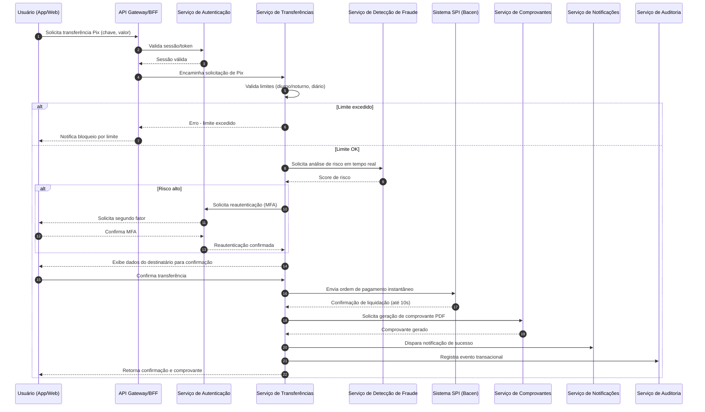
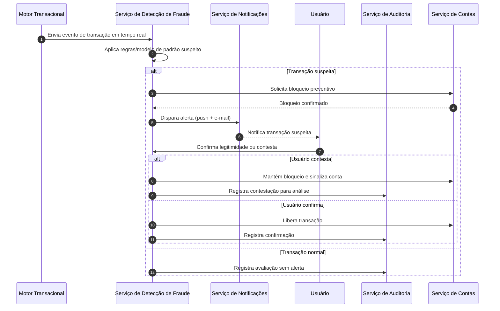

# Relatório Técnico de Arquitetura de Software

## 1. Identificação das HUs

| HU | Título | Perfil | RFs Relacionados |
|----|--------|--------|-------------------|
| HU01 | Abrir conta com validação de identidade | PF | RF01, RF02, RF08 |
| HU02 | Autenticar com múltiplos fatores | PF/PJ/Gerente | RF03, RF04, RF05, RF06 |
| HU03 | Realizar transferência via Pix | PF/PJ | RF22, RF23, RF24, RF13, RF27 |
| HU04 | Pagar boleto com agendamento | PF/PJ | RF28, RF29, RF30, RF31 |
| HU05 | Gerenciar cartão de crédito | PF/PJ | RF15, RF16, RF17, RF18, RF19, RF20 |
| HU06 | Contestar transação não reconhecida | PF/PJ | RF21, RF39 |
| HU07 | Investir em renda fixa | PF/PJ | RF32, RF33, RF34 |
| HU08 | Gerenciar consentimentos do open finance | PF/PJ | RF41, RF42, RF44 |
| HU09 | Receber alertas e responder a suspeita de fraude | PF/PJ | RF36, RF37, RF38, RF39, RF40 |
| HU10 | Abrir conta PJ com documentação societária | PJ | RF01, RF02, RF08 |
| HU11 | Realizar TED para fornecedores | PJ | RF25, RF26, RF27, RF13 |
| HU12 | Acompanhar carteira de clientes | Gerente | RF07, RF45, RF46 |
| HU13 | Abrir solicitação de serviço em nome do cliente | Gerente | RF47 |

---

## 2. Diagramas de Arquitetura (Mermaid)

### 2.1 Diagrama de Componentes (Visão Macro)

```mermaid
flowchart TB
    subgraph Canais
        MOB[App Mobile]
        WEB[Portal Web]
        GER[Console Gerente]
    end

    subgraph Borda
        APIGW[API Gateway / BFF]
    end

    subgraph DominiosCore["Domínios de Negócio"]
        AUTH[Serviço de Identidade e Autenticação]
        ONB[Serviço de Onboarding e KYC]
        CTA[Serviço de Contas Correntes/Poupança]
        CARD[Serviço de Cartões]
        TRANSF[Serviço de Transferências Pix/TED]
        BOLETO[Serviço de Pagamento de Boletos]
        INVEST[Serviço de Investimentos]
        FRAUDE[Serviço de Detecção de Fraude]
        OPENFIN[Serviço de Open Finance]
        CRM[Serviço de Relacionamento/CRM]
        NOTIF[Serviço de Notificações]
        AUDIT[Serviço de Auditoria e Trilhas]
        COMPROV[Serviço de Documentos/Comprovantes]
    end

    subgraph Integracoes["Integrações Externas Regulatórias"]
        SPI[Sistema de Pagamentos Instantâneos - SPI/Bacen]
        STR[Sistema de Transferência de Reservas - STR/TED]
        BACEN[Sistema de Reporte Regulatório - Bacen]
        BUREAU[Bureau de Crédito]
        PCI[Processador de Cartão PCI-DSS]
        OFPARC[Instituições Participantes Open Finance]

    end

    subgraph Persistencia["Camada de Dados (conceitual)"]
        DB_CTA[(Armazenamento Transacional Contas)]
        DB_CARD[(Armazenamento Cartões - sem PAN)]
        DB_INVEST[(Armazenamento Investimentos)]
        DB_AUDIT[(Armazenamento Auditoria Imutável)]
        DB_ID[(Armazenamento Identidade/Credenciais)]
    end

    MOB --> APIGW
    WEB --> APIGW
    GER --> APIGW

    APIGW --> AUTH
    APIGW --> ONB
    APIGW --> CTA
    APIGW --> CARD
    APIGW --> TRANSF
    APIGW --> BOLETO
    APIGW --> INVEST
    APIGW --> OPENFIN
    APIGW --> CRM

    AUTH --> DB_ID
    ONB --> BUREAU
    ONB --> AUTH
    CTA --> DB_CTA
    CARD --> DB_CARD
    CARD --> PCI
    TRANSF --> SPI
    TRANSF --> STR
    TRANSF --> COMPROV
    TRANSF --> FRAUDE
    BOLETO --> COMPROV
    BOLETO --> NOTIF
    INVEST --> DB_INVEST
    FRAUDE --> NOTIF
    FRAUDE --> AUDIT
    OPENFIN --> OFPARC
    OPENFIN --> AUDIT
    CRM --> CTA
    CRM --> INVEST
    CRM --> AUDIT

    AUTH --> AUDIT
    CTA --> AUDIT
    CARD --> AUDIT
    TRANSF --> AUDIT
    BOLETO --> AUDIT
    INVEST --> AUDIT

    AUDIT --> DB_AUDIT
    AUDIT --> BACEN
```

### 2.2 Diagrama de Sequência — Transferência Pix (HU03)

### 2.3 Diagrama de Sequência — Detecção de Fraude e Contestação (HU09)

---

## 3. Decisões de Arquitetura

| # | Decisão | Justificativa | Requisitos Relacionados |
|---|---------|----------------|---------------------------|
| DA01 | Arquitetura orientada a domínios/serviços desacoplados por capacidade de negócio (contas, cartões, transferências, investimentos, fraude, open finance) | Permite escalonamento independente e isolamento de falhas por domínio crítico | RNF16, RNF17, RNF23 |
| DA02 | Uso de um API Gateway/BFF como ponto único de entrada para canais mobile, web e gerente | Centraliza autenticação, rate limiting e roteamento, simplificando governança de segurança | RNF04, RF03, RNF01 |
| DA03 | Delegação do armazenamento e processamento de dados de cartão a um processador certificado externo | Elimina escopo PCI-DSS do núcleo da plataforma | RNF06, RF14, RF15 |
| DA04 | Serviço de Auditoria como componente transversal, consumindo eventos de todos os domínios | Garante trilha imutável centralizada com retenção regulatória | RNF12, RF40 |
| DA05 | Serviço de Detecção de Fraude desacoplado, operando de forma síncrona (bloqueio) e assíncrona (análise contínua) | Permite decisão em tempo real sem acoplar lógica de risco aos serviços transacionais | RF36, RF37, RNF15 |
| DA06 | Comunicação entre canais e domínios sempre criptografada em trânsito e com autenticação mútua conceitual | Atende exigência de TLS e proteção de dados sensíveis | RNF01, RNF02 |
| DA07 | Módulo de Consentimento como responsável único por regras de acesso a dados via Open Finance | Isola complexidade regulatória de compartilhamento de dados | RF41-RF44, RNF11 |
| DA08 | Persistência transacional segregada por domínio (contas, cartões, investimentos, auditoria, identidade), sem prescrição de tecnologia específica | Mantém neutralidade tecnológica e permite escolha posterior conforme requisitos não funcionais de consistência | RNF13, RNF16 |
| DA09 | Serviço de Notificações centralizado para push/e-mail, consumido por múltiplos domínios (fraude, boletos, cartões, consentimentos) | Evita duplicação de lógica de disparo e garante consistência de canal | RF20, RF31, RF38, HU08 |
| DA10 | Componente de Geração de Comprovantes desacoplado e reutilizável entre Pix, TED, boletos e cartões | Padroniza emissão de PDF e reduz acoplamento entre domínios transacionais | RF13, RF29 |
| DA11 | Controle de acesso do Gerente de Relacionamento condicionado a registro de consentimento do cliente, validado no domínio de CRM | Atende exigência de consentimento explícito antes de qualquer visão consolidada | RF07, HU12, HU13 |
| DA12 | Escalonamento horizontal automático e implantação multi-zona tratados como requisitos de infraestrutura transversal, não vinculados a um domínio específico | Aplica-se a toda a plataforma de forma uniforme | RNF16, RNF23 |

---

## 4. Tabela de Componentes e Rastreabilidade

| Componente | Responsabilidade Principal | Comunica-se com | Origem (HU / Critério de Aceite) |
|------------|------------------------------|-------------------|------------------------------------|
| API Gateway/BFF | Roteamento, autenticação de borda, rate limiting, agregação de respostas para canais | Todos os serviços de domínio; canais mobile/web/gerente | RNF04, HU02 |
| Serviço de Identidade e Autenticação | Gestão de credenciais, MFA, sessões, histórico de acesso, bloqueio remoto | API Gateway; Armazenamento de Identidade; Serviço de Auditoria | HU02, RF03-RF06 |
| Serviço de Onboarding e KYC | Validação de documentos PF/PJ, integração com bureau, aprovação de cadastro | Serviço de Autenticação; Bureau de Crédito; Serviço de Notificações | HU01, HU10, RF01-RF02 |
| Serviço de Contas Correntes/Poupança | Saldo, extrato, rendimento de poupança, transferência entre contas próprias | Armazenamento Transacional Contas; Serviço de Comprovantes; Serviço de Auditoria | RF08-RF13 |
| Serviço de Cartões | Emissão, limites, bloqueio/desbloqueio, faturas, notificação de transação | Processador PCI-DSS; Serviço de Notificações; Serviço de Fraude | HU05, RF14-RF20 |
| Serviço de Transferências (Pix/TED) | Orquestração de chaves Pix, envio SPI/STR, agendamento, limites | SPI; STR; Serviço de Fraude; Serviço de Comprovantes | HU03, HU11, RF22-RF27 |
| Serviço de Pagamento de Boletos | Leitura/validação de código de barras, agendamento, lembrete de vencimento | Serviço de Notificações; Serviço de Comprovantes | HU04, RF28-RF31 |
| Serviço de Investimentos | Catálogo de produtos, aplicação/resgate, posição consolidada, informe de rendimentos | Armazenamento Investimentos; Serviço de Auditoria | HU07, RF32-RF35 |
| Serviço de Detecção de Fraude | Monitoramento em tempo real, scoring de risco, bloqueio preventivo | Serviço de Transferências; Serviço de Cartões; Serviço de Notificações; Auditoria | HU09, RF36-RF40 |
| Serviço de Open Finance | Gestão de consentimentos, exposição de APIs padronizadas, iniciação de pagamento via terceiros | Instituições Participantes; Serviço de Auditoria | HU08, RF41-RF44 |
| Serviço de Relacionamento/CRM | Visão consolidada de carteira, anotações, abertura de solicitações em nome do cliente | Serviço de Contas; Serviço de Investimentos; Serviço de Auditoria | HU12, HU13, RF45-RF47 |
| Serviço de Notificações | Disparo unificado de push e e-mail para eventos de negócio | Todos os domínios que geram eventos ao usuário | RF20, RF31, RF38, HU08 |
| Serviço de Auditoria e Trilhas | Registro imutável de operações, acessos e alterações; suporte a relatórios regulatórios | Todos os domínios; Sistema de Reporte Regulatório Bacen | RNF12, RF40, RNF09 |
| Serviço de Documentos/Comprovantes | Geração e disponibilização de comprovantes/PDF | Serviço de Transferências; Serviço de Boletos; Serviço de Contas | RF13, RF29 |
| Armazenamento de Identidade | Persistência segura de credenciais e fatores de autenticação | Serviço de Autenticação | RNF02, RNF03 |
| Armazenamento Transacional Contas | Persistência de saldo, extrato e histórico transacional | Serviço de Contas | RNF14, RNF22 |
| Armazenamento Cartões (sem PAN) | Persistência de metadados de cartão, exceto dados sensíveis PCI | Serviço de Cartões | RNF06 |
| Armazenamento Investimentos | Persistência de posições e histórico de aplicações/resgates | Serviço de Investimentos | RF34 |
| Armazenamento Auditoria Imutável | Retenção de longo prazo de trilhas de auditoria | Serviço de Auditoria | RNF12 |

---

## 5. Bloqueios e Pendências

| # | Descrição do Bloqueio/Pendência | Impacto | Responsável Sugerido |
|---|-----------------------------------|---------|------------------------|
| B01 | Não há definição de SLA específico para resposta do Bureau de Crédito e Bureau de KYC de sócios PJ | Pode inviabilizar cumprimento do prazo de 24h/48h de análise de onboarding (HU01, HU10) | Time de Integrações/Onboarding |
| B02 | Ausência de detalhamento sobre o modelo de scoring de fraude (regras vs. machine learning) | Impacta desenho de latência e infraestrutura do Serviço de Detecção de Fraude | Time de Risco/Fraude |
| B03 | Não especificado o processo de reconciliação em caso de falha do SPI durante a janela de 10s (RF24/RNF15) | Risco de inconsistência transacional sem definição clara de fallback | Arquitetura Core Bancário |
| B04 | Regras de retenção e expurgo de dados pessoais sob LGPD não detalhadas além da auditoria de 5 anos | Pode gerar conflito entre RNF10 (LGPD) e RNF12 (retenção mínima) | Jurídico/Compliance + Arquitetura de Dados |
| B05 | Não há definição de política de autorização granular do Gerente de Relacionamento (o que pode/não pode visualizar sem consentimento amplo) | Risco de exposição indevida de dados sensíveis de clientes | Time de CRM/Segurança |
| B06 | Ausência de requisito sobre versionamento e depreciação das APIs de Open Finance | Pode gerar quebra de contrato com instituições parceiras | Time de Open Finance |

---

## 6. Cobertura de Requisitos

| Categoria | RFs/RNFs Cobertos | Observação |
|-----------|--------------------|------------|
| Gestão de Usuários e Autenticação | RF01-RF07 | Totalmente endereçados via Serviço de Autenticação e Onboarding |
| Conta Corrente/Poupança | RF08-RF13 | Cobertos pelo Serviço de Contas e Serviço de Comprovantes |
| Cartões | RF14-RF21 | Cobertos pelo Serviço de Cartões, com dependência do Processador PCI-DSS |
| Transferências | RF22-RF27 | Cobertos pelo Serviço de Transferências, integrando SPI/STR |
| Boletos | RF28-RF31 | Cobertos pelo Serviço de Pagamento de Boletos |
| Investimentos | RF32-RF35 | Cobertos pelo Serviço de Investimentos |
| Detecção de Fraude | RF36-RF40 | Cobertos pelo Serviço de Detecção de Fraude, integrado a Notificações e Auditoria |
| Open Finance | RF41-RF44 | Cobertos pelo Serviço de Open Finance |
| Gerente de Relacionamento | RF45-RF47 | Cobertos pelo Serviço de Relacionamento/CRM |
| Segurança (RNF01-RNF06) | Totalmente endereçados nas decisões DA02, DA03, DA06 | — |
| Conformidade (RNF07-RNF12) | Endereçados via Serviço de Auditoria e Open Finance | Pendências em B04 |
| Disponibilidade/Desempenho (RNF13-RNF17) | Endereçados via decisões de escalonamento horizontal e multi-zona | Detalhamento técnico pendente de fase de detalhamento não-funcional |
| Usabilidade/Compatibilidade (RNF18-RNF21) | Não modelado em componentes de backend; recai sobre camada de apresentação nos canais | Fora do escopo arquitetural de backend |
| Infraestrutura/Dados (RNF22-RNF24) | Endereçados conceitualmente via decisões DA08, DA12 | Detalhamento técnico de backup/observabilidade pendente |

---

## 7. Gap Analysis

| # | Lacuna Identificada | Impacto Arquitetural | Ação Recomendada |
|---|------------------------|-------------------------|----------------------|
| G01 | Falta de especificação sobre o mecanismo de idempotência para transações Pix/TED em caso de reenvio de requisição | Risco de duplicidade de débito/crédito em cenários de falha de rede | Definir contrato de idempotência (chave de idempotência) no Serviço de Transferências antes da fase de detalhamento |
| G02 | Ausência de requisito explícito sobre consistência entre saldo em tempo real (RF09) e processamento assíncrono de fraude/bloqueio | Pode gerar saldo "otimista" exibido ao usuário divergente do saldo efetivamente disponível | Modelar estados intermediários de saldo (disponível vs. bloqueado) no Serviço de Contas |
| G03 | Não há requisito sobre o tratamento de usuários com múltiplos perfis (ex.: sócio PJ que também é cliente PF) | Impacta modelo de identidade e autorização | Especificar modelo de vínculo multi-perfil no Serviço de Identidade |
| G04 | Falta de definição sobre priorização/SLA diferenciado para relatórios regulatórios (BACEN 3040, SCR) em caso de indisponibilidade parcial | Risco de não conformidade regulatória em cenários de degradação | Definir contrato de resiliência específico para o Serviço de Auditoria/Regulatório |
| G05 | Ausência de requisito sobre auditabilidade das decisões automatizadas do motor de fraude (explicabilidade) | Pode gerar dificuldade em contestações e auditorias internas/externas | Incluir requisito de rastreabilidade de critérios de decisão no Serviço de Fraude |
| G06 | Não especificado processo de revogação em cascata de acessos do Gerente quando cliente revoga consentimento | Risco de acesso residual indevido | Modelar evento de revogação propagado ao Serviço de CRM |
| G07 | Falta de requisito sobre internacionalização/multi-idioma, embora não seja crítico para escopo nacional | Baixo impacto, mas pode gerar retrabalho futuro em expansão | Registrar como item de backlog de evolução, sem ação imediata |