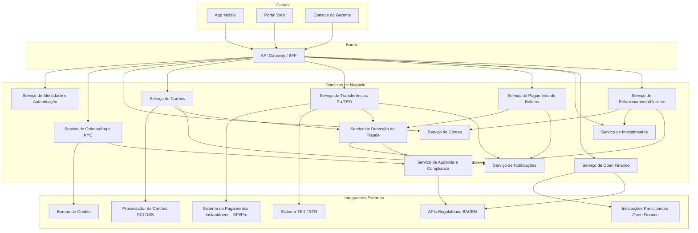
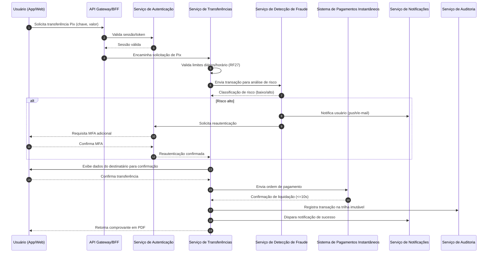
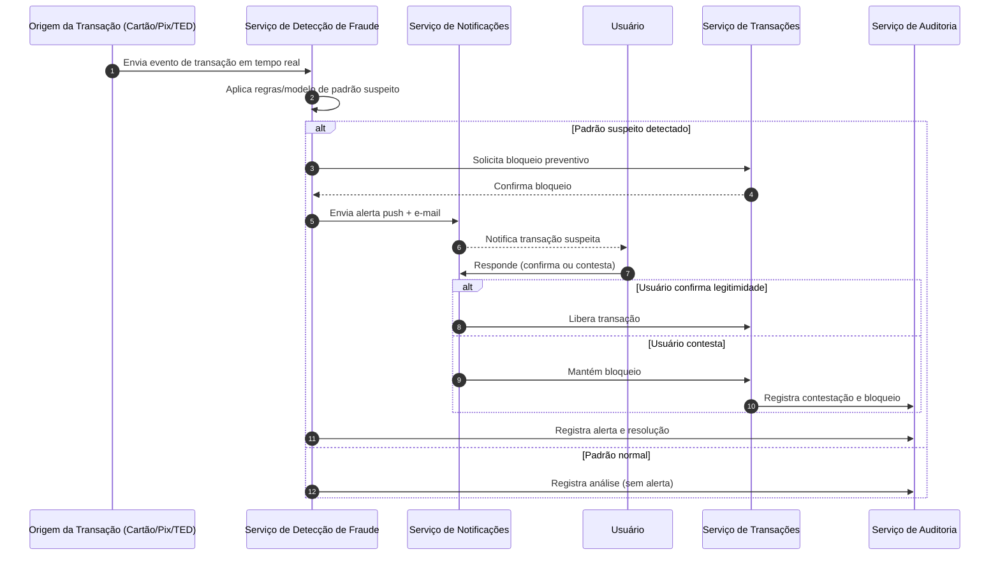
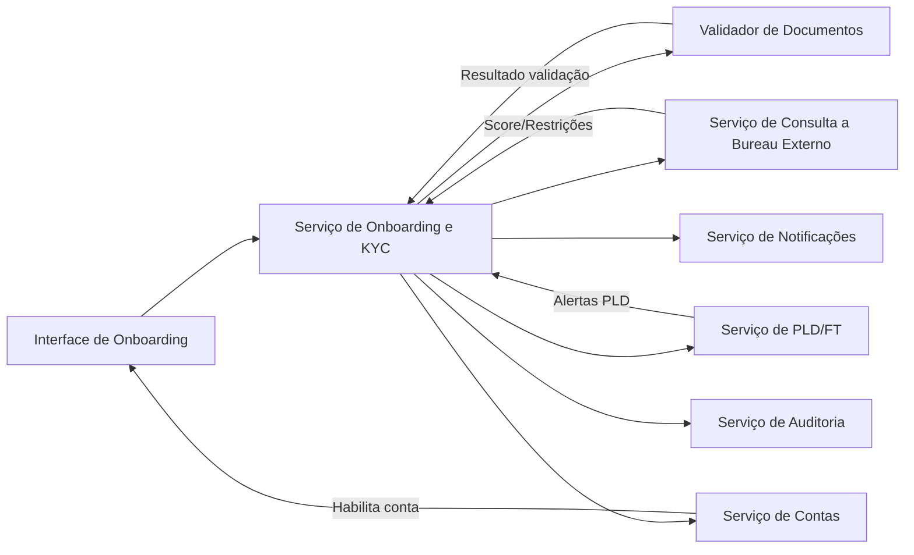

# Relatório Técnico de Arquitetura de Software
## Plataforma Financeira Digital (G01) — Sistema Bancário Digital

---

## 1. Identificação das HUs

| HU | Título | Perfil | RFs Relacionados | RNFs Relacionados |
|----|--------|--------|-------------------|--------------------|
| HU01 | Abrir conta com validação de identidade | PF | RF01, RF02, RF08 | RNF07, RNF08, RNF10 |
| HU02 | Autenticar com múltiplos fatores | PF/PJ/Gerente | RF03, RF04, RF05, RF06 | RNF03, RNF04 |
| HU03 | Realizar transferência via Pix | PF/PJ | RF22, RF23, RF24, RF27, RF13 | RNF15, RNF21 |
| HU04 | Pagar boleto com agendamento | PF/PJ | RF28, RF29, RF30, RF31 | RNF21 |
| HU05 | Gerenciar cartão de crédito | PF | RF16, RF17, RF18, RF19, RF20 | RNF02, RNF06 |
| HU06 | Contestar transação não reconhecida | PF/PJ | RF21, RF39 | RNF12 |
| HU07 | Investir em renda fixa | PF/PJ | RF32, RF33, RF34, RF35 | RNF21 |
| HU08 | Gerenciar consentimentos do open finance | PF/PJ | RF41, RF42, RF43, RF44 | RNF10, RNF11 |
| HU09 | Receber alertas e responder a suspeita de fraude | PF/PJ | RF36, RF37, RF38, RF39, RF40 | RNF04, RNF12 |
| HU10 | Abrir conta PJ com documentação societária | PJ | RF01, RF02, RF08 | RNF07, RNF08 |
| HU11 | Realizar TED para fornecedores | PJ | RF25, RF26, RF27, RF13 | RNF15 (limites regulatórios), RNF21 |
| HU12 | Acompanhar carteira de clientes | Gerente | RF07, RF45, RF46 | RNF10, RNF12 |
| HU13 | Abrir solicitação de serviço em nome do cliente | Gerente | RF47 | RNF12 |

---

## 2. Diagramas de Arquitetura (Mermaid)

### 2.1 Visão Macro de Componentes (Contexto)

### 2.2 Diagrama de Sequência — Transferência Pix (HU03)

### 2.3 Diagrama de Sequência — Alerta de Fraude (HU09)

### 2.4 Diagrama de Componentes — Onboarding (HU01/HU10)

---

## 3. Decisões de Arquitetura

| ID | Decisão | Justificativa | Requisitos Relacionados |
|----|---------|----------------|---------------------------|
| DA01 | Adoção de arquitetura orientada a serviços/domínios de negócio desacoplados (não necessariamente microsserviços físicos) | Permite evolução independente de módulos regulados (KYC, Pix, cartões) e isolamento de falhas | RNF16, RNF17, RNF23 |
| DA02 | Uso de um componente de borda (API Gateway/BFF) único para canais mobile, web e gerente | Centraliza autenticação, rate limiting e roteamento, simplificando a superfície de ataque | RNF01, RNF04 |
| DA03 | Separação do Serviço de Detecção de Fraude como componente transversal, consumindo eventos de todos os canais transacionais | Necessário para monitoramento em tempo real (RF36-RF40) sem acoplar lógica de risco a cada domínio | RF36-RF40 |
| DA04 | Delegação do armazenamento e processamento de dados de cartão a um processador externo certificado | Requisito explícito de não armazenar dados de cartão internamente | RNF06 |
| DA05 | Trilha de auditoria centralizada e imutável, consumida por todos os domínios via eventos | Atende exigência de retenção de 5 anos e rastreabilidade completa de operações | RNF12 |
| DA06 | Serviço de Notificações desacoplado, com múltiplos canais (push, e-mail) | Necessário para alertas simultâneos de fraude, boletos e MFA | RF20, RF31, RF38 |
| DA07 | Serviço de Open Finance com interface de API padronizada exposta a terceiros e camada de consentimento própria | Atende à obrigatoriedade regulatória de especificações Open Finance Brasil | RF41-RF44, RNF11 |
| DA08 | Escalonamento horizontal automático e múltiplas zonas de disponibilidade como requisito não-funcional transversal a todos os serviços | Atende SLA de disponibilidade e resiliência | RNF13, RNF16, RNF17, RNF23 |
| DA09 | Confirmação explícita (double-check) como padrão de interação obrigatório em operações financeiras críticas | Atende RNF21 de forma consistente em Pix, TED, boletos e investimentos | RF29, RNF21 |
| DA10 | Componentização do domínio de Relacionamento/Gerente com controle de consentimento explícito do cliente | Necessário para RF07/RF45 garantirem que acesso do gerente respeite privacidade | RF07, RF45-RF47 |

---

## 4. Tabela de Componentes e Rastreabilidade

| Componente | Responsabilidade Principal | Comunica-se com | Origem (HU / Critério de Aceite) |
|------------|------------------------------|-------------------|------------------------------------|
| API Gateway/BFF | Roteamento, autenticação de borda, rate limiting, agregação de respostas para canais | Todos os serviços de domínio | HU02 (MFA), RNF04 |
| Serviço de Identidade e Autenticação | Gerenciar cadastro, login, MFA, sessões, bloqueio remoto | API Gateway, Serviço de Notificações, Auditoria | HU02, RF03-RF06 |
| Serviço de Onboarding e KYC | Validar identidade PF/PJ, integrar bureaus, aplicar PLD/FT | Bureau externo, Serviço de Contas, Notificações, Auditoria | HU01, HU10, RF01-RF02 |
| Serviço de Contas | Gerir contas corrente/poupança, saldo, extrato, rendimentos | Serviço de Transferências, Investimentos, Relacionamento | RF08-RF13 |
| Serviço de Cartões | Emissão, bloqueio, limites, faturas, contestação de cartão | Processador PCI externo, Fraude, Notificações | HU05, HU06, RF14-RF21 |
| Serviço de Transferências (Pix/TED) | Orquestrar transferências, aplicar limites, agendamento | SPI, STR, Fraude, Notificações, Auditoria | HU03, HU11, RF22-RF27 |
| Serviço de Pagamento de Boletos | Ler/validar boletos, agendar pagamentos, notificar vencimento | Fraude, Notificações, Contas | HU04, RF28-RF31 |
| Serviço de Investimentos | Exibir produtos de renda fixa, aplicar/resgatar, emitir informe | Serviço de Contas, Auditoria, Relacionamento | HU07, RF32-RF35 |
| Serviço de Detecção de Fraude | Monitorar transações, classificar risco, bloquear preventivamente | Transferências, Cartões, Boletos, Notificações, Auditoria | HU09, RF36-RF40 |
| Serviço de Open Finance | Gerenciar consentimentos, expor APIs padronizadas, iniciar pagamentos externos | Instituições parceiras, Auditoria, BACEN | HU08, RF41-RF44 |
| Serviço de Relacionamento/Gerente | Visão consolidada de clientes, anotações, solicitações em nome do cliente | Serviço de Contas, Investimentos, Auditoria | HU12, HU13, RF45-RF47 |
| Serviço de Notificações | Disparar alertas multi-canal (push, e-mail) | Todos os serviços transacionais | RF20, RF31, RF38, HU09 |
| Serviço de Auditoria e Compliance | Registrar trilha imutável, gerar relatórios regulatórios | Todos os domínios, BACEN | RNF09, RNF12, HU13 |

---

## 5. Bloqueios e Pendências

| ID | Descrição do Bloqueio/Pendência | Impacto | Responsável Sugerido |
|----|-----------------------------------|---------|------------------------|
| BP01 | Não há definição de critérios objetivos/modelo para "padrão suspeito" (RF36) | Impede especificação do motor de regras/scoring de fraude | Time de Risco/Compliance + Arquitetura |
| BP02 | Ausência de definição de SLA de resposta da análise de crédito (RF15) | Impacta fluxo de emissão de cartão de crédito e experiência do usuário | Produto/Negócio |
| BP03 | Não especificado o provedor/processador PCI-DSS a ser integrado | Bloqueia definição de contrato de integração com Serviço de Cartões | Arquitetura + Segurança |
| BP04 | Regras de cálculo de rendimento da poupança "conforme BACEN" não detalhadas | Impede implementação determinística do motor de rendimentos | Negócio/Compliance |
| BP05 | Falta definição de formato/periodicidade dos relatórios BACEN 3040/SCR (RNF09) | Impacta desenho do Serviço de Auditoria/Compliance | Compliance Regulatório |
| BP06 | Não há detalhamento do processo de análise de contestações (HU06) — prazos, fluxo de estorno | Impede modelagem completa do subfluxo de disputas | Produto + Operações |
| BP07 | Ausência de regras de autorização granular para o gerente (o que exatamente pode ver/fazer sem consentimento explícito) | Risco de violação de privacidade/LGPD | Segurança + Jurídico |

---

## 6. Cobertura de Requisitos

| Categoria | Total de Requisitos | Cobertos por Componentes Identificados | Observação |
|-----------|----------------------|-------------------------------------------|------------|
| RF Gestão de Usuários (RF01-RF07) | 7 | 7 | Totalmente coberto por Auth + Onboarding |
| RF Contas (RF08-RF13) | 6 | 6 | Coberto por Serviço de Contas |
| RF Cartões (RF14-RF21) | 8 | 8 | Coberto por Serviço de Cartões + PCI externo |
| RF Transferências (RF22-RF27) | 6 | 6 | Coberto por Serviço de Transferências |
| RF Boletos (RF28-RF31) | 4 | 4 | Coberto por Serviço de Boletos |
| RF Investimentos (RF32-RF35) | 4 | 4 | Coberto por Serviço de Investimentos |
| RF Fraude (RF36-RF40) | 5 | 5 (parcialmente, ver BP01) | Motor de regras não detalhado |
| RF Open Finance (RF41-RF44) | 4 | 4 | Coberto por Serviço de Open Finance |
| RF Gerente (RF45-RF47) | 3 | 3 | Coberto por Serviço de Relacionamento |
| RNF Segurança (RNF01-RNF06) | 6 | 6 | Distribuído transversalmente (Gateway, Cartões, Auth) |
| RNF Conformidade (RNF07-RNF12) | 6 | 5 (ver BP05) | Auditoria/Compliance parcialmente detalhado |
| RNF Disponibilidade/Desempenho (RNF13-RNF17) | 5 | 5 | Decisões transversais (DA08) |
| RNF Usabilidade (RNF18-RNF21) | 4 | 4 | Aplicável aos canais Mobile/Web |
| RNF Infraestrutura (RNF22-RNF24) | 3 | 3 | Backup, redundância, monitoramento — transversais |

**Cobertura geral estimada: ~97% dos requisitos mapeados para componentes arquiteturais, com pendências pontuais em regras de negócio detalhadas (fraude, rendimento, relatórios regulatórios).**

---

## 7. Gap Analysis

| Gap Identificado | Descrição | Impacto Arquitetural | Ação Recomendada |
|-------------------|-----------|------------------------|--------------------|
| G01 | Falta de especificação do motor de regras de fraude (limiares, modelos) | Serviço de Detecção de Fraude não pode ser dimensionado nem testado adequadamente | Workshop com áreas de risco para definir catálogo de regras e SLAs de resposta |
| G02 | Ausência de contrato formal com bureau de crédito para análise de RF15 | Bloqueia definição de interface externa e tempos de resposta | Definir contrato de integração e SLA com fornecedor de bureau |
| G03 | Não há detalhamento de política de retenção/expurgo de dados além dos 5 anos de auditoria (LGPD) | Risco de não conformidade com LGPD quanto a minimização de dados | Definir política de ciclo de vida de dados com jurídico/DPO |
| G04 | Falta de definição de níveis de consentimento granular para acesso do gerente (RF07/RF45) | Risco de acesso indevido a dados sensíveis do cliente | Modelar matriz de permissões e consentimento por escopo de dado |
| G05 | Não especificado processo de reconciliação em caso de falha durante transação Pix/TED (RNF17) | Risco de inconsistência financeira em cenários de falha parcial | Especificar máquina de estados de transação com compensação (saga) |
| G06 | Ausência de detalhamento sobre versionamento e evolução das APIs Open Finance conforme fases regulatórias | Risco de retrabalho arquitetural a cada nova fase do Open Finance Brasil | Adotar estratégia de versionamento de API e gestão de contrato desde o início |
| G07 | Não há requisito explícito sobre internacionalização/localização, embora não pareça necessário no escopo atual | Baixo impacto, mas deve ser confirmado | Confirmar com stakeholders se há necessidade de suporte multi-idioma/moeda |
| G08 | Falta de definição de estratégia de testes de carga/performance específicos para picos (ex: Pix em horários de pico) | Risco de não validar RNF15/RNF16 antes de produção | Incluir plano de testes de carga e chaos engineering no roadmap de QA |