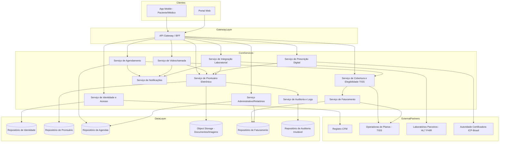
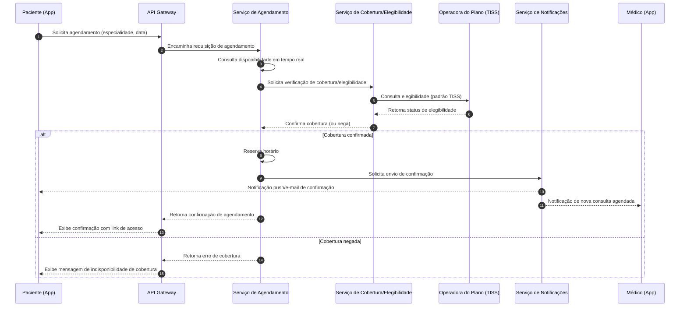
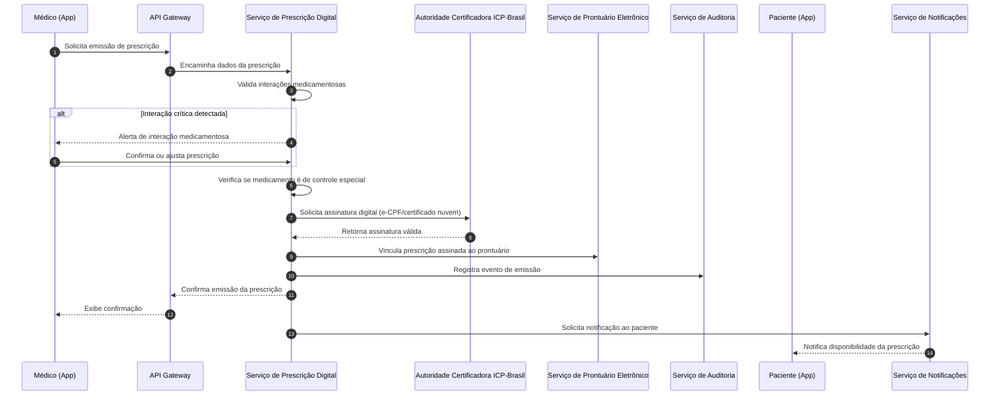
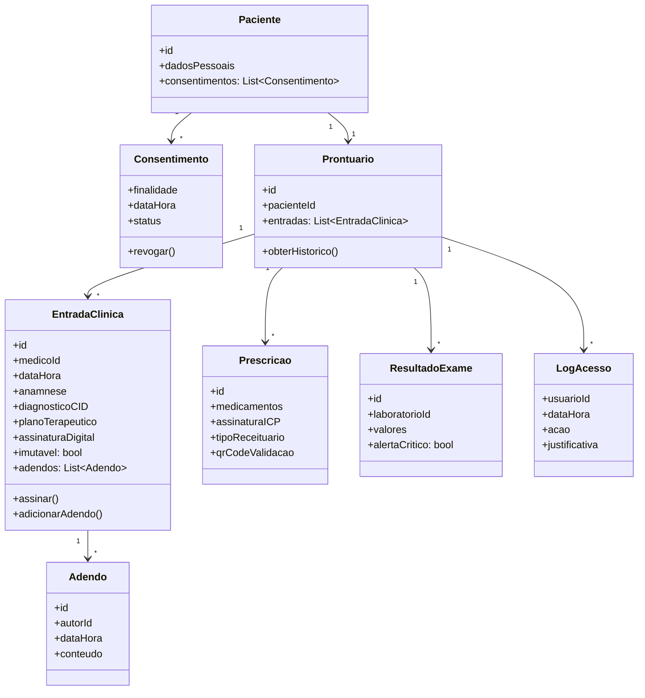

# Relatório Técnico de Arquitetura de Software
## Plataforma Integrada de Saúde Digital (G02)

---

## 1. Identificação das HUs

| HU | Título | Perfil | RFs Relacionados | RNFs Relacionados |
|----|--------|--------|-------------------|--------------------|
| HU01 | Cadastrar-se e consentir com tratamento de dados | Paciente | RF01, RF23 | RNF07, RNF12 |
| HU02 | Agendar consulta presencial/videochamada | Paciente | RF07, RF08, RF09, RF11 | RNF14 |
| HU03 | Participar de videochamada | Paciente | RF14, RF15, RF17, RF18 | RNF04, RNF16, RNF22 |
| HU04 | Visualizar prontuário e resultados de exames | Paciente | RF22, RF24, RF33 | RNF15, RNF02 |
| HU05 | Acessar e compartilhar prescrição digital | Paciente | RF26, RF27, RF29, RF30 | RNF06 |
| HU06 | Notificação de resultado de exame | Paciente | RF31, RF32 | - |
| HU07 | Validar cadastro com CRM ativo | Médico | RF02 | - |
| HU08 | Registrar evolução clínica | Médico | RF19, RF20, RF25 | RNF10, RNF11 |
| HU09 | Emitir prescrição digital | Médico | RF26, RF27, RF28, RF30 | RNF06 |
| HU10 | Solicitar exame e receber alerta crítico | Médico | RF34, RF32, RF35 | RNF26 |
| HU11 | Acessar prontuário compartilhado | Médico | RF19, RF23, RF06 | RNF11 |
| HU12 | Gerenciar médicos e agendas | Admin Clínica | RF12, RF43 | - |
| HU13 | Acompanhar faturamento por convênio | Admin Clínica | RF40, RF44 | - |
| HU14 | Processar autorização prévia | Operador Plano | RF38, RF39 | RNF09, RNF26 |

---

## 2. Diagramas de Arquitetura (Mermaid)

### 2.1 Diagrama de Componentes (Visão Macro)

### 2.2 Diagrama de Sequência — Agendamento com Verificação de Cobertura (HU02)

### 2.3 Diagrama de Sequência — Emissão de Prescrição Digital (HU09)

### 2.4 Diagrama de Classes — Domínio de Prontuário Eletrônico

---

## 3. Decisões de Arquitetura

| ID | Decisão | Justificativa | Requisitos Relacionados |
|----|---------|----------------|---------------------------|
| DA01 | Adotar arquitetura de microsserviços organizados por domínio funcional (Identidade, Agendamento, Videochamada, Prontuário, Prescrição, Laboratório, Cobertura, Faturamento, Administrativo) | Permite escalonamento independente e isolamento de falhas conforme RNF17, RNF13 | RNF13, RNF17, RNF24 |
| DA02 | Introduzir um API Gateway/BFF como ponto único de entrada para clientes móveis e web | Centraliza autenticação, roteamento e controle de acesso por perfil (RF04) | RF04, RNF01 |
| DA03 | Prontuário Eletrônico implementado como serviço próprio com modelo de dados append-only para entradas assinadas | Atende à exigência de imutabilidade pós-assinatura e trilha de auditoria de 20 anos | RF25, RNF11 |
| DA04 | Serviço de Auditoria centralizado e desacoplado dos serviços de domínio, com armazenamento imutável dedicado | Garante consistência de logs de acesso ao prontuário independentemente do serviço de origem | RF06, RNF05, RNF11 |
| DA05 | Serviço de Cobertura/Elegibilidade e Faturamento seguem padrão de mensageria TISS como contrato de integração externa | Conformidade regulatória obrigatória com ANS | RF37, RF38, RF40, RNF09, RNF26 |
| DA06 | Serviço de Videochamada desacoplado do prontuário, comunicando-se apenas por referência de evento (duração, participantes), sem armazenar mídia | Atende à exigência de não gravação e criptografia ponta a ponta | RF16, RNF04 |
| DA07 | Documentos clínicos e imagens armazenados em serviço externo de objetos com redundância geográfica, referenciados por metadados no Prontuário | Atende RNF18 sem acoplar armazenamento binário ao banco transacional | RF21, RNF18 |
| DA08 | Integração com CFM e Autoridade Certificadora ICP-Brasil tratada como adaptadores externos (anti-corruption layer) | Isola mudanças de contrato de terceiros do núcleo do domínio | RF02, RF27, RNF06 |
| DA09 | Serviço de Notificações desacoplado, orientado a eventos, consumido por múltiplos domínios (agendamento, laboratório, prescrição) | Evita duplicação de lógica de envio e centraliza canais (push/e-mail) | RF11, RF32, RF18 |
| DA10 | Consentimentos tratados como entidade de primeira classe vinculada ao paciente, consultada antes de qualquer acesso externo ao prontuário | Atende à exigência de consentimento explícito e LGPD art. 11 | RF23, RNF07, RNF12 |

---

## 4. Tabela de Componentes e Rastreabilidade

| Componente | Responsabilidade Principal | Comunica-se com | Origem (HU / Critério de Aceite) |
|------------|------------------------------|-------------------|-------------------------------------|
| API Gateway / BFF | Roteamento, autenticação de entrada, agregação de respostas para clientes | App Mobile, Portal Web, todos os serviços core | HU01–HU14 (transversal) |
| Serviço de Identidade e Acesso | Cadastro de perfis, MFA, validação de CRM, controle de sessão e permissões | Registro CFM, Repositório de Identidade, API Gateway | HU01, HU07 |
| Serviço de Agendamento | Gestão de agendas, disponibilidade, cancelamento/remarcação, encaixe urgente | Serviço de Cobertura, Serviço de Notificações, Repositório de Agendas | HU02, HU12 |
| Serviço de Videochamada | Infraestrutura de chamada, alertas de horário, compartilhamento de arquivos, registro de duração | Serviço de Notificações, Serviço de Prontuário | HU03 |
| Serviço de Prontuário Eletrônico | Registro de evoluções, imutabilidade pós-assinatura, histórico, consentimento de acesso externo | Object Storage, Serviço de Auditoria, Serviço de Prescrição, Serviço de Laboratório | HU04, HU08, HU11 |
| Serviço de Prescrição Digital | Emissão, validação de interações, assinatura ICP-Brasil, controle de receituário especial | Autoridade Certificadora, Serviço de Prontuário | HU05, HU09 |
| Serviço de Integração Laboratorial | Encaminhamento de solicitações, recebimento de resultados, alertas de valores críticos | Laboratórios Parceiros (HL7 FHIR), Serviço de Prontuário, Serviço de Notificações | HU06, HU10 |
| Serviço de Cobertura e Elegibilidade | Verificação de elegibilidade, autorização prévia, geração de guias TISS | Operadoras de Planos, Serviço de Faturamento | HU02, HU14 |
| Serviço de Faturamento | Geração e transmissão de faturamento eletrônico, cálculo de coparticipação | Operadoras de Planos, Repositório de Faturamento, Serviço Administrativo | HU13 |
| Serviço Administrativo/Relatórios | Gestão de clínicas, médicos, salas, equipamentos, geração de indicadores | Repositório de Agendas, Repositório de Faturamento | HU12, HU13 |
| Serviço de Notificações | Envio de push e e-mail para eventos de agendamento, exames, prescrições | Serviços de domínio (transversal) | HU02, HU03, HU06, HU10 |
| Serviço de Auditoria e Logs | Registro imutável de acessos e alterações em prontuário | Repositório de Auditoria (imutável) | HU08, HU11, RF06 |
| Object Storage (Documentos/Imagens) | Armazenamento redundante geograficamente de laudos e imagens diagnósticas | Serviço de Prontuário | HU04 (critério: download de resultados) |
| Adaptador CFM | Consulta e revalidação periódica de situação do CRM | Serviço de Identidade | HU07 |
| Adaptador ICP-Brasil | Emissão de assinatura digital em prescrições e entradas do prontuário | Serviço de Prescrição, Serviço de Prontuário | HU08, HU09 |
| Adaptador TISS/Operadoras | Tradução de mensagens internas para padrão TISS e vice-versa | Serviço de Cobertura, Serviço de Faturamento | HU02, HU13, HU14 |

---

## 5. Bloqueios e Pendências

| ID | Descrição | Impacto | Responsável Sugerido |
|----|-----------|---------|------------------------|
| BP01 | Não há definição do SLA de resposta da API do CFM para validação de CRM (RF02/HU07 menciona 24h, mas não há fallback se API externa estiver indisponível) | Pode bloquear cadastro de médicos indefinidamente | Time de Integrações Externas |
| BP02 | Ausência de especificação sobre o mecanismo de detecção de "acesso anômalo" (RNF05) — não há definição de heurísticas ou limiares | Impede o dimensionamento do componente de segurança | Time de Segurança |
| BP03 | Não está definido o processo de revalidação periódica automática do CRM (frequência, gatilho) mencionado em HU07 | Risco de médicos com CRM suspenso continuarem ativos | Time de Produto/Compliance |
| BP04 | Falta definição de política de retenção/expurgo para dados de sessão de videochamada, já que não há gravação (RNF04) | Impacta design do serviço de auditoria de duração de chamada | Time de Arquitetura |
| BP05 | Não há SLA definido para resposta do laboratório parceiro (apenas notificação após disponibilização) | Pode gerar expectativa divergente entre módulos assíncronos | Time de Integrações Externas |
| BP06 | Ausência de detalhamentos sobre reconciliação de glosas e fluxo de contestação junto às operadoras (mencionado em HU13, mas sem fluxo detalhado) | Afeta desenho do serviço de Faturamento | Time de Produto |
| BP07 | Não há definição clara de qual entidade audita o cumprimento do prazo de 30 minutos para autorização eletiva (HU14) | Necessário para SLA de monitoramento entre plataforma e operadora | Time de Compliance/Operações |

---

## 6. Cobertura de Requisitos

| Categoria | RFs Cobertos | RNFs Cobertos | Observação |
|-----------|---------------|-----------------|------------|
| Gestão de Usuários e Acesso | RF01–RF06 | RNF01, RNF03, RNF05 | Totalmente endereçado via Serviço de Identidade |
| Agendamento | RF07–RF13 | RNF14 | Totalmente endereçado via Serviço de Agendamento + Cobertura |
| Videochamada | RF14–RF18 | RNF04, RNF16, RNF22 | Endereçado via Serviço de Videochamada; latência/resolução dependem de infraestrutura não especificada (ver Gap Analysis) |
| Prontuário Eletrônico | RF19–RF25 | RNF02, RNF10, RNF11, RNF15 | Totalmente endereçado; performance de carregamento (3s) depende de estratégia de indexação não detalhada |
| Prescrição Digital | RF26–RF30 | RNF06 | Totalmente endereçado via Serviço de Prescrição + Adaptador ICP |
| Integração com Laboratórios | RF31–RF35 | RNF26 | Endereçado via Serviço de Integração Laboratorial; padrão HL7 FHIR referenciado conforme requisito |
| Cobertura por Planos de Saúde | RF36–RF41 | RNF09, RNF14, RNF26 | Endereçado via Serviço de Cobertura/Elegibilidade + Faturamento |
| Módulo Administrativo | RF42–RF46 | - | Endereçado via Serviço Administrativo |
| Conformidade Regulatória | - | RNF07, RNF08, RNF09, RNF10, RNF11, RNF12 | Tratada de forma transversal, reforçada por Serviço de Auditoria e Consentimento |
| Infraestrutura/Disponibilidade | - | RNF13, RNF17, RNF18, RNF23, RNF24, RNF25 | Endereçado nas decisões arquiteturais (escalonamento horizontal, object storage externo, múltiplas zonas) |
| Usabilidade/Compatibilidade | - | RNF19, RNF20, RNF21, RNF22 | Não modelado em profundidade — depende de camada de apresentação (fora do escopo de backend) |

---

## 7. Gap Analysis

| Gap Identificado | Requisitos Relacionados | Impacto Arquitetural | Ação Recomendada |
|--------------------|---------------------------|------------------------|----------------------|
| Ausência de definição de estratégia de cache/indexação para atingir os 3s de carregamento do prontuário (RNF15) | RF22, RNF15 | Pode exigir camada de leitura otimizada (read model) separada da escrita | Avaliar padrão de segregação leitura/escrita (CQRS conceitual) para o Serviço de Prontuário |
| Não há detalhamento de como a verificação de elegibilidade em 5s (RNF14) será garantida diante de latência de operadoras externas | RF37, RNF14 | Risco de violação de SLA por dependência de terceiros | Definir mecanismo de cache de elegibilidade com expiração curta e fallback assíncrono |
| Falta de especificação sobre política de assinatura de médicos sem certificado ICP-Brasil próprio (uso de certificado em nuvem) — fluxo de emissão/renovação não detalhado | RF27, RNF06 | Impacta design do Adaptador ICP-Brasil (múltiplos provedores possíveis) | Especificar contrato de integração abstrato suportando múltiplos provedores homologados |
| Não há requisito explícito sobre versionamento de prontuário em caso de correções por adendo em cascata (múltiplos adendos sobre a mesma entrada) | RF25, HU08 | Pode gerar ambiguidade na apresentação do histórico ao usuário final | Definir modelo de versionamento de adendos com ordenação temporal explícita |
| Ausência de definição de critérios objetivos para "valores críticos" de exames — hoje dependente de tabela de referência não especificada | RF35, HU10 | Componente de alerta não pode ser dimensionado sem fonte de parâmetros clínicos | Definir fonte de verdade (tabela de referência clínica) e mecanismo de atualização |
| Não há requisito de auditoria específica para o processo de negociação/contestação de glosas junto a operadoras | RF44, HU13 | Serviço de Faturamento pode necessitar de submódulo de workflow não previsto | Levantar com stakeholders o fluxo completo de contestação de glosa |
| Falta de definição sobre retenção de dados após revogação de consentimento (LGPD) versus retenção mínima de 20 anos exigida pelo CFM (RNF11 x RNF12) | RF23, RNF11, RNF12 | Conflito potencial entre direito de portabilidade/exclusão e obrigação regulatória de retenção | Definir política de anonimização/pseudonimização em vez de exclusão física para dados clínicos |
| Não há requisito claro sobre comportamento do sistema em caso de indisponibilidade da videochamada nativa (fallback) | RF14, RNF13 | Risco de consulta perdida sem plano de contingência explícito | Especificar critérios de contingência e possível modo degradado (ex.: áudio apenas) |
| Ausência de detalhamento sobre modelo de permissões granulares por perfil (RF04) além da distinção entre os 5 perfis citados | RF04 | Dificulta modelagem de RBAC/ABAC no Serviço de Identidade | Levantar matriz completa de permissões por funcionalidade e perfil |