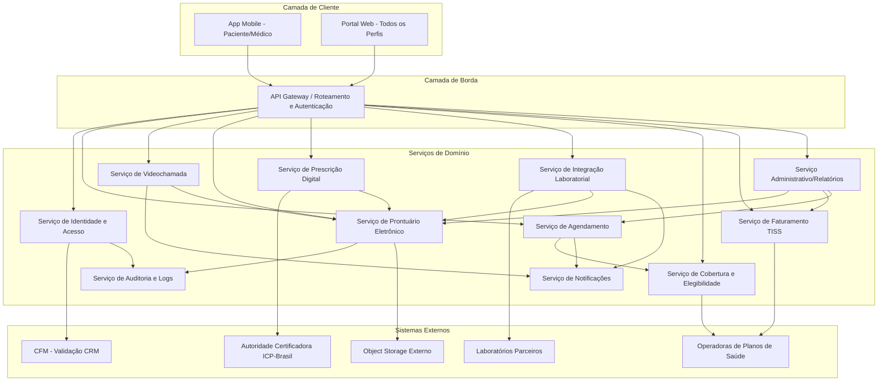
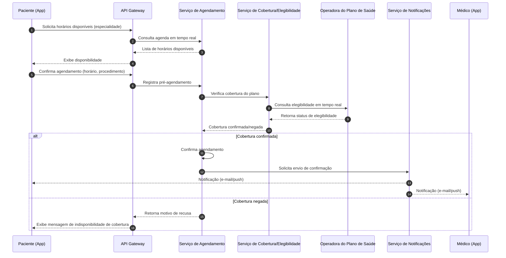
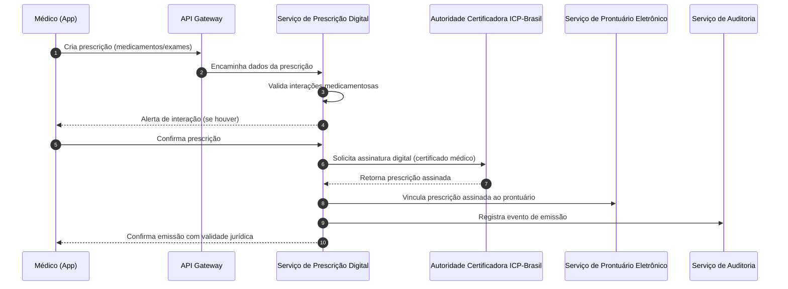

# Relatório Técnico de Arquitetura de Software

## 1. Identificação das HUs

| HU | Título | Perfil | RFs Relacionados | RNFs Relacionados |
|----|--------|--------|-------------------|---------------------|
| HU01 | Cadastrar-se e consentir com tratamento de dados de saúde | Paciente | RF01, RF03 | RNF07, RNF12 |
| HU02 | Agendar consulta presencial ou por videochamada | Paciente | RF07, RF08, RF09, RF11 | RNF14 |
| HU03 | Participar de consulta por videochamada | Paciente | RF14, RF15, RF17, RF18 | RNF04, RNF16, RNF22 |
| HU04 | Visualizar prontuário e resultados de exames | Paciente | RF22, RF23, RF24, RF33 | RNF15, RNF02 |
| HU05 | Acessar e compartilhar prescrição digital | Paciente | RF26, RF27, RF29, RF30 | RNF06 |
| HU06 | Receber notificação de resultado de exame disponível | Paciente | RF31, RF32, RF33 | — |
| HU07 | Validar cadastro com CRM ativo | Médico | RF02 | — |
| HU08 | Registrar evolução clínica no prontuário | Médico | RF19, RF20, RF25 | RNF10, RNF11 |
| HU09 | Emitir prescrição digital com validade jurídica | Médico | RF26, RF27, RF28, RF30 | RNF06 |
| HU10 | Solicitar exame e receber resultado com alerta crítico | Médico | RF31, RF32, RF34, RF35 | — |
| HU11 | Acessar prontuário compartilhado entre especialidades | Médico | RF19, RF23, RF06 | RNF05, RNF11 |
| HU12 | Gerenciar médicos e agendas da unidade | Admin. Clínica | RF12, RF42, RF43 | — |
| HU13 | Acompanhar faturamento por convênio | Admin. Clínica | RF40, RF41, RF44 | — |
| HU14 | Processar autorização prévia de procedimentos | Operador Plano Saúde | RF37, RF38, RF39 | RNF09, RNF26 |

---

## 2. Diagramas de Arquitetura (Mermaid)

### 2.1 Diagrama de Componentes (Visão Macro)

### 2.2 Diagrama de Sequência — Agendamento com Verificação de Cobertura (HU02)

### 2.3 Diagrama de Sequência — Emissão de Prescrição Digital (HU09)

---

## 3. Decisões de Arquitetura

| ID | Decisão | Justificativa | Requisitos Relacionados |
|----|---------|-----------------|---------------------------|
| DA01 | Arquitetura orientada a serviços de domínio, desacoplados por responsabilidade funcional (agendamento, prontuário, prescrição, faturamento etc.) | Permite evolução independente e escalonamento seletivo conforme picos de demanda por módulo | RNF17, RF07-RF46 |
| DA02 | Serviço de Identidade e Acesso centralizado com MFA e controle de perfis (RBAC) | Necessário para atender múltiplos perfis com permissões distintas e requisitos de auditoria | RF01, RF03, RF04, RF05 |
| DA03 | Serviço de Auditoria imutável e apartado dos serviços de negócio | Garante trilha de auditoria confiável mesmo em caso de falha de outros componentes; atende retenção de 20 anos | RF06, RNF11 |
| DA04 | Armazenamento de documentos clínicos em serviço externo de objeto, com metadados no serviço de prontuário | Isola dados binários pesados (imagens, laudos) da camada transacional, com redundância geográfica | RNF18, RF21 |
| DA05 | Serviço de Videochamada com criptografia ponta a ponta, sem persistência de mídia | Atende exigência de privacidade e não gravação | RNF04, RF14 |
| DA06 | Integração com operadoras e laboratórios via adaptadores de padrões abertos (TISS/HL7 FHIR) | Facilita onboarding de novos parceiros sem acoplamento a implementações específicas | RNF26, RF31, RF37 |
| DA07 | Prontuário eletrônico com modelo de imutabilidade por assinatura e adendos versionados | Atende exigência legal de registro imutável após assinatura | RF25, RNF10 |
| DA08 | Assinatura digital de prescrições delegada a serviço externo de certificação (ICP-Brasil) | Não é responsabilidade do sistema emitir certificados; apenas integrar/consumir serviço homologado | RF27, RNF06 |
| DA09 | Notificações centralizadas em serviço próprio, desacoplado dos serviços de domínio via eventos | Padroniza canais (e-mail/push) e evita duplicação de lógica de disparo | RF11, RF18, RF32 |
| DA10 | Consentimento do paciente modelado como entidade de domínio explícita, versionada e auditável | Necessário para RF23, RF24 e conformidade LGPD (art. 11) | RNF07, RNF12 |
| DA11 | Serviço de Cobertura/Elegibilidade desacoplado do Agendamento e Faturamento, consumido por ambos | Evita duplicação de lógica de consulta a operadoras e centraliza regras de elegibilidade | RF09, RF37, RF39 |

---

## 4. Tabela de Componentes e Rastreabilidade

| Componente | Responsabilidade Principal | Comunica-se com | Origem (HU / Critério de Aceite) |
|------------|------------------------------|-------------------|-------------------------------------|
| API Gateway | Roteamento de requisições, aplicação de políticas de autenticação/autorização, rate limiting | Todos os serviços de domínio | RNF05, RF04 |
| Serviço de Identidade e Acesso (IAM) | Cadastro, autenticação MFA, gestão de perfis/permissões, validação de CRM junto ao CFM | CFM (externo), Serviço de Auditoria | RF01-RF05, HU07 |
| Serviço de Agendamento | Gestão de disponibilidade, criação/cancelamento/remarcação de consultas, encaixe de urgência | Serviço de Cobertura, Serviço de Notificações | RF07-RF13, HU02, HU12 |
| Serviço de Videochamada | Estabelecimento de sessão de vídeo criptografada, controle de ingresso, compartilhamento de arquivos, registro de duração | Serviço de Prontuário, Serviço de Notificações | RF14-RF18, HU03 |
| Serviço de Prontuário Eletrônico (EHR) | Registro de evoluções clínicas, histórico, controle de consentimento, imutabilidade pós-assinatura | Object Storage, Serviço de Auditoria, Serviço de Prescrição, Serviço Laboratorial | RF19-RF25, HU04, HU08, HU11 |
| Serviço de Prescrição Digital | Emissão, validação de interações medicamentosas, assinatura digital, controle de receituário especial | Autoridade Certificadora ICP-Brasil, EHR | RF26-RF30, HU05, HU09 |
| Serviço de Integração Laboratorial | Encaminhamento de solicitações de exame, recebimento e vinculação de resultados, alertas de valor crítico | Laboratórios parceiros (externo), EHR, Notificações | RF31-RF35, HU06, HU10 |
| Serviço de Cobertura e Elegibilidade | Verificação de elegibilidade e cobertura junto às operadoras | Operadoras de Planos (externo), Agendamento, Faturamento | RF09, RF36-RF37, HU02, HU14 |
| Serviço de Faturamento TISS | Geração de guias, transmissão de faturamento, registro de coparticipação | Operadoras (externo), Serviço Administrativo | RF38-RF41, HU13, HU14 |
| Serviço Administrativo/Relatórios | Cadastro de unidades/clínicas, gestão de médicos vinculados, relatórios gerenciais e indicadores | EHR, Faturamento, Agendamento | RF42-RF46, HU12, HU13 |
| Serviço de Notificações | Disparo de notificações por push e e-mail, alertas de proximidade de consulta | Agendamento, Videochamada, Laboratorial | RF11, RF18, RF32, HU02, HU03, HU06 |
| Serviço de Auditoria e Logs | Registro imutável de acessos e alterações, trilha de auditoria de longo prazo | IAM, EHR | RF06, RNF11, HU11 |
| Object Storage Externo | Armazenamento redundante de documentos clínicos e imagens diagnósticas | Serviço de Prontuário | RNF18, RF21 |
| Serviço de Monitoramento | Exposição de métricas operacionais (latência, erros, disponibilidade) | Todos os serviços (observabilidade) | RNF25 |

---

## 5. Bloqueios e Pendências

| ID | Descrição | Impacto | Responsável Sugerido |
|----|-----------|---------|------------------------|
| BP01 | Não há especificação do protocolo/API oficial de consulta ao CFM para validação de CRM (RF02, HU07) | Impede definição do contrato de integração externa | Time de Integrações + Stakeholder Regulatório |
| BP02 | Não há definição de qual(is) certificadora(s) ICP-Brasil homologada(s) serão integradas (RF27, RNF06) | Bloqueia design do adaptador de assinatura digital | Time de Integrações + Jurídico |
| BP03 | Ausência de definição de SLA/contrato com laboratórios parceiros para formato de retorno de resultados (RF31) | Impacta modelagem do conector HL7 FHIR | Time de Integrações + Parceiros |
| BP04 | Não especificado o mecanismo de revalidação periódica automática do CRM (HU07, critério 3) | Requer definição de periodicidade e gatilho de revogação de acesso | Product Owner |
| BP05 | Critérios de "valores críticos" de exames não estão parametrizados por tipo de exame (RF35, HU10) | Impede modelagem da tabela de referência clínica | Corpo Clínico / Product Owner |
| BP06 | Não há definição de política de retenção/expurgo para dados não-clínicos (ex.: logs operacionais) além da retenção de prontuário (RNF11) | Pode gerar inconsistência entre LGPD (minimização) e retenção regulatória CFM | DPO / Jurídico |

---

## 6. Cobertura de Requisitos

| Categoria | RFs/RNFs Cobertos | Cobertura |
|-----------|----------------------|-----------|
| Gestão de Usuários e Acesso | RF01-RF06 | 100% |
| Agendamento de Consultas | RF07-RF13 | 100% |
| Videochamada | RF14-RF18 | 100% |
| Prontuário Eletrônico | RF19-RF25 | 100% |
| Prescrição Digital | RF26-RF30 | 100% |
| Integração com Laboratórios | RF31-RF35 | 100% |
| Cobertura por Planos de Saúde | RF36-RF41 | 100% (nível conceitual; detalhamento TISS pendente de especificação técnica externa) |
| Módulo Administrativo | RF42-RF46 | 100% |
| Segurança (RNF01-RNF06) | Cobertos via IAM, criptografia em trânsito/repouso, videochamada E2E | 100% |
| Conformidade (RNF07-RNF12) | Cobertos via módulo de consentimento, auditoria e retenção | 100% (pendências de parametrização regulatória — ver Seção 5) |
| Disponibilidade/Desempenho (RNF13-RNF18) | Cobertos por decisões de escalonamento e object storage externo | Coberto arquiteturalmente; validação depende de testes de carga (fora do escopo deste relatório) |
| Usabilidade/Compatibilidade (RNF19-RNF22) | Atendidos na camada de cliente (App/Portal) | Coberto conceitualmente |
| Infraestrutura e Dados (RNF23-RNF26) | Cobertos por decisões de backup, redundância e observabilidade | Coberto arquiteturalmente |

---

## 7. Gap Analysis

| Gap Identificado | Área Afetada | Impacto Arquitetural | Ação Recomendada |
|-------------------|----------------|--------------------------|----------------------|
| Falta de definição do formato/contrato de troca com CFM para validação de CRM | Serviço de Identidade e Acesso | Bloqueia implementação do adaptador externo; risco de retrabalho | Levantar especificação técnica junto ao CFM ou provedor homologado antes do detalhamento de baixo nível |
| Ausência de modelo de dados para "consentimento granular" (por finalidade, por especialidade, por unidade) | Prontuário Eletrônico / LGPD | Risco de não atender art. 11 da LGPD de forma auditável | Modelar entidade de consentimento com granularidade por finalidade e escopo de compartilhamento |
| Não há definição de política de conflito entre agendas ao reconfigurar grade médica (HU12) | Serviço de Agendamento | Risco de inconsistência entre agendamentos confirmados e novas configurações de grade | Definir regras de precedência e notificação obrigatória em caso de conflito |
| Ausência de detalhamento do processo de contingência para indisponibilidade da videochamada (RNF13) | Serviço de Videochamada | Risco de não cumprir SLA de 99,9% sem plano de fallback definido | Especificar plano de contingência (ex.: reagendamento automático, canal alternativo) |
| Falta de parametrização de "tempo configurável" de expiração de sessão por perfil (RF05) | IAM | Pode gerar inconsistência de segurança entre perfis com diferentes níveis de risco | Definir tabela de parâmetros de timeout por perfil junto a stakeholders de segurança |
| Não há especificação de como glosas e negativas de autorização (HU13, HU14) retroalimentam o prontuário/faturamento | Faturamento / Administrativo | Pode gerar divergência entre dados financeiros e clínicos | Definir fluxo de reconciliação entre Serviço de Faturamento e Serviço de Cobertura |
| Ausência de definição de estratégia de versionamento para adendos ao prontuário (RF25) | Prontuário Eletrônico | Risco de ambiguidade jurídica sobre "o que é adendo" vs. "nova entrada" | Definir modelo formal de versionamento e apresentação ao usuário final |
| Não especificado o mecanismo de detecção de "acesso anômalo" (RNF05) | Segurança / Auditoria | Sem critérios claros, a funcionalidade de rate limiting/detecção pode ser subespecificada | Definir heurísticas ou parâmetros mínimos de anomalia (volume, horário, geolocalização) com time de segurança |