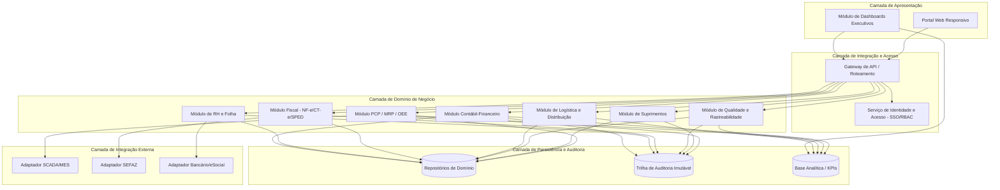
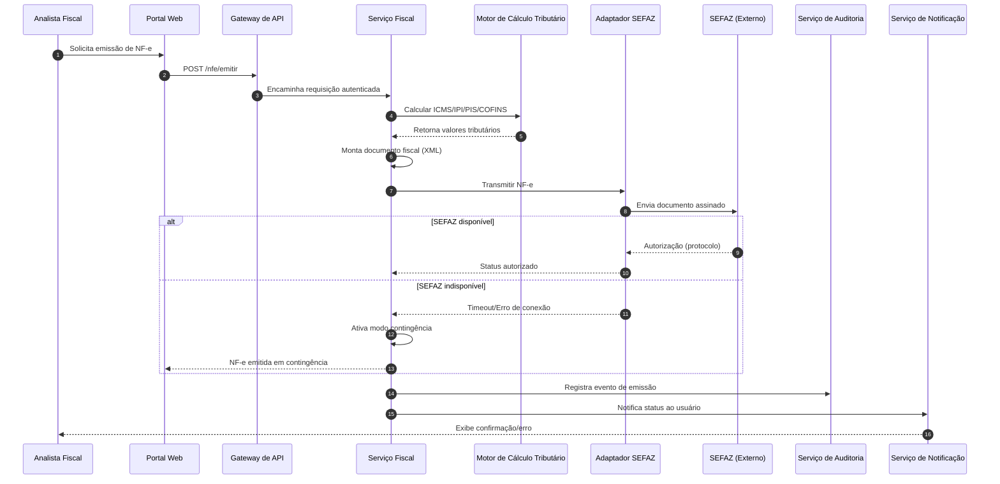
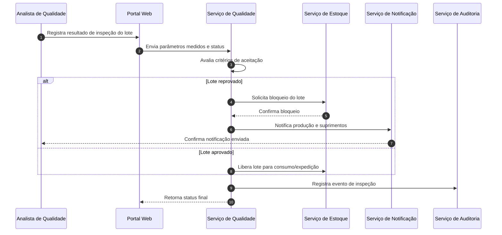

# Relatório Técnico de Arquitetura de Software
## Sistema Integrado de Gestão Empresarial para Manufatura (ERP) — G03

---

## 1. Identificação das HUs

| HU | Título | Perfil | Módulo(s) Impactado(s) | RF Relacionados |
|----|--------|--------|-------------------------|------------------|
| HU01 | Gerar OP e calcular MRP | Planejador PCP | PCP / Suprimentos | RF05, RF06, RF14 |
| HU02 | Monitorar OEE e desvios em tempo real | Planejador PCP | PCP / Chão de Fábrica / Dashboards | RF08, RF10, RF11, RF12, RF51, RF52 |
| HU03 | Gerenciar cotações com múltiplos fornecedores | Comprador | Suprimentos | RF13, RF15, RF16 |
| HU04 | Acompanhar desempenho de fornecedores | Gestor Suprimentos | Suprimentos / Dashboards | RF19, RF53 |
| HU05 | Registrar inspeção e bloquear lotes reprovados | Analista Qualidade | Qualidade / Estoque | RF20, RF21, RF22 |
| HU06 | Rastrear lote do insumo ao produto acabado | Analista Qualidade | Qualidade / Logística / Fiscal | RF23, RF17, RF28, RF31 |
| HU07 | Emitir NF-e com cálculo automático de impostos | Analista Fiscal | Fiscal | RF31, RF32, RF33, RF34, RNF15, RNF17 |
| HU08 | Manter SPED Fiscal atualizado | Analista Fiscal | Fiscal / Contabilidade | RF36, RF48 |
| HU09 | Processar folha de pagamento mensal | Analista RH | RH/Folha | RF38, RF39, RF40 |
| HU10 | Gerar obrigações acessórias de RH | Analista RH | RH/Folha | RF40 |
| HU11 | Visualizar DRE e Fluxo de Caixa em tempo real | Controller | Contabilidade / Financeiro | RF43, RF45, RF46, RF47 |
| HU12 | Acompanhar KPIs no dashboard executivo | Diretor/CEO | Dashboards / Todos os módulos | RF50, RF51, RF52, RF53 |

---

## 2. Diagramas de Arquitetura (Mermaid)

### 2.1 Visão Macro de Componentes (C4-like)

### 2.2 Diagrama de Sequência — Emissão de NF-e (HU07)

### 2.3 Diagrama de Sequência — Inspeção de Qualidade e Bloqueio de Lote (HU05)

---

## 3. Decisões de Arquitetura

| Decisão | Justificativa | Requisitos Relacionados |
|---------|----------------|--------------------------|
| Arquitetura modular orientada a domínios (por módulo de negócio) com gateway único de acesso | Isola responsabilidades de PCP, Suprimentos, Qualidade, Fiscal, RH e Contabilidade, permitindo evolução e escala independentes | RNF16, RNF22 |
| Serviço centralizado de Identidade e Acesso (IAM) integrado a diretório corporativo | Atende necessidade de SSO, RBAC e segregação de funções sem acoplar lógica de autorização aos módulos de negócio | RF01-RF04, RNF03 |
| Camada de Adaptadores para integrações externas (SCADA/MES, SEFAZ, bancário/eSocial) | Isola protocolos industriais e fiscais específicos, permitindo trocar implementação sem afetar o domínio | RF11, RF31-RF36, RF40, RNF18 |
| Trilha de auditoria imutável como serviço transversal | Requisito de retenção de 10 anos e imutabilidade não pode ser responsabilidade de cada módulo individualmente | RNF10, RF03 |
| Base analítica (DWH) segregada da base transacional | Suporta drill-down e dashboards em tempo real sem penalizar desempenho das operações transacionais | RF50-RF53, RNF14 |
| Mecanismo de contingência fiscal com fila de sincronização assíncrona | Necessário para atender emissão offline de NF-e e posterior sincronização | RF34, RNF17 |
| Motor de regras configurável para cálculo tributário e planos de contas | Regras fiscais e contábeis mudam frequentemente; devem ser parametrizáveis sem alteração de código | RF32, RF44, RNF06 |
| Isolamento lógico de dados por unidade fabril (multi-tenant lógico) | Atende requisito de múltiplas unidades com isolamento e consolidação | RF04, RNF16 |
| Comunicação assíncrona baseada em eventos entre módulos de domínio | Permite baixo acoplamento entre PCP, Estoque, Qualidade, Fiscal e Contabilidade nos fluxos de consumo/produção | RF09, RF43 |

---

## 4. Tabela de Componentes e Rastreabilidade

| Componente | Responsabilidade Principal | Comunica-se com | Origem (HU / Critério de Aceite) |
|------------|------------------------------|------------------|-------------------------------------|
| Serviço de Identidade e Acesso (IAM) | Autenticação SSO, RBAC, segregação de funções, restrição por unidade fabril | Gateway, todos os módulos | RF01-RF04, RNF03 |
| Gateway de API | Roteamento, autenticação de requisições, exposição de APIs documentadas | Portal Web, todos os módulos | RNF19 |
| Serviço de PCP/MRP | Gestão de OP, cálculo de MRP, sequenciamento de capacidade | Suprimentos, Estoque, Adaptador MES | RF05-RF07, HU01 |
| Serviço de Apontamento e OEE | Registro de apontamento, cálculo de OEE, geração de alertas de desvio | Adaptador MES, Notificação, DWH | RF08, RF10-RF12, HU02 |
| Adaptador SCADA/MES | Tradução de protocolos industriais (OPC-UA/MQTT/REST) para eventos internos | Serviço de Apontamento/OEE | RF11, RNF18 |
| Serviço de Suprimentos | Cadastro de fornecedores, cotações, ordens de compra, aprovação por alçada | PCP, Estoque, Notificação | RF13-RF19, HU03, HU04 |
| Serviço de Qualidade | Planos de inspeção, registro de resultados, bloqueio de lotes, NC | Estoque, Notificação, Auditoria | RF20-RF25, HU05, HU06 |
| Serviço de Rastreabilidade | Consulta de cadeia completa do lote (entrada → saída) | Qualidade, Fiscal, Logística | RF23, HU06 |
| Serviço de Estoque/Armazenagem | Controle de saldo, endereçamento, bloqueio/liberação de lotes | Qualidade, PCP, Logística | RF09, RF26, RF22 |
| Serviço de Logística/Expedição | Planejamento de expedição, romaneios, rastreamento de entregas, RMA | Estoque, Fiscal, Notificação | RF27-RF30 |
| Serviço Fiscal (NF-e/CT-e) | Emissão, cálculo tributário, cancelamento, contingência | Adaptador SEFAZ, Contabilidade, Auditoria | RF31-RF35, HU07 |
| Motor de Cálculo Tributário | Cálculo de ICMS/IPI/PIS/COFINS/ISS por NCM/UF | Serviço Fiscal | RF32, RNF06 |
| Adaptador SEFAZ | Comunicação com órgão fiscal externo, contingência | Serviço Fiscal | RF31, RF34, RNF15, RNF17 |
| Serviço SPED | Geração e validação de arquivos SPED Fiscal/Contábil | Fiscal, Contabilidade, Auditoria | RF36, RF48, HU08 |
| Serviço de RH/Folha | Cadastro de colaboradores, ponto eletrônico, folha, verbas | Adaptador Bancário, Auditoria | RF37-RF42, HU09 |
| Serviço de Obrigações Acessórias RH | Geração de eSocial, CAGED, RAIS, DIRF | RH, Notificação | RF40, HU10 |
| Serviço Contábil-Financeiro | Lançamentos automáticos, plano de contas, DRE, Balanço, Fluxo de Caixa | Todos os módulos transacionais, DWH | RF43-RF49, HU11 |
| Serviço de Dashboards/KPIs | Consolidação de indicadores, metas, drill-down, exportação | DWH, todos os módulos | RF50-RF53, HU02, HU04, HU11, HU12 |
| Base Analítica (DWH) | Armazenamento otimizado para consultas de indicadores e drill-down | Serviço de Dashboards, Contábil | RF52, RNF14 |
| Serviço de Auditoria | Registro imutável de eventos e trilha de auditoria | Todos os módulos | RF03, RNF10 |
| Serviço de Notificação | Envio de alertas visuais/e-mail sobre eventos configurados | PCP, Qualidade, RH, Suprimentos | RF12, RF24, HU02, HU05, HU10 |
| Serviço de Backup e Continuidade | Backup automático, WAL, RPO ≤ 1h | Repositórios de domínio | RNF21 |
| Painel de Monitoramento Operacional | Exposição de métricas de todos os módulos para equipe de TI | Todos os módulos, Equipe de TI | RNF23 |

---

## 5. Bloqueios e Pendências

1. **Definição de threshold padrão para alertas de OEE (RF12/HU02)** — não especificado valor default; requer definição de negócio antes da parametrização do motor de regras.
2. **Modelo de alçadas de aprovação de OC (RF16/HU03)** — hierarquia de aprovação não detalhada (níveis, valores-limite); necessário workshop com Suprimentos.
3. **Protocolo industrial efetivo por unidade fabril (RNF18)** — requisito permite múltiplos protocolos (OPC-UA, MQTT, REST/JSON); necessário mapeamento por planta antes do detalhamento do adaptador MES.
4. **Política de retenção e criptografia específica por tipo de dado (RNF02/RNF10)** — necessário detalhamento de quais campos são "dados financeiros/fiscais/RH" para escopo de criptografia.
5. **Regras de convenções coletivas (RF41, RNF11)** — variam por categoria/sindicato e não são detalhadas; dependem de insumo jurídico/RH contínuo.
6. **Critérios de comparação de cotações (RF15/HU03)** — pesos entre preço, prazo e qualidade não definidos.
7. **Definição de SLA de sincronização em contingência fiscal (RF34/RNF17)** — prazo máximo para sincronização pós-contingência não especificado.

---

## 6. Cobertura de Requisitos

| Categoria | RFs/RNFs Cobertos | Observação |
|-----------|--------------------|------------|
| Gestão de Usuários e Acesso | RF01-RF04 | Cobertos pelo Serviço de IAM |
| PCP | RF05-RF12 | Cobertos por PCP/MRP e Apontamento/OEE, com dependência do Adaptador MES |
| Suprimentos | RF13-RF19 | Cobertos pelo Serviço de Suprimentos |
| Qualidade | RF20-RF25 | Cobertos por Qualidade e Rastreabilidade |
| Logística | RF26-RF30 | Cobertos pelo Serviço de Logística |
| Fiscal | RF31-RF36 | Cobertos por Fiscal, Motor Tributário, Adaptador SEFAZ, SPED |
| RH/Folha | RF37-RF42 | Cobertos por RH/Folha e Obrigações Acessórias |
| Contabilidade | RF43-RF49 | Cobertos pelo Serviço Contábil-Financeiro |
| Dashboards | RF50-RF53 | Cobertos por Dashboards + DWH |
| Segurança | RNF01-RNF05 | Cobertos por IAM, Gateway, Auditoria (parcial — testes de penetração são processo, não componente) |
| Conformidade | RNF06-RNF11 | Cobertos por Motor Tributário, SPED, Auditoria (dependem de manutenção contínua de regras externas) |
| Disponibilidade/Desempenho | RNF12-RNF17 | Endereçados na arquitetura modular e DWH, mas dependem de dimensionamento de infraestrutura não especificado |
| Integração | RNF18-RNF20 | Cobertos pela camada de Adaptadores e Gateway de API |
| Infraestrutura/Dados | RNF21-RNF24 | Cobertos por Backup/Continuidade e Painel de Monitoramento |

**Cobertura geral estimada: 100% dos RFs/RNFs endereçados em nível conceitual**, com pendências pontuais de parametrização detalhadas na Seção 5.

---

## 7. Gap Analysis

| Gap Identificado | Impacto Arquitetural | Ação Recomendada |
|-------------------|------------------------|---------------------|
| Ausência de especificação de volume/carga por unidade fabril (nº de plantas, usuários simultâneos) | Dimensionamento de capacidade do Gateway, DWH e Adaptador MES fica indefinido | Levantar estimativas de carga junto às áreas de negócio antes do dimensionamento técnico |
| Falta de definição sobre estratégia de consolidação multi-unidade (RNF16) | Impacta modelo de isolamento lógico de dados vs. replicação para consolidação central | Definir modelo de particionamento de dados por unidade fabril em fase de detalhamento |
| Não há detalhamento do formato/estrutura do "protocolo industrial padrão" por planta (RF11/RNF18) | Adaptador MES pode precisar suportar múltiplos protocolos simultaneamente, aumentando complexidade | Realizar inventário técnico dos sistemas SCADA/MES existentes nas plantas |
| Ausência de requisito explícito sobre versionamento de regras fiscais/tributárias ao longo do tempo | Motor de Cálculo Tributário pode aplicar regra incorreta para documentos retroativos (ex.: reprocessamento) | Especificar necessidade de versionamento histórico de alíquotas e regras por vigência |
| Não há requisito de idioma/localização além do português/BR | Pode limitar expansão futura, mas não bloqueia entrega atual | Registrar como decisão consciente de escopo, revisitar se houver operação internacional |
| Falta de definição de SLA para o Serviço de Notificação (e-mail vs. push vs. SMS) | Impacta desenho do componente de notificação e dependências externas | Definir canais de notificação obrigatórios e opcionais com área de negócio |
| Ausência de critérios de retenção/expurgo para dados operacionais não fiscais (ex.: apontamentos de produção) | Pode gerar crescimento não controlado da base transacional/DWH | Definir política de retenção específica por tipo de dado operacional |
| Não há requisito de testes de penetração com periodicidade definida (RNF05 menciona "periódicos" sem cadência) | Dificulta planejamento do processo de segurança contínua | Definir cadência mínima (ex.: semestral/anual) em conjunto com área de segurança |