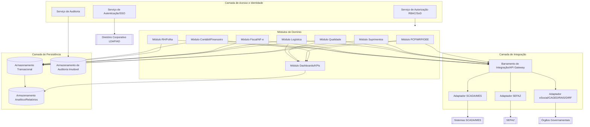
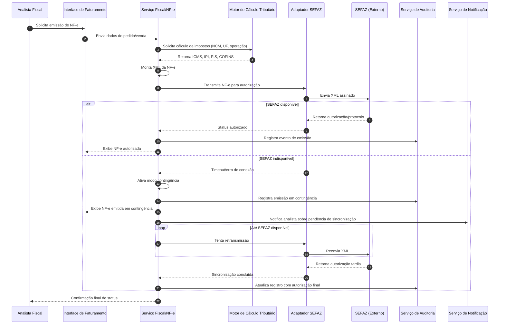
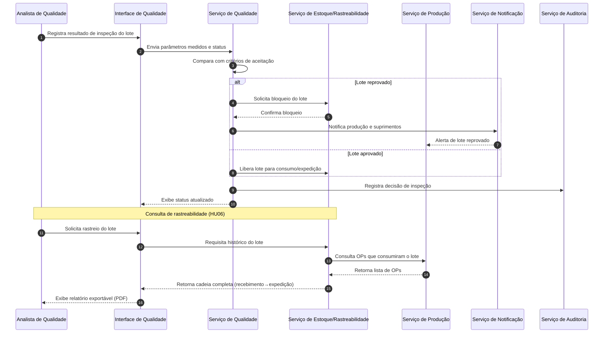

# Relatório Técnico de Arquitetura de Software
## ERP para Indústria Manufatureira (G03)

---

## 1. Identificação das HUs

| HU | Perfil | Síntese | RFs relacionados | RNFs relacionados |
|----|--------|---------|-------------------|--------------------|
| HU01 | Planejador PCP | Criar OP e calcular MRP | RF05, RF06, RF14 | RNF13 |
| HU02 | Planejador PCP | Monitorar OEE e alertas | RF10, RF11, RF12, RF52 | RNF14, RNF18 |
| HU03 | Comprador | Cotações com múltiplos fornecedores | RF13, RF15, RF16 | - |
| HU04 | Gestor Suprimentos | Desempenho de fornecedores | RF19 | - |
| HU05 | Analista Qualidade | Inspeção e bloqueio de lote | RF20, RF21, RF22 | - |
| HU06 | Analista Qualidade | Rastreabilidade completa | RF23 | RNF10 |
| HU07 | Analista Fiscal | Emissão NF-e com impostos | RF31, RF32, RF33, RF34 | RNF07, RNF15, RNF17 |
| HU08 | Analista Fiscal | SPED Fiscal atualizado | RF36 | RNF08 |
| HU09 | Analista RH | Processar folha mensal | RF38, RF39, RF40 | RNF11 |
| HU10 | Analista RH | Obrigações acessórias RH | RF40 | RNF08, RNF11 |
| HU11 | Controller | DRE e fluxo de caixa em tempo real | RF43, RF45, RF46, RF47 | RNF14 |
| HU12 | Diretor/CEO | Dashboard executivo com KPIs | RF50, RF51, RF52, RF53 | RNF14 |

---

## 2. Diagramas de Arquitetura (Mermaid)

### 2.1 Diagrama de Componentes (Visão Macro)

### 2.2 Diagrama de Sequência — HU07 (Emissão de NF-e com Contingência)

### 2.3 Diagrama de Sequência — HU05/HU06 (Inspeção de Qualidade e Bloqueio de Lote)

---

## 3. Decisões de Arquitetura

| # | Decisão | Justificativa | Requisitos Relacionados |
|---|---------|----------------|---------------------------|
| D01 | Arquitetura modular orientada a domínios de negócio (PCP, Suprimentos, Qualidade, Logística, Fiscal, RH, Contábil, BI), comunicando-se via barramento/API central. | Isola responsabilidades, permite evolução independente de módulos e atende à natureza multi-domínio do ERP. | RF05–RF53 |
| D02 | Camada de integração dedicada com adaptadores específicos por protocolo externo (SCADA/MES, SEFAZ, órgãos de RH). | Isola variabilidade de protocolos industriais e governamentais, evitando acoplamento direto dos módulos de negócio a especificidades externas. | RF11, RF31–RF36, RF40, RNF18 |
| D03 | Serviço de Auditoria centralizado e desacoplado, com armazenamento imutável dedicado. | Atende requisito de trilha de auditoria com retenção de 10 anos e não-repúdio, separando dados operacionais de dados de conformidade. | RF03, RNF10 |
| D04 | Serviço de Identidade e Acesso centralizado (SSO + RBAC/SoD) compartilhado por todos os módulos. | Garante consistência de autorização granular por unidade fabril/módulo/função e segregação de funções em operações financeiras/fiscais. | RF01–RF04, RNF03, RNF04 |
| D05 | Modo de contingência fiscal implementado como estado de máquina dentro do módulo Fiscal, com fila de reenvio assíncrona. | Atende exigência de emissão offline com sincronização posterior sem bloquear operação de vendas. | RF34, RNF17 |
| D06 | Camada analítica/relatórios separada da camada transacional, alimentada por replicação/propagação de eventos de domínio. | Permite atender SLA de carregamento de dashboards (5s) sem competir por recursos com transações operacionais críticas. | RF50–RF53, RNF14 |
| D07 | Modelo de dados com particionamento lógico por unidade fabril/filial. | Atende requisito de isolamento de dados por unidade com consolidação centralizada. | RF04, RNF16 |
| D08 | Rastreabilidade implementada como grafo de relacionamento entre entidades (lote, OP, NF-e, inspeção), consultável ponta a ponta. | Suporta consultas de rastreabilidade completa exigidas em auditorias e recalls. | RF23, HU06 |
| D09 | Bloqueio de lote implementado como regra de domínio no serviço de Estoque, acionada por evento do serviço de Qualidade. | Garante consistência transacional entre decisão de qualidade e disponibilidade física/lógica do lote. | RF22, HU05 |
| D10 | Comunicação entre módulos preferencialmente assíncrona baseada em eventos de domínio, com fallback síncrono para operações que exigem confirmação imediata (ex: emissão de NF-e). | Reduz acoplamento temporal entre módulos e melhora resiliência, mantendo consistência onde exigido por regra de negócio. | RF09, RF11, RF43, RNF12 |

---

## 4. Tabela de Componentes e Rastreabilidade

| Componente | Responsabilidade Principal | Comunica-se com | Origem (HU / Critério de Aceite) |
|------------|------------------------------|-------------------|-------------------------------------|
| Serviço de Autenticação/SSO | Autenticar usuários via diretório corporativo | Serviço de Autorização, Serviço de Auditoria | RF02 |
| Serviço de Autorização (RBAC/SoD) | Controlar permissões granulares por módulo/função/unidade | Todos os módulos de domínio | RF01, RF04, RNF03 |
| Serviço de Auditoria | Registrar log imutável de todas as operações | Todos os módulos, Armazenamento de Auditoria | RF03, RNF10 |
| Módulo PCP/MRP/OEE | Gerir OPs, calcular MRP, sequenciar capacidade, calcular OEE | Adaptador SCADA, Módulo Suprimentos, Módulo BI | RF05–RF12, HU01, HU02 |
| Adaptador SCADA/MES | Traduzir protocolos industriais para eventos internos | Módulo PCP | RF11, RNF18 |
| Módulo Suprimentos | Gerir fornecedores, cotações, OCs, recebimentos, devoluções | Módulo PCP, Módulo Fiscal, Módulo Qualidade | RF13–RF19, HU03, HU04 |
| Módulo Qualidade | Gerir planos de inspeção, resultados, NCs, bloqueios | Serviço de Estoque, Módulo PCP, Serviço de Notificação | RF20–RF25, HU05, HU06 |
| Serviço de Estoque/Rastreabilidade | Manter posição de estoque, bloqueios e cadeia de rastreio | Módulo Qualidade, Módulo PCP, Módulo Logística | RF09, RF22, RF23, HU06 |
| Módulo Logística | Gerir expedição, romaneios, entregas, RMA | Módulo Fiscal, Serviço de Estoque | RF26–RF30 |
| Módulo Fiscal/NF-e | Calcular tributos, emitir NF-e/CT-e, gerir contingência | Adaptador SEFAZ, Módulo Contábil, Módulo Logística | RF31–RF36, HU07, HU08 |
| Adaptador SEFAZ | Transmitir/receber documentos fiscais eletrônicos | Módulo Fiscal | RF31, RF34, RNF07, RNF17 |
| Módulo RH/Folha | Gerir colaboradores, ponto, folha, benefícios | Adaptador eSocial, Módulo Contábil | RF37–RF42, HU09, HU10 |
| Adaptador eSocial/CAGED/RAIS/DIRF | Gerar e validar arquivos de obrigações acessórias | Módulo RH | RF40, RNF08 |
| Módulo Contábil/Financeiro | Gerar lançamentos, DRE, balanço, contas a pagar/receber | Todos os módulos transacionais, Módulo BI | RF43–RF49, HU11 |
| Módulo Dashboards/BI | Consolidar KPIs, permitir drill-down e exportação | Armazenamento Analítico, todos os módulos | RF50–RF53, HU02, HU11, HU12 |
| Serviço de Notificação | Emitir alertas visuais e por e-mail sobre desvios/eventos | Módulo PCP, Módulo Qualidade, Módulo RH | RF12, HU02, HU05, HU10 |
| Barramento de Integração/API Gateway | Rotear e expor eventos/APIs entre módulos e sistemas externos | Todos os módulos, Adaptadores externos | RNF19, RNF20 |
| Armazenamento Transacional | Persistir dados operacionais de todos os módulos | Todos os módulos | Transversal |
| Armazenamento de Auditoria | Persistir trilha imutável de auditoria | Serviço de Auditoria | RNF10 |
| Armazenamento Analítico | Persistir dados consolidados para relatórios/dashboards | Módulo BI, Módulo Contábil | RF50, RNF14 |

---

## 5. Bloqueios e Pendências

| # | Descrição do Bloqueio/Pendência | Impacto | Responsável Sugerido |
|---|-----------------------------------|---------|------------------------|
| B01 | Não há definição de qual(is) protocolo(s) industrial(is) específico(s) por unidade fabril serão priorizados (OPC-UA, MQTT, REST/JSON coexistem). | Afeta o design do Adaptador SCADA/MES e capacidade de generalização. | Equipe de Integração + Stakeholder de Manufatura |
| B02 | Não há especificação de política de retenção/expurgo para dados operacionais fora do escopo fiscal/auditoria (10 anos é definido só para trilha fiscal/RH). | Pode gerar crescimento não controlado da base transacional. | Arquitetura de Dados + Governança |
| B03 | Ausência de definição de SLA de sincronização para múltiplas unidades fabris (RNF16 menciona isolamento e consolidação, mas não frequência). | Impacta design de replicação entre unidades e camada analítica central. | Arquitetura + TI Corporativo |
| B04 | Não há detalhamento de regras de alçada de aprovação (RF16) — hierarquia, valores, exceções. | Bloqueia definição do motor de workflow de aprovação. | Área de Suprimentos/Compliance |
| B05 | Ausência de especificação sobre convenções coletivas variáveis por categoria/região (RNF11) — fonte de dados e forma de atualização. | Impacta motor de cálculo de folha, pode gerar erros de conformidade. | RH + Jurídico |
| B06 | Não há definição de estratégia de resolução de conflitos quando dados operacionais chegam de múltiplas fontes (ex.: apontamento manual vs. SCADA). | Afeta consistência do cálculo de OEE e MRP. | Arquitetura + PCP |

---

## 6. Cobertura de Requisitos

| Categoria | RFs Cobertos | RNFs Cobertos | Observações |
|-----------|----------------|------------------|----------------|
| Usuários e Acesso | RF01–RF04 | RNF03, RNF04 | Cobertura total via Serviço de Autenticação/Autorização/Auditoria |
| PCP | RF05–RF12 | RNF13, RNF18 | Cobertura total; SCADA via adaptador dedicado |
| Suprimentos | RF13–RF19 | - | Cobertura total; workflow de alçada requer detalhamento (ver B04) |
| Qualidade | RF20–RF25 | RNF10 | Cobertura total incluindo rastreabilidade e bloqueio |
| Logística | RF26–RF30 | - | Cobertura funcional total; integração com transportadoras não especificada tecnicamente (gap) |
| Fiscal | RF31–RF36 | RNF06, RNF07, RNF08, RNF15, RNF17 | Cobertura total, incluindo contingência |
| RH/Folha | RF37–RF42 | RNF09, RNF11 | Cobertura total; dependências externas de convenções (ver B05) |
| Contabilidade | RF43–RF49 | - | Cobertura total |
| Dashboards/KPIs | RF50–RF53 | RNF14 | Cobertura total |
| Segurança Transversal | - | RNF01, RNF02, RNF05 | Cobertos por decisões arquiteturais gerais (TLS, criptografia em repouso, auditoria de segurança) — não modelados como componente próprio |
| Infraestrutura | - | RNF12, RNF21, RNF22, RNF23, RNF24 | Cobertos como atributos de qualidade transversais, não requerem componente de domínio dedicado |

**Cobertura geral estimada: 100% dos RFs endereçados por ao menos um componente; 100% dos RNFs endereçados por decisão arquitetural ou atributo transversal.**

---

## 7. Gap Analysis

| # | Gap Identificado | Impacto Arquitetural | Ação Recomendada |
|---|--------------------|--------------------------|----------------------|
| G01 | Requisitos não especificam critérios de desempate ou prioridade quando múltiplos fornecedores atendem igualmente aos critérios de cotação (RF15). | Motor de comparação de propostas pode ter ambiguidade de regra de negócio. | Levantar com stakeholders de Suprimentos matriz de pesos/critérios de desempate. |
| G02 | Não há especificação de granularidade temporal do OEE (por turno é citado, mas não por hora/minuto para drill-down). | Afeta modelagem do serviço de apontamento e granularidade de eventos armazenados. | Definir junto ao PCP a granularidade mínima de captura de eventos de produção. |
| G03 | RF11 exige integração em tempo real com SCADA/MES, mas não define comportamento em caso de perda de conectividade prolongada com o chão de fábrica. | Risco de indisponibilidade de dados de OEE/apontamento sem estratégia de contingência definida. | Especificar modo degradado/local com sincronização posterior, análogo ao padrão de contingência fiscal (D05). |
| G04 | Não há requisito explícito sobre versionamento de planos de inspeção de qualidade (RF20) quando alterados após lotes já produzidos. | Pode gerar inconsistência em auditorias de rastreabilidade retroativa. | Definir política de versionamento imutável de planos de inspeção vinculados a lote/data. |
| G05 | RF43 menciona lançamentos automáticos a partir de outros módulos, mas não define regra de estorno/reprocessamento em caso de erro em módulo de origem. | Risco de inconsistência contábil sem mecanismo de compensação definido. | Especificar padrão de lançamento de estorno/compensação transacional entre módulos e Contábil. |
| G06 | Não há requisito sobre política de resolução de conflito de dados entre unidades fabris na consolidação central (RNF16). | Pode gerar divergência entre dado local e consolidado. | Definir estratégia de consolidação (ex.: unidade fabril como fonte de verdade, central como agregador read-only). |
| G07 | Ausência de requisito de idempotência para reenvio de NF-e em contingência (RF34/RNF17), risco de duplicidade de documento fiscal. | Risco de emissão duplicada de NF-e após restabelecimento de conexão. | Incluir requisito de chave de idempotência/deduplicação no fluxo de sincronização. |
| G08 | Não há definição de requisito de internacionalização/idioma para operações multi-moeda (RF49), apenas conversão de valores. | Pode impactar módulos de RH/Contábil se houver operação internacional. | Confirmar com stakeholders se há necessidade de suporte multi-idioma além de multi-moeda. |
| G09 | RF52 exige drill-down "até o registro transacional de origem", mas não define limite de profundidade/desempenho para essa navegação em grandes volumes. | Pode conflitar com RNF14 (5s de carregamento) em cenários de alto volume histórico. | Definir estratégia de indexação/agregação incremental para drill-down performático. |