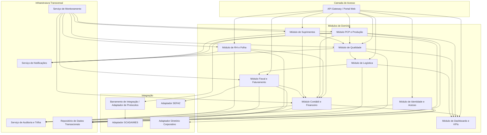
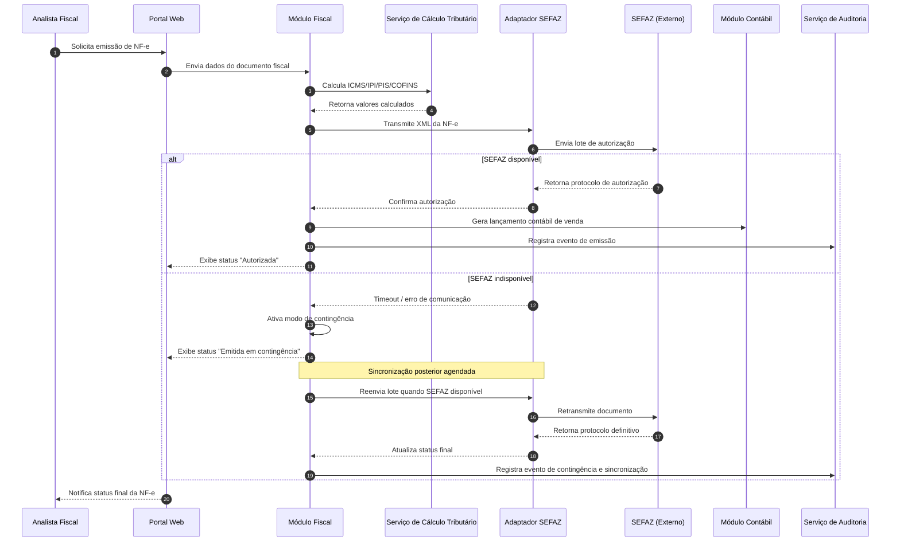
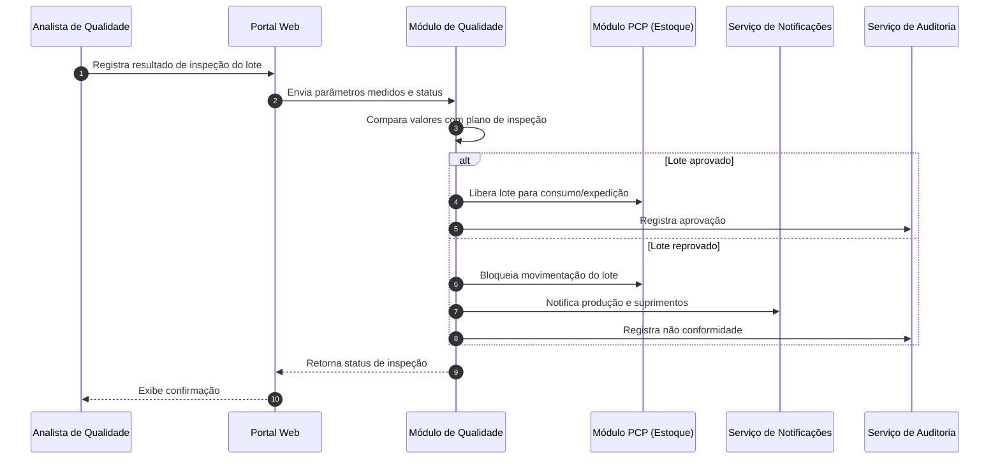

# Relatório Técnico de Arquitetura de Software

## 1. Identificação das HUs

| HU | Título | Perfil | RFs Relacionados | RNFs Relacionados |
|----|--------|--------|-------------------|---------------------|
| HU01 | Gerar OP e calcular MRP | Planejador de Produção | RF05, RF06, RF14 | RNF13 |
| HU02 | Monitorar OEE e desvios | Planejador de Produção | RF10, RF11, RF12, RF50, RF52 | RNF18 |
| HU03 | Gerenciar cotações com fornecedores | Comprador | RF13, RF15, RF16 | - |
| HU04 | Acompanhar desempenho de fornecedores | Gestor de Suprimentos | RF19, RF53 | - |
| HU05 | Registrar inspeção e bloquear lotes | Analista de Qualidade | RF20, RF21, RF22 | - |
| HU06 | Rastrear lote insumo→acabado | Analista de Qualidade | RF23, RF17, RF28 | - |
| HU07 | Emitir NF-e com impostos automáticos | Analista Fiscal | RF31, RF32, RF33, RF34 | RNF15, RNF17, RNF07 |
| HU08 | Manter SPED Fiscal atualizado | Analista Fiscal | RF36 | RNF08 |
| HU09 | Processar folha de pagamento | Analista de RH | RF38, RF39 | RNF11 |
| HU10 | Gerar obrigações acessórias RH | Analista de RH | RF40 | RNF08 |
| HU11 | Visualizar DRE e Fluxo de Caixa | Controller | RF45, RF46, RF47, RF52 | - |
| HU12 | Dashboard executivo | Diretor/CEO | RF50, RF51, RF52, RF53 | RNF14 |

## 2. Diagramas de Arquitetura (Mermaid)

### 2.1 Diagrama de Componentes (Visão Macro)

### 2.2 Diagrama de Sequência — HU07: Emissão de NF-e com Contingência

### 2.3 Diagrama de Sequência — HU05/HU06: Inspeção e Bloqueio de Lote

## 3. Decisões de Arquitetura

| # | Decisão | Justificativa |
|---|---------|----------------|
| D01 | Arquitetura modular orientada a domínios de negócio (PCP, Suprimentos, Qualidade, Logística, Fiscal, RH, Contábil, BI) | Reflete os agrupamentos naturais de RF e permite evolução/escala independente por módulo, alinhado a RNF16 (multiplantas). |
| D02 | Camada de integração dedicada (adaptadores) para SEFAZ, SCADA/MES e Diretório Corporativo | Isola protocolos externos variáveis (OPC-UA, MQTT, REST/JSON, webservices SEFAZ) do núcleo de domínio, atendendo RNF18, RNF19. |
| D03 | Serviço transversal de Auditoria com trilha imutável | Atende RF03, RNF10 (retenção 10 anos) de forma centralizada, evitando duplicação de lógica de auditoria em cada módulo. |
| D04 | Motor de Cálculo Tributário como serviço desacoplado do Módulo Fiscal | Permite atualização isolada de regras fiscais (RNF06) sem impactar emissão/transmissão de documentos. |
| D05 | Modo de contingência para emissão fiscal com fila de sincronização assíncrona | Atende RF34 e RNF17, garantindo continuidade operacional em indisponibilidade da SEFAZ. |
| D06 | Módulo de BI/Dashboards consumindo dados consolidados via camada de agregação, não diretamente das tabelas transacionais | Suporta RNF14 (5s de carregamento) e drill-down (RF52) sem sobrecarregar módulos operacionais. |
| D07 | Controle de acesso RBAC com escopo hierárquico por unidade fabril centralizado no Módulo de Identidade | Atende RF01, RF04, RNF03 de forma única e reutilizável por todos os módulos. |
| D08 | Isolamento lógico de dados por unidade fabril com consolidação centralizada | Atende RNF16, permitindo múltiplas plantas com segregação e visão corporativa. |
| D09 | Integração entre módulos via eventos/mensagens de domínio (ex.: "OP encerrada", "Lote reprovado") | Reduz acoplamento direto entre PCP, Qualidade, Suprimentos e Contábil, favorecendo consistência eventual e rastreabilidade. |
| D10 | Neutralidade tecnológica: nenhum produto específico de banco de dados, mensageria ou framework prescrito | Conforme diretriz de neutralidade; decisões de implementação ficam a cargo do time de engenharia. |

## 4. Tabela de Componentes e Rastreabilidade

| Componente | Responsabilidade Principal | Comunica-se com | Origem (HU / Critério de Aceite) |
|---|---|---|---|
| Módulo de Identidade e Acesso (IAM) | Autenticação SSO, gestão de perfis/permissões, RBAC hierárquico por unidade | Adaptador de Diretório, Serviço de Auditoria, todos os módulos de domínio | RF01-RF04, RNF03, RNF04 |
| Módulo PCP e Produção | Gestão de OPs, MRP, sequenciamento de capacidade, apontamento, cálculo de OEE | Adaptador SCADA/MES, Módulo de Qualidade, Módulo Contábil, Serviço de Notificações | RF05-RF12, HU01, HU02 |
| Adaptador SCADA/MES | Tradução de protocolos industriais (OPC-UA/MQTT/REST) para eventos de domínio | Módulo PCP | RF11, RNF18, HU02 |
| Serviço de Cálculo de MRP | Cálculo de necessidades líquidas de materiais | Módulo PCP, Módulo de Suprimentos | RF06, HU01, RNF13 |
| Módulo de Suprimentos | Cadastro de fornecedores, solicitações de compra automáticas, cotações, OCs, recebimento | Módulo PCP, Módulo de Qualidade, Módulo Contábil | RF13-RF19, HU03, HU04 |
| Módulo de Qualidade | Planos de inspeção, registro de resultados, bloqueio de lotes, NC, rastreabilidade | Módulo PCP, Módulo de Suprimentos, Módulo de Logística, Serviço de Notificações | RF20-RF25, HU05, HU06 |
| Módulo de Logística | Endereçamento de estoque, expedição, romaneios, rastreamento de entregas, RMA | Módulo de Qualidade, Módulo Fiscal | RF26-RF30 |
| Módulo Fiscal e Faturamento | Emissão de NF-e/CT-e, cálculo tributário, contingência, SPED Fiscal | Serviço de Cálculo Tributário, Adaptador SEFAZ, Módulo Contábil | RF31-RF36, HU07, HU08 |
| Serviço de Cálculo Tributário | Cálculo de ICMS/IPI/PIS/COFINS/ISS por NCM e UF | Módulo Fiscal | RF32, HU07 |
| Adaptador SEFAZ | Transmissão/recepção de documentos fiscais eletrônicos, gestão de contingência | Módulo Fiscal | RF31, RF34, RNF15, RNF17 |
| Módulo de RH e Folha | Cadastro de colaboradores, ponto eletrônico, folha, obrigações acessórias, benefícios | Módulo Contábil, Serviço de Notificações | RF37-RF42, HU09, HU10 |
| Módulo Contábil e Financeiro | Lançamentos automáticos, plano de contas, DRE, Balanço, Fluxo de Caixa, SPED Contábil, multimoeda | Módulo PCP, Suprimentos, Fiscal, RH, Módulo BI | RF43-RF49, HU11 |
| Módulo de Dashboards e KPIs (BI) | Consolidação de indicadores, metas, alertas visuais, drill-down, exportação | Módulo Contábil, PCP, Qualidade, Logística | RF50-RF53, HU02, HU11, HU12 |
| Serviço de Auditoria e Trilha | Registro imutável de operações críticas, retenção de longo prazo | Todos os módulos | RF03, RNF10 |
| Serviço de Notificações | Envio de alertas (e-mail/painel) sobre desvios, reprovações, prazos | Módulo PCP, Qualidade, Suprimentos, RH | RF12, HU02, HU05, HU10 |
| Serviço de Monitoramento Operacional | Exposição de métricas de todos os módulos para equipe de TI | Todos os módulos | RNF23 |
| Barramento de Integração (ESB) | Roteamento de eventos/dados entre módulos e adaptadores externos | Todos os módulos e adaptadores | RNF19, RNF20 |

## 5. Bloqueios e Pendências

| # | Item | Descrição | Impacto |
|---|------|-----------|---------|
| B01 | Definição de threshold de desvio de produção (RF12) | Não há especificação de valores default ou faixa de configuração | Impede definição de contrato do serviço de alertas |
| B02 | Regras de alçada de aprovação de OC (RF16) | Política de aprovação não detalhada (níveis, valores, exceções) | Bloqueia modelagem do fluxo de aprovação e matriz RBAC associada |
| B03 | Definição de convenções coletivas aplicáveis por categoria (RNF11) | Variação por sindicato/categoria não especificada | Impacta motor de cálculo de folha, necessidade de parametrização externa |
| B04 | Critérios de comparação de propostas de cotação (RF15) | "Critérios configuráveis" sem pesos ou fórmula definida | Bloqueia especificação do serviço de comparação automática |
| B05 | Protocolo definitivo de integração SCADA/MES por planta (RNF18) | Múltiplos protocolos possíveis sem regra de seleção/prioridade | Impacta design do Adaptador SCADA/MES |
| B06 | Estratégia de consolidação multi-planta (RNF16) | Não especifica se consolidação é em tempo real ou batch | Afeta arquitetura do Módulo Contábil/BI |

## 6. Cobertura de Requisitos

| Categoria | RFs Cobertos | RNFs Cobertos | Observações |
|---|---|---|---|
| Usuários e Acesso | RF01-RF04 | RNF03, RNF04 | Cobertura completa via Módulo IAM |
| PCP | RF05-RF12 | RNF13, RNF18 | Cobertura completa; dependência de B01, B05 |
| Suprimentos | RF13-RF19 | - | Cobertura completa; dependência de B02, B04 |
| Qualidade | RF20-RF25 | - | Cobertura completa |
| Logística | RF26-RF30 | - | Cobertura completa |
| Fiscal | RF31-RF36 | RNF06-RNF08, RNF15, RNF17 | Cobertura completa |
| RH | RF37-RF42 | RNF11 | Dependência de B03 |
| Contábil | RF43-RF49 | RNF02, RNF10 | Cobertura completa |
| BI/Dashboards | RF50-RF53 | RNF14 | Cobertura completa |
| Segurança/Conformidade transversal | - | RNF01-RNF10 | Cobertos por IAM, Auditoria, camada de comunicação |
| Infraestrutura | - | RNF12, RNF21-RNF24 | Requer detalhamento operacional na fase de implantação |

Todos os RFs (RF01-RF53) e RNFs (RNF01-RNF24) possuem componente arquitetural correspondente identificado, exceto os itens em aberto na Seção 5.

## 7. Gap Analysis

| # | Gap Identificado | Impacto Arquitetural | Ação Recomendada |
|---|---|---|---|
| G01 | Ausência de especificação de SLA para o Barramento de Integração em cenários de pico (ex.: fechamento de folha + emissão de NF-e simultâneos) | Risco de contenção de recursos entre módulos críticos | Definir política de priorização/quotas por tipo de evento no ESB |
| G02 | Não há requisito explícito sobre versionamento de esquemas de dados fiscais/contábeis ao longo do tempo (mudanças de legislação) | Dificuldade em manter histórico de conformidade retroativa (RNF10, 10 anos) | Especificar estratégia de versionamento de regras fiscais e schemas por período de vigência |
| G03 | Falta de requisito sobre reconciliação entre dados MES/SCADA e apontamento manual em caso de divergência | Risco de inconsistência no cálculo de OEE | Definir regra de precedência e processo de reconciliação de dados |
| G04 | Ausência de definição de RTO (Recovery Time Objective) complementar ao RPO definido em RNF21 | Incompleto plano de continuidade de negócio | Estabelecer RTO para módulos críticos (Fiscal, Contábil, PCP) |
| G05 | Não especificado processo de homologação/descredenciamento de fornecedores mencionado em HU04 | Falta de fluxo de estado (ativo/suspenso/descredenciado) para fornecedores | Modelar máquina de estados do ciclo de vida do fornecedor |
| G06 | Ausência de requisito sobre gestão de identidade de dispositivos/máquinas na integração MES | Risco de autenticação insegura entre chão de fábrica e ERP | Definir mecanismo de autenticação/autorização para dispositivos industriais |
| G07 | Não há requisito de idempotência para reprocessamento de eventos (ex.: reenvio de NF-e em contingência, reprocessamento de folha) | Risco de duplicidade de lançamentos contábeis/fiscais | Exigir chave de idempotência em todos os serviços transacionais críticos |
| G08 | Falta de requisito sobre internacionalização/localização além de multimoeda (RF49) | Pode limitar expansão para operações multi-país | Avaliar necessidade de i18n na camada de apresentação, se aplicável ao escopo futuro |