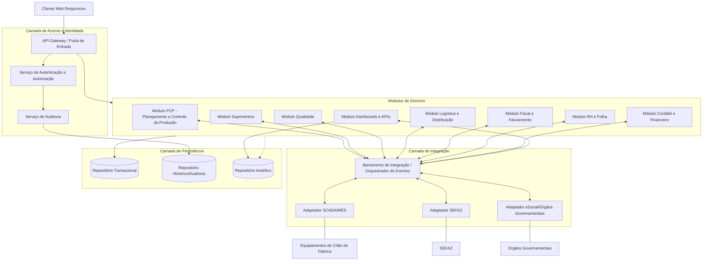
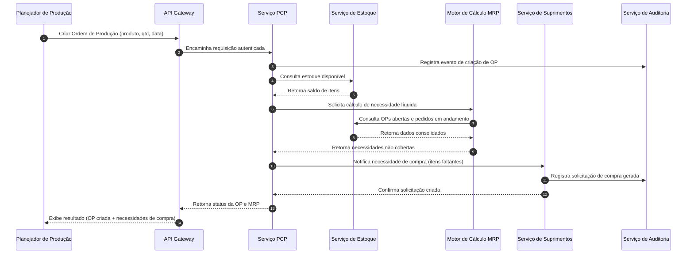
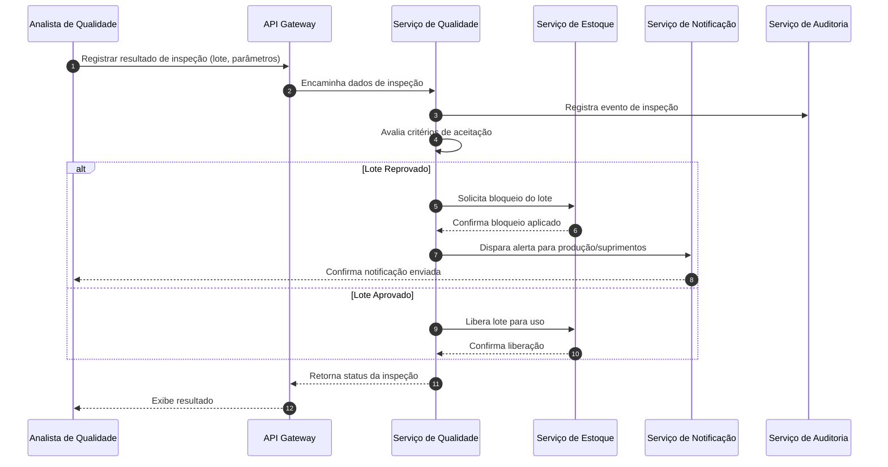

# Relatório Técnico de Arquitetura de Software
## Sistema Integrado de Gestão Empresarial para Manufatura (ERP) — G03

---

## 1. Identificação das HUs

| HU | Título | Módulo(s) Relacionado(s) | RFs Associados |
|----|--------|---------------------------|-----------------|
| HU01 | Gerar ordens de produção e calcular MRP | PCP / Suprimentos | RF05, RF06, RF14 |
| HU02 | Monitorar OEE e desvios em tempo real | PCP / Chão de Fábrica | RF08, RF10, RF11, RF12, RF50-RF52 |
| HU03 | Gerenciar cotações com múltiplos fornecedores | Suprimentos | RF13, RF15, RF16 |
| HU04 | Acompanhar desempenho de fornecedores | Suprimentos | RF19, RF53 |
| HU05 | Registrar inspeção de lote e bloquear reprovados | Qualidade | RF20, RF21, RF22 |
| HU06 | Rastrear lote do insumo ao produto acabado | Qualidade / Logística | RF23, RF17, RF28 |
| HU07 | Emitir NF-e com cálculo automático de impostos | Fiscal | RF31, RF32, RF33, RF34 |
| HU08 | Manter SPED Fiscal atualizado | Fiscal/Contábil | RF36, RF48 |
| HU09 | Processar folha de pagamento mensal | RH | RF38, RF39, RF40 |
| HU10 | Gerar obrigações acessórias de RH | RH | RF40 |
| HU11 | Visualizar DRE e Fluxo de Caixa em tempo real | Contábil/Financeiro | RF43, RF45, RF46, RF47 |
| HU12 | Acompanhar indicadores executivos | Dashboards | RF50, RF51, RF52 |

---

## 2. Diagramas de Arquitetura (Mermaid)

### 2.1 Visão Macro de Componentes

### 2.2 Diagrama de Sequência — HU01 (Geração de OP e cálculo de MRP)

### 2.3 Diagrama de Sequência — HU05 (Inspeção de Lote)

---

## 3. Decisões de Arquitetura

| # | Decisão | Justificativa | Requisitos Relacionados |
|---|---------|----------------|--------------------------|
| D01 | Arquitetura modular orientada a domínios (PCP, Suprimentos, Qualidade, Logística, Fiscal, RH, Contábil, BI) comunicando-se via barramento de integração | Isola responsabilidades funcionais complexas e permite evolução independente por área de negócio | RF05-RF53 |
| D02 | Uso de camada de adaptadores para integrações externas (SCADA/MES, SEFAZ, órgãos governamentais) | Reduz acoplamento entre núcleo de negócio e protocolos/formatos externos variáveis | RF11, RF31-RF36, RF40, RNF18 |
| D03 | Serviço de Auditoria centralizado e imutável, consumido de forma transversal por todos os módulos | Atende requisito de trilha auditável com retenção de longo prazo | RF03, RNF10 |
| D04 | Repositório analítico segregado do repositório transacional | Garante desempenho de dashboards sem impactar operações transacionais críticas | RF50-RF53, RNF14 |
| D05 | Motor de MRP como serviço computacional dedicado, desacoplado do serviço de PCP | Permite escalar o processamento intensivo de cálculo sem afetar operações de cadastro/consulta | RF06, RNF13 |
| D06 | Módulo Fiscal com suporte a modo de contingência local | Garante continuidade operacional em caso de indisponibilidade de serviços externos (SEFAZ) | RF34, RNF17 |
| D07 | Controle de acesso (RBAC) e segregação de funções aplicados na camada de Autenticação/Autorização, transversal a todos os módulos | Atende requisitos de segurança e conformidade fiscal/financeira | RF01, RF04, RNF03 |
| D08 | Isolamento lógico de dados por unidade fabril com consolidação centralizada no módulo de BI/Contábil | Suporta múltiplas plantas mantendo governança de dados | RF04, RNF16 |
| D09 | Comunicação entre módulos preferencialmente assíncrona via eventos, com fallback síncrono via API para operações críticas (bloqueio de lote, aprovação de OC) | Equilibra desempenho, resiliência e consistência transacional | RF12, RF22, RNF13-RNF15 |

---

## 4. Tabela de Componentes e Rastreabilidade

| Componente | Responsabilidade Principal | Comunica-se com | Origem (HU / Critério de Aceite) |
|------------|------------------------------|-------------------|-------------------------------------|
| API Gateway | Ponto único de entrada, roteamento e validação inicial de requisições | Serviço de Autenticação, todos os módulos de domínio | Transversal — todas as HUs |
| Serviço de Autenticação e Autorização | SSO, controle de perfis, RBAC/SoD, restrição por unidade fabril | API Gateway, Serviço de Auditoria | RF01-RF04, RNF03, RNF04 |
| Serviço de Auditoria | Registro imutável de operações por usuário/módulo | Todos os módulos de domínio | RF03, RNF10 |
| Módulo PCP | Gestão de OPs, sequenciamento, apontamento e OEE | Motor MRP, Serviço de Estoque, Adaptador SCADA/MES | HU01, HU02 |
| Motor de Cálculo MRP | Cálculo de necessidade líquida de materiais | Módulo PCP, Serviço de Estoque | HU01 (critério: MRP considera estoque, OPs e compras) |
| Módulo Suprimentos | Cotações, ordens de compra, recebimento, desempenho de fornecedores | Módulo PCP, Serviço de Estoque, Serviço de Notificação | HU01, HU03, HU04 |
| Módulo Qualidade | Planos de inspeção, resultados, bloqueio de lotes, rastreabilidade, NC | Serviço de Estoque, Serviço de Notificação, Módulo Logística | HU05, HU06 |
| Módulo Logística | Endereçamento de estoque, expedição, romaneios, RMA | Módulo Qualidade, Módulo Fiscal | RF26-RF30, HU06 |
| Módulo Fiscal | Emissão de NF-e/CT-e, cálculo de impostos, SPED | Adaptador SEFAZ, Módulo Contábil | HU07, HU08 |
| Módulo RH | Cadastro, ponto eletrônico, folha, obrigações acessórias | Adaptador Órgãos Governamentais, Módulo Contábil | HU09, HU10 |
| Módulo Contábil/Financeiro | Lançamentos automáticos, DRE, fluxo de caixa, contas a pagar/receber | Módulo Fiscal, Módulo RH, Módulo BI | HU11 |
| Módulo Dashboards/BI | Consolidação de KPIs, drill-down, exportação | Repositório Analítico, todos os módulos de domínio (leitura) | HU02, HU04, HU11, HU12 |
| Adaptador SCADA/MES | Tradução de protocolos industriais para eventos internos | Módulo PCP, ESB | RF11, RNF18 |
| Adaptador SEFAZ | Transmissão/recebimento de documentos fiscais eletrônicos | Módulo Fiscal, ESB | RF31, RF33, RF34, RNF17 |
| Adaptador Órgãos Governamentais | Geração/envio de arquivos eSocial, CAGED, RAIS, DIRF | Módulo RH, ESB | HU10 |
| Serviço de Notificação | Disparo de alertas (e-mail, painel) sobre desvios e eventos críticos | Módulo PCP, Módulo Qualidade, Módulo Suprimentos | HU02, HU05, HU10 |
| Serviço de Estoque | Controle centralizado de saldo, bloqueio/liberação de lotes | Módulo PCP, Suprimentos, Qualidade, Logística | RF09, RF22, RF26 |
| Barramento de Integração (ESB) | Orquestração de eventos e mensagens entre módulos e adaptadores | Todos os módulos e adaptadores | Transversal |
| Repositório Transacional | Persistência de dados operacionais correntes | Todos os módulos de domínio | Transversal |
| Repositório Analítico | Base otimizada para consultas de BI/dashboards | Módulo BI | RF50-RF53, RNF14 |
| Repositório Histórico/Auditoria | Armazenamento de trilhas de auditoria de longo prazo | Serviço de Auditoria | RNF10 |

---

## 5. Bloqueios e Pendências

| # | Descrição do Bloqueio/Pendência | Impacto | Ação Recomendada |
|---|-----------------------------------|---------|-------------------|
| B01 | Não há definição de protocolo específico priorizado entre OPC-UA, MQTT ou REST/JSON para integração com SCADA/MES | Impacta o design do Adaptador SCADA/MES e capacidade de plug-and-play multi-fábrica | Definir com stakeholders de TI de planta qual(is) protocolo(s) serão suportados por unidade fabril |
| B02 | Ausência de detalhamento sobre política de alçada de aprovação de OC | Impacta modelagem do fluxo de aprovação e notificações | Levantar matriz de alçadas junto à área de Suprimentos/Financeiro |
| B03 | Não especificado o SLA de sincronização entre emissão em contingência e SEFAZ | Impacta garantias de consistência fiscal pós-reconexão | Definir RPO/RTO específico para o cenário de contingência fiscal |
| B04 | Ausência de definição sobre política de retenção/exclusão de dados pessoais conforme LGPD (direito ao esquecimento) versus retenção de 10 anos para dados fiscais | Conflito potencial entre RNF09 e RNF10 | Definir regras de anonimização/pseudonimização para conciliar ambos requisitos |
| B05 | Não há detalhamento de como o isolamento de dados por unidade fabril coexiste com a consolidação centralizada (RNF16) | Impacta modelo de particionamento de dados | Especificar estratégia de multi-tenancy (isolamento lógico vs. físico) |
| B06 | Não definidos os thresholds padrão de alertas de desvio de produção (RF12) e KPIs (RF51) | Impacta parametrização inicial do sistema | Levantar valores de referência junto a PCP e áreas executivas |

---

## 6. Cobertura de Requisitos

| Categoria | Requisitos Cobertos | Observação |
|-----------|----------------------|------------|
| Gestão de Usuários e Acesso | RF01-RF04 | Totalmente endereçados via componentes de Autenticação/Autorização/Auditoria |
| PCP | RF05-RF12 | Cobertos por Módulo PCP, Motor MRP e Adaptador SCADA/MES |
| Suprimentos | RF13-RF19 | Cobertos pelo Módulo Suprimentos |
| Qualidade | RF20-RF25 | Cobertos pelo Módulo Qualidade |
| Logística | RF26-RF30 | Cobertos pelo Módulo Logística |
| Fiscal | RF31-RF36 | Cobertos pelo Módulo Fiscal e Adaptador SEFAZ |
| RH | RF37-RF42 | Cobertos pelo Módulo RH e Adaptador Órgãos Governamentais |
| Contábil/Financeiro | RF43-RF49 | Cobertos pelo Módulo Contábil/Financeiro |
| Dashboards | RF50-RF53 | Cobertos pelo Módulo BI |
| Segurança (RNF01-05) | Atendidos de forma transversal via Gateway, Autenticação e Auditoria | Detalhamento técnico de criptografia/TLS não prescrito (neutralidade tecnológica) |
| Conformidade (RNF06-11) | Atendidos pelos módulos Fiscal, RH e Contábil | Dependem de atualização contínua de regras externas |
| Disponibilidade/Desempenho (RNF12-17) | Atendidos por decisões de desacoplamento (D05, D06, D09) | Necessário validação de capacidade em ambiente real |
| Interoperabilidade (RNF18-20) | Atendidos pela Camada de Integração e Adaptadores | Protocolo específico pendente (ver B01) |
| Infraestrutura (RNF21-24) | Parcialmente atendidos — backup, monitoramento e responsividade endereçados conceitualmente | Estratégia de implantação (on-premises/nuvem) neutra, a definir em fase posterior |

---

## 7. Gap Analysis

| # | Gap Identificado | Impacto Arquitetural | Ação Recomendada para o Time de Desenvolvimento |
|---|--------------------|------------------------|----------------------------------------------------|
| G01 | Falta de especificação sobre versionamento e retrocompatibilidade das APIs RESTful expostas (RNF19) | Risco de quebra de integrações com parceiros/legados em evoluções futuras | Estabelecer política de versionamento de contrato de API desde o primeiro release |
| G02 | Ausência de definição sobre estratégia de recuperação de desastre (DR) além do backup (RNF21) | Risco de indisponibilidade prolongada em cenário de falha catastrófica | Definir RTO/RPO específicos para cenário de disaster recovery, não apenas backup rotineiro |
| G03 | Não há requisito claro sobre gestão de concorrência em atualizações simultâneas de estoque (múltiplas OPs consumindo o mesmo lote) | Risco de inconsistência de saldo em cenários de alta concorrência | Especificar mecanismo de controle de concorrência otimista/pessimista no Serviço de Estoque |
| G04 | Falta de definição sobre idempotência das integrações fiscais (reenvio de NF-e em caso de timeout) | Risco de duplicidade de documentos fiscais | Definir contrato de idempotência e chaves de correlação nas integrações com SEFAZ |
| G05 | Não especificado o tratamento de múltiplas moedas em nível de arredondamento/precisão (RF49) | Divergências contábeis em operações multi-moeda | Definir regras de precisão decimal e arredondamento no Módulo Contábil |
| G06 | Ausência de requisito sobre internacionalização/localização de interface além do idioma implícito (português/legislação BR) | Limitação para expansão futura da solução | Avaliar necessidade de suporte multi-idioma na camada de apresentação |
| G07 | Não há menção a testes de carga específicos para o cenário de múltiplas unidades fabris simultâneas | Risco de degradação de desempenho não identificado antes da operação real | Incluir plano de testes de carga multi-tenant no roadmap de qualidade |
| G08 | Falta de detalhamento sobre o processo de homologação/descredenciamento de fornecedores mencionado na HU04 | Fluxo de negócio incompleto para decisão automatizada ou semi-automatizada | Levantar regras de negócio específicas com a área de Suprimentos antes do detalhamento funcional |