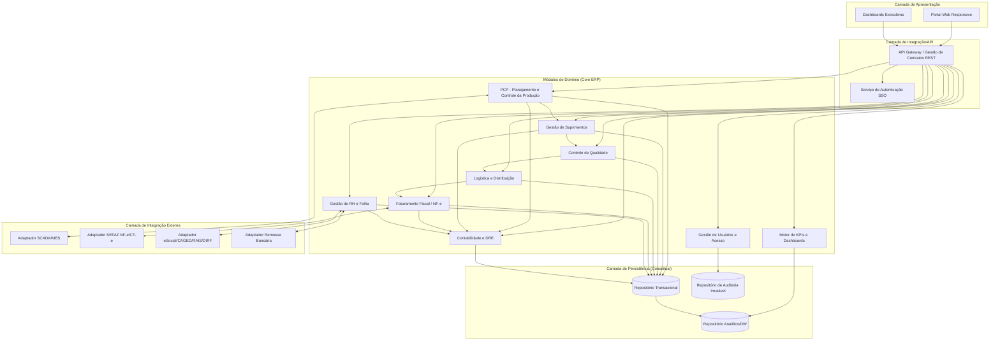
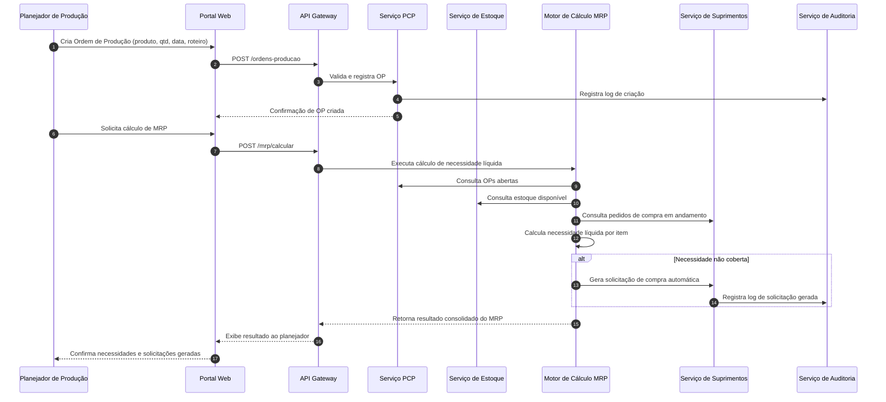
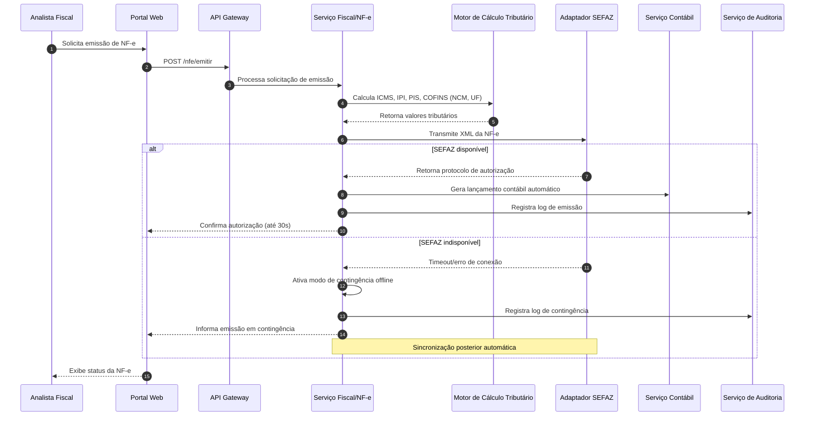

# Relatório Técnico de Arquitetura de Software
## Sistema Integrado de Gestão Empresarial para Manufatura (ERP) — G03

---

## 1. Identificação das HUs

| HU | Título | Perfil | Módulo Funcional Relacionado | RFs Associados |
|----|--------|--------|-------------------------------|-----------------|
| HU01 | Gerar ordens de produção e calcular MRP | Planejador de Produção | PCP | RF05, RF06, RF14 |
| HU02 | Monitorar OEE e desvios em tempo real | Planejador de Produção | PCP / Chão de Fábrica | RF08, RF10, RF11, RF12, RF52 |
| HU03 | Gerenciar cotações com múltiplos fornecedores | Comprador | Suprimentos | RF13, RF15, RF16 |
| HU04 | Acompanhar desempenho de fornecedores | Gestor de Suprimentos | Suprimentos | RF19, RF53 |
| HU05 | Registrar inspeção e bloquear lotes reprovados | Analista de Qualidade | Qualidade | RF20, RF21, RF22 |
| HU06 | Rastrear lote do insumo ao produto acabado | Analista de Qualidade | Qualidade / Logística | RF23, RF09, RF17, RF28 |
| HU07 | Emitir NF-e com cálculo automático de impostos | Analista Fiscal | Fiscal/Faturamento | RF31, RF32, RF33, RF34 |
| HU08 | Manter SPED Fiscal atualizado | Analista Fiscal | Fiscal/Contábil | RF36, RF48 |
| HU09 | Processar folha de pagamento mensal | Analista de RH | RH/Folha | RF38, RF39, RF40 |
| HU10 | Gerar obrigações acessórias de RH | Analista de RH | RH/Folha | RF40 |
| HU11 | Visualizar DRE e Fluxo de Caixa em tempo real | Controller | Contabilidade | RF43, RF45, RF46, RF47, RF52 |
| HU12 | Acompanhar KPIs pelo dashboard executivo | Diretor/CEO | BI/Dashboards | RF50, RF51, RF52, RF53 |

---

## 2. Diagramas de Arquitetura (Mermaid)

### 2.1 Diagrama de Componentes (Visão Macro)

### 2.2 Diagrama de Sequência — HU01 (Geração de OP + Cálculo MRP)

### 2.3 Diagrama de Sequência — HU07 (Emissão de NF-e)

---

## 3. Decisões de Arquitetura

| # | Decisão | Justificativa | Requisitos Relacionados |
|---|---------|----------------|--------------------------|
| D01 | Arquitetura modular orientada a domínios funcionais (PCP, Suprimentos, Qualidade, Logística, Fiscal, RH, Contábil, BI) com comunicação via contratos de API | Facilita isolamento de responsabilidades, evolução independente e rastreabilidade por módulo de negócio | RF01–RF53 |
| D02 | Uso de um Gateway de API centralizado como ponto único de entrada para autenticação, roteamento e políticas de acesso | Padroniza segurança (RNF01, RNF03, RNF04) e simplifica integração de consumidores externos (RNF19) | RF01–RF04, RNF01, RNF03, RNF19 |
| D03 | Adaptadores de integração dedicados para sistemas externos (SCADA/MES, SEFAZ, eSocial, bancário) | Isola variações de protocolo (OPC-UA, MQTT, REST/JSON) da lógica de domínio, permitindo troca de protocolo sem impacto no core | RF11, RNF18, RF31–RF36, RF40 |
| D04 | Repositório de Auditoria Imutável segregado do repositório transacional | Atende requisito de trilha de auditoria imutável com retenção de 10 anos sem impactar performance transacional | RF03, RNF10 |
| D05 | Repositório Analítico/DW separado para consultas de BI e dashboards | Evita contenção entre carga transacional (OLTP) e consultas analíticas (RF50-53), suportando SLA de 5s | RF50–RF53, RNF14 |
| D06 | Motor de Cálculo Tributário como serviço desacoplado do módulo Fiscal | Permite atualização isolada de regras fiscais (alíquotas, NCM, UF) sem redeploy de todo o módulo fiscal | RF32, RNF06 |
| D07 | Mecanismo de contingência assíncrona para emissão fiscal (NF-e/CT-e) com fila de sincronização | Atende RNF17 garantindo continuidade operacional mesmo com SEFAZ indisponível | RF34, RNF17 |
| D08 | Modelo de controle de acesso RBAC com segregação de funções (SoD) aplicado transversalmente via Gateway/Serviço de Usuários | Atende requisitos críticos de segurança para operações financeiras/fiscais | RF01, RF04, RNF03 |
| D09 | Comunicação entre módulos de domínio via eventos/mensagens para atualizações de estoque, qualidade e produção | Permite reação em tempo real (bloqueio de lote reprovado, atualização de estoque) sem acoplamento síncrono rígido | RF09, RF22, RF12 |
| D10 | Camada de persistência conceitual dividida em Transacional, Auditoria e Analítica (sem prescrição de tecnologia) | Mantém neutralidade tecnológica exigida, permitindo decisão de implementação por infraestrutura on-premises/nuvem/híbrida | RNF16, RNF22 |
| D11 | Isolamento lógico de dados por unidade fabril/filial com consolidação centralizada nos módulos Contábil e BI | Atende requisito de múltiplas unidades fabris com isolamento e visão consolidada | RF04, RNF16 |

---

## 4. Tabela de Componentes e Rastreabilidade

| Componente | Responsabilidade Principal | Comunica-se com | Origem (HU / Critério de Aceite) |
|---|---|---|---|
| Serviço de Autenticação SSO | Autenticar usuários via diretório corporativo, emitir tokens de sessão | API Gateway, Serviço de Usuários | RF02 |
| Serviço de Usuários e Acesso | Gerenciar perfis, permissões granulares e hierarquia organizacional | API Gateway, Serviço de Auditoria | RF01, RF03, RF04 |
| Serviço de Auditoria | Registrar logs imutáveis de todas as operações críticas | Todos os módulos de domínio | RF03, RNF10 |
| Serviço PCP | Gerenciar OPs, sequenciamento, apontamento de produção | Motor MRP, Serviço de Estoque, Adaptador SCADA/MES | HU01, HU02, RF05, RF07, RF08 |
| Motor de Cálculo MRP | Calcular necessidade líquida de materiais | Serviço PCP, Serviço de Estoque, Serviço de Suprimentos | HU01, RF06 |
| Motor de Cálculo OEE | Calcular disponibilidade, performance e qualidade por centro de trabalho | Serviço PCP, Adaptador SCADA/MES | HU02, RF10 |
| Adaptador SCADA/MES | Traduzir protocolos industriais (OPC-UA/MQTT/REST) para eventos internos | Serviço PCP | RF11, RNF18 |
| Serviço de Estoque | Manter saldo de materiais, produtos acabados e endereçamento | Serviço PCP, Suprimentos, Qualidade, Logística | RF09, RF26 |
| Serviço de Suprimentos | Gerenciar fornecedores, cotações, OCs, recebimentos | Motor MRP, Serviço de Qualidade, Serviço Contábil | HU03, HU04, RF13–RF19 |
| Serviço de Qualidade | Gerenciar planos de inspeção, resultados, bloqueio de lotes, NCs | Serviço de Estoque, Serviço de Logística, Serviço de Auditoria | HU05, HU06, RF20–RF25 |
| Serviço de Rastreabilidade | Consolidar histórico de lote (recebimento → expedição) | Serviço de Qualidade, Suprimentos, Logística, Fiscal | HU06, RF23 |
| Serviço de Logística e Distribuição | Gerenciar expedições, romaneios, entregas, RMA | Serviço de Estoque, Serviço Fiscal | RF26–RF30 |
| Serviço Fiscal/NF-e | Emitir e controlar NF-e/CT-e, cancelamento, contingência | Motor Tributário, Adaptador SEFAZ, Serviço Contábil | HU07, RF31–RF35 |
| Motor de Cálculo Tributário | Calcular impostos por NCM/UF/operação fiscal | Serviço Fiscal | HU07, RF32, RNF06 |
| Adaptador SEFAZ | Transmitir/receber XML NF-e/CT-e, gerenciar contingência | Serviço Fiscal | RF31, RF34, RNF17 |
| Serviço SPED | Consolidar registros fiscais/contábeis e gerar arquivos SPED | Serviço Fiscal, Serviço Contábil | HU08, RF36, RF48 |
| Serviço de RH e Folha | Gerenciar cadastro, ponto, cálculo de folha e benefícios | Adaptador Ponto Eletrônico, Adaptador eSocial, Serviço Contábil | HU09, RF37–RF42 |
| Adaptador Obrigações Acessórias RH | Gerar arquivos eSocial, CAGED, RAIS, DIRF nos leiautes vigentes | Serviço de RH e Folha | HU10, RF40 |
| Adaptador Remessa Bancária | Gerar arquivo de crédito salarial | Serviço de RH e Folha | HU09 |
| Serviço Contábil | Consolidar lançamentos, plano de contas, DRE, balanço, fluxo de caixa | Suprimentos, Fiscal, RH, PCP, Motor de KPIs | HU11, RF43–RF49 |
| Motor de KPIs e Dashboards | Consolidar indicadores, metas, drill-down | Repositório Analítico, todos os módulos de domínio | HU02, HU04, HU11, HU12, RF50–RF53 |
| Repositório Transacional (conceitual) | Persistir dados operacionais de todos os módulos | Todos os serviços de domínio | Transversal |
| Repositório de Auditoria Imutável (conceitual) | Persistir trilha de auditoria com retenção mínima | Serviço de Auditoria | RNF10 |
| Repositório Analítico/DW (conceitual) | Persistir dados consolidados para consultas de BI | Motor de KPIs, Repositório Transacional | RF50, RNF14 |
| API Gateway | Rotear requisições, aplicar políticas de segurança e rate limiting | Todos os serviços de domínio | RNF01, RNF04, RNF19 |

---

## 5. Bloqueios e Pendências

| # | Descrição do Bloqueio/Pendência | Impacto | Responsável Sugerido |
|---|-----------------------------------|---------|------------------------|
| B01 | Não há definição de qual protocolo industrial (OPC-UA, MQTT ou REST/JSON) será priorizado por unidade fabril | Impacta design do Adaptador SCADA/MES e critérios de conformidade | Time de Integração/Chão de Fábrica |
| B02 | Ausência de especificação de SLA de latência para eventos de bloqueio de lote reprovado (RF22) | Pode afetar decisão entre comunicação síncrona ou assíncrona entre Qualidade e Estoque | Arquitetura + Qualidade |
| B03 | Não há definição clara de política de retenção/expurgo de dados fora do escopo fiscal/RH (10 anos) para os demais módulos | Impacta dimensionamento do Repositório Transacional e estratégia de arquivamento | DPO / Governança de Dados |
| B04 | Falta detalhamento sobre estratégia de consolidação multi-unidade fabril no módulo Contábil (RNF16) — consolidação em tempo real ou batch | Impacta arquitetura do Serviço Contábil e Motor de KPIs | Controladoria + Arquitetura |
| B05 | Não há definição de RTO (Recovery Time Objective) complementar ao RPO de 1h (RNF21) | Impacta estratégia de continuidade de negócio e contingência de NF-e | Infraestrutura/TI |
| B06 | Ausência de especificação sobre versionamento de schemas XSD da SEFAZ e estratégia de atualização automática (RNF07) | Impacta ciclo de manutenção do Adaptador SEFAZ | Time Fiscal/Compliance |
| B07 | Não há definição de granularidade de permissões (RF01) — por transação, por campo ou por tela | Impacta modelo de dados do Serviço de Usuários e RBAC | Segurança/Produto |

---

## 6. Cobertura de Requisitos

| Categoria | Total de Requisitos | Cobertos por Componentes/Diagramas | Observação |
|---|---|---|---|
| RF - Gestão de Usuários e Acesso | 4 (RF01–RF04) | 4/4 | Cobertos via Serviço de Usuários e Auditoria |
| RF - PCP | 8 (RF05–RF12) | 8/8 | Cobertos via Serviço PCP, Motor MRP, Motor OEE, Adaptador MES |
| RF - Suprimentos | 7 (RF13–RF19) | 7/7 | Cobertos via Serviço de Suprimentos |
| RF - Qualidade | 6 (RF20–RF25) | 6/6 | Cobertos via Serviço de Qualidade e Rastreabilidade |
| RF - Logística | 5 (RF26–RF30) | 5/5 | Cobertos via Serviço de Logística |
| RF - Fiscal/NF-e | 6 (RF31–RF36) | 6/6 | Cobertos via Serviço Fiscal, Motor Tributário, Adaptador SEFAZ, Serviço SPED |
| RF - RH/Folha | 6 (RF37–RF42) | 6/6 | Cobertos via Serviço de RH, Adaptadores RH |
| RF - Contabilidade | 7 (RF43–RF49) | 7/7 | Cobertos via Serviço Contábil |
| RF - Dashboards/KPIs | 4 (RF50–RF53) | 4/4 | Cobertos via Motor de KPIs e Repositório Analítico |
| RNF - Segurança | 5 (RNF01–RNF05) | 5/5 | Cobertos via API Gateway, Serviço de Usuários, decisões D02/D08 |
| RNF - Conformidade | 6 (RNF06–RNF11) | 6/6 | Cobertos via Motor Tributário, Serviço SPED, Repositório de Auditoria |
| RNF - Disponibilidade/Desempenho | 6 (RNF12–RNF17) | 5/6 | RNF13 (MRP 10min/50k itens) sem validação de capacidade especificada — ver Gap Analysis |
| RNF - Integração | 3 (RNF18–RNF20) | 3/3 | Cobertos via Adaptadores e API Gateway |
| RNF - Infraestrutura/Dados | 4 (RNF21–RNF24) | 3/4 | RNF23 (monitoramento) mencionado parcialmente — ver Gap Analysis |

**Cobertura geral estimada: ~97% dos requisitos endereçados estruturalmente pelos componentes propostos.**

---

## 7. Gap Analysis

| # | Gap Identificado | Requisitos Afetados | Impacto Arquitetural | Ação Recomendada |
|---|---|---|---|---|
| G01 | Ausência de componente explícito de "Painel de Monitoramento Operacional de TI" (métricas de todos os módulos) | RNF23 | Sem esse componente, não há visibilidade centralizada de saúde dos serviços | Especificar um Serviço de Observabilidade/Monitoramento transversal na próxima iteração |
| G02 | Não há detalhamento de como o dimensionamento do Motor MRP atende ao requisito de 50.000 itens em 10 minutos | RNF13 | Risco de gargalo não identificado até testes de carga | Realizar prova de conceito de performance antes da fase de construção |
| G03 | Falta de definição do mecanismo de conciliação entre emissão em contingência e sincronização posterior (ordem de eventos, deduplicação) | RF34, RNF17 | Risco de inconsistência fiscal (duplicidade de NF-e) | Detalhar máquina de estados da NF-e incluindo estado de contingência/sincronizado |
| G04 | Não há especificação de motor de regras para atualização automática de alíquotas/tabelas NCM (RNF06) | RF32, RNF06 | Acoplamento do Motor Tributário a atualizações manuais frequentes | Avaliar necessidade de um serviço de gestão de tabelas fiscais versionado |
| G05 | Ausência de definição de estratégia de isolamento multi-tenant/multi-fábrica (lógico vs. físico) | RNF16 | Impacta modelo de dados e política de segurança entre unidades fabris | Definir modelo de particionamento lógico por unidade fabril na próxima fase de design detalhado |
| G06 | Não há requisito explícito de versionamento de API para consumidores externos (parceiros/legados) | RNF19 | Risco de quebra de contrato ao evoluir APIs | Incluir política de versionamento semântico de APIs no backlog técnico |
| G07 | Falta de definição de responsável/processo pela liberação formal de lotes bloqueados (RF22) | RF22, HU05 | Processo de negócio incompleto pode gerar ambiguidade operacional | Levantar com stakeholders de Qualidade o fluxo de aprovação de liberação |
| G08 | Ausência de requisito sobre internacionalização/localização de idioma na interface (apenas responsividade é citada) | RNF24 | Pode limitar expansão para operações multi-país (compatível com múltiplas moedas, RF49) | Confirmar com stakeholders se há necessidade de i18n/l10n |
| G09 | Não há SLA definido para o processamento assíncrono de eventos entre módulos (ex: bloqueio de lote → notificação) | RF12, RF22 | Pode gerar percepção de lentidão em cenários críticos de qualidade/produção | Definir SLA de propagação de eventos internos na especificação técnica detalhada |