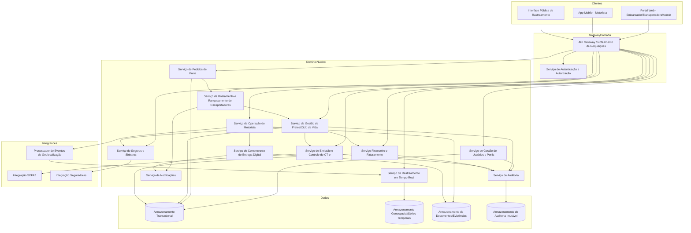
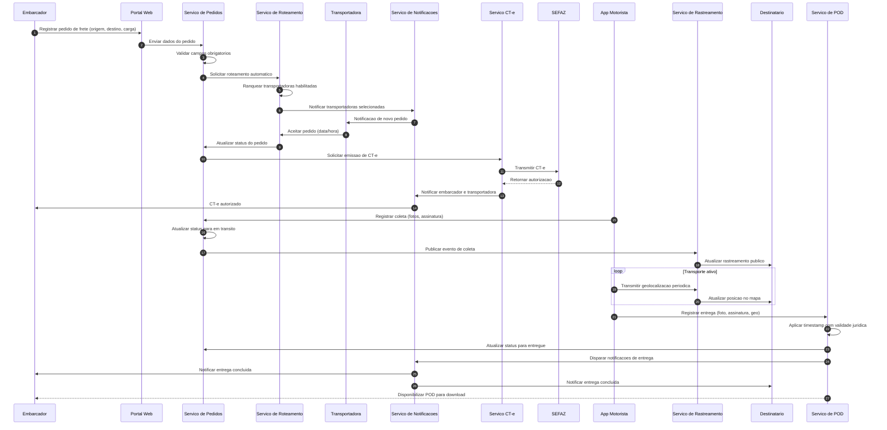
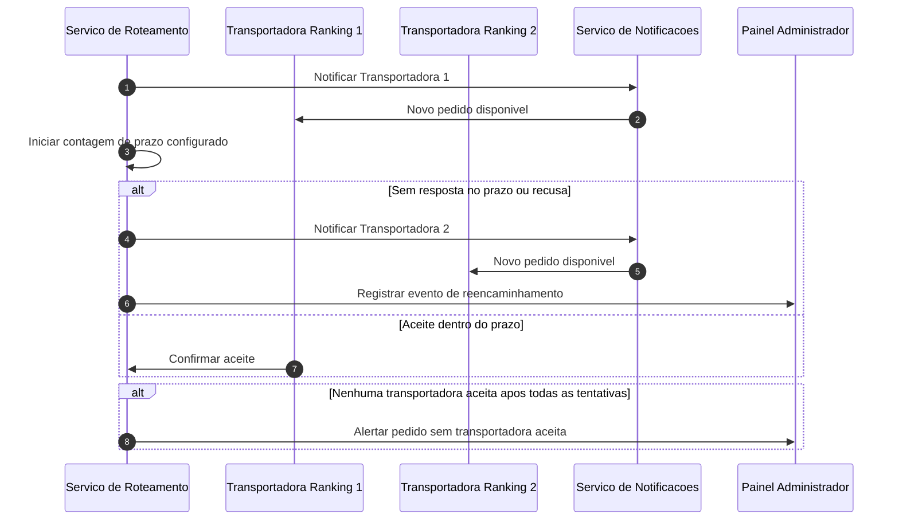

# Relatório Técnico de Arquitetura de Software
## Plataforma de Gestão de Transporte de Cargas (G04)

---

## 1. Identificação das HUs

| HU | Perfil | Título | RFs Relacionados |
|----|--------|--------|-------------------|
| HU01 | Embarcador | Registrar pedido de frete | RF05, RF06, RF09, RF10 |
| HU02 | Embarcador | Selecionar transportadora e contratar seguro | RF11, RF12, RF17, RF41 |
| HU03 | Embarcador | Acompanhar pedidos e receber comprovante de entrega | RF07, RF33, RF34, RF37, RF39 |
| HU04 | Embarcador | Abrir sinistro por avaria ou extravio | RF42, RF43, RF44 |
| HU05 | Transportadora | Aceitar pedidos de frete e gerenciar frota | RF13, RF14, RF15, RF03 |
| HU06 | Transportadora | Acompanhar operação dos motoristas em tempo real | RF25, RF26, RF32 |
| HU07 | Transportadora | Consultar demonstrativo financeiro de repasse | RF46, RF48 |
| HU08 | Motorista | Executar coleta com registro de evidências | RF24, RF26 |
| HU09 | Motorista | Registrar entrega com assinatura digital do destinatário | RF27, RF28, RF37, RF38, RF40 |
| HU10 | Motorista | Registrar ocorrência durante o transporte | RF26, RF35 |
| HU11 | Destinatário | Rastrear carga em tempo real sem cadastro | RF30, RF31, RF32 |
| HU12 | Destinatário | Receber notificações de cada etapa da entrega | RF33 |
| HU13 | Administrador | Monitorar SLA de fretes e acionar contingência | RF36, RF15 |
| HU14 | Administrador | Acompanhar painel financeiro da plataforma | RF49 |

---

## 2. Diagramas de Arquitetura (Mermaid)

### 2.1 Diagrama de Componentes (Visão Macro)

### 2.2 Diagrama de Sequência — Fluxo Completo de Pedido até Entrega (HU01, HU02, HU08, HU09)

### 2.3 Diagrama de Sequência — Contingência de Aceite (RF15, HU13)

---

## 3. Decisões de Arquitetura

| Decisão | Racional | Trade-offs |
|---------|----------|------------|
| **Arquitetura orientada a serviços por domínio funcional** (Usuários, Pedidos, Roteamento, CT-e, Motorista, Rastreamento, Notificações, Sinistros, Financeiro) | Requisitos abrangem domínios de negócio fortemente distintos (fiscal, geoespacial, financeiro), com ciclos de evolução independentes | Maior complexidade de orquestração e necessidade de contratos de integração bem definidos |
| **Comunicação assíncrona por eventos entre módulos de roteamento, notificação e rastreamento** | RF13-RF16, RF25, RF33-RF36 exigem reação a eventos (aceite/recusa, nova posição, mudança de status) sem acoplamento síncrono | Exige mecanismo de garantia de entrega e idempotência de eventos |
| **Armazenamento especializado para dados geoespaciais/série temporal separado do armazenamento transacional** | RNF23, RNF16 — alto volume de atualizações de geolocalização não deve degradar consultas transacionais | Necessidade de sincronização entre armazenamentos e consultas cruzadas (ex: painel do administrador) |
| **Camada de integração externa isolada (SEFAZ, Seguradoras) com contratos versionados** | RNF24 exige evolução independente das integrações fiscais e de seguros | Introduz camada adicional de tradução/adaptação (anti-corruption layer) |
| **Serviço de Auditoria centralizado e imutável, alimentado por eventos de domínio** | RF04, RNF11 exigem trilha auditável de operações críticas com retenção de 5 anos | Necessidade de garantir consistência eventual entre serviços de domínio e o log de auditoria |
| **App mobile do motorista com capacidade de operação e persistência local (offline-first)** | RF28, RNF17 exigem que nenhum evento seja perdido por falta de conectividade | Exige lógica de sincronização, resolução de conflitos e fila de reenvio no dispositivo |
| **Serviço de Rastreamento público desacoplado da autenticação de usuários da plataforma** | RF30, RNF05 exigem acesso sem cadastro via token único por frete | Modelo de segurança diferenciado (token de recurso) coexistindo com autenticação de perfis internos |
| **Serviço de Roteamento com motor de regras configurável para ranqueamento** | RF11, RF12, RF15 exigem critérios configuráveis e reordenamento dinâmico | Necessidade de versionamento de regras de negócio e testes de regressão de ranqueamento |
| **Emissão de CT-e como serviço dedicado com suporte a modo de contingência** | RF19, RNF07-RNF08 exigem operação mesmo com indisponibilidade da SEFAZ | Complexidade adicional de sincronização pós-contingência e reconciliação de status |
| **Painel de métricas operacionais transversal, consumindo eventos de todos os serviços de domínio** | RNF25 exige observabilidade de latência de roteamento, taxa de aceitação, disponibilidade de integrações | Requer padronização de emissão de métricas por todos os serviços |

---

## 4. Tabela de Componentes e Rastreabilidade

| Componente | Responsabilidade Principal | Comunica-se com | Origem (HU / Critério de Aceite) |
|------------|------------------------------|------------------|-------------------------------------|
| Serviço de Gestão de Usuários e Perfis | Cadastro, autenticação de perfis, vínculo motorista/veículo à transportadora | API Gateway, Serviço de Auditoria | RF01-RF04, HU05 |
| API Gateway / Roteamento de Requisições | Ponto único de entrada, roteamento para serviços de domínio | Todos os serviços de domínio | Transversal |
| Serviço de Autenticação e Autorização | Autenticação MFA, controle de acesso por perfil, tokens de sessão | Gateway, Usuários | RNF03, RNF04, RF02 |
| Serviço de Pedidos de Frete | Registro, cancelamento e consolidação de status de pedidos | Roteamento, Financeiro, Documentos | HU01, HU03, RF05-RF09 |
| Serviço de Roteamento e Ranqueamento | Seleção automática e ranqueamento de transportadoras, reencaminhamento em recusa | Pedidos, Notificações, Painel Admin | HU02, HU05, HU13, RF10-RF16 |
| Serviço de Gestão de Fretes (Ciclo de Vida) | Controle de estados do frete (aceito, em trânsito, entregue) | Pedidos, CT-e, Motorista, Rastreamento, Financeiro, Sinistros | HU02, HU03, RF07 |
| Serviço de Emissão e Controle de CT-e | Emissão, transmissão, contingência e cancelamento de CT-e | Fretes, Integração SEFAZ, Auditoria | RF17-RF22, HU02 |
| Integração SEFAZ | Comunicação com serviço externo de autorização fiscal | Serviço de CT-e | RF18, RF20, RNF07 |
| Serviço de Operação do Motorista | Registro de coleta, entrega, ocorrências, operação offline | Fretes, POD, Rastreamento, Documentos | HU08, HU09, HU10, RF23-RF29 |
| Serviço de Rastreamento em Tempo Real | Processamento e exposição de posição e histórico de eventos | Motorista, Interface Pública, Notificações | HU06, HU11, RF30-RF32 |
| Processador de Eventos de Geolocalização | Ingestão e processamento em alto volume de posições | Motorista, Rastreamento, Armazenamento Geoespacial | RF25, RNF15, RNF16, RNF23 |
| Serviço de Notificações | Disparo de e-mail/SMS/alertas conforme eventos de domínio | Fretes, Roteamento, Motorista, Sinistros, Painel Admin | RF33-RF36, HU12 |
| Serviço de Comprovante de Entrega Digital (POD) | Geração, timestamp e disponibilização do POD | Motorista, Fretes, Notificações, Documentos | HU09, RF37-RF40, RNF10 |
| Serviço de Seguros e Sinistros | Cotação, contratação, abertura e acompanhamento de sinistros | Fretes, Integração Seguradoras, Documentos, Notificações | HU02, HU04, RF41-RF44 |
| Integração Seguradoras | Comunicação externa para cotação/sinistro | Serviço de Sinistros | RF41, RF43, RNF24 |
| Serviço Financeiro e Faturamento | Cálculo de frete, comissão, faturas e repasses | Fretes, Painel Admin | HU07, HU14, RF45-RF49 |
| Serviço de Auditoria | Registro imutável de operações críticas | Todos os serviços de domínio | RF04, RNF11 |
| Interface Pública de Rastreamento | Exibição de mapa/status sem autenticação, via token único | Serviço de Rastreamento | HU11, RF30, RNF05 |
| Painel de Métricas Operacionais | Exposição de indicadores de latência, aceitação, disponibilidade | Todos os serviços de domínio | RNF25 |
| Armazenamento Geoespacial/Séries Temporais | Persistência otimizada de posições e trajetos | Processador de Geolocalização, Rastreamento | RNF23 |
| Armazenamento de Documentos/Evidências | Persistência de fotos, assinaturas, laudos, PODs | Motorista, POD, Sinistros | RF09, RF44 |
| Armazenamento de Auditoria Imutável | Persistência com retenção mínima de 5 anos | Serviço de Auditoria | RNF11 |

---

## 5. Bloqueios e Pendências

1. **Definição do modelo de contingência de CT-e**: os requisitos não especificam o comportamento do sistema em caso de rejeição definitiva do CT-e pela SEFAZ após sincronização de contingência (RF19) — necessita definição de regra de negócio junto à área fiscal.
2. **Critérios de desempate no ranqueamento de transportadoras** (RF11/RF12): não há definição de pesos padrão ou prioridade entre preço, prazo e desempenho quando configuráveis — pendente de validação com stakeholders de negócio.
3. **Política de cancelamento de pedidos** (RF08): mencionada como "configurável", mas sem detalhamento de janelas de tempo, multas ou fluxos de exceção.
4. **Formato de validade jurídica do timestamp do POD** (RF38, RNF10): não especifica se será necessário uso de autoridade certificadora externa — impacta arquitetura de integração.
5. **SLA de sincronização offline do app do motorista** (RF28, RNF17): não há definição de tempo máximo tolerável de fila local nem tamanho máximo de dados armazenados no dispositivo.
6. **Regras de retenção e expurgo de dados de geolocalização**: RNF23 define armazenamento otimizado, mas não há requisito de retenção/expurgo específico para esses dados (distinto do RNF22 de backup transacional).
7. **Modelo de tarifação da comissão da plataforma** (RF46): não especifica se é percentual fixo, escalonado ou negociado por transportadora — impacta o desenho do serviço financeiro.

---

## 6. Cobertura de Requisitos

| Categoria | RFs/RNFs Cobertos | Componentes Responsáveis |
|-----------|--------------------|-----------------------------|
| Usuários e Acesso | RF01-RF04, RNF03, RNF04 | Serviço de Usuários, Autenticação, Auditoria |
| Pedidos de Frete | RF05-RF09 | Serviço de Pedidos |
| Roteamento e Seleção | RF10-RF16, RNF13 | Serviço de Roteamento |
| CT-e | RF17-RF22, RNF07, RNF08, RNF14 | Serviço de CT-e, Integração SEFAZ |
| Operação do Motorista | RF23-RF29, RNF17, RNF18, RNF19, RNF21 | Serviço de Operação do Motorista |
| Rastreamento | RF30-RF32, RNF05, RNF12, RNF15, RNF16, RNF23 | Serviço de Rastreamento, Processador de Geolocalização |
| Notificações | RF33-RF36 | Serviço de Notificações |
| POD | RF37-RF40, RNF10 | Serviço de POD |
| Seguros e Sinistros | RF41-RF44 | Serviço de Sinistros, Integração Seguradoras |
| Financeiro | RF45-RF49 | Serviço Financeiro |
| Segurança Transversal | RNF01, RNF02, RNF06, RNF09 | Autenticação, Gateway, todos os serviços (criptografia) |
| Infraestrutura/Manutenibilidade | RNF22, RNF24, RNF25 | Armazenamentos, Painel de Métricas, Camada de Integração |

**Cobertura geral estimada: 100% dos RFs e RNFs mapeados a pelo menos um componente arquitetural.**

---

## 7. Gap Analysis

| Gap Identificado | Impacto Arquitetural | Ação Recomendada |
|-------------------|------------------------|----------------------|
| Ausência de definição de granularidade de eventos para o barramento assíncrono (ex: quantidade de tipos de evento, formato de payload) | Risco de acoplamento excessivo ou explosão de tipos de mensagens entre Roteamento, Notificações e Rastreamento | Elaborar catálogo de eventos de domínio com contrato formal antes da implementação |
| Não há requisito explícito de reconciliação entre status do frete no domínio interno e status oficial no CT-e/SEFAZ em caso de divergência | Possível inconsistência entre visão do embarcador e situação fiscal real | Definir processo de reconciliação periódica e alertas de divergência |
| Falta de especificação sobre limites de retenção/exclusão de dados pessoais conforme LGPD (RNF09) além da criptografia | Risco de não conformidade quanto a direito ao esquecimento e portabilidade de dados | Detalhar política de ciclo de vida de dados pessoais com jurídico/DPO |
| Ausência de requisito sobre versionamento de regras de ranqueamento e trilha de decisão de roteamento | Dificuldade de auditar por que uma transportadora foi selecionada em disputas comerciais | Incluir log de decisão de roteamento com critérios e pesos aplicados no momento |
| Não há definição de estratégia de consistência entre o Armazenamento Geoespacial e o restante do sistema transacional (ex: consultas cruzadas do painel do administrador) | Pode gerar inconsistência temporária em relatórios de SLA (HU13) que combinam posição e status do frete | Definir modelo de consistência eventual documentado e tolerância aceitável de atraso |
| Falta de requisito sobre idempotência/reenvio de eventos do app offline do motorista | Risco de duplicação de eventos (ex: entrega registrada duas vezes) ao sincronizar | Especificar identificadores únicos de evento e deduplicação no backend |
| Ausência de SLA para resposta das integrações externas (seguradoras) além da SEFAZ | Risco de indefinição sobre timeout e fallback em cotação/sinistro | Definir contratos de nível de serviço mínimos com parceiros de seguro |
| Não há menção a testes de carga/critérios de aceite quantitativos para "alto volume" de geolocalização (RNF16) | Dificulta dimensionamento e validação de capacidade da arquitetura | Estabelecer metas quantitativas (ex: eventos/segundo) junto ao negócio |